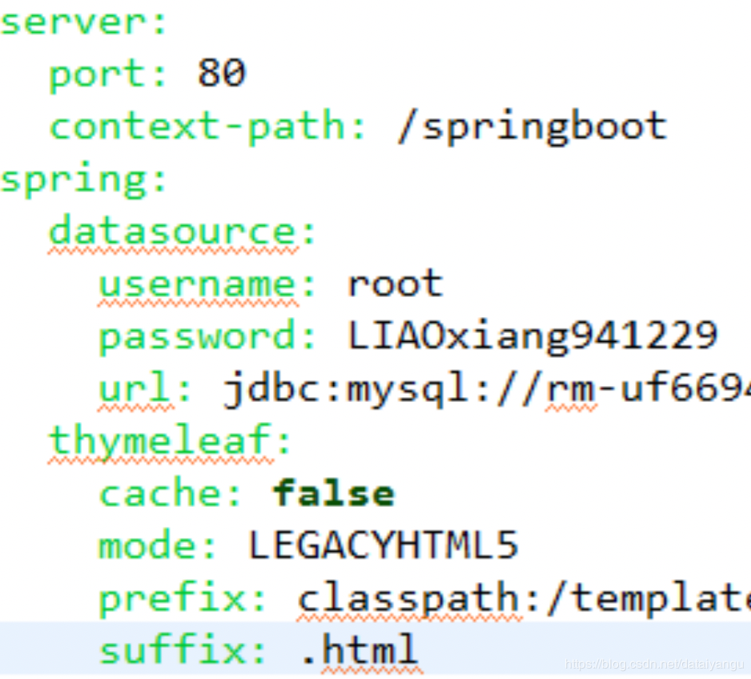

# SpringBoot启动端口+访问路径

配置文件：
```js 
server.port=9090
server.context-path=/springboot
```

现在只能用http://127.0.0.1:9090/springboot才能访问到项目

# SpringBoot配置文件yml

下面讲一下SpringBoot中另外一种格式的配置文件，名为application.yml的配置文件，这种配置文件更方便我们使用，有提示功能，而且SpringBoot也是默认去读取这个格式的配置文件，我们这里改变一下配置文件的风格。
原来的配置文件：
```js 
server.port=9090
server.context-path=/springboot

spring.datasource.url=jdbc:mysql://localhost:3306/springboot_mjxy
spring.datasource.username=root
spring.datasource.password=admin
spring.datasource.driver-class-name=com.mysql.jdbc.Driver
#mybatis.mapper-locations=classpath:mapper/*.xml
spring.thymeleaf.suffix=.html
spring.thymeleaf.mode=HTML5
spring.thymeleaf.encoding=UTF-8
spring.thymeleaf.content-type=text/html
name=majiaxueyuan
```

下面我们把它改造成application.yml的风格，非常有层次感

```js 
server:
 port: 80
 context-path: /springboot
spring:
 datasource:
   username: root
   password: admin
   url: jdbc:mysql://localhost:3306/springboot_mjxy?characterEncoding=utf8
 thymeleaf:
   cache: false
   mode: LEGACYHTML5
   prefix: classpath:/templates/
   suffix: .html
```



如果没有高亮，请在eclipse中安装SpringToolsSuits。然后重启eclipse，选择打开方式就可以高亮了。

# SpringBoot多环境区分

我们可以创建多个配置文件，只需要在源配置文件上面增加下面的一个配置
spring:
profiles:
active: lx
这样系统就会优先去扫描配置文件是application-lx.yml的配置文件

# SpringBoot打包发布

项目右键–>Run As…–>Maven Build…–>goals–>clean package
或者进入项目目录，命令行mvn clean package
如果报错没有主清单,在pom文件中新增下面代码
```js 
<build>
<plugins>
<plugin>
<groupId>org.apache.maven.plugins</groupId>
<artifactId>maven-compiler-plugin</artifactId>
<configuration>
<source>1.8</source>
<target>1.8</target>
</configuration>
</plugin>
<plugin>
<groupId>org.springframework.boot</groupId>
<artifactId>spring-boot-maven-plugin</artifactId>
<configuration>
<maimClass>com.majiaxueyuan.App</maimClass>
</configuration>
<executions>
<execution>
<goals>
<goal>repackage</goal>
</goals>
</execution>
</executions>
</plugin>
</plugins>
</build>
```