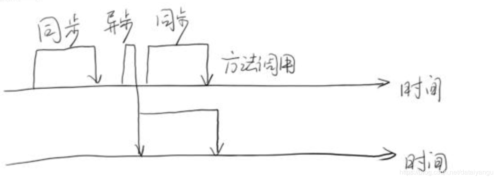
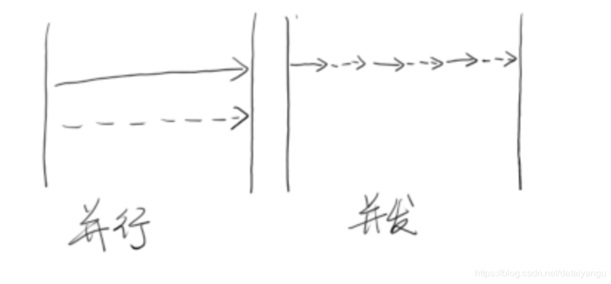
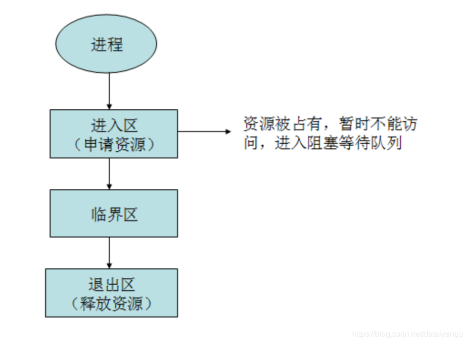
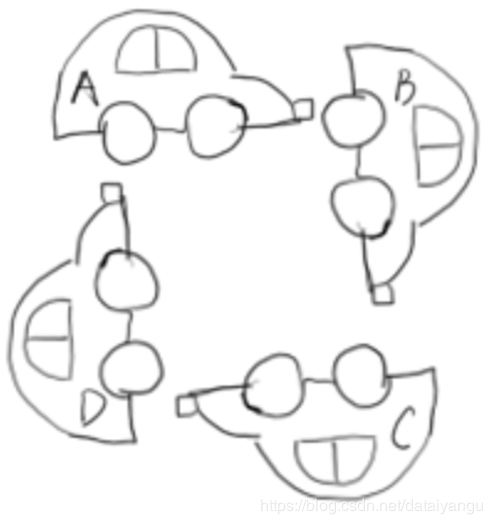
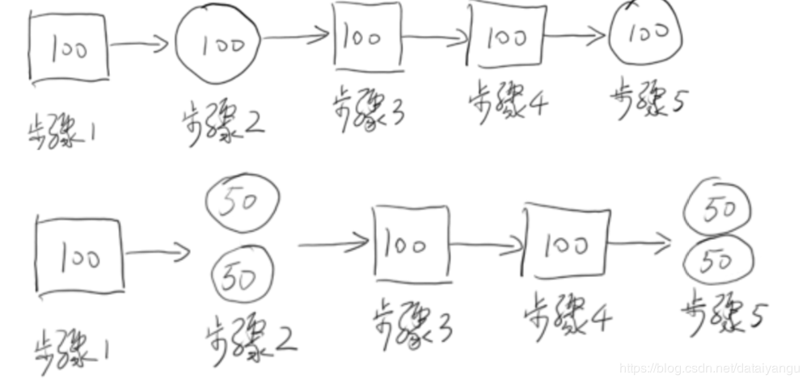
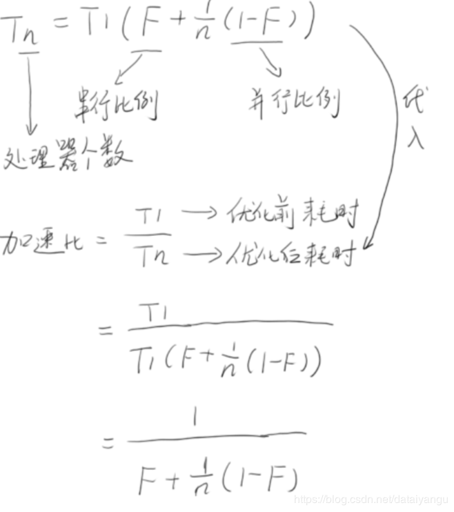
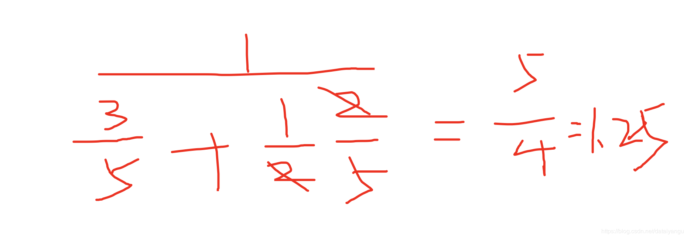
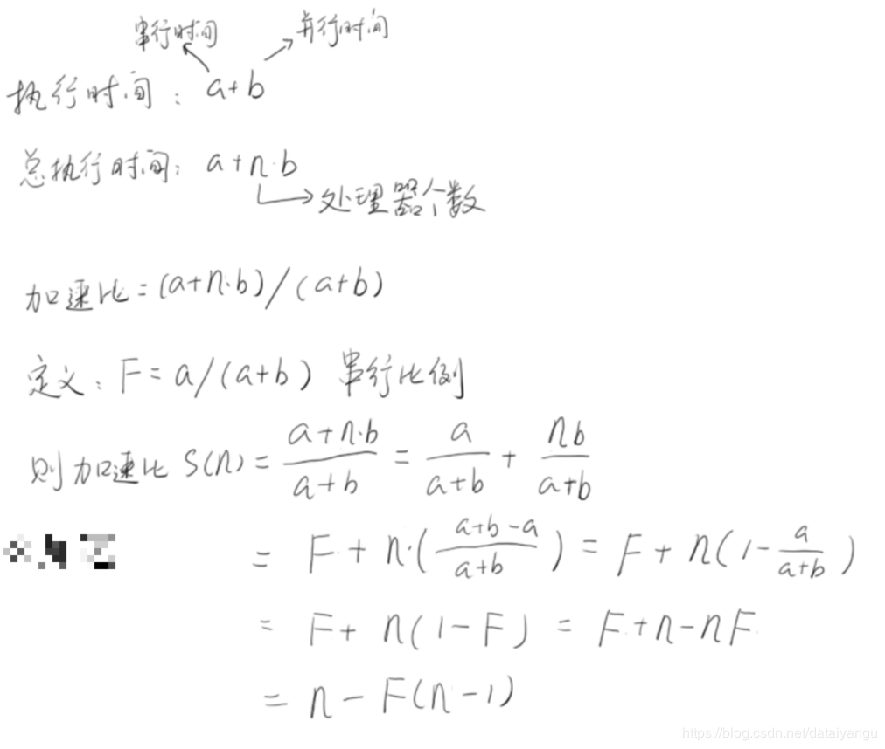

title: Java高并发程序设计学习笔记（一）：并行简介以及重要概念
author: Leesin.Dong
top: 
tags:
  - 高并发
categories:
  - 学习笔记
  - Java高并发程序设计学习笔记
date: 2019-1-18 19:20:00

---
# 为什么需要并行? 
– 业务要求
– 性能

# 反对意见
– Linus Torvalds :忘掉那该死的并行吧!
– 需要有多么奇葩的想象力才能想象出并行计算的用武之地?
Linus Torvalds炮轰过的技术
– GNU Emacs
– GNOME
– HFS+ (Mac OS 文件系统)
– Java
• “本质上我看到的只是 Java 引擎在走下坡路，因为它别无去处。 ”1998年8月
• “我不关心Java。多么可怕的语言。“2011年11月
– C++
• “事实是，C++编译器不值得信任。整个C++异常处理从根本上是错误的。“2004年1月19日 “
• 尽管 C++ 可以用于原型或简单的 GUI 编程，但它不能使事情更简单。C 语言虽然并不精益于系统编程语言，但它积极鼓励你使用简单和直接的结构。 “2007年9月7日
  • “C ++ 是一个可怕的语言。”2007年9月6日
– XML
– Solaris
– MINIX

Linus Torvalds :并行计算只有在图像处理和服务端编程2个领域可以使用，并且它在这2个 领域确实有着大量广泛的使用。但是在其它任何地方，并行计算毫无建树!

# 大势所趋
摩尔定律的失效
– 预计18个月会将芯片的性能提高一倍
– Intel CEO Barret单膝下跪对取消4GHz感到抱歉 • 在2004年秋季，Intel宣布彻底取消4GHz计划
– 虽然现在已经有了4GHZ的芯片，但频率极限已经逼近 10年过去了，我们还停留在4GHZ

顶级计算机科学家唐纳德·尔文·克努斯
– 在我看来，这种现象(并发)或多或少是由于硬件设计者 – 已经无计可施了导致的，他们将摩尔定律失效的责任 – 推脱给软件开发者。

并行计算还出于业务模型的需要
– 并不是为了提高系统性能，而是确实在业务上需要多个执行单元。 – 比如HTTP服务器，为每一个Socket连接新建一个处理线程
– 让不同线程承担不同的业务工作
– 简化任务调度
# 几个重要的概念
## 同步(synchronous)和异步(asynchronous)

同步异步是对于方法调用而言的。
同步调用会等待方法的返回，方法执行多久就要等待多久。
异步调用瞬间返回，但是调用并没有完成，会在后台起一个线程，所以不影响做下面的事情。
## 并发和并行

并发和并行的外在表象基本上是一致的。
并行：两个线程或者进程同时进行
并发：一会做事件a一会做事件b，如此重复调度
对于单核cpu来说只能是并发，对于多核cpu来说是可以并行的，但是对于外在表象来看，事件a和事件b不论是并行还是并发，都是在同时执行
##  **  临界区  **
– 临界区用来表示一种公共资源或者说是共享数据，可以被多个线程使用。但是每一次，只能有一个线程
    使用它，一旦临界区资源被占用，其他线程要想使用这个资源，就必须等待。

## 阻塞(Blocking)和非阻塞(Non-Blocking)
– 阻塞和非阻塞通常用来形容多线程间的相互影响。比如一个线程占用了临界区资源，那么其它所有需要 这个资源的线程就必须在这个临界区中进行等待，等待会导致线程挂起。这种情况就是阻塞。此时，如 果占用资源的线程一直不愿意释放资源，那么其它所有阻塞在这个临界区上的线程都不能工作。
– 非阻塞允许多个线程同时进入临界区

阻塞是在操作系统层面被挂起，阻塞的方式性能比较差，据统计，如果一个线程在操作系统层面被挂起，做了上下文切换，需要八万个时间周期来做这件事情，所以不是一个特别好的办法，但是是最简单的方法，虽然效率不是很高。
## 死锁(Deadlock)、饥饿(Starvation)和活锁(Livelock)

1. 死锁：a堵住了d，d堵住了c，c堵住了b，b堵住了a，a需要b开动，b需要c开动，c需要d开动，d需要a开动-----谁也不能动。
死锁虽然不好，但是是一个静态的问题，一旦死锁，所有的线程都停止，cpu的占用率是零

2.  活锁：电梯里人想出来，外面的人想进去，都想避开，里面的人往左面靠，外面的人往右边靠，还是不能避开，里面的人往右面靠，外面的人往左边靠，如此往复。
又或者a线程需要资源1、2，b线程需要资源1、2，这个时候a抢到了1，b抢到了2，都不能工作，这个时候都释放出来，a又去抢到了2，b抢到了1，如此往复。
简言之，就是资源来线程之间跳来跳去，也无法进行下去。
活锁比死锁更难查找，因为是动态的问题。

3. 饥饿：a线程优先级比b低，所以调度的时候调度不到a，就不能继续往下执行，就会饿死，或者资源竞争优先级比较低，也会导致饿死。
饥饿是指某一个或 者多个线程因为种 种原因无法获得所 需要的资源，导致 一直无法执行。
## 并发级别 
1. 阻塞:当一个线程进入临界区后，其他线程必须等待
2. 非阻塞（下面三个）

### – 无障碍 

无障碍是一种最弱的非阻塞调度
	  自由出入临界区 
	  无竞争时，有限步内完成操作
	 有竞争时，回滚数据有竞争时，回滚数据
	好进不好出，很容易进去，但是进去发现很多线程竞争相同的资源的时候，会需要回滚数据，比如要读取xy，已经读过了x，读到y的时候发现在竞争，会从x重新读。
	
### – 无锁

是无障碍的
保证有一个线程可以胜出
while (!atomicVar.compareAndSet(localVar, localVar+1)) {
  localVar = atomicVar.get(); 
  }
 因为无障碍中，如果存在不断的竞争，将会所有的都出不来，所以无锁就需要每次竞争都能胜出一个，这样保证程序能够顺畅的执行下去。

###  –   无等待
无锁的
 要求所有的线程都必须在有限步内完成 ，所有的线程都能在有线的事件内都从临界区出来。
 无饥饿的，因为所有的线程都必须在有限步内完成 ，所以是无饥饿的。
 举例子：
 只有读线程没有写线程，就是无等待的。
 如果有写线程的话，就会出现资源竞争也就是上面的无障碍的状态，怎么办呢？在每次写之前把数据拷贝一次副本，在写线程中拿到副本，修改副本，修改数据的过程可能需要点时间，可是修改的是副本不是原始的数据，所以在这个过程中的读线程仍然是无等待的。写线程也只是一直在写，所以也是无等待的。
最后需要时就是将副本覆盖原始数据而已。
# 有关并行的2个重要定律
Amdahl定律(阿姆达尔定律) 
 Gustafson定律(古斯塔夫森)
##  Amdahl定律(阿姆达尔定律)
– 定义了串行系统并行化后的加速比的计算公式和理论上限 – 加速比定义:加速比=优化前系统耗时/优化后系统耗时

在步骤二和步骤五的地方运用了并行
加速比=优化前系统耗时/优化后系统耗时=500/400=1.25

将上面的例子代入公式：f（串行比例）= 五分之三，这里默认两个cpu

由上面的公式可以得出：
增加CPU处理器的数量（n）并不一定能起到有效的作用 提高系统内可并行化的模块比重，合理增加并行处 理器数量（1-f），才能以最小的投入，得到最大的加速比
## Gustafson定律(古斯塔夫森)
– 说明处理器个数，串行比例和加速比之间的关系

只要有足够的并行化，那么加速 比和CPU个数成正比

结论：两个结论虽然不同，但是总的来说就是要处理好n（cpu的个数）和f（串行化比例），因为公式中只和这两个参数有关系。

