title: Java高并发程序设计学习笔记（三）：Java内存模型和线程安全
author: Leesin.Dong
top: 
tags:
  - 高并发
categories:
  - 学习笔记
  - Java高并发程序设计学习笔记
date: 2019-1-18 19:20:02

---


# 原子性
原子性是指一个操作是不可中断的。即使是在多个线程一起执行的时候，一个操作一旦开始，就 不会被其它线程干扰。
i++是原子操作吗?
不是，因为包含了三次操作：读i，i+1，新值写到i中。
比如i=1，i是static的，一个线程a读到了1，另一个线程b在线程一做加法之前也读到了i=1,   a线程和b线程同时拿到了i，做i++的操作，a线程i++后变成了2，b线程i++后也变成了2， **<font color="red"> 所以最后的i的值是2，但是实际上i的值应该是3   </font>**

# 有序性
在并发时，程序的执行可能就会出现乱序

```js
class OrderExample { int a = 0;
boolean flag = false; public void writer() {
a = 1;
flag = true; }
public void reader() { if (flag) {
inti= a+1;
...... }
}
```
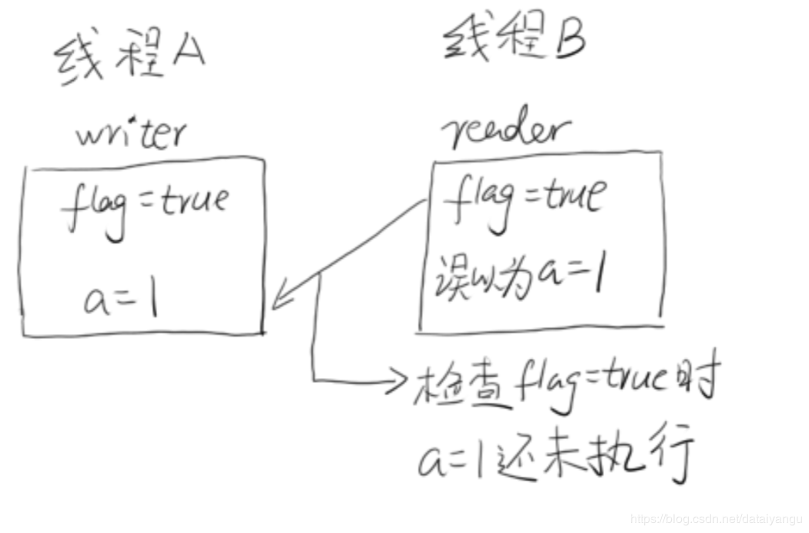

一条指令（汇编指令）的执行是可以分为很多步骤的 
– 取指IF   （把指令取出来）
– 译码和取寄存器操作数 ID （参数取出来）
– 执行或者有效地址计算 EX （执行）
– 存储器访问 MEM （存储器访问）
– 写回WB （数据写会到寄存器中去）
 **<font color="red"> 注意：每一个部分会占用计算机不同的硬件   </font>**
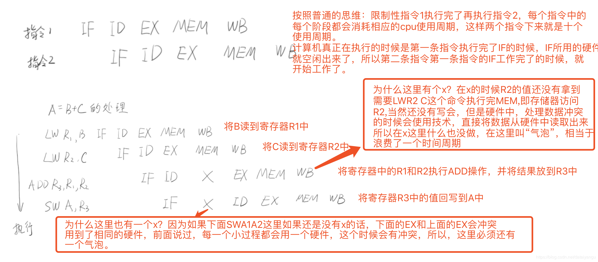

 复杂一点的：
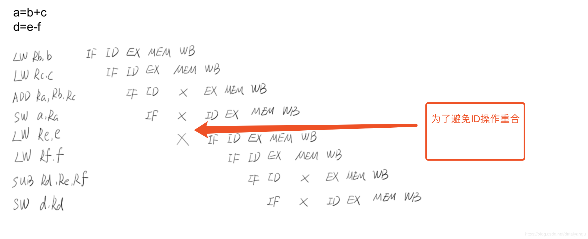

发现加了很多的气泡进去
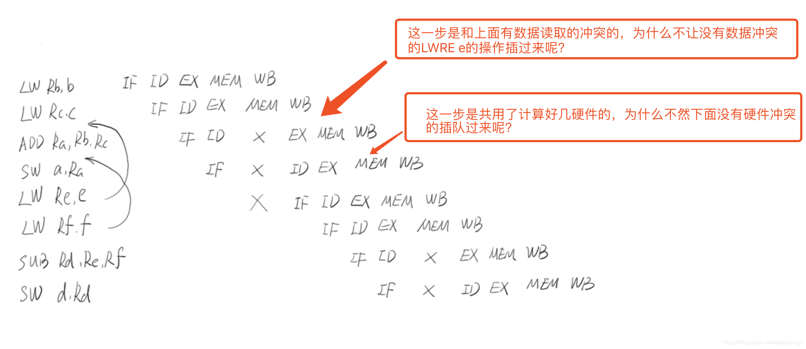
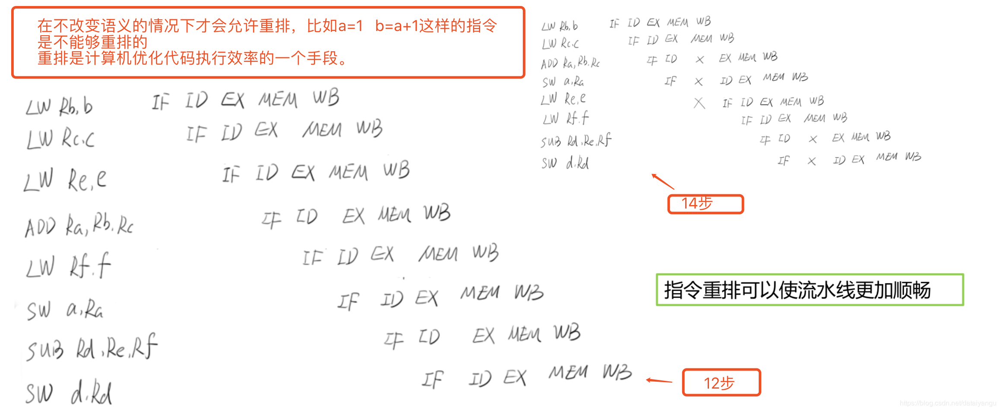


# 可见性
可见性是指当一个线程修改了某一个共享变量的值，其他线程是否能够立即知道这个修改。 
## – 编译器优化
比如上面的重排，并不知道另一个线程中的值是多少，或者编译期，一个线程中，一个值优化到了某个寄存器中，另一个线程中将这个值放到了高速缓存cache中，这两个线程就不能再同一时间知道对方修改了值。多核cpu，每一个cpu中都有自己的寄存器，变量被不同的cpu不同的寄存器不同的cache中保存，所以不能保证可见。
## – 硬件优化(如写吸收，批操作)
cpu想把数据写到内存里的时候，很可能不会是直接把数据写到内存里面，因为这样很慢，先把数据写到硬件队列里面，然后通过批量操作的方式批量写到内存里面去，这样会比较快一些，还会做优化，比如对同一个内存地址多次做了不同的读写，认为是没有必要，因为是以最后一个为准，所以干脆就把老的读写，就不读写进去，只将最后的地址读写进去
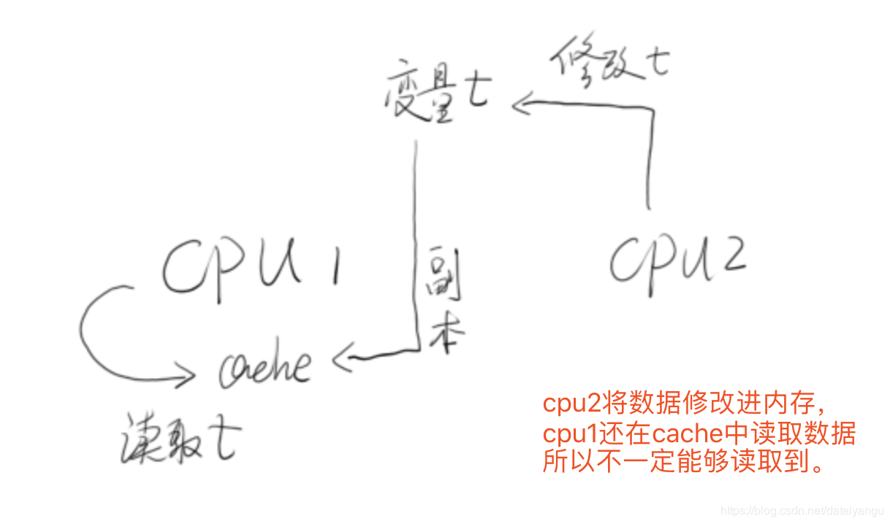

 **<font color="red">   如果不做优化，就不会有这些问题，可是不做优化的话，性能就会很差。 </font>**
 ## Java虚拟机层面的可见性
 博文：http://hushi55.github.io/2015/01/05/volatile-assembly

```js
public class VisibilityTest extends Thread { private boolean stop;
public void run() {
int i = 0; while(!stop) {
i++; }
System.out.println("finish loop,i=" + i); }
public void stopIt() { stop = true;
}
public boolean getStop(){ return stop;
}

```

```js
public static void main(String[] args) throws Exception { VisibilityTest v = new VisibilityTest();
v.start();
Thread.sleep(1000);
v.stopIt();
Thread.sleep(2000); System.out.println("finish main"); System.out.println(v.getStop());
DATAGURU专业数据分析社区
}
```
 **<font color="red">  就是希望在v.stopIt();之后让stop=true，输出System.out.println("finish loop,i=" + i); }
可是实际的操作，是并没有输出这句话的。
   </font>**

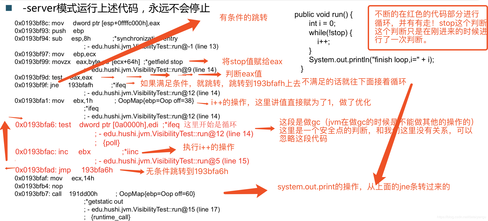

如何查看是什么模式？
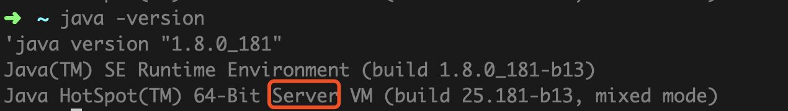

虚拟机执行有两种方式client方式和server模式，client不会做太多的优化，就是系统启动的比较快，server模式系统启动的慢，但是有很多的优化，现在64位的机器都是server模式。
通过server模式发现是永远不会执行完。
 **<font color="red">   如何进行查看汇编指令 ？ </font>**
 1、可以使用命令

> java -XX:+UnlockDiagnosticVMOptions -XX:+PrintAssembly Main
> (Main是class文件)

2、在IDEA配置VM options，打印汇编指令，如下图。

> -XX:+UnlockDiagnosticVMOptions -XX:+PrintAssembly

原文：https://blog.csdn.net/ljheee/article/details/82218156 


上图是博客作者整理的汇编代码，这里解释一下：
 **<font color="red">因为jvm的内部优化，导致不断的在红色的代码部分进行循环，并没有走!stop的这个而判断指令，这个判断只是在刚刚进来的时候回进行了一次判断，所以会不断的执行下去。也就出现了上面的结果。    </font>**

引用博文中的一句话：
程序比较简单，在主线程中启动一个线程，这个线程不停的对局部变量做自增操作，主线程休眠 1 秒中后改变启动线程的循环控制变量，想让它停止循环。这个程序在 client 模式下是能停止线程做自增操作的，但是在 server 模式先将是无限循环。若是改成
```js
private volatile boolean stop;
```
 **<font color="red">   用 volatile 修饰 stop 变量，将不会出现死循环。 </font>**
我们知道 volatile 在 JVM 内存模型中是保证修饰变量的可见性，这个不是我们今天讨论的重点，我们今天想看看在 volatile 修饰下和不修饰代码编译成的汇编代码的区别，以便我们学习 JVM 的内存模型。

再来看一个例子

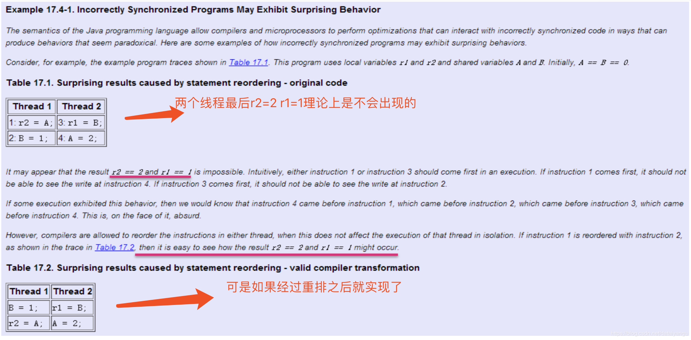
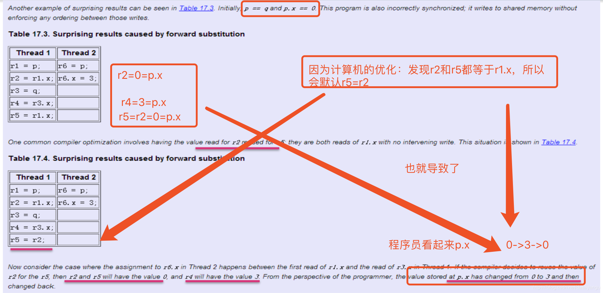

上图是从java语言规范中拿到的，描述可见性和指令重排的一些问题
# Happen-Before规则（先行发生）
## 程序顺序原则:
一个线程内保证语义的串行性
对于单线程来说，重排前和重排后的结果必须一致
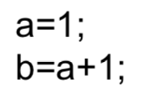

## volatile规则:
volatile变量的写，先发生于读，这保证了volatile变量的可见性 
## 锁规则:
解锁(unlock)必然发生在随后的加锁(lock)前
如果加锁被重排到解锁前面，因为还没有解锁，肯定是获取不到锁的
##  传递性:
A先于B，B先于C，那么A必然先于C

###  线程的start()方法先于它的每一个动作
### 线程的所有操作先于线程的终结(Thread.join())
### 线程的中断(interrupt())先于被中断线程的代码
### 对象的构造函数执行结束先于finalize()方法

# 线程安全的概念
指某个函数、函数库在多线程环境中被调用时，能够正确地处理各个线程的局部变量，使程序功 能正确完成。


i++在多线程下访问的情况
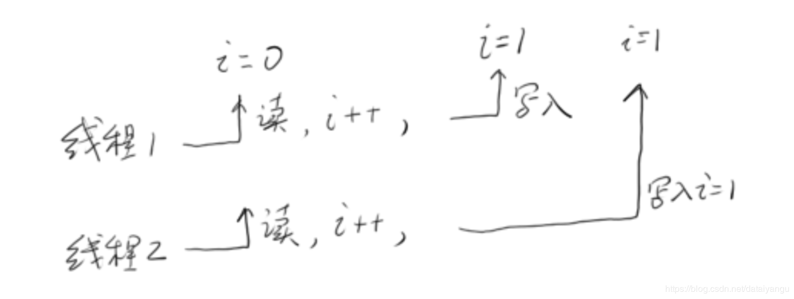

i++是static的一个变量，在多线程中不是线程安全的，一个线程在读的时候，另一个线程也在读，一个线程在写的时候，另一个线程也在写，所以写和读的时候值会被另外一个线程覆盖掉。甚至线程很多的时候，i可能会越加越小，

解决：阻塞的方式
```js
public class AccountingSync implements Runnable{
static AccountingSync instance=new AccountingSync(); static int i=0;
@Override
public void run() {
for(int j=0;j<10000000;j++){ synchronized(instance){
  } }
```

