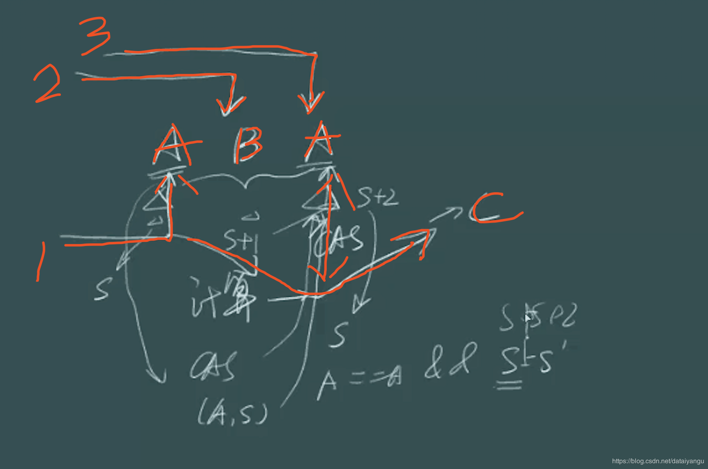

title: Java高并发程序设计学习笔记（四）：无锁
author: Leesin.Dong
top: 
tags:
  - 高并发
categories:
  - 学习笔记
  - Java高并发程序设计学习笔记
date: 2019-1-18 19:20:03

---


# 1. 无锁类的原理详解
## 简介：
前面已经介绍过无锁：
– 无障碍
无障碍是一种最弱的非阻塞调度
自由出入临界区
无竞争时，有限步内完成操作
有竞争时，回滚数据有竞争时，回滚数据
好进不好出，很容易进去，但是进去发现很多线程竞争相同的资源的时候，会需要回滚数据，比如要读取xy，已经读过了x，读到y的时候发现在竞争，会从x重新读。

– 无锁
是无障碍的
保证有一个线程可以胜出
while (!atomicVar.compareAndSet(localVar, localVar+1)) {
localVar = atomicVar.get();
}
因为无障碍中，如果存在不断的竞争，将会所有的都出不来，所以无锁就需要每次竞争都能胜出一个，这样保证程序能够顺畅的执行下去。

## 1.1. CAS
CAS算法的过程是这样:它包含3个参数CAS(V,E,N)。V表示要更新的变量，E表示预期值，N表示新值。仅当V 值等于E值时，才会将V的值设为N，如果V值和E值不同，则说明已经有其他线程做了更新，则当前线程什么 都不做。最后，CAS返回当前V的真实值。CAS操作是抱着乐观的态度进行的，它总是认为自己可以成功完成 操作。当多个线程同时使用CAS操作一个变量时，只有一个会胜出，并成功更新，其余均会失败。失败的线程 不会被挂起，仅是被告知失败，并且允许再次尝试，当然也允许失败的线程放弃操作。基于这样的原理，CAS 操作即时没有锁，也可以发现其他线程对当前线程的干扰，并进行恰当的处理。

CAS是一个原子操作，是由一条cpu指令完成的。

java中提供了很多无所类的使用，如果一个线程被挂起，将会消耗八万个时光周期，但是如果是无锁的，最多只是循环，也就只会消耗几个时光周期，所以无锁的方式比阻塞的方式要好很多。
## 1.2. CPU指令
```js
cmpxchg
/*
accumulator = AL, AX, or EAX, depending on whether
a byte, word, or doubleword comparison is being performed */
if(accumulator == Destination) {
ZF = 1;         //判断是否和期望值相等，相等的话就给一个转换标志。同时进行转换。
Destination = Source; }
else {
ZF = 0;         //不相等的话就给一个不转换的标志。同时不转换。
accumulator = Destination; }
```
这是一个原子操作是安全的。
# 2. 无锁类的使用
## 2.1. AtomicInteger
### 2.1.1. 概述 
Number
### 2.1.2. 主要接口
public final int get()//取得当前值 
public final void set(int newValue)//设置当前值
public final int getAndSet(int newValue)//设置新值，并返回旧值
public final boolean compareAndSet(int expect, int u)//如果当前值为expect，则设置为u
public final int getAndIncrement() //当前值加1，返回旧值 
public final int getAndDecrement()//当前值减1，返回旧值
public final int getAndAdd(int delta)//当前值增加delta，返回旧值
public final int incrementAndGet() //当前值加1，返回新值
public final int decrementAndGet() //当前值减1，返回新值
public final int addAndGet(int delta)//当前值增加delta，返回新值
   
### 2.1.3. 主要接口的实现
compareAndSet方法
```js
//expect期望值，update更新的新值，成功返回true，失败返回false
  public final boolean compareAndSet(int expect, int update) {
        return unsafe.compareAndSwapInt(this, valueOffset, expect, update);
    }
 //unsafe是不安全的，java将指针进行了屏蔽封装，而unsafe会提供类似指针的操作，对这个类的偏移量上的期望值
```
偏移量valueOffset哪里来的？

```js 
valueOffset = unsafe.objectFieldOffset
```
getAndIncrement方法
```js
//返回当前值，并且加一
    public final int getAndIncrement() {
        for(;;){
        	int current = get();
        	int next = current + 1;
        	if(compareAndSet(current,next))
        		return current;
		}
    }

```
get是得到当前这个类的private volatile int value;这个值加一，然后compareAndSet，如果当前的值和期望值相等的时候返回当前的这个值，否则，继续循环，和无锁的机制是一样的。如果在判断之前有其他的线程拿到了current值，在下面的if将会失败
### 例子

```js
import java.util.concurrent.atomic.AtomicInteger;

public class Test {
	static AtomicInteger i = new AtomicInteger();
	public static class AddThread implements  Runnable{
		public void run(){
			for (int j = 0; j < 10000; j++) {
				i.incrementAndGet();
				
			}
		}
		
	}
	public static void main(String[] args) throws InterruptedException {
		Thread[] ts = new Thread[10];
		for (int k = 0; k < 10; k++) {
			ts[k] = new Thread(new AddThread());
		}
		for (int k = 0; k < 10; k++) {
			ts[k].start();
		}
		for (int k = 0; k < 10; k++) {
			ts[k].join();
		}
		System.out.println(i);
	}
}
```
运行结果

```js
100000
```
## 2.2. Unsafe
### 2.2.1. 概述
非安全的操作，比如: 根据偏移量设置值 、park() 、底层的CAS操作
非公开API，在不同版本的JDK中， 可能有较大差异

```js
static {
        try {
            valueOffset = unsafe.objectFieldOffset
                (AtomicInteger.class.getDeclaredField("value"));
        } catch (Exception ex) { throw new Error(ex); }
    }

```
拿到value这个字段在本类（相当于c中的首地址）中的偏移量是多少。

### 2.2.2. 主要接口
//获得给定对象偏移量上的int值
public native int getInt(Object o, long offset); //设置给定对象偏移量上的int值
public native void putInt(Object o, long offset, int x); //获得字段在对象中的偏移量
public native long objectFieldOffset(Field f); //设置给定对象的int值，使用volatile语义
public native void putIntVolatile(Object o, long offset, int x); //获得给定对象对象的int值，使用volatile语义
public native int getIntVolatile(Object o, long offset); //和putIntVolatile()一样，但是它要求被操作字段就是volatile类型的 public native void putOrderedInt(Object o, long offset, int x);

## 2.3. AtomicReference 
### 2.3.1. 概述
对象的引用
对引用进行修改 是一个模板类，抽象化了数据类型
### 2.3.2. 主要接口
get()
set(V) compareAndSet() getAndSet(V)
大部分的方法和compareAndSet差不多。
例子：

```js

import java.util.concurrent.atomic.AtomicInteger;
import java.util.concurrent.atomic.AtomicReference;

public class Test {
	public final static AtomicReference<String> atomicStr = new AtomicReference<String>("abc");


	public static void main(String[] args) throws InterruptedException {
		for (int i = 0; i < 10; i++) {
			final int num = i;
			new Thread() {
				public void run() {
					try {
						Thread.sleep(Math.abs((int)Math.random()*100));
					} catch (InterruptedException e) {
						e.printStackTrace();
					}
					if (atomicStr.compareAndSet(("abc"), "def")) {
						System.out.println("Thread"+Thread.currentThread().getId()+"change value to"+atomicStr.compareAndSet(("abc"), "def"));
					}else{
						System.out.println("Thread"+Thread.currentThread().getId()+"FALED");
					}
				}
			}.start();
		}
	}
}

```

运行结果

```js
Thread10change value tofalse
Thread1FALED
Thread2FALED
Thread3FALED
Thread4FALED
Thread5FALED
Thread6FALED
Thread7FALED
Thread8FALED
Thread9FALED

```

## 2.4. AtomicStampedReference 
和对象的引用差不多
stamped表示时间戳、唯一性等
### 2.4.1. 概述
ABA问题




如图，一个值为A，期初一个线程1拿到它，然后做相关的操作，这个时候线程2拿到这个A并且改为了B，线程3拿到了B改为了A，这个时候线程1将拿到的A和讲过了线程2 线程3后的A进行比较，相同的话A就改为C。
发现是没问题的，因为A还是变为了A，如果是加法，没问题，可是如果比较关注中间的过程呢？比如网吧充钱，没钱机器就自动冲，可是只能自动充值一次，这个时候第二次还是到了临界点呢？？
这个时候就需要给一个时间戳或者唯一的标识。每次改变的时候都传递一个包含A和时间戳的对象，每次在比价A的同时比较时间戳。
源码解析：

```js
//将原来的value做了一层封装分为了reference和stamp
private static class Pair<T> {
        final T reference;
        final int stamp;
        private Pair(T reference, int stamp) {
            this.reference = reference;
            this.stamp = stamp;
        }
        static <T> Pair<T> of(T reference, int stamp) {
            return new Pair<T>(reference, stamp);
        }
    }

//compareAndSet的参数也由原来的两个，变为了四个，包括期望值和新的值
public boolean compareAndSet(V   expectedReference,
                                 V   newReference,
                                 int expectedStamp,
                                 int newStamp) {
        Pair<V> current = pair;
        return
        //当两个都相等的时候才有机会向下执行
            expectedReference == current.reference &&
            expectedStamp == current.stamp &&
            ((newReference == current.reference &&
              newStamp == current.stamp) ||
             casPair(current, Pair.of(newReference, newStamp)));
    }

//jdk中经常会有函数叫做cas...来更新列表的头部、尾部等操作
//pairOffset就是
private boolean casPair(Pair<V> cmp, Pair<V> val) {
        return UNSAFE.compareAndSwapObject(this, pairOffset, cmp, val);
    }

```
##  2.5. AtomicIntegerArray 
### 2.5.1. 概述
支持无锁的数组
### 2.5.2. 主要接口
//获得数组第i个下标的元素
public final int get(int i)
//获得数组的长度
public final int length()
//将数组第i个下标设置为newValue，并返回旧的值
public final int getAndSet(int i, int newValue) //进行CAS操作，如果第i个下标的元素等于expect，则设置为update，设置成功返回true public final boolean compareAndSet(int i, int expect, int update)
//将第i个下标的元素加1
public final int getAndIncrement(int i) //将第i个下标的元素减1
public final int getAndDecrement(int i) //将第i个下标的元素增加delta(delta可以是负数) public final int getAndAdd(int i, int delta)
### 例子
```js

import java.util.concurrent.atomic.AtomicInteger;
import java.util.concurrent.atomic.AtomicIntegerArray;
import java.util.concurrent.atomic.AtomicReference;

public class Test {
	static AtomicIntegerArray arr = new AtomicIntegerArray(10);

	public static class AddThread implements Runnable {
		public void run() {
			for (int i = 0; i < 10000; i++) {
				arr.getAndIncrement(i % arr.length());

			}
		}
	}


	public static void main(String[] args) throws InterruptedException {
		Thread[] ts = new Thread[10];
		for (int i = 0; i < 10; i++) {
			ts[i] = new Thread((new AddThread()));


		}
		for (int i = 0; i < 10; i++) {
			ts[i].start();

		}
		for (int i = 0; i < 10; i++) {
			ts[i].join();

		}
		System.out.println(arr);
	}
}


```
如果是不安全的话，不会每个都是1000，应该比这个小。
运行结果

```js
[10000,10000,10000,10000,10000,10000,10000,10000,10000,10000]
```
### 源码解析

```js
private static final int base = unsafe.arrayBaseOffset(int[].class);

public final int get(int i) {
        return getRaw(checkedByteOffset(i));
    }

private int getRaw(long offset) {
//数组所在的基地址开始取offset的偏移量
        return unsafe.getIntVolatile(array, offset);
}
//返回第i个元素在数组中的偏移量是多少
private long checkedByteOffset(int i) {
        if (i < 0 || i >= array.length)
            throw new IndexOutOfBoundsException("index " + i);

        return byteOffset(i);
}
private static long byteOffset(int i) {
		//i偏移了shift的数值
        return ((long) i << shift) + base;
        //通过下面的计算 i左移两位（二进制，即在末尾加两个零
        //，如果是十进制就是乘以4）
 }
static {
		//数组中每个元素有多宽，int就是4（每个int是4个byte）
        int scale = unsafe.arrayIndexScale(int[].class);
        if ((scale & (scale - 1)) != 0)
            throw new Error("data type scale not a power of two");
            //shift的值
            //numberOfLeadingZeros前导零，一个数字化成二进制
            //前面的零的个数
            //4------>   00000....100       32-3=29
            //4的前导零就是29
        shift = 31 - Integer.numberOfLeadingZeros(scale);
        //所以shift=2
 }

```

## 2.6. AtomicIntegerFieldUpdater 
### 2.6.1. 概述
让普通变量也享受原子操作
希望拥有原子操作，但是不改变原原子的类型。
使用尽量少的代码、在不改变原来类型的基础上、做出较少的改变来实现原子操作。
### 2.6.2. 主要接口 AtomicIntegerFieldUpdater.newUpdater()
AtomicIntegerFieldUpdate.newUpdate() 
incrementAndGet()
### 例子

```js

import java.util.concurrent.atomic.AtomicInteger;
import java.util.concurrent.atomic.AtomicIntegerArray;
import java.util.concurrent.atomic.AtomicIntegerFieldUpdater;
import java.util.concurrent.atomic.AtomicReference;

public class Test {
	public static class Candidate{
		int id;
		volatile  int score;
	}

	public final static AtomicIntegerFieldUpdater<Candidate> scoreUpdater =
			AtomicIntegerFieldUpdater.newUpdater(Candidate.class, "score");
	public static AtomicInteger allScore = new AtomicInteger();

	public static void main(String[] args) throws InterruptedException {
		final Candidate stu  = new Candidate();
		Thread[] threads = new Thread[10000];
		for (int i = 0; i <10000 ; i++) {
			threads[i] = new Thread(){
				public void run(){
					if (Math.random()>0.4){
						scoreUpdater.incrementAndGet(stu);
						allScore.incrementAndGet();
					}
				}
			};
			threads[i].start();
		}
		for (int i = 0; i <10000 ; i++) {
			threads[i].join();


		}
		System.out.println("sore="+stu.score);
		System.out.println("allScore="+allScore);
	}
}


```
通过AtomicInteger来验证，发现是相同的安全的结果，主要就是上面提到的两个方法，通过反射实现的。


```js
sore=5948
allScore=5948
```

### 2.6.3. 小说明
1. Updater只能修改它可见范围内的变量。因为Updater使用反射得到这个变量。如果变量不可见，就会出错。
比如如果score申明为private，就是不可行的。
2. 为了确保变量被正确的读取，它必须是volatile类型的。如果我们原有代码中未申明这个类型，那么简单得 申明一下就行，这不会引起什么问题。
3. 由于CAS操作会通过对象实例中的偏移量直接进行赋值，因此，它不支持static字段(Unsafe. objectFieldOffset()不支持静态变量)。
# 3. 无锁算法详解 

jdk中的vector是有锁的。
源码解析：

```js
 /**
     * Appends the specified element to the end of this Vector.
     *
     * @param e element to be appended to this Vector
     * @return {@code true} (as specified by {@link Collection#add})
     * @since 1.2
     */
    public synchronized boolean add(E e) {
    	//记录vector被修改的次数
        modCount++;
       // vector底层是数组
       // 判断时候越界，如果越界了就进行扩展，扩展代码在下面
        ensureCapacityHelper(elementCount + 1);
        //不越界就将e加在后面
        elementData[elementCount++] = e;
        return true;
    }
   // 是一个同步的方法，每次只有一个线程能进行add操作，所有的元素都保存在elementData
    中
    private void ensureCapacityHelper(int minCapacity) {
        // overflow-conscious code
        if (minCapacity - elementData.length > 0)
            grow(minCapacity);
    }
private void grow(int minCapacity) {
        // overflow-conscious code
        int oldCapacity = elementData.length;
        //扩展增量（扩容）capacityIncrement可以自己制定，如果自己不指定的话就
        //是默认的oldCapacity+oldCapacity------>newCapacity也就是
        //乘以二
        int newCapacity = oldCapacity + ((capacityIncrement > 0) ?
                                         capacityIncrement : oldCapacity);
        if (newCapacity - minCapacity < 0)
            newCapacity = minCapacity;
        if (newCapacity - MAX_ARRAY_SIZE > 0)
            newCapacity = hugeCapacity(minCapacity);
            //把老元素放到新的元素中去
        elementData = Arrays.copyOf(elementData, newCapacity);
    }
    //创建了一个新的数组，把原来的数组复制过去。
 public static <T,U> T[] copyOf(U[] original, int newLength, Class<? extends T[]> newType) {
        @SuppressWarnings("unchecked")
        T[] copy = ((Object)newType == (Object)Object[].class)
            ? (T[]) new Object[newLength]
            : (T[]) Array.newInstance(newType.getComponentType(), newLength);
        System.arraycopy(original, 0, copy, 0,
                         Math.min(original.length, newLength));
        return copy;
    }
```
注意看里面的注释很重要：
提取出来几个
 **<font color="red"> vector底层是数组  
  判断时候越界，如果越界了就进行扩展，
  add是一个同步的方法（有锁的），每次只有一个线程能进行add操作 
  扩展增量（扩容）capacityIncrement可以自己制定，如果自己不指定的话就
        是默认的oldCapacity+oldCapacity------>newCapacity也就是
        乘以二（有次面试我被问过）!!!!!!!!!!!!所以当扩容的数字很大的时候，建议给个扩容的大小
        把老元素放到新的元素中去
        创建了一个新的数组，把原来的数组复制过去。</font>**
## 3.1. 无锁的Vector实现
这里只将源码贴出来
和普通的vector实现的区别是原来的vector是一维数组，而这里的数组是二维的数组，为什么用二维数组？二维数组中的第一个容量是n，第二个就是2n，第三个就是4n。。。。以此类推，就像是一个个不同容量的篮子。
FIRST_BUCKET_SIZE给定第一个篮子的大小
N_BUCKET有多少个篮子
 private final AtomicReferenceArray<AtomicReferenceArray<E>> buckets;
 通过AtomicReferenceArray的二重数组来封装这些篮子。AtomicReferenceArray和AtomicArray差不多只是将array的值换成了对象。

 **<font color="red">  有个分析的很不错的博文：  </font>**
 http://reimuwang.org/2018/05/17/Java%20%E5%B9%B6%E5%8F%91-%E6%97%A0%E9%94%81%E7%9A%84Vector%E5%AE%9E%E7%8E%B0/

```js
/*
 * Copyright (c) 2007 IBM Corporation
 *
 * Licensed under the Apache License, Version 2.0 (the "License");
 * you may not use this file except in compliance with the License.
 * You may obtain a copy of the License at
 *
 * http://www.apache.org/licenses/LICENSE-2.0
 *
 * Unless required by applicable law or agreed to in writing, software
 * distributed under the License is distributed on an "AS IS" BASIS,
 * WITHOUT WARRANTIES OR CONDITIONS OF ANY KIND, either express or implied.
 * See the License for the specific language governing permissions and
 * limitations under the License.
 */
 
package main.java.org.amino.ds.lockfree;
 
import java.util.AbstractList;
import java.util.concurrent.atomic.AtomicReference;
import java.util.concurrent.atomic.AtomicReferenceArray;
 
/**
 * It is a thread safe and lock-free vector.
 * This class implement algorithm from:<br>
 *
 * Lock-free Dynamically Resizable Arrays <br>
 *
 * Damian Dechev, Peter Pirkelbauer, and Bjarne Stroustrup<br>
 * Texas A&M University College Station, TX 77843-3112<br>
 * {dechev, peter.pirkelbauer}@tamu.edu, bs@cs.tamu.edu
 *
 *
 * @author Zhi Gan
 *
 * @param <E> type of element in the vector
 *
 */
public class LockFreeVector<E> extends AbstractList<E> {
    private static final boolean debug = false;
    /**
     * Size of the first bucket. sizeof(bucket[i+1])=2*sizeof(bucket[i])
     */
    private static final int FIRST_BUCKET_SIZE = 8;
 
    /**
     * number of buckets. 30 will allow 8*(2^30-1) elements
     */
    private static final int N_BUCKET = 30;
 
    /**
     * We will have at most N_BUCKET number of buckets. And we have
     * sizeof(buckets.get(i))=FIRST_BUCKET_SIZE**(i+1)
     */
    private final AtomicReferenceArray<AtomicReferenceArray<E>> buckets;
 
    /**
     * @author ganzhi
     *
     * @param <E>
     */
    static class WriteDescriptor<E> {
        public E oldV;
        public E newV;
        public AtomicReferenceArray<E> addr;
        public int addr_ind;
 
        /**
         * Creating a new descriptor.
         *
         * @param addr Operation address
         * @param addr_ind  Index of address
         * @param oldV old operand
         * @param newV new operand
         */
        public WriteDescriptor(AtomicReferenceArray<E> addr, int addr_ind,
                E oldV, E newV) {
            this.addr = addr;
            this.addr_ind = addr_ind;
            this.oldV = oldV;
            this.newV = newV;
        }
 
        /**
         * set newV.
         */
        public void doIt() {
            addr.compareAndSet(addr_ind, oldV, newV);
        }
    }
 
    /**
     * @author ganzhi
     *
     * @param <E>
     */
    static class Descriptor<E> {
        public int size;
        volatile WriteDescriptor<E> writeop;
 
        /**
         * Create a new descriptor.
         *
         * @param size Size of the vector
         * @param writeop Executor write operation
         */
        public Descriptor(int size, WriteDescriptor<E> writeop) {
            this.size = size;
            this.writeop = writeop;
        }
 
        /**
         *
         */
        public void completeWrite() {
            WriteDescriptor<E> tmpOp = writeop;
            if (tmpOp != null) {
                tmpOp.doIt();
                writeop = null; // this is safe since all write to writeop use
                // null as r_value.
            }
        }
    }
 
    private AtomicReference<Descriptor<E>> descriptor;
    private static final int zeroNumFirst = Integer
            .numberOfLeadingZeros(FIRST_BUCKET_SIZE);;
 
    /**
     * Constructor.
     */
    public LockFreeVector() {
        buckets = new AtomicReferenceArray<AtomicReferenceArray<E>>(N_BUCKET);
        buckets.set(0, new AtomicReferenceArray<E>(FIRST_BUCKET_SIZE));
        descriptor = new AtomicReference<Descriptor<E>>(new Descriptor<E>(0,
                null));
    }
 
    /**
     * add e at the end of vector.
     *
     * @param e
     *            element added
     */
    public void push_back(E e) {
        Descriptor<E> desc;
        Descriptor<E> newd;
        do {
            desc = descriptor.get();
            desc.completeWrite();
            //desc.size   Vector 本身的大小
            //FIRST_BUCKET_SIZE  第一个一位数组的大小
            int pos = desc.size + FIRST_BUCKET_SIZE;
            int zeroNumPos = Integer.numberOfLeadingZeros(pos);  // 取出pos 的前导领
            //zeroNumFirst  为FIRST_BUCKET_SIZE 的前导领
            int bucketInd = zeroNumFirst - zeroNumPos;  //哪个一位数组
            //判断这个一维数组是否已经启用
            if (buckets.get(bucketInd) == null) {
                //newLen  一维数组的长度
                int newLen = 2 * buckets.get(bucketInd - 1).length();
                if (debug)
                    System.out.println("New Length is:" + newLen);
                buckets.compareAndSet(bucketInd, null,
                        new AtomicReferenceArray<E>(newLen));
            }
 
            int idx = (0x80000000>>>zeroNumPos) ^ pos;   //在这个一位数组中，我在哪个位置
            newd = new Descriptor<E>(desc.size + 1, new WriteDescriptor<E>(
                    buckets.get(bucketInd), idx, null, e));
        } while (!descriptor.compareAndSet(desc, newd));
        descriptor.get().completeWrite();
    }
 
    /**
     * Remove the last element in the vector.
     *
     * @return element removed
     */
    public E pop_back() {
        Descriptor<E> desc;
        Descriptor<E> newd;
        E elem;
        do {
            desc = descriptor.get();
            desc.completeWrite();
 
            int pos = desc.size + FIRST_BUCKET_SIZE - 1;
            int bucketInd = Integer.numberOfLeadingZeros(FIRST_BUCKET_SIZE)
                    - Integer.numberOfLeadingZeros(pos);
            int idx = Integer.highestOneBit(pos) ^ pos;
            elem = buckets.get(bucketInd).get(idx);
            newd = new Descriptor<E>(desc.size - 1, null);
        } while (!descriptor.compareAndSet(desc, newd));
 
        return elem;
    }
 
    /**
     * Get element with the index.
     *
     * @param index
     *            index
     * @return element with the index
     */
    @Override
    public E get(int index) {
        int pos = index + FIRST_BUCKET_SIZE;
        int zeroNumPos = Integer.numberOfLeadingZeros(pos);
        int bucketInd = zeroNumFirst - zeroNumPos;
        int idx = (0x80000000>>>zeroNumPos) ^ pos;
        return buckets.get(bucketInd).get(idx);
    }
 
    /**
     * Set the element with index to e.
     *
     * @param index
     *            index of element to be reset
     * @param e
     *            element to set
     */
    /**
      * {@inheritDoc}
      */
    public E set(int index, E e) {
        int pos = index + FIRST_BUCKET_SIZE;
        int bucketInd = Integer.numberOfLeadingZeros(FIRST_BUCKET_SIZE)
                - Integer.numberOfLeadingZeros(pos);
        int idx = Integer.highestOneBit(pos) ^ pos;
        AtomicReferenceArray<E> bucket = buckets.get(bucketInd);
        while (true) {
            E oldV = bucket.get(idx);
            if (bucket.compareAndSet(idx, oldV, e))
                return oldV;
        }
    }
 
    /**
     * reserve more space.
     *
     * @param newSize
     *            new size be reserved
     */
    public void reserve(int newSize) {
        int size = descriptor.get().size;
        int pos = size + FIRST_BUCKET_SIZE - 1;
        int i = Integer.numberOfLeadingZeros(FIRST_BUCKET_SIZE)
                - Integer.numberOfLeadingZeros(pos);
        if (i < 1)
            i = 1;
 
        int initialSize = buckets.get(i - 1).length();
        while (i < Integer.numberOfLeadingZeros(FIRST_BUCKET_SIZE)
                - Integer.numberOfLeadingZeros(newSize + FIRST_BUCKET_SIZE - 1)) {
            i++;
            initialSize *= FIRST_BUCKET_SIZE;
            buckets.compareAndSet(i, null, new AtomicReferenceArray<E>(
                    initialSize));
        }
    }
 
    /**
     * size of vector.
     *
     * @return size of vector
     */
    public int size() {
        return descriptor.get().size;
    }
 
    /**
      * {@inheritDoc}
      */
    @Override
    public boolean add(E object) {
        push_back(object);
        return true;
    }
}
```


