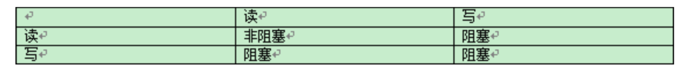
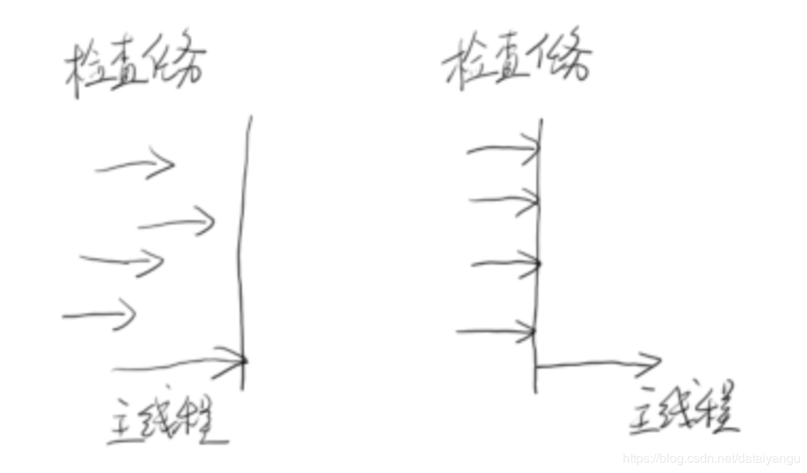
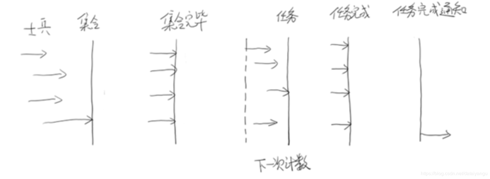
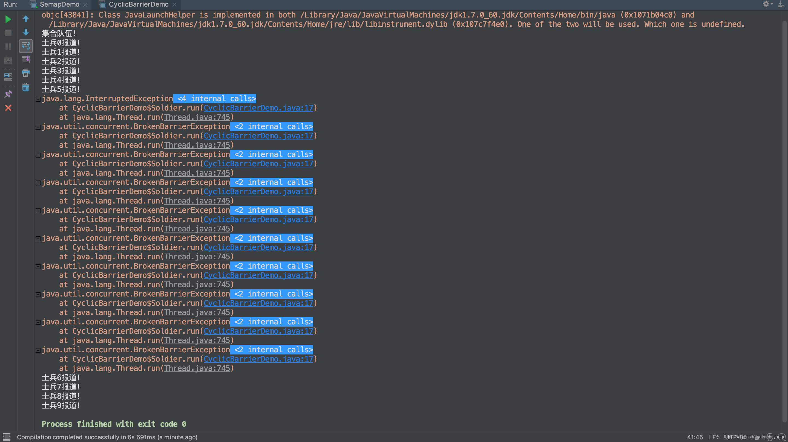
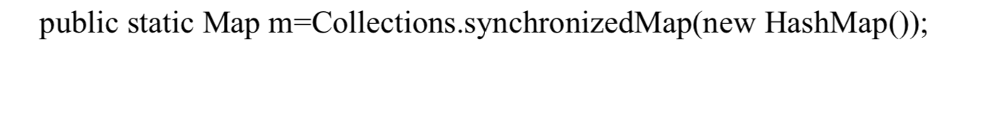
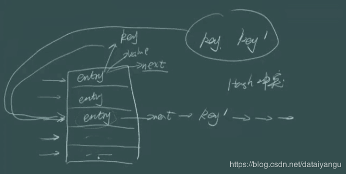
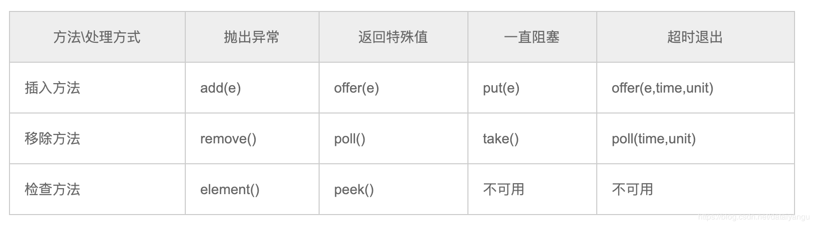
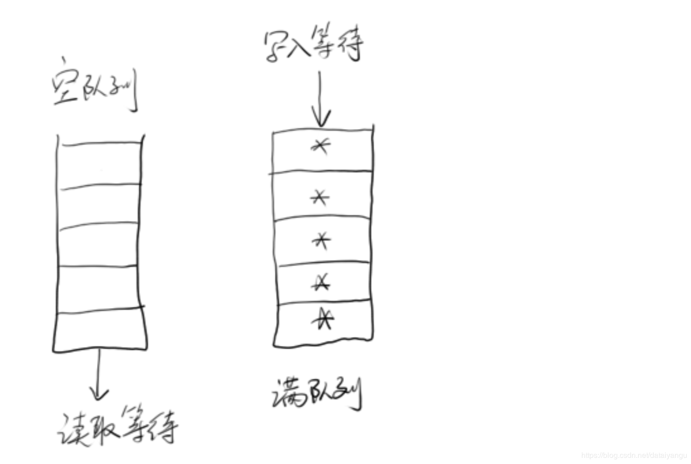

title: Java高并发程序设计学习笔记（五）：JDK并发包(各种同步控制工具的使用、并发容器及典型源码分析（Hashmap等）)
author: Leesin.Dong
top: 
tags:
  - 高并发
categories:
  - 学习笔记
  - Java高并发程序设计学习笔记
date: 2019-1-18 19:20:04

---


# 1. 各种同步控制工具的使用 
## 1.1. ReentrantLock
在synchronize的基础上新加了功能，如果是特别简单的场景，两者是没有太大的区别的。
### 1.1.1.可重入
 单线程可以重复进入，但要重复退出
 对于同一个线程，自己是可以重复进入的，否则会把自己卡死。
 结论：
重入锁是可重复获得资源的锁，已经获得锁的线程可以对当前的资源重入加锁而不会引起阻塞；不可重入锁是不可重复获得资源的锁，当已经获得锁的线程对当前资源再次加锁时，会把自己阻塞

广义上的可重入锁指的是可重复可递归调用的锁，在外层使用锁之后，在内层仍然可以使用，并且不发生死锁（前提得是同一个对象或者class），这样的锁就叫做可重入锁。ReentrantLock和synchronized都是可重入锁，下面是一个用synchronized实现的例子：


```js
public class ReentrantTest implements Runnable {

    public synchronized void get() {
        System.out.println(Thread.currentThread().getName());
        set();
    }

    public synchronized void set() {
        System.out.println(Thread.currentThread().getName());
    }

    public void run() {
        get();
    }

    public static void main(String[] args) {
        ReentrantTest rt = new ReentrantTest();
        for(;;){
            new Thread(rt).start();
        }
    }
}

```

整个过程没有发生死锁的情况，截取一部分输出结果如下：

```js
Thread-8492
Thread-8492
Thread-8494
Thread-8494
Thread-8495
Thread-8495
Thread-8493
Thread-8493

```

set()和get()同时输出了线程名称，表明即使递归使用synchronized也没有发生死锁，证明其是可重入的。


以上原文：https://blog.csdn.net/rickiyeat/article/details/78314451 


```js


import java.util.concurrent.locks.ReentrantLock;

public class Lock implements Runnable{
	public static ReentrantLock lock = new ReentrantLock();
	public static int i = 0;
	public void run() {
		for (int j = 0; j < 100000; j++) {
			lock.lock();
			lock.lock();
			try {
				i++;
			} finally {
				//不论如何都进行unlock
				//加两次锁必须解锁两次。
				lock.unlock();
				lock.unlock();
			}
		
		}
	}
	//synchronize只要在大括号外面，出了大括号，虚拟机会自动释放锁，可是lock是通过unlock来控制什么时候释放锁

	public static void main(String[] args) throws InterruptedException {
		Lock tl = new Lock();
		//同时开两个一样的线程
		Thread t1 = new Thread(tl);
		Thread t2 = new Thread(tl);
		t1.start();t2.start();
		t1.join();t2.join();
		System.out.println(i);
	}
}

```
运行结果

```js
20000
```
### 1.1.2. 可中断 lockInterruptibly()
在发生死锁或者其他的导致长期等待的情况，希望锁停下来的功能，synchronize没有这个功能，ReentrantLock提供了可中断。

```js
import java.util.concurrent.locks.ReentrantLock;

public class Interruptible  implements Runnable{
	public static ReentrantLock lock1 = new ReentrantLock();
	public static ReentrantLock lock2 = new ReentrantLock();
	int lock;
	public Interruptible(int lock){
		this.lock = lock;
	}

	public void run() {
		try{
			//lock=1的时候lock1上锁,lock=2的时候lock2上锁，刚才的lock1上了锁
			//之后还要给lock2上锁,lock2上了锁之后还要给lock1上锁，
			// 可是lock2在lock=2的时候被locl=2拿到了，lock1在lock=1的时候
			//被locl=1拿到了所以形成了死锁
			if (lock == 1){
				lock1.lockInterruptibly();
				try{
					Thread.sleep(500);
				} catch (InterruptedException e) {
					e.printStackTrace();
				}
				lock2.lockInterruptibly();
			}else{
				lock2.lockInterruptibly();
				try{
					Thread.sleep(500);
				} catch (InterruptedException e) {
					e.printStackTrace();
				}
				lock1.lockInterruptibly();
			}
		} catch (InterruptedException e) {
			e.printStackTrace();
		}finally {
		//如果lock1还拿着这把锁的话，就解掉。
			if (lock1.isHeldByCurrentThread())
				lock1.unlock();
			if (lock2.isHeldByCurrentThread())
				lock2.unlock();
			System.out.println(Thread.currentThread().getId()+":线程退出");
		}
	}

	public static void main(String[] args) throws InterruptedException {
		Interruptible interruptible1 = new Interruptible(1);
		Interruptible interruptible2 = new Interruptible(2);
		Thread t1 = new Thread(interruptible1);
		Thread t2 = new Thread(interruptible2);
		t1.start();t2.start();
		Thread.sleep(1000);
		DeadlockChecker.check();
	}
}

```
DeadlockChecker.check();如果将这句话注释，将会进行无限期的死锁。
```js
import java.lang.management.ManagementFactory;
import java.lang.management.ThreadInfo;
import java.lang.management.ThreadMXBean;

public class DeadLockChecker {
	private final static ThreadMXBean mbean = ManagementFactory.getThreadMXBean();
	final  static  Runnable deadLockCheck = new Runnable() {
		public void run() {
			while (true) {
				long [] deadLockedThreadIds = mbean.findDeadlockedThreads();
				if (deadLockedThreadIds != null) {
					ThreadInfo[] threadInfos = mbean.getThreadInfo(deadLockedThreadIds);
					for (Thread t : Thread.getAllStackTraces().keySet()) {
						for (int i = 0; i<threadInfos.length ; i++) {
							if (t.getId() == threadInfos[i].getThreadId()) {
								t.interrupt();
							}
						}
					}
				}
				try{
					Thread.sleep(5000);
				}catch (InterruptedException e){
					
				}
			}
		}
	};
	
	public static void check(){
		Thread t = new Thread(deadLockCheck);
		t.setDaemon(true);
		t.start();
	}
}

```

### 1.1.3. 可限时 
超时不能获得锁，就返回false，不会永久等待构成死锁

```js
import java.util.concurrent.TimeUnit;
import java.util.concurrent.locks.ReentrantLock;

public class TimeLock implements  Runnable{
	public static ReentrantLock lock = new ReentrantLock();

	public void run() {
		try{
			//如果线程在5秒之内没有拿到锁就走else里面的内容
			if (lock.tryLock(5, TimeUnit.SECONDS)) {
				Thread.sleep(6000);	
			}else{
				System.out.println("get lock failed");
			}
		} catch (InterruptedException e) {
			e.printStackTrace();
		}finally {
			if (lock.isHeldByCurrentThread()) {
				lock.unlock();
			}
		}
	}

	public static void main(String[] args) {
		TimeLock tl = new TimeLock();
		Thread t1 = new Thread(tl);
		Thread t2 = new Thread(t1);
		t1.start();
		t2.start();
		
	}
}

```

### 1.1.4. 公平锁
什么是公平锁？
先来先得，避免产生饥饿现象，但是性能差很多。所以不是特殊情况下，不要使用公平锁。
public ReentrantLock(boolean fair)
public static ReentrantLock fairLock = new ReentrantLock(true);


## 1.2. Condition
###  1.2.1. 概述
类似于 Object.wait()和Object.notify() 与ReentrantLock结合使用
### 1.2.2. 主要接口
void await() throws InterruptedException;//等待
void awaitUninterruptibly();
long awaitNanos(long nanosTimeout) throws InterruptedException; boolean await(long time, TimeUnit unit) throws InterruptedException; boolean awaitUntil(Date deadline) throws InterruptedException;
void signal();//通知继续往下走
void signalAll();

```js
import java.util.concurrent.locks.Condition;
import java.util.concurrent.locks.ReentrantLock;

public class ReenTerLockCondition implements Runnable {
	public static ReentrantLock lock = new ReentrantLock();
	public static Condition condition = lock.newCondition();

	public void run() {
		try{
			lock.lock();
			condition.await();
			System.out.println("Thread is going on ");
		} catch (InterruptedException e) {
			e.printStackTrace();
		}finally {
			lock.unlock();
		}
	}

	public static void main(String[] args) throws InterruptedException {
		ReenTerLockCondition tl = new ReenTerLockCondition();
		Thread t1 = new Thread(tl);
		t1.start();
		Thread.sleep(2000);
		lock.lock();
		condition.signal();
		lock.unlock();
	}
}
//必须在lock和unlock执行完了之后才会到上面将t1的锁解开。
//类似于之前的Synchronize代码块。
```

### 1.2.3. API详解 
await()方法会使当前线程等待，同时释放当前锁，当其他线程中使用signal()时或者signalAll()方法时，线
程会重新获得锁并继续执行。或者当线程被中断时，也能跳出等待。这和Object.wait()方法很相似。

awaitUninterruptibly()方法与await()方法基本相同，但是它并不会再等待过程中响应中断。不会被中断。
singal()方法用于唤醒一个在等待中的线程。相对的singalAll()方法会唤醒所有在等待中的线程。这和Obej ct.notify()方法很类似。
## 1.3. Semaphore 
 **<font color="red">  信号量
互斥的、排他的
可以有多个线程去共享这个临界区，广义上的锁，比如每个信号量指定十个许可，每个许可分配若干个线程，当然每个线程也可以持有多个许可，如果有多余的许可就可以进入，如果没有许可，后面的线程就必须等待，不能进入。
信号量允许多个线程进入临界区，信号量的许可等于一的时候就相当于一把锁。  </font>**

### 1.3.1. 概述
共享锁 运行多个线程同时临界区
### 1.3.2. 主要接口
public void acquire()//获得信号量

```js
 public void acquire() throws InterruptedException {
        sync.acquireSharedInterruptibly(1);
    }
    //也可以拿到多个许可
 public void acquire(int permits) throws InterruptedException {
        if (permits < 0) throw new IllegalArgumentException();
        sync.acquireSharedInterruptibly(permits);
    }
```

public void acquireUninterruptibly()//不支持中断的获得信号量
public boolean tryAcquire()//不会等待，只是试一试，拿不到就返回false
public boolean tryAcquire(long timeout, TimeUnit unit)//try的时间，等待的时间，和上线功能差差不多
 public void release()释放。
例子：

```js
import java.util.concurrent.ExecutorService;
import java.util.concurrent.Executors;
import java.util.concurrent.Semaphore;

public class  SemapDemo implements Runnable {
	final Semaphore semp = new Semaphore(5);

	public void run() {
		try{
		//也可以semp.acquire(2);下面将会每两个线程输出一次
			semp.acquire();
			Thread.sleep(2000);
			System.out.println(Thread.currentThread().getId()+":done!");
		} catch (InterruptedException e) {
			e.printStackTrace();
		}finally {
			semp.release();
		}
	}

	public static void main(String[] args) {
		ExecutorService exec = Executors.newFixedThreadPool(20);
		final SemapDemo demo = new SemapDemo();
		for (int i = 0; i <20 ; i++) {
			exec.submit(demo);
		}
	}
}

```

运行结果：

```js
11:done!
19:done!
12:done!
10:done!
13:done!
14:done!
15:done!
18:done!
17:done!
16:done!
20:done!
22:done!
23:done!
21:done!
19:done!
25:done!
28:done!
24:done!
27:done!
26:done!
```
可以看到每五个线程输出一次，每次停留两秒，同样的如果semp.acquire(2);每个线程拿到两个许可，一共有五个许可，release（2），所以每次只有两个线程输出。

## 1.4. ReadWriteLock 
写会修改数据，读不会修改数据，从性能上来看，如果不管读还是写都加锁，会十分影响性能，synchronized并行度只有一，一次只允许一个线程经过。如果没有写操作，这个所有的read线程必然是无等待的。
### 1.4.1. 概述
ReadWriteLock是JDK5中提供的读写分离锁 
### 1.4.2. 访问情况
读-读不互斥:读读之间不阻塞。
读-写互斥:读阻塞写，写也会阻塞读。
写-写互斥:写写阻塞。


### 1.4.3. 主要接口
private static ReentrantReadWriteLock readWriteLock=newReentrantReadWriteLock(); 
private static Lock readLock = readWriteLock.readLock();
获得readLock，然后通过readLock.lock()惊醒操作
private static Lock writeLock = readWriteLock.writeLock();
获得readLock，然后通过readLock.lock()惊醒操作
## 1.5. CountDownLatch
### 1.5.1. 概述
倒数计时器 一种典型的场景就是火箭发射。在火箭发射前，为了保证万无一失，往往还要进行各项设备、仪器的检查。 只有等所有检查完毕后，引擎才能点火。这种场景就非常适合使用CountDownLatch。它可以使得点火线程 ，等待所有检查线程全部完工后，再执行
### 1.5.2. 主要接口
static final CountDownLatch end = new CountDownLatch(10); //加入有十个检查项（十个线程）
end.countDown();//没通过一个就减一
end.await();//见到最后就返回，执行比如发射火箭的操作
### 1.5.3. 示意图


主线程在这里等待，等到所有的检查任务都到达临界点之后，主线程就继续执行。
### 例子

```js
import java.util.Random;
import java.util.concurrent.CountDownLatch;
import java.util.concurrent.ExecutorService;
import java.util.concurrent.Executors;

public class CountDownLatchDemo implements Runnable {
	static final CountDownLatch end = new CountDownLatch(10);//开启十个线程来进行检查
	static final CountDownLatchDemo demo = new CountDownLatchDemo();
	public void run() {
		try {
			Thread.sleep(new Random().nextInt(10)*1000);
			System.out.println("check complete");
			end.countDown();
		} catch (InterruptedException e) {
			e.printStackTrace();
		}
	}

	public static void main(String[] args) throws InterruptedException {
		ExecutorService exec = Executors.newFixedThreadPool(10);
		for (int i = 0; i <10 ; i++) {
			exec.submit(demo);
		}
		//等待检查
		end.await();
		//发射火箭
		System.out.println("Fire");
		exec.shutdown();
	}
}

```
运行结果

```js
check complete
check complete
check complete
check complete
check complete
check complete
check complete
check complete
check complete
check complete
Fire
```

##  1.6. CyclicBarrier 
### 1.6.1. 概述
循环栅栏 Cyclic意为循环，也就是说这个计数器可以反复使用。比如，假设我们将计数器设置为10。那么凑齐第一批1 0个线程后，计数器就会归零，然后接着凑齐下一批10个线程
它和CountDownLatch的区别是CountDownLatch的计数器只能有一次，而CyclicBarrier可以再重复利用。
### 1.6.2. 主要接口
public CyclicBarrier(int parties（几个参与者相当于上一节中的10）, Runnable barrierAction（所有的线程到了之后，栅栏（系统）执行的动作）)
barrierAction就是当计数器一次计数完成后，系统会执行的动作 
await() //都到了之后再往下执行
### 1.6.3. 示意图


### 例子

```js
import java.util.Random;
import java.util.concurrent.BrokenBarrierException;
import java.util.concurrent.CyclicBarrier;

public class CyclicBarrierDemo {
	public static  class Soldier implements Runnable{
		private String soldier;
		private final CyclicBarrier cyclic;

		Soldier(CyclicBarrier cyclic,String soldierName) {
			this.soldier = soldierName;
			this.cyclic = cyclic;
		}

		public void run() {
			try {
				cyclic.await();
				doWork();
				cyclic.await();
			} catch (InterruptedException e) {
				e.printStackTrace();
			} catch (BrokenBarrierException e) {
				e.printStackTrace();
			}
		}

		void doWork(){
			try {
				Thread.sleep(Math.abs(new Random().nextInt()%10000));
			} catch (InterruptedException e) {
				e.printStackTrace();
			}
			System.out.println(soldier+":任务完成");
		}
	}
	public static class BarrierRun implements Runnable{
		boolean flag;
		int N;

		public BarrierRun(boolean flag, int N) {
			this.flag = flag;
			this.N = N;
		}
		public void run() {
			if (flag) {
				System.out.println("司令:[士兵"+N+"个，任务完成！]");
			}else{
				System.out.println("司令:[士兵"+N+"个，集合完毕！]");
				flag = true;
			}
		}
	}

	public static void main(String[] args) {
		final int N = 10;
		Thread[] allSoldier = new Thread[N];
		boolean flag = false;
		CyclicBarrier cyclic = new CyclicBarrier(N, new BarrierRun(flag, N));
		System.out.println("集合队伍!");
		for (int i = 0; i <N ; i++) {
			System.out.println("士兵"+i+"报道！");
			allSoldier[i] = new Thread(new Soldier(cyclic, "士兵" + i));
			allSoldier[i].start();
//			if (i == 5) {
//				allSoldier[0].interrupt();
//			}
		}
	}
}

```
运行结果

```js
集合队伍！
士兵0报道
士兵1报道
士兵2报道
士兵3报道
士兵4报道
士兵5报道
士兵6报道
士兵7报道
士兵8报道
士兵9报道
司令[士兵10个，集合完毕！]
士兵2：任务完成
士兵7：任务完成
士兵0：任务完成
士兵4：任务完成
士兵3：任务完成
士兵9：任务完成
士兵6：任务完成
士兵8：任务完成
士兵1：任务完成
士兵5：任务完成
司令：[士兵10个，任务完成！]
```

```js
//			if (i == 5) {
//				allSoldier[0].interrupt();
//			}
```
将这个注释打开的话


第零个终端之后，将会抛出InterruptedException异常，剩下的九个线程将会抛出BrokenBarrierException异常。
## 1.7. LockSupport 
### 1.7.1. 概述
比较偏底层。
提供线程阻塞原语 
挂起
### 1.7.2. 主要接口
LockSupport.park(); //停下来、挂起，将线程挂起，除非许可是可用的。
LockSupport.unpark(t1);//将t1继续执行，使得许可是可用的
### 1.7.3. 与suspend()比较 
LockSupport不容易引起线程冻结，suspend将来可能会被废弃。
有点类似于信号量中的许可，如果unpark发生在park之前，park并不会将线程阻塞住。
如果rewiew发生在suspend之前，suspend就不能再继续执行了，永久挂起。
### 1.7.4. 中断响应
wait等是能够try catch 终端异常的，但是park是没有捕获这个异常的，所以：
能够响应中断，但不抛出异常。
中断响应的结果是，park()函数的返回，可以从Thread.interrupted()得到中断标志
### 例子

```js
import java.util.concurrent.locks.LockSupport;

public class LockSupportDemo {
	public static Object u = new Object();
	static ChangeObjectThread t1 = new ChangeObjectThread("t1");
	static ChangeObjectThread t2 = new ChangeObjectThread("t2");

	public static class ChangeObjectThread extends Thread{
		public ChangeObjectThread(String name) {
			super.setName(name);
		}

		@Override
		public void run() {
			synchronized (u){
				System.out.println("in"+getName());
				LockSupport.park();
			}
		}
	}

	public static void main(String[] args) throws InterruptedException {
		t1.start();
		Thread.sleep(100);
		t2.start();
		LockSupport.unpark(t1);
		LockSupport.unpark(t2);
		t1.join();
		t2.join();
	}
}

```
运行结果
```js
int 1 
int 2
```
不论unpark在park的前面还是后面都不会阻塞。

## 1.8. ReentrantLock 的实现
### 1.8.1. CAS状态 
锁到底有没有被人占用，通过是否到达期望值，通过值是否改变来判断是否应该拿到锁。
### 1.8.2. 等待队列
如果没有拿到锁，线程应该怎么办呢，应该进入等待的队列，如果有多个线程进来，多个线程在队列中进行等待。
### 1.8.3. park()
在队列中的线程都进行park操作。unlock的时候，从等待的队列中挑出一个出来进行unpark操作。
### 源码

```js
 /**
         * Performs lock.  Try immediate barge, backing up to normal
         * acquire on failure.
         */
        final void lock() {
            if (compareAndSetState(0, 1))//期望值是0，更新成1
            //如果成功了，便能拿到锁，就能继续往下走。
                setExclusiveOwnerThread(Thread.currentThread());
            else
            //否则就尝试去做申请。
                acquire(1);
        }
        protected final boolean compareAndSetState(int expect, int update) {
        // See below for intrinsics setup to support this
        return unsafe.compareAndSwapInt(this, stateOffset, expect, update);
    }
     public final void acquire(int arg) {
     //在尝试一下，万一别人释放了呢？
        if (!tryAcquire(arg) &&
            acquireQueued(addWaiter(Node.EXCLUSIVE), arg))
            selfInterrupt();
    }
    //如果尝试了还是不行就把自己放到等待队列中去
      private Node addWaiter(Node mode) {
        Node node = new Node(Thread.currentThread(), mode);
        // Try the fast path of enq; backup to full enq on failure
        //放到队列的尾巴上去。
        Node pred = tail;
        if (pred != null) {
            node.prev = pred;
            if (compareAndSetTail(pred, node)) {
                pred.next = node;
                return node;
            }
        }
        enq(node);
        return node;
    }
 //返回的node然后再去尝试请求锁
    final boolean acquireQueued(final Node node, int arg) {
        boolean failed = true;
        try {
            boolean interrupted = false;
            for (;;) {
                final Node p = node.predecessor();
                if (p == head && tryAcquire(arg)) {
                    setHead(node);
                    p.next = null; // help GC
                    failed = false;
                    return interrupted;
                }
               //如果确实是拿不到就会在这里挂起，下面会有详细
                if (shouldParkAfterFailedAcquire(p, node) &&
                    parkAndCheckInterrupt())
                    interrupted = true;
            }
        } finally {
            if (failed)
                cancelAcquire(node);
        }
    }
    //通过park进行挂起
 private final boolean parkAndCheckInterrupt() {
        LockSupport.park(this);
        return Thread.interrupted();
    }


//unlock操作
 public void unlock() {
        sync.release(1);
 }
  */
    public final boolean release(int arg) {
        if (tryRelease(arg)) {
            Node h = head;
            if (h != null && h.waitStatus != 0)
            //将队列头部的node进行unpark操作
                unparkSuccessor(h);
            return true;
        }
        return false;
    }

private void unparkSuccessor(Node node) {
        /*
         * If status is negative (i.e., possibly needing signal) try
         * to clear in anticipation of signalling.  It is OK if this
         * fails or if status is changed by waiting thread.
         */
        int ws = node.waitStatus;
        if (ws < 0)
            compareAndSetWaitStatus(node, ws, 0);

        /*
         * Thread to unpark is held in successor, which is normally
         * just the next node.  But if cancelled or apparently null,
         * traverse backwards from tail to find the actual
         * non-cancelled successor.
         */
        Node s = node.next;
        if (s == null || s.waitStatus > 0) {
            s = null;
            for (Node t = tail; t != null && t != node; t = t.prev)
                if (t.waitStatus <= 0)
                    s = t;
        }
        if (s != null)
            LockSupport.unpark(s.thread);
    }
```

# 2. 并发容器及典型源码分析
## 2.1. 集合包装 
### 2.1.1. HashMap
HashMap不是一个线程安全的容器，可以通过如下的方法变成线程安全的，但是只适用于并发量比较小的情况。
Collections.synchronizedMap


### 源码

```js
private static class SynchronizedMap<K,V>
        implements Map<K,V>, Serializable {
        private static final long serialVersionUID = 1978198479659022715L;

        private final Map<K,V> m;     // Backing Map
        final Object      mutex;        // Object on which to synchronize

        SynchronizedMap(Map<K,V> m) {
            if (m==null)
                throw new NullPointerException();
            this.m = m;
            mutex = this;
        }

        SynchronizedMap(Map<K,V> m, Object mutex) {
            this.m = m;
            this.mutex = mutex;
        }

        public int size() {
            synchronized (mutex) {return m.size();}
        }
        public boolean isEmpty() {
            synchronized (mutex) {return m.isEmpty();}
        }
        public boolean containsKey(Object key) {
            synchronized (mutex) {return m.containsKey(key);}
        }
        public boolean containsValue(Object value) {
            synchronized (mutex) {return m.containsValue(value);}
        }
        public V get(Object key) {
            synchronized (mutex) {return m.get(key);}
        }

        public V put(K key, V value) {
            synchronized (mutex) {return m.put(key, value);}
        }
        public V remove(Object key) {
            synchronized (mutex) {return m.remove(key);}
        }
        public void putAll(Map<? extends K, ? extends V> map) {
            synchronized (mutex) {m.putAll(map);}
        }
        public void clear() {
            synchronized (mutex) {m.clear();}
        }

        private transient Set<K> keySet = null;
        private transient Set<Map.Entry<K,V>> entrySet = null;
        private transient Collection<V> values = null;

        public Set<K> keySet() {
            synchronized (mutex) {
                if (keySet==null)
                    keySet = new SynchronizedSet<>(m.keySet(), mutex);
                return keySet;
            }
        }

        public Set<Map.Entry<K,V>> entrySet() {
            synchronized (mutex) {
                if (entrySet==null)
                    entrySet = new SynchronizedSet<>(m.entrySet(), mutex);
                return entrySet;
            }
        }

        public Collection<V> values() {
            synchronized (mutex) {
                if (values==null)
                    values = new SynchronizedCollection<>(m.values(), mutex);
                return values;
            }
        }

        public boolean equals(Object o) {
            if (this == o)
                return true;
            synchronized (mutex) {return m.equals(o);}
        }
        public int hashCode() {
            synchronized (mutex) {return m.hashCode();}
        }
        public String toString() {
            synchronized (mutex) {return m.toString();}
        }
        private void writeObject(ObjectOutputStream s) throws IOException {
            synchronized (mutex) {s.defaultWriteObject();}
        }
    }
```
通过观察分析，是将map封装到了synchronizeMap中，并且，将get  put 等操作都放在了Synchronize代码块中，下面的List和Set同理，因为是放在了synchronize代码块中所以是串行的不是并行的，只能适用于并发量比较小的场景。

### 2.1.2. List
synchronizedList
### 2.1.3. Set
synchronizedSet
## 2.2. ConcurrentHashMap
高性能HashMap（解决synchronize只适用于并发量小的场景）
### 2.2.1HashMap源码分析
HashMap内部是一个数组
拿put方法来看
```js
public V put(K key, V value) {
        if (table == EMPTY_TABLE) {
            inflateTable(threshold);
        }
        if (key == null)
            return putForNullKey(value);
        int hash = hash(key);
        int i = indexFor(hash, table.length);
        for (Entry<K,V> e = table[i]; e != null; e = e.next) {
            Object k;
            if (e.hash == hash && ((k = e.key) == key || key.equals(k))) {
                V oldValue = e.value;
                e.value = value;
                e.recordAccess(this);
                return oldValue;
            }
        }

        modCount++;
        addEntry(hash, key, value, i);
        return null;
    }
    //进入inflateTable方法
  private void inflateTable(int toSize) {
        // Find a power of 2 >= toSize
        int capacity = roundUpToPowerOf2(toSize);

        threshold = (int) Math.min(capacity * loadFactor, MAXIMUM_CAPACITY + 1);
        table = new Entry[capacity];
        initHashSeedAsNeeded(capacity);
    }
    //看到是将疏浚存到了table中
    transient Entry<K,V>[] table = (Entry<K,V>[]) EMPTY_TABLE;
    //每一个table中是entry表象
    static class Entry<K,V> implements Map.Entry<K,V> {
    //每个entry里面是key value next hash
        final K key;
        V value;
        Entry<K,V> next;
        int hash;

        /**
         * Creates new entry.
         */
        Entry(int h, K k, V v, Entry<K,V> n) {
            value = v;
            next = n;
            key = k;
            hash = h;
        }

        public final K getKey() {
            return key;
        }

        public final V getValue() {
            return value;
        }

        public final V setValue(V newValue) {
            V oldValue = value;
            value = newValue;
            return oldValue;
        }

        public final boolean equals(Object o) {
            if (!(o instanceof Map.Entry))
                return false;
            Map.Entry e = (Map.Entry)o;
            Object k1 = getKey();
            Object k2 = e.getKey();
            if (k1 == k2 || (k1 != null && k1.equals(k2))) {
                Object v1 = getValue();
                Object v2 = e.getValue();
                if (v1 == v2 || (v1 != null && v1.equals(v2)))
                    return true;
            }
            return false;
        }

        public final int hashCode() {
            return Objects.hashCode(getKey()) ^ Objects.hashCode(getValue());
        }

        public final String toString() {
            return getKey() + "=" + getValue();
        }

        /**
         * This method is invoked whenever the value in an entry is
         * overwritten by an invocation of put(k,v) for a key k that's already
         * in the HashMap.
         */
        void recordAccess(HashMap<K,V> m) {
        }

        /**
         * This method is invoked whenever the entry is
         * removed from the table.
         */
        void recordRemoval(HashMap<K,V> m) {
        }
    }
```



get（key）是通过哈希算法来判断应该映射到哪个槽位的
两个不同的key比如，key1  key2可能被映射到同一个槽位中，这里叫做哈希冲突
一种解决方法是，既然你映射到了同一个槽位中，我就把你方法同一个槽位中，可是在一个entry的数组中如何放两个entry呢？？通过entry中的next指向下一个entry

事实上HashMap的内部主要实现是数组，数组中放着entry，每个entry都是链表中的一环，链表的头部，当发生大量的hash冲突的时候蜕化成一个链表。

一般情况下HashMap不会放满，因为放满之后必然产生冲突，所以一般HashMap需要预留空间

### 2.2.2. ConcurrentHashMap源码分析

```js
 public V put(K key, V value) {
        Segment<K,V> s;
        if (value == null)
            throw new NullPointerException();
        int hash = hash(key);
        int j = (hash >>> segmentShift) & segmentMask;
        if ((s = (Segment<K,V>)UNSAFE.getObject          // nonvolatile; recheck
             (segments, (j << SSHIFT) + SBASE)) == null) //  in ensureSegment
            s = ensureSegment(j);
        return s.put(key, hash, value, false);
    }
```
Segment 段
如果大量线程进来，会一起竞争HashMap的赋值操作
把大的HashMap切割成若干个小的HashMap，每个线程进来的时候，先把当前的key映射到其中的一个小HashMap中去，在小HashMap中做一个普通HashMap应该做的事情，假如大的HashMap中有十六个小的HashMap，意味着大的HashMap可以同时接受十六个线程的赋值操作，相比于之前只有一个HasnMap，性能提高了十六倍。

这里的Segment就是上面说的小HashMap，通过移位操作拿到当前的偏移量如果不存在就创建一个：

```js
 private Segment<K,V> ensureSegment(int k) {
        final Segment<K,V>[] ss = this.segments;
        long u = (k << SSHIFT) + SBASE; // raw offset
        Segment<K,V> seg;
        if ((seg = (Segment<K,V>)UNSAFE.getObjectVolatile(ss, u)) == null) {
            Segment<K,V> proto = ss[0]; // use segment 0 as prototype
            int cap = proto.table.length;
            float lf = proto.loadFactor;
            int threshold = (int)(cap * lf);
            HashEntry<K,V>[] tab = (HashEntry<K,V>[])new HashEntry[cap];
            if ((seg = (Segment<K,V>)UNSAFE.getObjectVolatile(ss, u))
                == null) { // recheck
                Segment<K,V> s = new Segment<K,V>(lf, threshold, tab);
                while ((seg = (Segment<K,V>)UNSAFE.getObjectVolatile(ss, u))
                       == null) {
                    if (UNSAFE.compareAndSwapObject(ss, u, null, seg = s))
                        break;
                }
            }
        }
        return seg;
    }
```
将第零个Segment作为原型将第k个Segment设置出来。

 **<font color="red"> 注意这里的put虽然是线程安全的但是并没有使用锁。
   </font>**
上面的s.put():

```js

 final V put(K key, int hash, V value, boolean onlyIfAbsent) {
 //这里的tryLock还是一个CAS操作tryLock不会等待，Lock才会等待
            HashEntry<K,V> node = tryLock() ? null :
            //如果trylock失败，代码在线面详细解释这个函数
                scanAndLockForPut(key, hash, value);
            V oldValue;
            try {
                HashEntry<K,V>[] tab = table;
                int index = (tab.length - 1) & hash;
                槽位映射到index上，拿出index中的第一个
                HashEntry<K,V> first = entryAt(tab, index);
                //尝试将first插到entry中
                for (HashEntry<K,V> e = first;;) {
                //如果有hash冲突
                    if (e != null) {
                        K k;
                        if ((k = e.key) == key ||
                            (e.hash == hash && key.equals(k))) {
                            oldValue = e.value;
                            if (!onlyIfAbsent) {
                                e.value = value;
                                ++modCount;
                            }
                            break;
                        }
                        //有Hash冲突就将value串起来
                        e = e.next;
                    }
                    //如果没有hash冲突
                    else {
                        if (node != null)
                            node.setNext(first);
                        else
                            node = new HashEntry<K,V>(hash, key, value, first);
                        int c = count + 1;
                        if (c > threshold && tab.length < MAXIMUM_CAPACITY)
                            rehash(node);
                        else
                        //就将entry set到数组中去
                            setEntryAt(tab, index, node);
                        ++modCount;
                        count = c;
                        oldValue = null;
                        break;
                    }
                }
            } finally {
                unlock();
            }
            return oldValue;
        }

private HashEntry<K,V> scanAndLockForPut(K key, int hash, V value) {
            HashEntry<K,V> first = entryForHash(this, hash);
            HashEntry<K,V> e = first;
            HashEntry<K,V> node = null;
            int retries = -1; // negative while locating node
            //不断的trylock
            while (!tryLock()) {
                HashEntry<K,V> f; // to recheck first below
                if (retries < 0) {
                    if (e == null) {
                        if (node == null) // speculatively create node
                            node = new HashEntry<K,V>(hash, key, value, null);
                        retries = 0;
                    }
                    else if (key.equals(e.key))
                        retries = 0;
                    else
                        e = e.next;
                }
                //如果trylock超过了一定的次数，就会挂起
                else if (++retries > MAX_SCAN_RETRIES) {
                    lock();
                    break;
                }
                else if ((retries & 1) == 0 &&
                //这里可能是hash进行了扩容重hash等操作，将retrues复制为-1，
                //再不断的进行trylock
                         (f = entryForHash(this, hash)) != first) {
                    e = first = f; // re-traverse if entry changed
                    retries = -1;
                }
            }
            return node;
        }

```
 **<font color="red"> 这里的不断的trylock，如果到达一定的次数在挂起，是concurrentHashMap的核心优化   </font>**
 但是注意在concurrentHashMap中有一个size操作中的：
 

```js
public int size() {
        // Try a few times to get accurate count. On failure due to
        // continuous async changes in table, resort to locking.
        final Segment<K,V>[] segments = this.segments;
        int size;
        boolean overflow; // true if size overflows 32 bits
        long sum;         // sum of modCounts
        long last = 0L;   // previous sum
        int retries = -1; // first iteration isn't retry
        try {
            for (;;) {
                if (retries++ == RETRIES_BEFORE_LOCK) {
                    for (int j = 0; j < segments.length; ++j)
                        ensureSegment(j).lock(); // force creation
                }
                sum = 0L;
                size = 0;
                overflow = false;
                for (int j = 0; j < segments.length; ++j) {
                    Segment<K,V> seg = segmentAt(segments, j);
                    if (seg != null) {
                        sum += seg.modCount;
                        int c = seg.count;
                        if (c < 0 || (size += c) < 0)
                            overflow = true;
                    }
                }
                if (sum == last)
                    break;
                last = sum;
            }
        } finally {
            if (retries > RETRIES_BEFORE_LOCK) {
                for (int j = 0; j < segments.length; ++j)
                    segmentAt(segments, j).unlock();
            }
        }
        return overflow ? Integer.MAX_VALUE : size;
    }

```
上面的代码中重复进行了lock和unlock，因为在想要得到map的size的时候是不能够再进行修改的，所以加上锁，这里可能会有性能问题，可是size操作用的并不是很频繁，所以可以忽略。

rehash操作：

```js
//在put操作中
//如果大于了hash的阈值，就会进行rehash
if (c > threshold && tab.length < MAXIMUM_CAPACITY)
                            rehash(node);

 /**
         * Doubles size of table and repacks entries, also adding the
         * given node to new table
         */
 private void rehash(HashEntry<K,V> node) {
            HashEntry<K,V>[] oldTable = table;
            int oldCapacity = oldTable.length;
            int newCapacity = oldCapacity << 1;
            threshold = (int)(newCapacity * loadFactor);
            HashEntry<K,V>[] newTable =
                (HashEntry<K,V>[]) new HashEntry[newCapacity];
            int sizeMask = newCapacity - 1;
            for (int i = 0; i < oldCapacity ; i++) {
                HashEntry<K,V> e = oldTable[i];
                if (e != null) {
                    HashEntry<K,V> next = e.next;
                    int idx = e.hash & sizeMask;
                    if (next == null)   //  Single node on list
                        newTable[idx] = e;
                    else { // Reuse consecutive sequence at same slot
                        HashEntry<K,V> lastRun = e;
                        int lastIdx = idx;
                        for (HashEntry<K,V> last = next;
                             last != null;
                             last = last.next) {
                            int k = last.hash & sizeMask;
                            if (k != lastIdx) {
                                lastIdx = k;
                                lastRun = last;
                            }
                        }
                        newTable[lastIdx] = lastRun;
                        // Clone remaining nodes
                        for (HashEntry<K,V> p = e; p != lastRun; p = p.next) {
                            V v = p.value;
                            int h = p.hash;
                            int k = h & sizeMask;
                            HashEntry<K,V> n = newTable[k];
                            newTable[k] = new HashEntry<K,V>(h, p.key, v, n);
                        }
                    }
                }
            }
            int nodeIndex = node.hash & sizeMask; // add the new node
            node.setNext(newTable[nodeIndex]);
            newTable[nodeIndex] = node;
            table = newTable;
        }
```
rehash会将空间容量翻倍，将node放进去，是一个比较耗时的操作，做了一点油画，尽量重用现有的元素，不去新建元素，也就是说在翻倍前和翻倍后，同一个元素，很可能在用一个位置


## 2.3. BlockingQueue
阻塞队列

阻塞队列（BlockingQueue）是一个支持两个附加操作的队列。这两个附加的操作是：在队列为空时，获取元素的线程会等待队列变为非空。当队列满时，存储元素的线程会等待队列可用。阻塞队列常用于生产者和消费者的场景，生产者是往队列里添加元素的线程，消费者是从队列里拿元素的线程。阻塞队列就是生产者存放元素的容器，而消费者也只从容器里拿元素。


以上两段内容转自：http://ifeve.com/java-blocking-queue/


是一个接口，不是一个实际的类，是一个并发容器，但不是一个高性能的并发容器，和concurrentHashMap（高性能）不一样，但它本身的好处是在多个线程共享数据的容器

如上图，如果队列为空，还试图往队列里面读数据，读的线程就会等待，等待有其他的线程往里面写数据的时候，才会唤醒，并且去拿到数据。如果队列已经满了，还想往队列中存数据，写的线程就会等待，等有人将数据拿掉之后才会写进去。

所以会引起线程的阻塞。

### ArrayBlockingQueue源码

```js
/** Main lock guarding all access */
    final ReentrantLock lock;//保证线程安全
    /** Condition for waiting takes */
    private final Condition notEmpty;//提示读操作不为空
    /** Condition for waiting puts */
    private final Condition notFull;//提示写操作不为满

 public void put(E e) throws InterruptedException {
        checkNotNull(e);
        final ReentrantLock lock = this.lock;
        //put操作直接加锁，所以是比较耗性能的。
        lock.lockInterruptibly();
        try {
            while (count == items.length)
            //如果是满的会进行等待，直到下面的take操作
                notFull.await();
            insert(e);
        } finally {
            lock.unlock();
        }
    }
public E take() throws InterruptedException {
        final ReentrantLock lock = this.lock;
        lock.lockInterruptibly();
        try {
            while (count == 0)
            //这里是为了读操作
                notEmpty.await();
                //去掉写操作的锁，具体代码往下看
            return extract();
        } finally {
            lock.unlock();
        }
    }

 private E extract() {
        final Object[] items = this.items;
        E x = this.<E>cast(items[takeIndex]);
        items[takeIndex] = null;
        takeIndex = inc(takeIndex);
        --count;
        //在这里讲锁打开
        notFull.signal();
        return x;
    }
```

## 2.4. ConcurrentLinkedQueue
高性能的链表队列，处理类似于concurrentHashMap，内部使用大量的无锁的算法。

