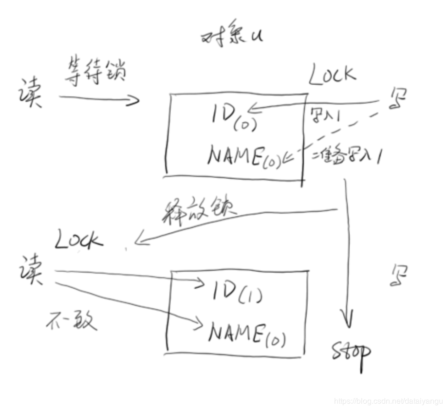
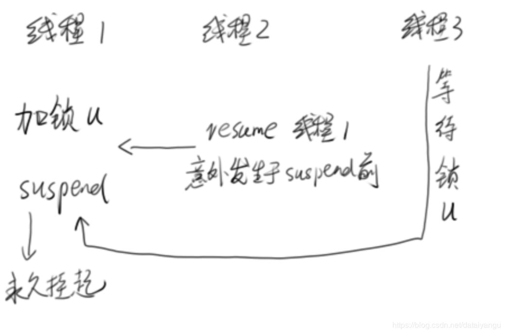
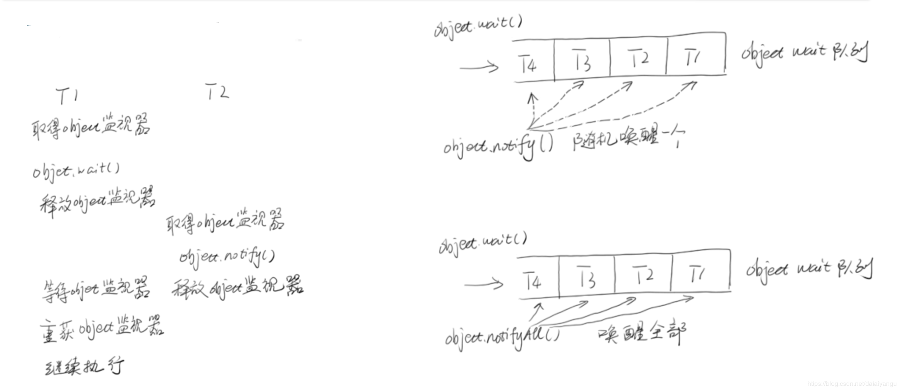

title: Java高并发程序设计学习笔记（二）：多线程基础
author: Leesin.Dong
top: 
tags:
  - 高并发
categories:
  - 学习笔记
  - Java高并发程序设计学习笔记
date: 2019-1-18 19:20:01

---


# 什么是线程？
线程是进程内的执行单元。
每个进程中有若干个线程，进程的切换是非常重量型的，所线程可以作为较为广泛的并发涉及

java中调动了线程会映射到操作系统中，两者是等价的
# 线程的基本操作


# 线程的基本操作
## 新建线程
```js
Thread t1=new Thread(); t1.start();
每一个线程都是runable接口的实现
start方法就能把这个线程跑起来，开启一个线程
在一个新的操作系统的线程上面调用run方法
```
```js
Thread t1=new Thread(); t1.run(); 
不能开启线程
```
 **<font color="red">  调用run方法和调用start方法做的事情是一样的 ，但是run并不会开启新的线程而是在调用run的当前的这个线程当中执行这个操作，只有使用的start方法才是在真的一个新的线程当中执行run中的事情 </font>**

Thread.run()的实现 target 是Runnable接口（run是runnable接口中的一个方法）
run方法源码
```js
private Runnable target;
public void run() {
if (target != null) {
 target.run();
} }
```

Thread 的init方法：
```js
public Thread(){
	init(null,null,"Thread-"+nextThreadNum(),0)
	//init方法是在new对象的时候自动执行的
}
private void init(ThreadGroup g, Runnable target, String name,
                      long stackSize) {
        init(g, target, name, stackSize, null, true);
    }
 ```
 ## 调用run的一种方式
 这里的target本身就是传的null，所以就可以把run方法重载，把我们的方法写进去
 ```js
Thread t1=new Thread(){ 
@Override
public void run(){
System.out.println("Hello, I am t1");
} };
t1.start();
```
##  调用run另的一种方式
将target传到init方法中，来运行run方法。如下面CreateThread3（一个runnable的实例），这里不需要重载run方法，t1.start()的时候会自动去调用target.run。
```js
Thread t1=new Thread(new CreateThread3()); t1.start();
```
## 终止线程  **<font color="red">（弃用）</font>**
– Thread.stop() 不推荐使用。它会释放所有monitor
记录1:ID=1，NAME=小明 
记录2:ID=2，NAME=小王



如上图，在读和写的时候加入锁，当写完id，正要写name的时候，stop掉了thread，这个时候，会把锁释放掉，导致将id写了进去，name没有写进去，出现数据的不一致。
## 中断线程

public void Thread.interrupt() // 中断线程
public boolean Thread.isInterrupted() // 判断是否被中断
public static boolean Thread.interrupted() // 判断是否被中断，并清除当前中断状态
```js
public void run(){ while(true){
Thread.yield();
} }
t1.interrupt();
```
t1.interrupt();我只是告诉线程你应该终止了，对线程没有任何的影响，还是在跑着的。
```js
public void run(){ while(true){
if(Thread.currentThread().isInterrupted()){
System.out.println("Interruted!"); 
break;
}
Thread.yield();
} }
```
通过Thread.currentThread().isInterrupted()判断当前的线程是不是被interrupt（），告知过要中断，是的话就break出while循环，同时终止run方法，也就自动终止了thread，这里不会出现数据的不一致，因为是在Thread.yield();（下一次数据处理之前）对线程进行终止的。
 **<font color="red">   拓展 </font>**

 public static native void sleep(long millis) throws InterruptedException
  ```js
 public void run(){ while(true){
			if(Thread.currentThread().isInterrupted()){ 
			System.out.println("Interruted!");
			break; }
			try {
			Thread.sleep(2000);
			} catch (InterruptedException e) {
			System.out.println("Interruted When Sleep"); 
			//设置中断状态，抛出异常后会清除中断标记位 
			Thread.currentThread().interrupt();
			}
			 Thread.yield();
 }
 } 
```
sleep即休眠方法。为什么休眠方法需要抛出 throws InterruptedException异常呢？
如果我在休眠的过程中，线程出现了isInterrupted（中断）的请求怎么办？这个时候如果sleep会抛出一个异常，同时自动清除interrupt（）设置的标志位，所以需要在抛出的异常中添加Thread.currentThread().interrupt();以保证能够被上面的Thread.currentThread().isInterrupted()检测到从而中断线程。
## 挂起(suspend)和继续执行(resume)线程 **<font color="red">    (弃用)</font>**
 **<font color="red"> suspend()不会释放锁   </font>**，发现suspend之后现场称还是runnable的状态，当然不代表所有的挂起后线程会runnable。
如果加锁发生在resume()之前 ，则死锁发生


如上图，线程1挂起可，这个时候没有释放锁，希望通过线程2来resume锁，但是线程2的resume可能意外的发生在suspend之前，这个时候线程1将会永远的挂，其他的锁（如上图线程3）将会无线等待线程1拿到的锁。
## 等待线程结束(join)和谦让(yeild)
### yeild   
当前线程优先级不是特别高，希望其他线程有机会争夺cpu时间，所以讲当前占用的cpu事件释放掉，使得其他的线程有更多的机会继续往下执行，但是下次还是有机会拿到cpu时间，不代表永远的让出去。
### join   
线程a希望知道线程b什么时候结束，因为需要在线程b结束的时候来立马做某些事情。
```js
public class JoinMain {
public volatile static int i=0;
public static class AddThread extends Thread{
@Override public void run() {
for(i=0;i<10000000;i++); }
}
public static void main(String[] args) throws InterruptedException {
AddThread at=new AddThread();
 at.start();
at.join();
System.out.println(i);
} }
```
如上面的代码，希望在主线程中加入at方法，在at方法执行完毕之后再执行System.out.println(i);这句话。

join（有时间和没时间的，如果有无参数就是无限等待，有参数，就是等待一段时间如果还没有结束就继续往下执行，我等不起。）
 join的本质
 ```js
while (isAlive()) {
wait(0); 
}
```
如果线程是isalive（没死掉的），就无线等待，直到线程执行完毕后， 系统会调用 notifyAll()，注意 **<font color="red"> 不要在Thread实例上使用 wait()和notify()方法</font>

## 守护线程
在后台默默地完成一些系统性的服务，比如垃圾回收线程、JIT线程就可以理解为守护线程 
当一个Java应用内，只有守护线程时，Java虚拟机就会自然退出
  Thread t=new DaemonT(); t.setDaemon(true); t.start();
  举例子：
  ```js
  psvm(){
Thread t =new DeamonT();
t.setDaemon(true);
t.start();
}
```
会发现，刚启动程序，就自动停掉了。
## 线程优先级
 public final static int MIN_PRIORITY = 1;
public final static int NORM_PRIORITY = 5; 
public final static int MAX_PRIORITY = 10;
```js
Thread high=new HightPriority(); LowPriority low=new LowPriority(); 
high.setPriority(Thread.MAX_PRIORITY);
low.setPriority(Thread.MIN_PRIORITY);
low.start();
high.start();
```
low的优先级比high高
   高优先级的线程更容易再竞争中获胜
# 基本的线程同步操作
## synchronized **<font color="red">    （注意拿到的东西必须是同一个)</font>**
这个关键字是java内置的，所有的实现是在虚拟机内部做的，包括拿锁、线程挂起、挂起之前做的优化等待等。
– 指定加锁对象:对给定对象加锁，进入同步代码前要获得给定对象的锁。
```js
public class AccoutingSync2  implements Runnable{
	static AccoutingSync2 instance = new AccoutingSync2();
	static int i =0 ;
	public void run() {
		for (int i = 0; i < 100000; i++) {
			synchronized (instance) {
				i++;
			}
		}
	}

	public static void main(String[] args) throws InterruptedException {
		Thread t1 = new Thread(instance);
		Thread t2 = new Thread(instance);
		t1.start();
		t2.start();
		t1.join();
		t2.join();
		System.out.println(i);
	}
}
```
– 直接作用于实例方法:相当于对当前实例加锁，进入同步代码前要获得当前实例的锁。
```js
public class AccoutingSync2  implements Runnable{
//	static AccoutingSync2 instance = new AccoutingSync2();
	static int i =0 ;
	public synchronized void increase(){
		i++;
	}
	public void run() {
		for (int i = 0; i < 100000; i++) {
			increase();
		}
	}

	public static void main(String[] args) throws InterruptedException {
		//Thread t1 = new Thread(new AccoutingSync2());
		//Thread t2 = new Thread(new AccoutingSync2());
		AccoutingSync2 accoutingSync2 = new AccoutingSync2();
		Thread t1 = new Thread(accoutingSync2);
		Thread t2 = new Thread(accoutingSync2);
		t1.start();
		t2.start();
		t1.join();
		t2.join();
		System.out.println(i);
	}
}
```
 **<font color="red">  注意上面的mian方法的两行注释，如果new两次AccoutingSync2，是两个对象，这样作用于方法上的锁，并不是一个实例对象，是不对的，必须是一个实例对象才能用这种方法。  </font>**

– 直接作用于静态方法:相当于对当前类加锁，进入同步代码前要获得当前类的锁。
 ```js
 public class AccoutingSync2  implements Runnable{
//	static AccoutingSync2 instance = new AccoutingSync2();
	static int i =0 ;
	public synchronized void increase(){
		i++;
	}
	public void run() {
		for (int i = 0; i < 100000; i++) {
			increase();
		}
	}

	public static void main(String[] args) throws InterruptedException {
		Thread t1 = new Thread(new AccoutingSync2());
		Thread t2 = new Thread(new AccoutingSync2());
	//AccoutingSync2 accoutingSync2 = new AccoutingSync2();
		//Thread t1 = new Thread(accoutingSync2);
		//Thread t2 = new Thread(accoutingSync2);
		t1.start();
		t2.start();
		t1.join();
		t2.join();
		System.out.println(i);
	}
}
```
 **<font color="red">  将上面的代码微整，将synchronized修饰的方法变为static的，这个方法是属于类的，此时main函数中的Thread可以通过new AccoutingSync2()的方式来new。  </font>**

## Object.wait() Obejct.notify()

 Object.wait()线程等待在当前对象上
 Obejct.notify()通知等待在这个对象上的wait（）函数返回
 
 Object.wait()必须要先获得当前object的锁才能去调用wait方法
  Obejct.notify()也必须获得当前的object
  **<font color="red">注意：共有的锁必须在执行到synchronized代码之后才会被完全的释放</font>**

```js
import java.sql.SQLOutput;

public class Test {
	public static Object object = new Object();
	public static class T1 extends Thread{
		public void run	(){
			synchronized (object){
				System.out.println(System.currentTimeMillis()+":T1 start!");
				try{
					System.out.println(System.currentTimeMillis()+":T1 wait for object ");
					object.wait();
				}catch (InterruptedException e){
					e.printStackTrace();
				}
				System.out.println(System.currentTimeMillis()+"T1 end");
			}
		}
	}
	public static class T2 extends Thread{
		public void run(){
			synchronized (object){
				System.out.println(System.currentTimeMillis()+":T2 start! notify one thread!");
				object.notify();
				System.out.println(System.currentTimeMillis()+"T2 end");
				try{
					Thread.sleep(2000);
				}catch (InterruptedException e){
					e.printStackTrace();
				}
			}
		}
	}

	public static void main(String[] args) {
		Thread t1 = new T1();
		Thread t2 = new T2();
		t1.start();
		t2.start();
	}
}


```
<font color = "red">
注意上面的代码中wait和notify两个方法执行之前都需要获得object这个锁，包括wait的继续向下也需要这个锁                 
                        比如，打印出System.out.println(System.currentTimeMillis()+"T2 end");这句话之后会不会立即打印出System.out.println(System.currentTimeMillis()+"T1 end");？
答：不会因为wait和notify都在共用object这个锁，在输出System.out.println(System.currentTimeMillis()+"T2 end");这句话的时候还没有完全释放object对象，简单来说就是代码还在synchronized (object){}这个代码块中，所以只能在等待sleep2000之后再重新回来执行T1 end的操作。</font>


运行结果

```js
154604567447：T1 start
154604567441：T1  wait for object
154604567442：T2 start ! notify one thread!
154604567443：T2 end
154604567444：T1 end
```

具体停留两秒的效果还需要读者自己尝试
  



```js
import org.omg.PortableServer.THREAD_POLICY_ID;

import java.sql.SQLOutput;

public class Test {
	public static Object object = new Object();
	public static class T1 extends Thread{
		public void run	(){
			synchronized (object){
				System.out.println(System.currentTimeMillis()+":T1 start!");
				try{
					System.out.println(System.currentTimeMillis()+":T1 wait for object ");
					object.wait();
					Thread.sleep(1000);
				}catch (InterruptedException e){
					e.printStackTrace();
				}
				System.out.println(System.currentTimeMillis()+"T1 end");
			}
		}
	}
	public static class T2 extends Thread{
		public void run(){
			synchronized (object){
				System.out.println(System.currentTimeMillis()+":T2 start! notify one thread!");
				object.notifyAll();
				System.out.println(System.currentTimeMillis()+"T2 end");
				try{
					Thread.sleep(2000);
				}catch (InterruptedException e){
					e.printStackTrace();
				}
			}
		}
	}

	public static void main(String[] args) throws InterruptedException {
		Thread t1 = new T1();
		Thread t2 = new T2();
		Thread t3 = new T1();
		t1.start();
		t3.start();
		Thread.sleep(3000);
		t2.start();
	}
}


```
描述：
可以看到上面的代码中

```js
object.wait();
Thread.sleep(1000);
```
这里在wait方法后进行了sleep，创建了两个t1，将两个释放都释放的时候，中间会间断一秒，同时印证了上面必须要让程序执行到synchronize代码块外面之后再进行下一步。

运行结果
```js
154604567447：T1 start
154604567441：T1  wait for object
154604567442：T1 start
154604567443：T1  wait for object
154604567444：T2 start ! notify one thread!
154604567445：T2 end
154604567446：T1 end
154604567448：T1 end
```

具体停留效果需要读者亲自尝试。

