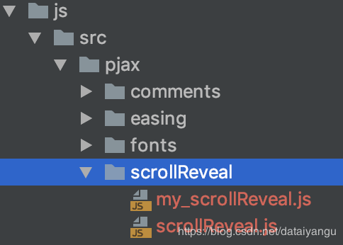

title: hexo next主题深度优化(十一)，next主题中加入scrollReveal.js，让文章随着鼠标的滚动，出现点小动作。
author: Leesin.Dong
top: 9999989
tags:
  - hexo
categories:
  - hexo
date: 2019-2-07 19:20:01

---

# 效果
[https://mmmmmm.me](https://mmmmmm.me)
# scrollReveal简单介绍以及简单操作
就是在鼠标滑动的时候，页面中的某个模块会动态的加载出来，不会显得那么突兀，增加页面的动态效果。
## 参考文档：
http://www.dowebok.com/134.html
https://blog.csdn.net/lp2659359879/article/details/52582892
# next主题中加入scrollReveal
## 给article标签添加属性
进入目录themes/next/layout/_macro/post.swig
搜索到article标签的位置

```js
  <article data-scroll-reveal="enter bottom move 60px over 0.6s after 0.05s" class="{{ post_class }}" itemscope itemtype="http://schema.org/Article">

```
如上面的代码data-scroll-reveal="enter bottom move 60px over 0.6s after 0.05s”，具体的值自行修改。
## 给底部的不蒜子添加属性

```js

<div class="busuanzi-count">
  <script async src="https://busuanzi.ibruce.info/busuanzi/2.3/busuanzi.pure.mini.js"></script>

  
    <span data-scroll-reveal="enter left move 60px over 1s after 0.05s" class="site-uv">
      {{ theme.busuanzi_count.site_uv_header }}
      <span class="busuanzi-value" id="busuanzi_value_site_uv"></span>
      {{ theme.busuanzi_count.site_uv_footer }}
    </span>
  

  
    <span data-scroll-reveal="enter right move 60px over 1s after 0.05s" class="site-pv">
      {{ theme.busuanzi_count.site_pv_header }}
      <span class="busuanzi-value" id="busuanzi_value_site_pv"></span>
      {{ theme.busuanzi_count.site_pv_footer }}
    </span>
  
</div>


```
注意这里最好设置为60px，因为太大的话会导致移动端的盒子变大，宽度就会被撑开了。
## 本地引入依赖并且编写启动函数
目录如图：


scrollReveal是我们需要引入的官方的js
my_scrollReveal.js（我自定义的启动函数）如下
tip:这里我尝试通过js将data-scroll-reveal动态的加入到article中，可能是因为 window.scrollReveal 初始化的操作，会导致报错（数组越界），所以最后通过直接在post.swig文件中添加属性。
```js
//如果刷新的页面不是首页，即点进去的文章的话，就不进行scrollReveal的操作
//因为在点进去的文章还是article标签包着的。
//我这里是根据pathname即浏览器访问地址进行判断的
var pathname = window.location.pathname
if (pathname.indexOf("html") < 0) {
//config默认配置，不过我用着好像不起作用，这里没有研究明白
  var config = {
    enter: 'right',
    move: '40px',
    over: '3s',
    after: '5',
    reset: true,
    init: true
  };
  //根据初始化配置创建一个scrollReveal对象
  window.scrollReveal = new scrollReveal(config);
  //初始化，会自动去页面中找到含有 data-scroll-reveal 属性的地方进行相关的操作。
  scrollReveal.init();
}

```

## 修改require.js主函数
因为在我的next中我应用了require，所以经引用上面两个js的操作放到了这里。
```js
//主函数
require.config({
  waitSeconds: 0,
  paths: {
    "music": "/dist/music",
    //目前会消耗较多的性能，以后可能会去掉。
    "aplayer": "/js/src/aplayer",
    "backgroudLine": "/js/src/backgroudLine",
    "category": "/js/src/category",
    "jquery.share.min":"/js/src/pjax/share/jquery.share.min",
    /*不显示图标的话替换fonts*/
    "share":"/js/src/pjax/share",
    "css":"/js/src/pjax/css",
    "comments":"/js/src/pjax/comments_git",
    "love":"/js/src/love",
    "eye":"/js/src/pjax/eye",
    "header_left":"/js/src/pjax/header_left",
    "article_top":"/js/src/pjax/article_top",
    "easing":"/js/src/pjax/easing/jquery.easing.1.3",
    "scrollReveal":"/js/src/pjax/scrollReveal/scrollReveal",
    "my_scrollReveal":"/js/src/pjax/scrollReveal/my_scrollReveal",
  },

  shim: {
    'share': {
      deps: [
        'css!/js/src/pjax/share/share.min','jquery.share.min'
      ]
    },
    'comments': {
      deps: [
        'css!/js/src/pjax/comments/gitalk'
      ]
    },
    'header_left': {
      deps: [
        'easing'
      ]
    },
    'my_scrollReveal':{
      deps:[
        'scrollReveal'
      ]
    }
  }
});
require(['backgroudLine','music','aplayer','category','jquery.share.min','share','css','comments','love','eye',
'header_left','article_top','easing','scrollReveal','my_scrollReveal'], function (){
});

```
在最后加入了scrollReveal和my_scrollReveal这两个函数，分别对应于引入官方的js和自定义的启动函数。
# 修改pjax的函数
如果没有加入pjax的看到上面就结束了，我这里应用的pjax所以记录下。
通过require引入的方式，发现并不能成功，
并且报错：
```js
pjaxMain.js:78 Uncaught TypeError: scrollReveal is not a constructor
    at pjaxMain.js:78
    at Object.execCb (require.js:30)
    at $.check (require.js:19)
    at $.enable (require.js:24)
    at $.init (require.js:18)
    at require.js:27
```
也是是说并没有定义，而且有时候会出现pjax处理后第一次没问题，第二次就又会报出同样的错误。
最后解决的方法是将上面官方的js和自己写的js封装在一个函数中然后通过我的pjax函数进行引用（跳转和回退）。

```js
/*pjax主函数*/
$(document).pjax('a[target!=_blank]', '#pjax-container', {
  fragment: '#pjax-container',
  timeout: 5000,
});
//用户通过浏览器的前进后退按钮，需要加载的js
$(window).on('popstate.pjax', function () {
  /*必须加*/
  // $(document).on('pjax:complete',
  //   function () {
      pjax();
    // })
})
$(document).on('pjax:start',
  function () {
    $(document).unbind('keyup')
  })
$(document).on('pjax:complete',
  function () {
    require.config({
      waitSeconds: 0,
      paths: {
        //这个是单独的
        "jquery.share.min":"/js/src/pjax/share/jquery.share.min",
        // "share":"/js/src/pjax/share",
        //这个也是单独的
        "css":"/js/src/pjax/css",
        "pjax_function_public":"/js/src/pjax/pjax_function_public",
        "comments":"/js/src/pjax/comments_git",
        "love":"/js/src/love"
      },
      shim: {
        'share': {
          deps: [
            'css!/js/src/pjax/share/share.min','jquery.share.min'
          ]
        },
        'comments': {
          deps: [
            'css!/js/src/pjax/comments/gitalk'
          ]
        },
      }
    });

    require(['jquery.share.min','share','css','pjax_function_public','comments'
    ], function () {
      pjax();

    });
  })

function pjax() {

 /*来必力评论*/
 //    comments_js();
/*gitalk评论*/
  gitalk();
  //护眼
  eye_js()
    //如果是文章，实现滚动效果
  article_top_js();
//不蒜子
  busuanzi_js();

  //自己写的分享
  pjaxshare();

// 分类的js
  category_js();
// 局部刷新后文章内容不显示bug的js
  opacity_js()
//点击有目录的文章sidebar不显示的bug解决
  motion_js()
  scrollspy_js()
  //utils_js()
  postdetails_js()
//lean数量统计的js，原来的js是在themes/next/layout/_third-party/analytics/lean-analytics.swig文件中
  lean_analytics();
  //百度推送js
  baidutuisong();
//     //右边sidebar滚轮效果消失了。
  initSidebarDimension()
  //懒加载
  lazyLoad();
  //捐赠的函数
  donate();
  //随鼠标的滚动文章动态出现的动画
  my_scrollReveal_js();
}

```


