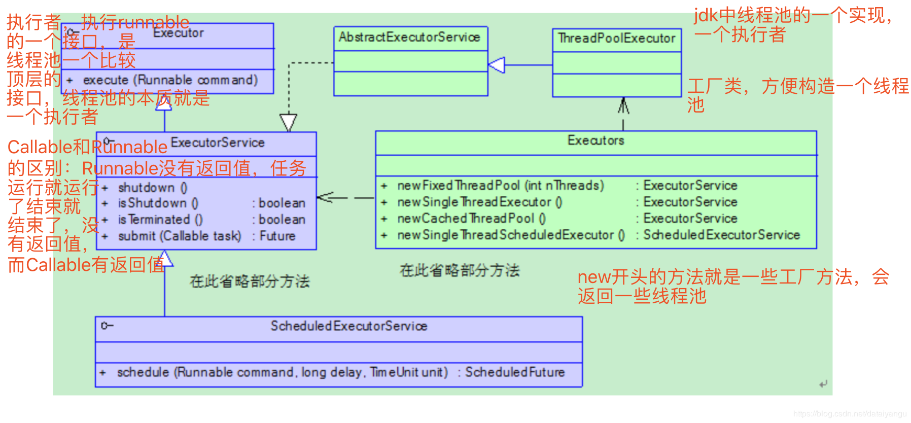
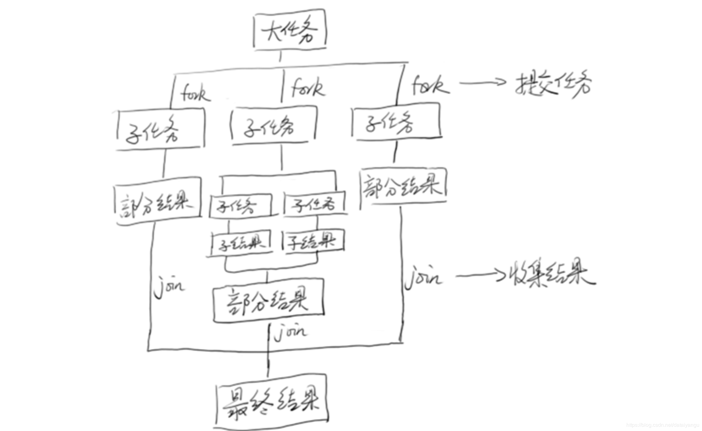
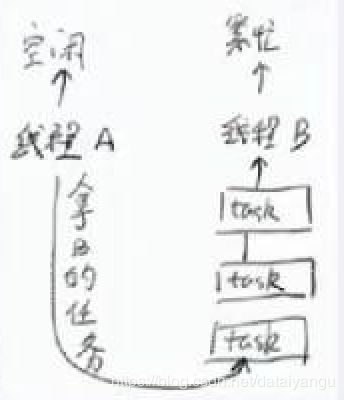
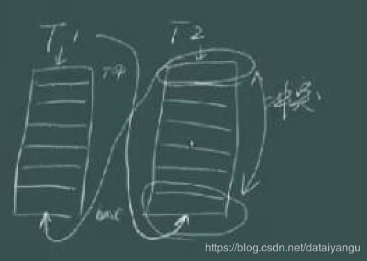

title: Java高并发程序设计学习笔记（六）：JDK并发包(线程池的基本使用、ForkJoin)
author: Leesin.Dong
top: 
tags:
  - 高并发
categories:
  - 学习笔记
  - Java高并发程序设计学习笔记
date: 2019-2-12 19:20:02

---


# 1. 线程池的基本使用
##  1.1. 为什么需要线程池
 **<font color="red">   为什么需要线程池？ </font>**
线程创建和销毁的代价是比较高的，在多线程中，如果每次都要对线程进行创建和销毁，这两个操作，对于线程本身的业务来说其实是没有必要的，我只关心线程所执行的任务，希望吧尽可能多的cpu用在任务的执行上，而不是辅助性质的线程的创建和销毁上面，所以线程池应运而生。

 **<font color="red">  线程池的作用？  </font>**
它的作用就是把线程进行复用，比如执行一百个任务，如果分十次批量执行，如果没有线程池就需要创建销毁一百次，如果有线程池（假如线程池中有十个线程），这十个线程是不退出的，常驻线程的，如果没有任务的话是一个等待的状态，任务开始的时候就会执行任务，当前十个任务提交的时候，他们在线程池里跑，因为线程池的线程不会被销毁，所以前十个任务跑完之后，马上就能执行下面的十个任务，从始至终只关注线程的业务，而只创建了一次十个线程，节省cpu的时间。

简单的线程池实现
略
## 1.2. JDK为我们提供了哪些支持 内置线程池
## 1.2.1.


## 1.3. 线程池的使用 
### 1.3.1. 线程池的种类
newFixedThreadPool 固定大小的线程池，线程池中的线程数量是固定的
newSingleThreadExecutor 单一线程的线程池，只有一个线程
newCachedThreadPool 缓存的线程池，当一下子好多任务的时候，就开好多线程去做，如果没有任务的时候，线程空闲下来的时候，慢慢线程的数量就会减少，自然消亡，简而言之就是线程的数量在某段时间内是会扩张或者收缩的
newScheduledThreadPool定时任务的线程池，支持定时及周期性任务执行，比如每个五分钟调一个什么任务。
### 1.3.2. 不同线程池的共同性 线程池构造函数详解
进入Executors类中
注意：代码中的参数详细意思，再往下面的代码中有详细介绍。
```js
 public static ExecutorService newFixedThreadPool(int nThreads) {
        return new ThreadPoolExecutor(nThreads, nThreads,
                                      0L, TimeUnit.MILLISECONDS,
                                      new LinkedBlockingQueue<Runnable>());
    }
    public static ExecutorService newSingleThreadExecutor() {
        return new FinalizableDelegatedExecutorService
            (new ThreadPoolExecutor(1, 1,
                                    0L, TimeUnit.MILLISECONDS,
                                    new LinkedBlockingQueue<Runnable>()));
    }
 public static ExecutorService newCachedThreadPool() {
        return new ThreadPoolExecutor(0, Integer.MAX_VALUE,
                                      60L, TimeUnit.SECONDS,
                                      new SynchronousQueue<Runnable>());
    }
    //第一个参数（线程池标准容量、初始容量）一开始是零，当任务进来就扩容，
    //SynchronousQueue容量是零当试图往queue中
    //塞任务的时候，是会失败的，就会线程池线程数从零开始往上增加到MAX_VALUE为止，
    //60秒是超时时间，60秒没被使用就会被移除掉
```
 **<font color="red">  发现都是new ThreadPoolExecutor（），只是传入了不同的参数
研究一下ThreadPoolExecutor这个构造函数  </font>**

```js
 public ThreadPoolExecutor(int corePoolSize,//核心线程数（标准）
                              int maximumPoolSize,//最大的线程数
                              long keepAliveTime,//如果没有事情做，还能在当前线程存活多少时间
                              //超过指定的时间，将会被杀掉
                              TimeUnit unit,//上面需要的时间的单位
                              BlockingQueue<Runnable> workQueue//阻塞队列，如果当前没有多余线程来做任务，现在queue中排队，用来保存任务。
                              //注意这个queue的容量是有限度的。
                              ) {
        this(corePoolSize, maximumPoolSize, keepAliveTime, unit, workQueue,
             Executors.defaultThreadFactory(), defaultHandler);
    }
```
返回头来接着看上面的构造函数就有了很多眉目。

## 1.4. 线程池使用的小例子 
### 1.4.1. 简单线程池

```js
import java.util.concurrent.ExecutorService;
import java.util.concurrent.Executors;

public class ThreadPoolDemo {
	public static class MyTask implements Runnable{

		public void run() {
			System.out.println(System.currentTimeMillis()+":Thread ID:"+Thread.currentThread().getId());
			try {
				Thread.sleep(1000);
			} catch (InterruptedException e) {
				e.printStackTrace();
			}
		}
	}

	public static void main(String[] args) {
		MyTask task = new MyTask();
		ExecutorService es = Executors.newFixedThreadPool(5);
		for (int i = 0; i <10 ; i++) {
			es.submit(task);
//			es.execute(task);
		}
	}
}

```
运行结果

```js
1549114075211Thread ID:9
1549114075213Thread ID:10
1549114085211Thread ID:11
1549114075211Thread ID:12
1549114075210Thread ID:13
1549114075213hread ID:10
1549114075415Thread ID:9
1549114075219Thread ID:13
1549114675217Thread ID:12
1549114075208hread ID:11
```


可以看到是五个五个执行的。es.submit(task);es.execute(task);两种方式都可以。
### 1.4.2. ScheduledThreadPool

```js
import java.util.concurrent.Executors;
import java.util.concurrent.ScheduledExecutorService;
import java.util.concurrent.TimeUnit;

public class ScheduledExecutirServiceDemo {
	public static void main(String[] args) {
		ScheduledExecutorService ses = Executors.newScheduledThreadPool(10);
		//如果前面的任务没有完成，则调度也不会启动
		ses.scheduleWithFixedDelay(new Runnable() {
			public void run() {
				try {
					Thread.sleep(1000);
					System.out.println(System.currentTimeMillis()/1000);
				} catch (InterruptedException e) {
					e.printStackTrace();
				}
			}
		}, 0, 2, TimeUnit.SECONDS);
	}
}

```
运行结果

```js
1548114424
1548114425
1548114427
1548114428
1548114420
1548114422
1548114423
1548114426
1548114429
1548114430
1548114432
1548114433
1548114434
1548114435
1548114436
1548114437
1548114438
1548114439
1548114430
```


每过三秒钟执行一次。

可以看到第一个参数是第一次各多少时间去调，第二个参数后面周期性的多长时间去调，第三个参数是事件的三围。

# 2. 扩展和增强线程池
##  2.1. 回调接口
beforeExecute afterExecute terminated
捕获线程池运行时一些信息，捕获当时的工作状态。

```js
import java.util.concurrent.LinkedBlockingDeque;
import java.util.concurrent.ThreadPoolExecutor;
import java.util.concurrent.TimeUnit;

public class ExtThreadPool {
	public static class Mytask implements Runnable{
		public String name;

		public Mytask(String name) {
			this.name = name;
		}
		public void run() {
			System.out.println("正在执行"+":Thread ID:"+Thread.currentThread().getId()+",Task Name = "+name);
			try {
				Thread.sleep(100);
			} catch (InterruptedException e) {
				e.printStackTrace();
			}
		}
	}

	public static void main(String[] args) throws InterruptedException {
		ThreadPoolExecutor es = new ThreadPoolExecutor(5, 5, 0L, TimeUnit.MICROSECONDS,
				new LinkedBlockingDeque<Runnable>()) {
			@Override
			protected void beforeExecute(Thread t, Runnable r) {
				System.out.println("准备执行："+((Mytask)r).name);
			}
			@Override
			protected void afterExecute(Runnable r,Throwable t ) {
				System.out.println("执行完成："+((Mytask)r).name);
			}
			@Override
			protected void terminated() {
				System.out.println("线程池退出");
			}


		};
		for (int i = 0; i < 5; i++) {
			Mytask mytask = new Mytask("TASK_GEYM_" + i);
			es.execute(mytask);
			Thread.sleep(10);
		}
		es.shutdown();
	}

}

```
结果

```js
准备执行：TASK_CEYM_0
正在执行Thread ID：9，TASK Name = TASK_CEYM_0
准备执行：TASK_CEYM_1
正在执行Thread ID：9，TASK Name = TASK_CEYM_1
准备执行：TASK_CEYM_2
正在执行Thread ID：9，TASK Name = TASK_CEYM_2
准备执行：TASK_CEYM_3
正在执行Thread ID：9，TASK Name = TASK_CEYM_3
准备执行：TASK_CEYM_4
正在执行Thread ID：9，TASK Name = TASK_CEYM_4
执行完成：TASK_CEYM_0
执行完成：TASK_CEYM_1
执行完成：TASK_CEYM_2
执行完成：TASK_CEYM_3
执行完成：TASK_CEYM_4
线程池退出
```


beforeExecute  线程执行前做的事
afterExecute  线程执行完了之后做的事
terminated  线程池退出后做的事
## 2.2. 拒绝策略
不能有无限大小的缓存队列，因为如果有大量的任务进来，会导致内存的激增，如果一直激增而没有释放，会导致内存异常。
所以当发现负载到了一定的程度后，应该选择丢弃一些任务，而不是放在内存中，看着内存被耗掉，丢弃的时候希望把这些丢掉的任务（比如数量，具体是那些）记录下来。

```js
 public ThreadPoolExecutor(int corePoolSize,
                              int maximumPoolSize,
                              long keepAliveTime,
                              TimeUnit unit,
                              BlockingQueue<Runnable> workQueue,
                              ThreadFactory threadFactory,
                              RejectedExecutionHandler handler) {
        if (corePoolSize < 0 ||
            maximumPoolSize <= 0 ||
            maximumPoolSize < corePoolSize ||
            keepAliveTime < 0)
            throw new IllegalArgumentException();
        if (workQueue == null || threadFactory == null || handler == null)
            throw new NullPointerException();
        this.corePoolSize = corePoolSize;
        this.maximumPoolSize = maximumPoolSize;
        this.workQueue = workQueue;
        this.keepAliveTime = unit.toNanos(keepAliveTime);
        this.threadFactory = threadFactory;
        this.handler = handler;
    }
```
构造函数中多了两个参数
ThreadFactory//线程工厂（稍后介绍）
RejectedExecutionHandler//拒绝策略//如果任务不能执行了我应该怎么做
具体的实现包括

### 拒绝策略举例：
#### AbortPolicy
```js
public static class AbortPolicy implements RejectedExecutionHandler {
        /**
         * Creates an {@code AbortPolicy}.
         */
        public AbortPolicy() { }

        /**
         * Always throws RejectedExecutionException.
         *
         * @param r the runnable task requested to be executed
         * @param e the executor attempting to execute this task
         * @throws RejectedExecutionException always.
         */
        public void rejectedExecution(Runnable r, ThreadPoolExecutor e) {
            throw new RejectedExecutionException("Task " + r.toString() +
                                                 " rejected from " +
                                                 e.toString());
        }
    }

```
这个策略是如果不能执行了，就会抛出异常，并且将具体的任务信息打印出啦。
#### DiscardPolicy
```js
public static class DiscardPolicy implements RejectedExecutionHandler {
        /**
         * Creates a {@code DiscardPolicy}.
         */
        public DiscardPolicy() { }

        /**
         * Does nothing, which has the effect of discarding task r.
         *
         * @param r the runnable task requested to be executed
         * @param e the executor attempting to execute this task
         */
        public void rejectedExecution(Runnable r, ThreadPoolExecutor e) {
        }
    }
```
这个策略是如果不执行了，就直接丢弃掉，设么也不做。
#### CallerRunsPolicy

```js
public static class CallerRunsPolicy implements RejectedExecutionHandler {
        /**
         * Creates a {@code CallerRunsPolicy}.
         */
        public CallerRunsPolicy() { }

        /**
         * Executes task r in the caller's thread, unless the executor
         * has been shut down, in which case the task is discarded.
         *
         * @param r the runnable task requested to be executed
         * @param e the executor attempting to execute this task
         */
        public void rejectedExecution(Runnable r, ThreadPoolExecutor e) {
            if (!e.isShutdown()) {
                r.run();
            }
        }
    }
```
 if (!e.isShutdown()) {
                r.run();
            }
如果线程池还活着，就让调用者执行这个任务，这个类本身自己不做处理。
#### DiscardOldestPolicy
```js
 public static class DiscardOldestPolicy implements RejectedExecutionHandler {
        /**
         * Creates a {@code DiscardOldestPolicy} for the given executor.
         */
        public DiscardOldestPolicy() { }

        /**
         * Obtains and ignores the next task that the executor
         * would otherwise execute, if one is immediately available,
         * and then retries execution of task r, unless the executor
         * is shut down, in which case task r is instead discarded.
         *
         * @param r the runnable task requested to be executed
         * @param e the executor attempting to execute this task
         */
        public void rejectedExecution(Runnable r, ThreadPoolExecutor e) {
            if (!e.isShutdown()) {
                e.getQueue().poll();
                e.execute(r);
            }
        }
    }
```
将队列中最老的丢弃掉。
### 小例子

```js
import org.omg.PortableServer.THREAD_POLICY_ID;

import java.util.concurrent.*;

public class RejectThreadPoolDemo {
	public static class MyTask implements Runnable{

		@Override
		public void run() {
			System.out.println(System.currentTimeMillis()+":Thread Id:"+Thread.currentThread().getId());
			try {
				Thread.sleep(100);
			} catch (InterruptedException e) {
				e.printStackTrace();
			}
		}
	}

	public static void main(String[] args) throws InterruptedException {
		MyTask task = new MyTask();
		ExecutorService es = new ThreadPoolExecutor(5, 5, 0L, TimeUnit.MILLISECONDS,
				new SynchronousQueue<Runnable>(),//永远都放不进去的对了，只有当我去拿的时候才能放进去，
				// 因为放不进去，所以走拒绝策略
				Executors.defaultThreadFactory(),
				new RejectedExecutionHandler() {
					@Override
					public void rejectedExecution(final Runnable r, final ThreadPoolExecutor executor) {
						System.out.println(r.toString()+"is discard");
					}
				});
		for (int i = 0; i <Integer.MAX_VALUE ; i++) {
			es.submit(task);
			Thread.sleep(10);

		}
	}
}

```
结果
```js
1548893374312:Thread Id:9
1548893374323:Thread Id:10
1548893374333:Thread Id:11
1548893374345:Thread Id:12
1548893374356:Thread Id:13
java.util.concurrent.FutureTask@655538e5is discard
java.util.concurrent.FutureTask@3e0a765cis discard
java.util.concurrent.FutureTask@20e0b1d6is discard
java.util.concurrent.FutureTask@7fbb6976is discard
1548893374418:Thread Id:9
1548893374433:Thread Id:10
1548893374446:Thread Id:11
1548893374456:Thread Id:12
1548893374466:Thread Id:13
java.util.concurrent.FutureTask@6c2fdbb1is discard
```

如上面，因为队列放不进去东西，任务每10ms执行一次，而每个任务要sleep 100ms，所以，必定会出现任务堆积，这个时候就走了我们自定义的拒绝策略。
##  2.3. 自定义ThreadFactory
能够在创造Thread的时候给Thread命名，或者使其变成守护线程的操作。
```js
import java.util.concurrent.ThreadFactory;
import java.util.concurrent.atomic.AtomicInteger;

class TheadF{
	static class DefaultThreadFactory implements ThreadFactory {
		private static final AtomicInteger poolNumber = new AtomicInteger(1);
		private final ThreadGroup group;
		private final AtomicInteger threadNumber = new AtomicInteger(1);
		private final String namePrefix;

		DefaultThreadFactory(){
			SecurityManager s = System.getSecurityManager();
			group = (s != null) ? s.getThreadGroup() : Thread.currentThread().getThreadGroup();
			namePrefix = "pool-" + poolNumber.getAndIncrement() + "-thread-";
		}
		DefaultThreadFactory(final ThreadGroup group, final String namePrefix) {
			this.group = group;
			this.namePrefix = namePrefix;
		}

		@Override
		public Thread newThread(final Runnable r) {
			Thread t = new Thread(group, r, namePrefix + threadNumber.getAndIncrement(),0);
			if (t.isDaemon())
				t.setDaemon(false);
			if (t.getPriority()!=Thread.NORM_PRIORITY)
				t.setPriority(Thread.NORM_PRIORITY);
			return t;
		}
	}
}

```

## 简单的线程池实现的原理
execute方法（ThreadPollExecutor类中）

```js
public void execute(Runnable command) {
        if (command == null)
            throw new NullPointerException();
        /*
         * Proceed in 3 steps:
         *
         * 1. If fewer than corePoolSize threads are running, try to
         * start a new thread with the given command as its first
         * task.  The call to addWorker atomically checks runState and
         * workerCount, and so prevents false alarms that would add
         * threads when it shouldn't, by returning false.
         *
         * 2. If a task can be successfully queued, then we still need
         * to double-check whether we should have added a thread
         * (because existing ones died since last checking) or that
         * the pool shut down since entry into this method. So we
         * recheck state and if necessary roll back the enqueuing if
         * stopped, or start a new thread if there are none.
         *
         * 3. If we cannot queue task, then we try to add a new
         * thread.  If it fails, we know we are shut down or saturated
         * and so reject the task.
         */
        int c = ctl.get();
        if (workerCountOf(c) < corePoolSize) {
            if (addWorker(command, true))
                return;
            c = ctl.get();
        }
        if (isRunning(c) && workQueue.offer(command)) {
            int recheck = ctl.get();
            if (! isRunning(recheck) && remove(command))
                reject(command);
            else if (workerCountOf(recheck) == 0)
                addWorker(null, false);
        }
        else if (!addWorker(command, false))
            reject(command);
    }

```
可以看到是将线程放到了workqueue中，workQueue是一个blockingQueue，如果里面没有数据，就不拿，如果满了，就等待，构造参数中的long keepAliveTime就是如果规定时间内一直在等待，超出之后就退出
上述代码中的ctl是什么？
     * The main pool control state, ctl, is an atomic integer packing
     * 他是一个原子的整数
     * two conceptual fields包装了两个逻辑上的字段：
     *   workerCount, indicating the effective number of threads线程总数
     *   runState,    indicating whether running, shutting down etc线程池本身的状态
     *
     The runState provides the main lifecyle control, taking on values:
    一些 线程池的状态
     *
     *   RUNNING:  Accept new tasks and process queued tasks可以添加新的task也可以处理一些任务
     *   SHUTDOWN: Don't accept new tasks, but process queued tasks不接受task但是接受task
     *   STOP:     Don't accept new tasks, don't process queued tasks,
     *             and interrupt in-progress tasks不接受task，不处理task
     *   TIDYING:  All tasks have terminated, workerCount is zero,
     *             the thread transitioning to state TIDYING
     *             will run the terminated() hook method
     *   TERMINATED: terminated() has completed
下面这里：了解即可。
```js
通过control+j看到CAPACITY是一个29位的数，左移一位，再减一，就是前二十八位
    private static final int CAPACITY   = (1 << COUNT_BITS) - 1;

 // Packing and unpacking ctl
 //c和CAPACITY的按位取反，最后再取与，就是前三位，表示线程池的状态
    private static int runStateOf(int c)     { return c & ~CAPACITY; }
    //c和CAPACITY按位取与（都转化成二进制，每位进行与的操作），得到c的前二十八位
    //得到了当前有多少个线程
    private static int workerCountOf(int c)  { return c & CAPACITY; }
```
接着往下看
```js
int c = ctl.get();
//如果当前线程的数量小于核心线程数量
        if (workerCountOf(c) < corePoolSize) {
        //加入进去
            if (addWorker(command, true))
                return;
            c = ctl.get();
        }
       // 如果加入失败了，就将这个操作放到workqueue中，
        if (isRunning(c) && workQueue.offer(command)) {
            int recheck = ctl.get();
            //如果在往queue里面加的过程中，简称线程池，发现不再是running的状态
            //就拒绝掉这个任务
            if (! isRunning(recheck) && remove(command))
                reject(command);
                //如果检查发现正在跑的线程是零，就addwork进行初始化
            else if (workerCountOf(recheck) == 0)
                addWorker(null, false);
        }
        //首选的不是reject而是先进行上面的放入queue
        //如果上面判断加如队列没有队列满了，塞不进去了，在这里再尝试加入任务
        //第二个参数是false，线程的数量不在收到核心线程数量的限制，而是受到
        //最大线程数的限制。如果这样都失败了，就进行reject拒绝策略。
        else if (!addWorker(command, false))
            reject(command);
```

# 4. ForkJoin
一个比较新的线程池
## 4.1. 思想 

### 4.1.1.



将大任务分成小任务，join等待所有的小任务结束再执行相应的操作，fork将小任务推向线程池。
## 4.2. 使用接口
### 4.2.1. RecursiveAction
无返回值
### 4.2.2. RecursiveTask
有返回值
## 4.3. 简单例子

```js
import java.util.ArrayList;
import java.util.concurrent.ExecutionException;
import java.util.concurrent.ForkJoinPool;
import java.util.concurrent.ForkJoinTask;
import java.util.concurrent.RecursiveTask;

public class CountTask extends RecursiveTask<Long> {
	private static final int ThRESHOLD = 10000;
	private long start;
	private long end;
	public CountTask(long start,long end){
		this.start = start;
		this.end = end;
	}
	protected Long compute() {
		long sum = 0;
		boolean canCompute = (end - start) < ThRESHOLD;
		if (canCompute) {
			for (long i = start; i <= end; i++) {
				sum += i;
			}
		}else{
			//分成100个小任务
			long step = (start + end) / 100;
			ArrayList<CountTask> subTasks = new ArrayList<CountTask>();
			long pos = start;
			for (int i = 0; i <100 ; i++) {
				long lastOne = pos + step;
				if (lastOne>end) {
					lastOne  = end;
				}
				CountTask subTask = new CountTask(pos, lastOne);
				pos += step + 1;
				subTasks.add(subTask);
				//将现任务加进去
				subTask.fork();
			}
			for (CountTask t : subTasks) {
				//等待所有的任务完成后再继续相应的操作
				sum += t.join();
			}
		}
		return sum;
	}

	public static void main(String[] args) {
		ForkJoinPool forkJoinPool = new ForkJoinPool();
		CountTask task = new CountTask(0, 20000L);
		ForkJoinTask<Long> result = forkJoinPool.submit(task);
		try {
			long res = result.get();

			System.out.println("sum="+res);
		} catch (InterruptedException e) {
			e.printStackTrace();
		} catch (ExecutionException e) {
			e.printStackTrace();
		}
	}
}

```
结果

```js
sum=200010000
```
上面的例子要实现的是将		CountTask task = new CountTask(0, 20000L);
这句话中的start到end进行累加运算，如果end-start<ThRESHOLD,就直接累加，如果超过这个阈值就通过ForkJoin将任务分成多个子任务，进行累加，所有的子任务完成之后再求和。


## 4.4. 实现要素
源码解析
在ForkJoin中每个线程都有一个相关的工作队列WorkQueue在ForkJoinPool中有这个内部类 
### workQueue
```js
@sun.misc.Contended
    static final class WorkQueue {

        /**
         * Capacity of work-stealing queue array upon initialization.
         * Must be a power of two; at least 4, but should be larger to
         * reduce or eliminate cacheline sharing among queues.
         * Currently, it is much larger, as a partial workaround for
         * the fact that JVMs often place arrays in locations that
         * share GC bookkeeping (especially cardmarks) such that
         * per-write accesses encounter serious memory contention.
         */
        static final int INITIAL_QUEUE_CAPACITY = 1 << 13;

        /**
         * Maximum size for queue arrays. Must be a power of two less
         * than or equal to 1 << (31 - width of array entry) to ensure
         * lack of wraparound of index calculations, but defined to a
         * value a bit less than this to help users trap runaway
         * programs before saturating systems.
         */
        static final int MAXIMUM_QUEUE_CAPACITY = 1 << 26; // 64M

        // Instance fields
        volatile int scanState;    // versioned, <0: inactive; odd:scanning
        int stackPred;            // 记录前一个栈顶的ctl

        int nsteals;               // number of steals
        int hint;                  // randomization and stealer index hint
        int config;                // pool index and mode
        volatile int qlock;        // 1: locked, < 0: terminate; else 0
        volatile int base;         // index of next slot for poll
        int top;                   // index of next slot for push
        ForkJoinTask<?>[] array;   // the elements (initially unallocated)
        final ForkJoinPool pool;   // the containing pool (may be null)
        final ForkJoinWorkerThread owner; // owning thread or null if shared
        volatile Thread parker;    // == owner during call to park; else null
        volatile ForkJoinTask<?> currentJoin;  // task being joined in awaitJoin
        volatile ForkJoinTask<?> currentSteal; // mainly used by helpStealer

        WorkQueue(ForkJoinPool pool, ForkJoinWorkerThread owner) {
            this.pool = pool;
            this.owner = owner;
            // Place indices in the center of array (that is not yet allocated)
            base = top = INITIAL_QUEUE_CAPACITY >>> 1;
        }

        /**
         * Returns an exportable index (used by ForkJoinWorkerThread).
         */
        final int getPoolIndex() {
            return (config & 0xffff) >>> 1; // ignore odd/even tag bit
        }

        /**
         * Returns the approximate number of tasks in the queue.
         */
        final int queueSize() {
            int n = base - top;       // non-owner callers must read base first
            return (n >= 0) ? 0 : -n; // ignore transient negative
        }

        /**
         * Provides a more accurate estimate of whether this queue has
         * any tasks than does queueSize, by checking whether a
         * near-empty queue has at least one unclaimed task.
         */
        final boolean isEmpty() {
            ForkJoinTask<?>[] a; int n, m, s;
            return ((n = base - (s = top)) >= 0 ||
                    (n == -1 &&           // possibly one task
                     ((a = array) == null || (m = a.length - 1) < 0 ||
                      U.getObject
                      (a, (long)((m & (s - 1)) << ASHIFT) + ABASE) == null)));
        }
```
 **<font color="red">  注意：上面的代码出自我本人idea jdk1.8，但是和视频中讲解的jdk1.8代码片不一样，主要讲解了workqueue中的某些字段，线面的讲解是视频中的字段，并非上面的代码片。  </font>**

不是所有的线程一直都在工作，有的线程有时候会被挂起，挂起的时候线程池需要知道谁被挂起，这样就可以新的任务来的时候，就从挂起的线程里面唤醒一个线程去执行，forkjoin就做这件事情，所有被挂起的线程会被放到一个栈（先进后出）里面，栈的内部是通过链表实现的，nextwait就是链表中很重要的一个东西，会指向下一个等待的线程，poolindex，当前线程在线程池中的id编号，eventcount，当前的线程被挂起了多少次，每次被挂起都会做一个累加如果小于0，就是inactive的状态（没有被激活，）eventcount还有一个含义，就是当前的poolindex是多少，在相关的代码片中（我这里实在是找不到）在注册的时候poolindex和eventactive是赋予了同一个值，eventcount是一个32位的数字，第一个bite表示是否被激活，其他的bite表示poolindex，所有的内容放在array中，array中的base和top中间使我们的线程


### ctl
在ForkJoinPool中同样有和上面的threadPool一样的ctl的字段
并不是原子的整数，是lang型的
```js
 	 //* Bits and masks for field ctl, packed with 4 16 bit subfields:
     //* AC: Number of active running workers minus target parallelism 活跃的线程数减去目标并行度（大概就是几个cpu就是几个并行度）
     //* TC: Number of total workers minus target parallelism总的线程数减去目标并行度（大概就是几个cpu就是几个并行度）
     //* SS: version count and status of top waiting thread线程池本身是否是激活的
     //EC eventcount顶部等待的堆栈顶端的线程的eventcount的值
     //* ID: poolIndex of top of Treiber stack of waiters poolIndex顶部等待的堆栈顶端的线程的poolIndex的值
     //注意tc ss  id三个相加恰好是一个int，这里就是刚才所说的eventcount
volatile long ctl;                   // main pool control

```
 **<font color="red"> 声明一下：
明明有五个变量，为什么不分成五个，一定要打包在ctl中呢？看起来增加了数据的复杂性，可读性也变差了，为什么还要这么做呢？   </font>**

因为加入多个线程来操作ForkJoin，一个操作了AC，一个操作了TC，这样如何保证AC和TC是属于一个的？用锁吗？这样对效率有很大的降低，但是如果将所有的数据放在一起，数据的一致性是一定能够保证的，读写的时候是原子性的，一次cas（无锁），就可以把所有的数据进行一次更新，并且保证不会和其他线程产生冲突，在性能上能得到大大的提升。通过无锁的操作，代替了多个Synchronize操作
目前是不支持对多个变量进行cas操作的。
就像如下代码
tryAddWorker：
```js
private void tryAddWorker(long c) {
        boolean add = false;
        do {
            long nc = ((AC_MASK & (c + AC_UNIT)) |
                       (TC_MASK & (c + TC_UNIT)));
            if (ctl == c) {
                int rs, stop;                 // check if terminating
                if ((stop = (rs = lockRunState()) & STOP) == 0)
                    add = U.compareAndSwapLong(this, CTL, c, nc);
                unlockRunState(rs, rs & ~RSLOCK);
                if (stop != 0)
                    break;
                if (add) {
                    createWorker();
                    break;
                }
            }
        } while (((c = ctl) & ADD_WORKER) != 0L && (int)c == 0);
    }
```
先将ctl中的每一个取出来做相应的操作，在叠加到一起进行cas的操作。

### 4.4.1. 工作窃取



scan方法：

```js
private ForkJoinTask<?> scan(WorkQueue w, int r) {
        WorkQueue[] ws; int m;
        if ((ws = workQueues) != null && (m = ws.length - 1) > 0 && w != null) {
            int ss = w.scanState;                     // initially non-negative
            for (int origin = r & m, k = origin, oldSum = 0, checkSum = 0;;) {
                WorkQueue q; ForkJoinTask<?>[] a; ForkJoinTask<?> t;
                int b, n; long c;
                if ((q = ws[k]) != null) {
                    if ((n = (b = q.base) - q.top) < 0 &&
                        (a = q.array) != null) {      // non-empty
                        long i = (((a.length - 1) & b) << ASHIFT) + ABASE;
                        if ((t = ((ForkJoinTask<?>)
                                  U.getObjectVolatile(a, i))) != null &&
                            q.base == b) {
                            if (ss >= 0) {
                                if (U.compareAndSwapObject(a, i, t, null)) {
                                    q.base = b + 1;
                                    if (n < -1)       // signal others
                                        signalWork(ws, q);
                                        runtask（）;
                                    //下面解释
                                    return t;
                                }
                            }
                            else if (oldSum == 0 &&   // try to activate
                                     w.scanState < 0)
                                tryRelease(c = ctl, ws[m & (int)c], AC_UNIT);
                        }
                        if (ss < 0)                   // refresh
                            ss = w.scanState;
                        r ^= r << 1; r ^= r >>> 3; r ^= r << 10;
                        origin = k = r & m;           // move and rescan
                        oldSum = checkSum = 0;
                        continue;
                    }
                    checkSum += b;
                }
               //如果scan操作没有任务的话，activecount就减一，然后将poolindex，nextwait，等堆栈信息，
               //保存到ctl中，并挂起当前线程。
             
                if ((k = (k + 1) & m) == origin) {    // continue until stable
                    if ((ss >= 0 || (ss == (ss = w.scanState))) &&
                        oldSum == (oldSum = checkSum)) {
                        if (ss < 0 || w.qlock < 0)    // already inactive
                            break;
                        int ns = ss | INACTIVE;       // try to inactivate
                        //UC_MASK & ((c = ctl) - AC_UNIT)，activecount-1，activecount是前十六位，所以减去10000000000000，就是
                        long nc = ((SP_MASK & ns) |
                                   (UC_MASK & ((c = ctl) - AC_UNIT)));
                        w.stackPred = (int)c;         // hold prev stack top
                        U.putInt(w, QSCANSTATE, ns);
                        //然后通过rac操作将nc赋值到ctl上
                        if (U.compareAndSwapLong(this, CTL, c, nc))
                            ss = ns;
                        else
                            w.scanState = ss;         // back out
                    }
                    checkSum = 0;
                }
            }
        }
        return null;
    }

```
很好的体现出forkjoin是如何工作的，
可以看到，scan方法 虽然是在本线程，但是，是在执行其他的workqueue中的base，上面说到线程都保存在了workqueue中，就是说不是盲目的做自己的任务，还看一看周围的线程的任务是否饥饿，会有效的避免饥饿的现象发生。
runtask（）

```js
 		/**
         * Executes the given task and any remaining local tasks.
         */
        final void runTask(ForkJoinTask<?> task) {
            if (task != null) {
                scanState &= ~SCANNING; // mark as busy
                (currentSteal = task).doExec();
                U.putOrderedObject(this, QCURRENTSTEAL, null); // release for GC
                execLocalTasks();
                ForkJoinWorkerThread thread = owner;
                if (++nsteals < 0)      // collect on overflow
                    transferStealCount(pool);
                scanState |= SCANNING;
                if (thread != null)
                    thread.afterTopLevelExec();
            }
        }
```


可以看到两个队列，当前线程对应t1队列，它需要看其他队列（t2）的base节点，然后从自己的top节点开始处理，其他线程对应t2队列，则同理，这样能很好的避免冲突。
帮助别人做可能比自己做自己的性能要好一点。


