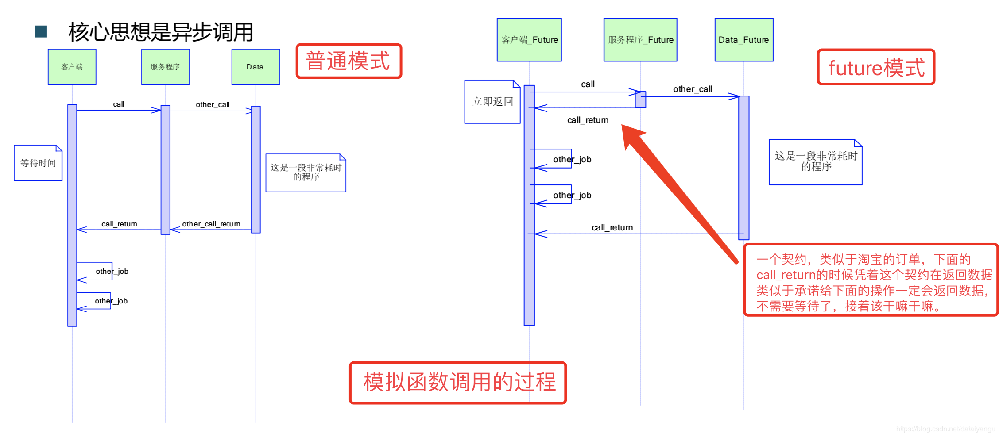
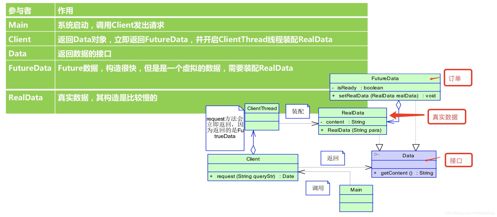
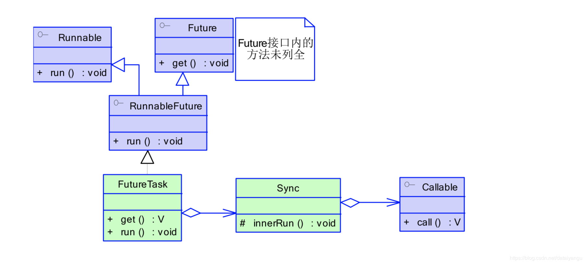
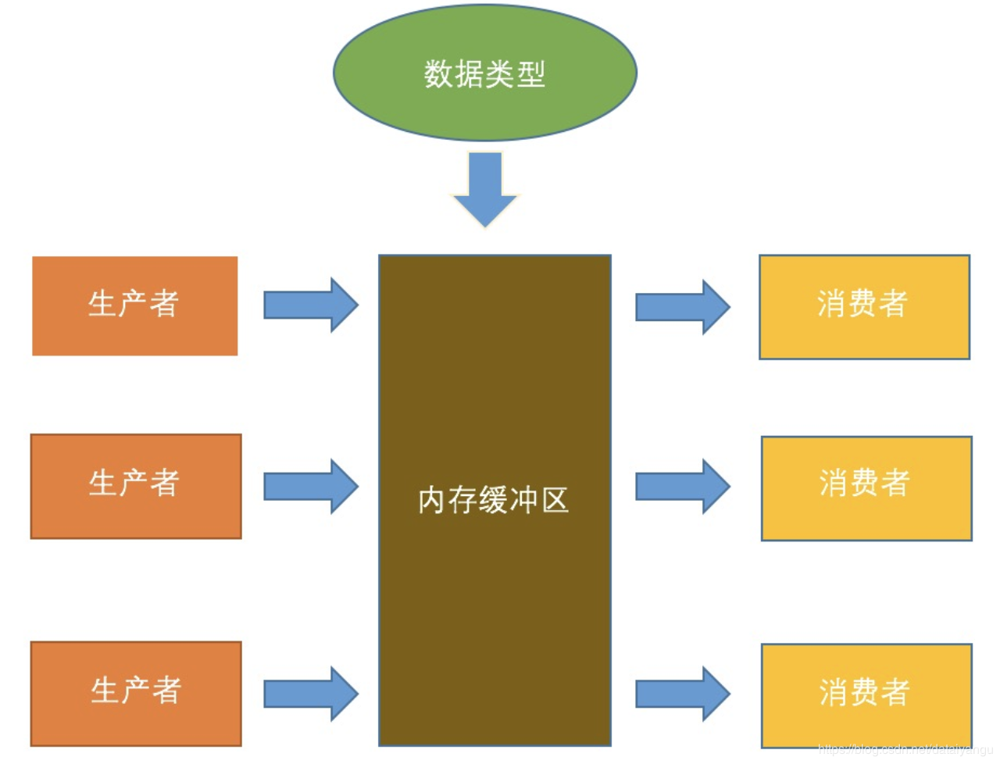

title: Java高并发程序设计学习笔记（七）：并行设计模式
author: Leesin.Dong
top: 
tags:
  - 高并发
categories:
  - 学习笔记
  - Java高并发程序设计学习笔记
date: 2019-2-13 19:20:02

---

# 什么是设计模式 
在软件工程中，设计模式(design pattern)是对软件设计中普遍存在(反复出现)的各种问题 ，所提出的解决方案。这个术语是由埃里希·伽玛(Erich Gamma)等人在1990年代从建筑设计领 域引入到计算机科学的。
Richard Helm, Ralph Johnson ,John Vlissides (Gof) 和Gamma合称四人帮
《设计模式:可复用面向对象软件的基础》 收录 23种模式
 – 观察者模式
 – 策略模式
 – 装饰者模式 
 – 享元模式
 – 模板方法
 – .....
## 架构模式 
– MVC
– 分层 
## 设计模式
– 提炼系统中的组件
## 代码模式(成例 Idiom)
– 低层次，与编码直接相关 
– 如DCL
  

```js
class Person { 
			String name; 
			int birthYear; 
			byte[] raw;
		public boolean equals(Object obj){ 
			if (!obj instanceof Person)
			return false;
			Person other = (Person)obj; 
			return name.equals(other.name)
			&& birthYear == other.birthYear
			&& Arrays.equals(raw, other.raw); 
		}
		
		public int hashCode(){ 
			... 
		} 
}
```

# 单例模式
单例对象的类必须保证只有一个实例存在。许多时候整个系统只需要拥有一个的全局对象，这样 有利于我们协调系统整体的行为
比如:全局信息配置
在多线程中通过单例模式，防止多个线程多次创建对象。
## 普通单例
```js
public class Singleton {
	private Singleton(){
		System.out.println("Singleton is create");
	}
	private static Singleton instance = new Singleton();
	public static Singleton getInstance() {
		return instance;
	}
}
```
何时产生实例 不好控制
## 假如单例中有某个字段
一般来说，产生实例的时间是调用getinstance方法的时候，但是实际上是Singleton对象第一次被访问的时候。
```js
public class Singleton {
	public static int STATUS=1;
	private Singleton(){
		System.out.println("Singleton is create"); 
	}
	private static Singleton instance = new Singleton(); 
	public static Singleton getInstance() {
		return instance; 
	}
}
```

```js
System.out.println(Singleton.STATUS);
```

```js
Singleton is create 1
```
想要输出STATUS这个字段，去访问了Singleton这个类，会自动创建一个实例，这是一个不好的地方。
## 改进的单例

```js
public class LazySingleton {
	private LazySingleton() {
		System.out.println("LazySingleton is create"); 
	}
	private static LazySingleton instance = null;
	public static synchronized LazySingleton getInstance() {
		if (instance == null)
		instance = new LazySingleton();
		return instance;
	}
}
```
因为上面的一点小bug，所以衍生出了这种单例模式，只有是第一次（instance=null）的时候才会进行初始化，是一个延迟加载的过程，同时防止多线程进入此类而创建多个实例，所以在方法上加入了synchronized关键字，保证当有一个线程进来的时候，其他的线程进不来，所以只有一个线程能够进入if (instance == null)这句话，不会多个线程同时进行判断。但是synchronized这个锁，可能对于高并发，可能有点影响。
## 代理模式再升级

```js
public class StaticSingleton {
	private StaticSingleton(){
		System.out.println("StaticSingleton is create"); 
	}
	private static class SingletonHolder {
		private static StaticSingleton instance = new StaticSingleton(); 
	}
	public static StaticSingleton getInstance() { 
		return SingletonHolder.instance;
	} 
}

```
为了避免上面的synchronized带来的高并发的性能问题，衍生出了这种方式。
将new StaticSingleton放到内部类中，调用getInstance方法的时候再访问StaticSingleton类中的instance，再new StaticSingleton来进行初始化，如果有一个static的STATUS的变量的时候，去访问它，是不会创建本类的实例的，因为并没有对内部类进行初始化，所以，只有通过访问getInstance（）这个方法的时候才会进行初始化。
通过这种方法也起到一种延迟加载的效果，而且没有高并发的性能问题，因为并没有加锁。
# 不变模式
一个类的内部状态创建后，在整个生命期间都不会发生变化时，就是不变类 
不变模式不需要同步，因为不变模式是一个只读的对象。
## 不变模式是如何实现的
```js
public final class Product { 
		//确保无子类
		private final String no; 
		//私有属性，不会被其他对象获取 
		private final String name;
		//final保证属性不会被2次赋值 
		private final double price;
		public Product(String no, String name, double price) {//在创建对象时，必须指定数据
		super();
		//因为创建之后，无法进行修改 this.no = no;
		this.name = name; this.price = price;
		}
		public String getNo() {
		return no;
		}
		public String getName() {
		return name;
		}
		public double getPrice() {
		return price;
		}
}
```
将类变成final的，保证没有子类，防止子类继承它，变成可变的。
将所有的属性变成final的，保证所有的字段只能被赋值一次。
## 不变模式的案例
java.lang.String
所有像是修改String的操作（replace，substring等），实际上是生成了一个新的String对象
java.lang.Boolean 
java.lang.Byte
java.lang.Character 
java.lang.Double
java.lang.Float
java.lang.Integer
java.lang.Long
java.lang.Short
以上所有的看似改变了原来对象的操作都是生成了一个新的对象。
# Future模式
## 核心思想是异步调用
被集成在可jdk的开发包中，核心思想就是异步调用。



如上图更加清楚的阐述了这一过程，futuredate和realdata都继承自Data接口，函数调用的时候返回Data接口，而不管究竟是futuredate还是realdata，将futuredate（类似上面的订单，只是一个空壳）迅速的返回，然后等真正的数据构造完成之后再返回realdata，并且在futuredate中具有realdata的参数，来判断时候已经将真实的数据返回。
## 举个栗子
```js
public interface Data {
	public String getResult (); 
}
```

```js
public class FutureData implements Data {
	protected RealData realdata = null;//FutureData是RealData的包装
	protected boolean isReady = false;
	public synchronized void setRealData(RealData realdata) {
		if (isReady) {
			return;
		}
		this.realdata = realdata; isReady = true; notifyAll();//RealData已经被注入，通知getResult()
	}
	public synchronized String getResult() {//会等待RealData构造完成
		while (!isReady) { 
			try {
				wait();//一直等待，知道RealData被注入
			} catch (InterruptedException e) {
			} 
		}
		return realdata.result;//由RealData实现
	}
}
```

```js
public class RealData implements Data { 
	protected final String result;
	public RealData(String para) {
	//RealData的构造可能很慢，需要用户等待很久，这里使用sleep模拟
	StringBuffer sb=new StringBuffer(); for (int i = 0; i < 10; i++) {
		sb.append(para); 
		try {
		//这里使用sleep，代替一个很慢的操作过程 Thread.sleep(100);
		} catch (InterruptedException e) {
		} 
	}
	result =sb.toString(); 
	}
	public String getResult() {
		return result; 
	}
}
```

```js
public class Client {
	public Data request(final String queryStr) {
	final FutureData future = new FutureData();
	new Thread() {
		public void run() {// RealData的构建很慢，
		//所以在单独的线程中进行
		RealData realdata = new RealData(queryStr); future.setRealData(realdata);
		} 
	}.start();
	return future; // FutureData会被立即返回 
	}
}
```
重新开启一个线程进行setRealData，但是立即返回future，供使用。
```js
public static void main(String[] args) {
	Client client = new Client(); //这里会立即返回，因为得到的是FutureData而不是RealData
	Data data = client.request("name");
	System.out.println("请求完毕");
	try {
	//这里可以用一个sleep代替了对其他业务逻辑的处理 //在处理这些业务逻辑的过程中，RealData被创建，从而充分利用了等待时间
	Thread.sleep(2000);
	} catch (InterruptedException e) {
	}
	//使用真实的数据
	System.out.println("数据 = " + data.getResult()); 
}
```
如果刚执行了Data data = client.request("name")返回的并不是真正的数据，这个时候去getResult一定会出现阻塞，但是中间执行了sleep（2000）或做一些其他的事情，并不会影响其他的业务，在真正需要数据的时候，在getResult，能够瞬间返回真正需要的数据。
## JDK对Future模式的支持


核心是FutureTask，一个带有Future功能的Runnable
### 通过callable实现future
这里通过implements Callable来实现future的功能。
```js
public class RealData implements Callable<String> { 
	private String para;
	public RealData(String para){
		this.para=para;
	}
	 @Override
	public String call() throws Exception {
		StringBuffer sb=new StringBuffer(); 
		for (int i = 0; i < 10; i++) {
			sb.append(para);
		try {
			Thread.sleep(100);
		} catch (InterruptedException e) {
		}
		return sb.toString(); 
	}
}
```

```js
public class FutureMain {
	public static void main(String[] args) throws InterruptedException, ExecutionException {
	//构造FutureTask
	FutureTask<String> future = new FutureTask<String>(new RealData("a"));
	ExecutorService executor = Executors.newFixedThreadPool(1); 
	//执行FutureTask，相当于上例中的 client.request("a") 发送请求 
	//在这里开启线程进行RealData的call()执行 
	executor.submit(future);
	System.out.println("请求完毕");
	try{ //这里依然可以做额外的数据操作，这里使用sleep代替其他业务逻辑的处理
	Thread.sleep(2000);
	} catch (InterruptedException e) {
	}
	//相当于data.getResult ()，取得call()方法的返回值 
	//如果此时call()方法没有执行完成，则依然会等待 
	System.out.println("数据 = " + future.get());
	} 
}
```
核心代码：
FutureTask<String> future = new FutureTask<String>(new RealData("a"));
上面说到jdk中对future的支持，其核心就是FutureTask，这里构造FutureTask
executor.submit(future);
System.out.println("数据 = " + future.get());
这里如果，在submit和get之间没有其他的操作直接进行get还是会形成阻塞的。
### 更加简便的方式实现future
```js
public class FutureMain2 {
	public static void main(String[] args) throws InterruptedException, ExecutionException {
	ExecutorService executor = Executors.newFixedThreadPool(1);
	//执行FutureTask，相当于上例中的 client.request("a") 发送请求
	//在这里开启线程进行RealData的call()执行
	Future<String> future=executor.submit(new RealData("a"));
	System.out.println("请求完毕");
	try { 
	//这里依然可以做额外的数据操作，这里使用sleep代替其他业务逻辑的处理
		Thread.sleep(2000);
	} catch (InterruptedException e) {
	}
	//相当于data.getResult ()，取得call()方法的返回值 
	//如果此时call()方法没有执行完成，则依然会等待 
	System.out.println("数据 = " + future.get());
	} 
}	
```
核心代码：
	Future<String> future=executor.submit(new RealData("a"));
	System.out.println("数据 = " + future.get());
	因为callable是能够有返回值的，所以能够直接得到future，进一步简化了操作。


# 生产者消费者
生产者-消费者模式是一个经典的多线程设计模式。它为多线程间的协作提供了良好的解决方案。 在生产者-消费者模式中，通常由两类线程，即若干个生产者线程和若干个消费者线程。生产者线 程负责提交用户请求，消费者线程则负责具体处理生产者提交的任务。生产者和消费者之间则通 过共享内存缓冲区进行通信。

线程a需要知道线程b的存在，线程b需要知道线程a的存在，如果更换了名字呢？从软件工程的角度讲，一个模块，对外最好是被知道的越少越好，一无所知最好，意味着外部的程序不论怎么改，对我都是没有影响的，能很好的降低耦合性。


 	
| 角色 | 作用 |
|--|--|
|  生产者|  用于提交用户请求，提取用户任务，并装入内存缓冲区 |
|消费者|在内存缓冲区中提取并处理任务|
|内存缓冲区|缓存生产者提交的任务或数据，供消费者使用|
|任务| 生成者向内存缓冲区提交的数据结构。|
|Main|使用生产者和消费者的客户端|
## 简单代码实现
```js
while (isRunning) { 
	Thread.sleep(r.nextInt(SLEEPTIME));
	data = new PCData(count.incrementAndGet()); //构造任务数据
	System.out.println(data+" is put into queue"); 
	if (!queue.offer(data, 2, TimeUnit.SECONDS)) { 
	//提交数据到缓冲区中
	} 
}
System.err.println("failed to put data:" + data);

while(true){
	PCData data = queue.take();
	//提取任务
	if (null != data) {
	int re = data.getData() * data.getData(); //计算平方
	System.out.println(MessageFormat.format("{0}*{1}={2}",
	data.getData(), re));
	} 
}
```

