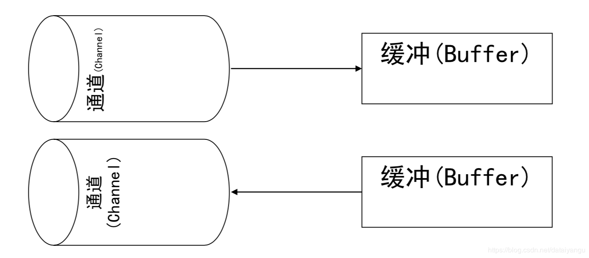
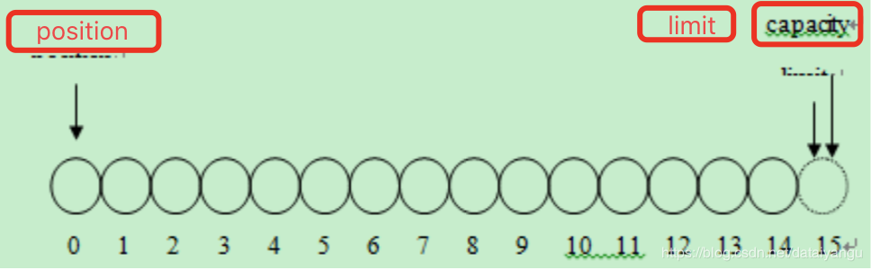
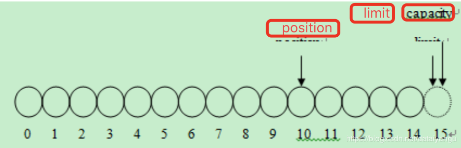
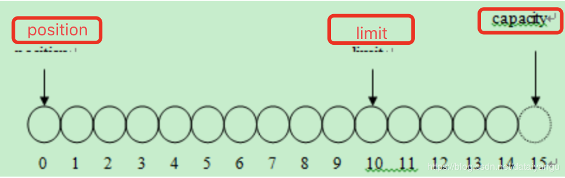
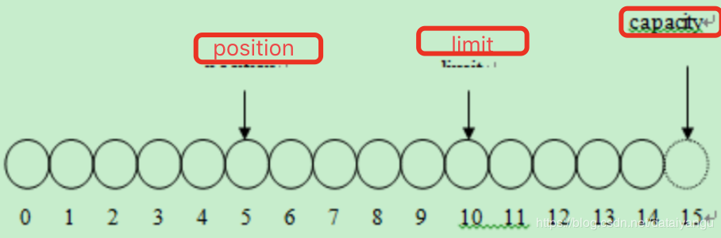
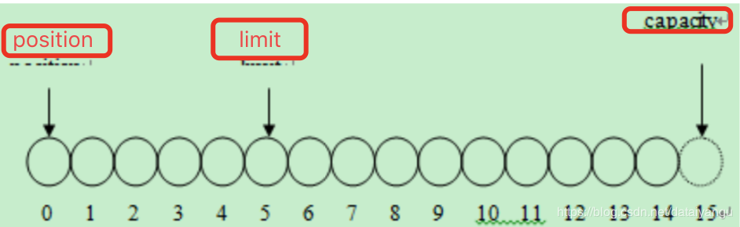
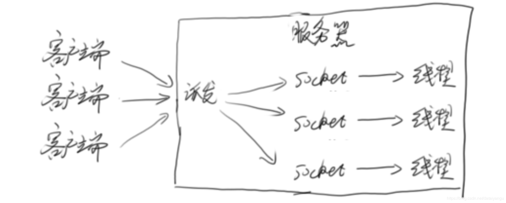
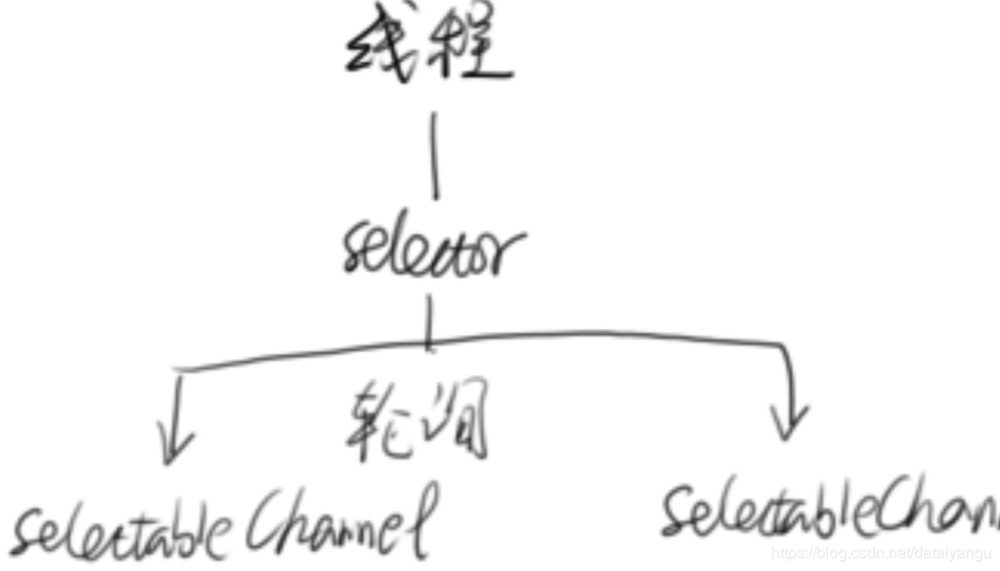
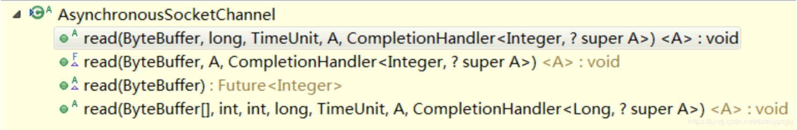
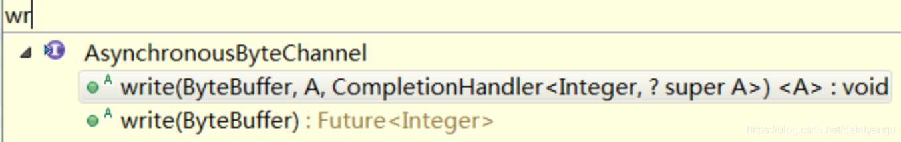

title: Java高并发程序设计学习笔记（八）：NIO和AIO
author: Leesin.Dong
top: 
tags:
  - 高并发
categories:
  - 学习笔记
  - Java高并发程序设计学习笔记
date: 2019-2-16 19:20:02

---

# 什么是NIO
NIO是New I/O的简称，与旧式的基于流的I/O方法相对，从名字看，它表示新的一套Java I/O标 准。它是在Java 1.4中被纳入到JDK中的，并具有以下特性:
– NIO是基于块(Block,硬盘上的块)的，它以块为基本单位处理数据，传统的是基于字节的，最小单位是字节，NIO最小单位是块。
– 为所有的原始类型提供(Buffer)缓存支持
– 增加通道(Channel)对象，作为新的原始 I/O 抽象
– 支持锁和内存映射文件的文件访问接口，拿文件系统来实现锁，就是我们平常的.log文件。
– 提供了基于Selector的异步网络I/O 
# Buffer && Channel


文件的读写都是通过Buffer读写到Channel，然后再到文件。Channel左边就是对应的我们的文件。
# Buffer
每个基本类型都有对应的buffer
```js
Object
	-Buffer
		-ByteBuffer
		-CharBuffer
		-DoubleBuffer
		-FloatBUffer
		-IntBuffer
		-LongBuffer
		-ShortBuffer
```
## 举个栗子
```js
FileInputStream fin = new FileInputStream(new File("d:\\temp_buffer.tmp")); 
//通过InputStream得到channel。
FileChannel fc=fin.getChannel();
//通过ByteBuffer分配1k的大小的buffer
ByteBuffer byteBuffer=ByteBuffer.allocate(1024);
//通过channel将1k大小的数据读到buffer中 
fc.read(byteBuffer);
fc.close(); 
//对buffer中的数据进行读写转换，后面可能要对buffer中的数据进行读取。
byteBuffer.flip();
```
## NIO复制文件

```js
public static void nioCopyFile(String resource, String destination) throws IOException {
	FileInputStream fis = new FileInputStream(resource); 
	FileOutputStream fos = new FileOutputStream(destination); 
	FileChannel readChannel = fis.getChannel();//读文件通道
	FileChannel writeChannel = fos.getChannel();//写文件通道
	ByteBuffer buffer = ByteBuffer.allocate(1024); //读入数据缓存
	while (true) {
		buffer.clear();
		int len = readChannel.read(buffer); //读入数据
		//len读到数据的大小
		if (len == -1) {
			break;
		//读取完毕 
		}
		buffer.flip();
		writeChannel.write(buffer); 
		//写入文件
	} 
	readChannel.close(); 
	writeChannel.close();
}
```
## Buffer中有3个重要的参数:
位置(position)、容量(capactiy)和上限(limit)
|参数 |写模式 |  读模式|
|--|--|--|
|位置  |当前缓冲区的位置，将从position的下一个位置写数据  |当前缓冲区读取的位置，将从此位置后，读取数据|
|容量|缓存区的总容量上限|缓存区的总容量上限|
|上限|缓冲区的实际上线，他总是小于等于容量。通常情况下和容量相等|代表刻度的总容量，和上次写入的数据量相等|
### 代码展示

```js
ByteBuffer b=ByteBuffer.allocate(15); //15个字节大小的缓冲区 
System.out.println("limit="+b.limit()+" capacity="+b.capacity()+" position="+b.position()); 
for(int i=0;i<10;i++){ //存入10个字节数据
	b.put((byte)i); 
}
System.out.println("limit="+b.limit()+" capacity="+b.capacity()+" position="+b.position());
b.flip(); //重置position 
System.out.println("limit="+b.limit()+" capacity="+b.capacity()+" position="+b.position());
for(int i=0;i<5;i++){
	System.out.print(b.get());
}
System.out.println();
System.out.println("limit="+b.limit()+" capacity="+b.capacity()+" position="+b.position()); b.flip();
System.out.println("limit="+b.limit()+" capacity="+b.capacity()+" position="+b.position());
```
### 图解
#### 新建


#### 存入10byte


#### flip


该操作会重置position，通常，将buffer从写模式转换为读 模式时需要执行此方法 flip()操作不仅重置了当前的position为0，还将limit设置到当 前position的位置

#### 五次读操作


#### flip


## 几个重要的函数
public final Buffer rewind()
– 将position置零，并清除标志位(mark)
public final Buffer clear()
– 将position置零，同时将limit设置为capacity的大小，并清除了标志mark
public final Buffer flip()
– 先将limit设置到position所在位置，然后将position置零，并清除标志位mark – 通常在读写转换时使用
## 文件映射到内存

```js
RandomAccessFile raf = new RandomAccessFile("C:\\mapfile.txt", "rw");
FileChannel fc = raf.getChannel();
//将文件映射到内存中
MappedByteBuffer mbb = fc.map(FileChannel.MapMode.READ_WRITE, 0, raf.length()); 
while(mbb.hasRemaining()){
	System.out.print((char)mbb.get()); 
}
mbb.put(0,(byte)98); //修改文件
raf.close();
```

# 网络编程  
## 多线程网络服务器的一般结构



## 简单案例 EchoServer
### EchoServer
```js
public static void main(String args[]) { 
	ServerSocket echoServer = null; 
	Socket clientSocket = null;
	try {
		echoServer = new ServerSocket(8000); 
	} catch (IOException e) {
		System.out.println(e); }
	while (true) { 
	try {
		clientSocket = echoServer.accept(); System.out.println(clientSocket.getRemoteSocketAddress() + " connect!"); 
		tp.execute(new HandleMsg(clientSocket));
	} catch (IOException e) {
		System.out.println(e); }
	} 
}
```
主线程在这里制作一个接收accept的功能。
### HandleMsg
```js
static class HandleMsg implements Runnable{
//省略部分信息
public void run(){
	try {
		is = new BufferedReader(new InputStreamReader(clientSocket.getInputStream()));
		os = new PrintWriter(clientSocket.getOutputStream(), true); 
		// 从InputStream当中读取客户端所发送的数据
		String inputLine = null;
		long b=System.currentTimeMillis();
		while ((inputLine = is.readLine()) != null) {
			os.println(inputLine); 
		}
		long e=System.currentTimeMillis();
		System.out.println("spend:"+(e-b)+"ms"); 
	} catch (IOException e) {
		e.printStackTrace(); }finally{
	//关闭资源
	}
}
```
读到什么就回写什么
### EchoServer的客户端
```js
public static void main(String[] args) throws IOException {
	Socket client = null;
	PrintWriter writer = null;
	BufferedReader reader = null;
	try {
		client = new Socket();
		client.connect(new InetSocketAddress("localhost", 8000)); writer = new PrintWriter(client.getOutputStream(), true); writer.println("Hello!");
		writer.flush();
		reader = new BufferedReader(new InputStreamReader(client.getInputStream()));
		System.out.println("from server: " + reader.readLine());
	} catch{
	} finally {
	//省略资源关闭 
	}
}
```
### 问题:
– 为每一个客户端使用一个线程，如果客户端出现延时等异常，线程可能会被占用很长时间。因为数据的准备和读取都在这个线程中。
– 此时，如果客户端数量众多，可能会消耗大量的系统资源
### 解决
– 非阻塞的NIO
– 数据准备好了在工作
 **<font color="red">  注意：io真正的工作分为准备和读取两个部分。nio就是在准备玩了之后才会分配读取的操作。  </font>**
 
## 模拟低效的客户端

```js
private static ExecutorService tp=Executors.newCachedThreadPool(); private static final int sleep_time=1000*1000*1000;
public static class EchoClient implements Runnable{
	public void run(){ 
		try {
		client = new Socket();
		client.connect(new InetSocketAddress("localhost", 8000)); 
		writer = new PrintWriter(client.getOutputStream(), true); writer.print("H");
		LockSupport.parkNanos(sleep_time);
		writer.print("e");
		LockSupport.parkNanos(sleep_time);
		writer.print("l");
		LockSupport.parkNanos(sleep_time);
		writer.print("l");
		LockSupport.parkNanos(sleep_time);
		writer.print("o");
		LockSupport.parkNanos(sleep_time);
		writer.print("!");
		LockSupport.parkNanos(sleep_time);
		writer.println();
		writer.flush();
```
### 服务器输出

```js
spend:6000ms 
spend:6000ms 
spend:6000ms 
spend:6001ms 
spend:6002ms
spend:6002ms 
spend:6002ms 
spend:6002ms 
spend:6003ms 
spend:6003ms
```
这里的6秒花在了哪里？
注意上面的代码块

```js
long b=System.currentTimeMillis();
while ((inputLine = is.readLine()) != null) {
	os.println(inputLine); 
}
long e=System.currentTimeMillis();
System.out.println("spend:"+(e-b)+"ms"); 
```
读和写一共花了六秒，读的时候花了很多时间读不到
# 网络编程NIO


 **<font color="red"> 把数据准备好了再通知我   </font>** Channel有点类似于流，一个Channel可以和文件或者网络Socket对应
 Selector：多路复用选择器 Selector，它是NIO编程的基础，非常重要，多路复用器提供选择已经就绪的任务的能力。简单说，就是Selector会不断地轮询注册在其上的通道（Channel） 假如某个通道发生了读写操作，这个通道就处于就绪状态，会被Selector轮询出来，然后通过SelectionKey可以取得就绪的Channel集合，从而进行后续的IO操作。一个Selector可以负责成千上万Channel通道，没有上线，这也是JDK使用了epoll代替了传统的select实现，获得连接句柄没有限制。这就意味着  我们只需要一个线程负责Selector的轮询，就可以接入成千上万个客户端。
Selector准备好数据后，返回SelectionKey SelectionKey表示一对Selector和Channel的关系， 从SelectionKey中可以得到Channnel(数据已经准备)， 并读取数据
select()和selectNow()：
select方法如果没有一个channel准备好数据的话，就会出现阻塞，selectNow不论有没有准备好，都会有一个返回值，不会出现阻塞。
# 参考代码

```js
import java.io.IOException;
import java.net.InetAddress;
import java.net.InetSocketAddress;
import java.nio.ByteBuffer;
import java.nio.channels.*;
import java.nio.channels.spi.SelectorProvider;
import java.util.Iterator;
import java.util.LinkedList;
import java.util.Set;

public class NioTest {
	private void StartServer ()throws Exception{
		final Selector selector = SelectorProvider.provider().openSelector();
		ServerSocketChannel ssc = ServerSocketChannel.open();
		//将ServerSocketChannel设置为非阻塞的，accept不会一直等待，即数据准备好了，给个通知。
		ssc.configureBlocking(false);
		InetSocketAddress isa = new InetSocketAddress(8000);
		ssc.socket().bind(isa);
		//给channel注册一个感兴趣的事件，即accept事件，如果有人accept，selector就告诉ssc
		SelectionKey acceptKey = ssc.register(selector, SelectionKey.OP_ACCEPT);
		for (; ; ) {
			//已经有数据准备好了（读、写、accept）
			selector.select();
//			if (selector.selectNow() == 0) {
//				continue;
//			}
			Set readyKeys = selector.selectedKeys();
			Iterator i = readyKeys.iterator();
			long e = 0;
			while (i.hasNext()) {
				SelectionKey sk = (SelectionKey) i.next();
				//remove掉，是为了防止后面重复处理。
				i.remove();
				//如果是一个accept的事件
				if (sk.isAcceptable()) {
					doAccept(sk);
				}
				//如果是一个读的事件，读已经准备好了
				else if(sk.isValid()&&sk.isReadable()){
//					将时间做一个记录
					if (!geym_time_stat.containsKey(((SocketChannel) sk.channel()).socket())) {
						geym_time_stat.put(((SocketChannel) sk.channel()).socket(),System.currentTimeMillis() );
						doRead(sk);
					}
				}
				//如果是一个写的事件
				else if (sk.isValid() && sk.isWritable()) {
					doWrite(sk);
					e = System.currentTimeMillis();
					//耗时的统计
					long b = geym_time_stat.remove(((SocketChannel) sk.channel()).socket());
					System.out.println("spend："+(e-b)+"ms");
				}
			}
		}
		class HandleMsg implements Runnable{
			SelectionKey sk;
			ByteBuffer bb;

			public HandleMsg(SelectionKey sk,ByteBuffer bb){
				this.sk= sk;
				this.bb = bb;
			}
			public void run() {
//				将之前添加的附件拿出来
				EchoClient echoClient = (EchoClient) sk.attachment();
				echoClient.enqueue(bb);
//				将SelectionKey感兴趣的事件修改为OP_READ和OP_WRITE；
				sk.interestOps(SelectionKey.OP_READ | SelectionKey.OP_WRITE);
//			强迫Selector立即返回
				selector.wakeup();
			}
		}
	}
	private void doRead(SelectionKey sk){
		SocketChannel channel = (SocketChannel) sk.channel();
		ByteBuffer bb = ByteBuffer.allocate(8192);
		int len;
		try{
			len = channel.read(bb);
			if (len < 0) {
				disconnect(sk);
				return;
			}
		} catch (IOException e) {
			System.out.println("Field to read from client");
			e.printStackTrace();
			disconnect(sk);
			return;
		}
		bb.flip();
		tp.excute(new HandleMsg(sk, bb));
	}
	private void doWrite(SelectionKey sk){
		SelectableChannel channel = sk.channel();
		EchoClient echoClient = (EchoClient) sk.attachment();
		LinkedList<ByteBuffer> outq =  echoClient.getOutputQueue();
		ByteBuffer bb = outq.getLast();
		try {
//			回写到channel中
			int len = channel.write(bb);
			if (len == -1) {
				disconnect(sk);
				return;
			}
			if (bb.remaining() == 0) {
				outq.removeLast();
			}
		} catch (Exception e) {
			System.out.println("Faild to write to client .");
			e.printStackTrace();
			disconnect(sk);
		}
		//队列中的数据已经回写完毕的话
		if (outq.size() == 0) {
//			将对写事件感兴趣去掉。
			sk.interestOps(SelectionKey.OP_READ);
		}
	}
	private void doAccept(SelectionKey sk){
		ServerSocketChannel server = (ServerSocketChannel) sk.channel();
		SocketChannel clientChannel;
		try {
			clientChannel = server.accept();
			clientChannel.configureBlocking(false);
			//希望能读数据
			SelectionKey clientKey = clientChannel.register(selector, SelectionKey.OP_READ);
			EchoClient echoClient = new EchoClient();
//			增加一个附件给Key
			clientKey.attach(echoClient);
			InetAddress clientAddress = clientChannel.socket().getInetAddress();
			System.out.println("Accepted connection from "+clientAddress.getHostAddress());

		} catch (Exception e) {
			System.out.println("Faild to accept new client");
			e.printStackTrace();
		}
	}
	class EchoClient{
		LinkedList<ByteBuffer> outq;
		EchoClient(){
		outq = new LinkedList<ByteBuffer>();
		}
//		读到数据就往里面塞
		public void enqueue(ByteBuffer bb){
			outq.addFirst(bb);
		}
	}

}

```
以上是通过nio的方式实现上面的功能，从6s多变为了几毫秒，因为只是部分代码，所以没有运行结果。
总结:
– NIO会将数据准备好后，再交由应用进行处理，数据如果没有准备好，是不会进入到应用中的，数据的读取过程依然在应用线程中完成 ，等待的时间剥离到一个独立的线程中去等待（selector.select();）。
– 节省数据准备时间(因为Selector可以复用)

# AIO
异步io
上面的NIO只是将等待的时间剥离到少数的线程中，避免大量的线程等待，造成的资源浪费，AIO等你写完了或者读完了再通知我。不需要读，也不需要写，只需要等系统把数据都处理完了之后，把回调函数放进去，就会执行，AIO不会加快io，io本身的速度并没有加快，只是改变了原来的线程对io的处理方式，看起来是变快了。
## 特点总结：
读完了再通知我
不会加快IO，只是在读完后进行通知 
使用回调函数，进行业务处理
## 基本思想
用到的类
```js
AsynchronousServerSocketChannel
  ```
  ```js
server = AsynchronousServerSocketChannel.open().bind(new InetSocketAddress(PORT));
```
使用server上的accept方法
```js
public abstract <A> void accept(A attachment,
CompletionHandler<AsynchronousSocketChannel,? super A>handler);
```
因为AIO是异步的，将accept调用了之后立即返回，但是并没有真正拿到客户端的数据，CompletionHandler<AsynchronousSocketChannel,? super A>handler这个接口的作用就是在真正accept的时候，将accept得到的数据传给handler，供后面的相关操作使用。
## 其他的方法
AsynchronousSocketChannel
因为是异步的，肯定不能读完了之后再返回，所以所有的方法都是立即返回的
– read


TimeUnit是超时时间
第三个函数只有一个参数，但是会返回一个future，告知读到了第几个字节
第四个函数是读到了ByteBuffer数组中，因为网络报文的前二十（举例）个字节是无用的，直接剥离掉，能直接拿到有用的数据。
– write


## 代码实现

```js
server.accept(null, new CompletionHandler<AsynchronousSocketChannel, Object>() {
	final ByteBuffer buffer = ByteBuffer.allocate(1024);
	  网络编程 AIO
	public void completed(AsynchronousSocketChannel result, Object attachment) {
		System.out.println(Thread.currentThread().getName()); 					  Future<Integer> writeResult=null;
		try {
			buffer.clear();
			result.read(buffer).get(100, TimeUnit.SECONDS); 
			buffer.flip();
			writeResult=result.write(buffer);
		} catch (InterruptedException | ExecutionException e) { e.printStackTrace();
		} catch (TimeoutException e) { e.printStackTrace();
		} finally { try {
		//执行完了之后再次执行accept，防止执行完了没事干了。
			server.accept(null, this);
			writeResult.get(); 
			result.close();
		} catch (Exception e) {
		System.out.println(e.toString()); }
		} 
	}
	@Override
	public void failed(Throwable exc, Object attachment) {
		System.out.println("failed: " + exc); 
	}
});
```
上面是accept的代码实现，
# 为什么需要了解NIO和AIO?

