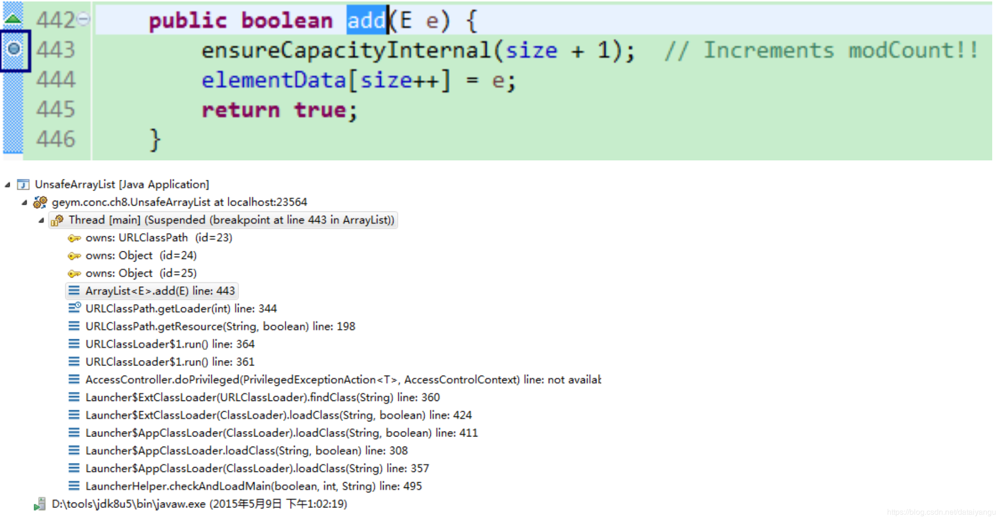
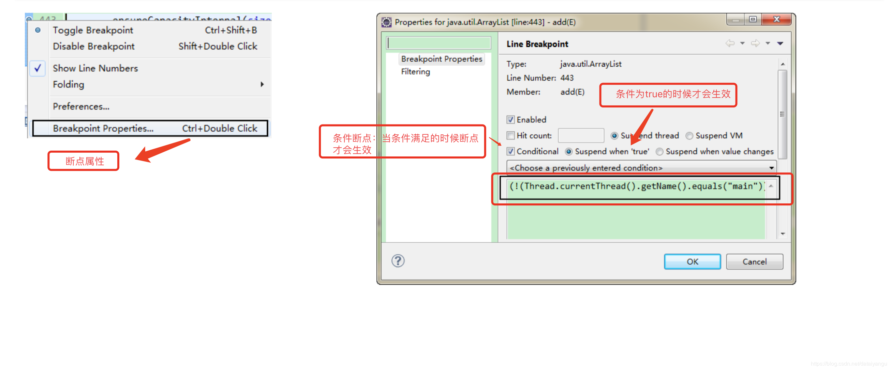
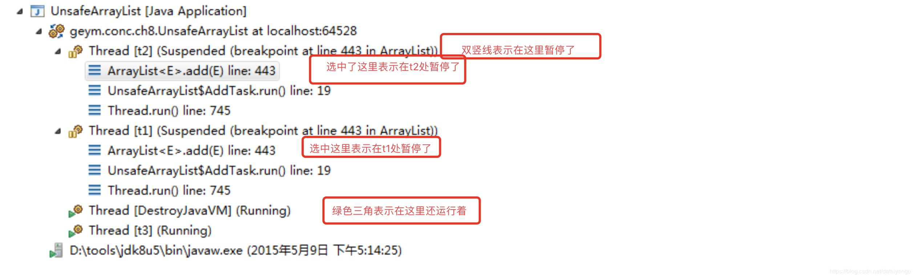
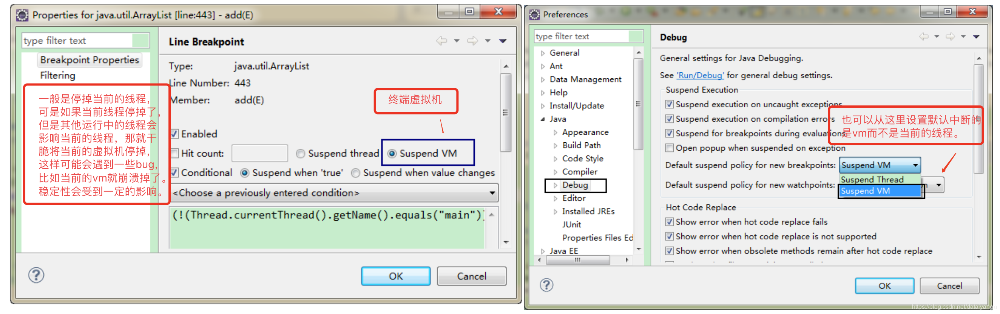
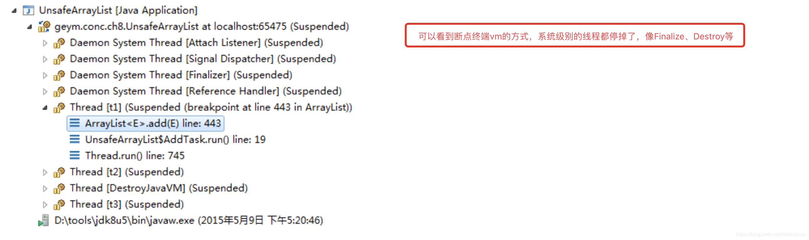

title: Java高并发程序设计学习笔记（十）：并发调试和JDK8新特性
author: Leesin.Dong
top: 
tags:
  - 高并发
categories:
  - 学习笔记
  - Java高并发程序设计学习笔记
date: 2019-2-21 10:20:02

---


# 多线程调试的方法
## 使用Eclipse进行多线程调试
看如下一段代码：
```js
public class UnsafeArrayList {
	static ArrayList al=new ArrayList();
	static class AddTask implements Runnable{
		@Override
		public void run() {
		try {
			Thread.sleep(100);
		} catch (InterruptedException e) {}
		for(int i=0;i<1000000;i++) 
		al.add(new Object());
		} 
	}
	public static void main(String[] args) throws InterruptedException { 
		Thread t1=new Thread(new AddTask(),"t1");
		Thread t2=new Thread(new AddTask(),"t2");
		t1.start();
		t2.start();
		Thread t3=new Thread(new Runnable(){
			@Override
			public void run() {
				while(true){
					try {
						Thread.sleep(1000); 
					} catch (InterruptedException e) {}
				} 
			}
		},"t3");
		t3.start();
		}
}
```
ArrayList不是线程安全的。
))

把断点打到ArrayList的add方法处，发现还是在classLoader层面上的，并没有到达我们的应用层的实现。


上面的条件断点只有当不是主线程的时候才会生效，通过上面的程序不难看出，整个应用层面和主线程并没有太大的关系，主要和线程t1 t2有关系





通过打断点的方式复现问题发现

```js
 public boolean add(E e) {
        ensureCapacityInternal(size + 1);  // Increments modCount!!
        elementData[size++] = e;
        return true;
    }
```
是在ensureCapacityInternal(size + 1);这行出现了问题，t1中size变成了9，t2size++，这个时候t1并不知情，导致size不一致，·8导致报错。
# 线程dump及分析
jstack 3992 可以导出当前虚拟机所有运行的线程。
在%JAVA_HOME%/bin目录下面（jstack 3992 ）
## 分析死锁案例
### 代码
代码简介：东西南北四个小车形成的死锁
```js
import java.util.concurrent.locks.ReentrantLock;

public class DeadLock extends Thread {
	protected Object myDirect;
	static ReentrantLock south = new ReentrantLock();
	static ReentrantLock north = new ReentrantLock();
	static ReentrantLock west = new ReentrantLock();
	static ReentrantLock east = new ReentrantLock();

	public DeadLock(Object obj){
		this.myDirect = obj;
		if (myDirect == south) {
			this.setName("south");
		}
		if (myDirect == north) {
			this.setName("north");
		}
		if (myDirect == west) {
			this.setName("west");
		}
		if (myDirect == east) {
			this.setName("east");
		}

	}

	@Override
	public void run() {
		if (myDirect == south) {
			try {
				west.lockInterruptibly();
				Thread.sleep(500);
				south.lockInterruptibly();
				System.out.println("car to south has passed");
			} catch (InterruptedException e) {
				e.printStackTrace();
				System.out.println("car to south is killed");
			}finally {
				if (west.isHeldByCurrentThread())
					west.unlock();
				if (south.isHeldByCurrentThread())
					south.unlock();
			}
		}
		if (myDirect == north) {
			try {
				east.lockInterruptibly();
				Thread.sleep(500);
				north.lockInterruptibly();
				System.out.println("car to south has passed");
			} catch (InterruptedException e) {
				e.printStackTrace();
				System.out.println("car to south is killed");
			}finally {
				if (east.isHeldByCurrentThread())
					east.unlock();
				if (north.isHeldByCurrentThread())
					north.unlock();
			}
		}
		if (myDirect == west) {
			try {
				north.lockInterruptibly();
				Thread.sleep(500);
				west.lockInterruptibly();
				System.out.println("car to south has passed");
			} catch (InterruptedException e) {
				e.printStackTrace();
				System.out.println("car to south is killed");
			}finally {
				if (north.isHeldByCurrentThread())
					north.unlock();
				if (west.isHeldByCurrentThread())
					west.unlock();
			}
		}
		if (myDirect == east) {
			try {
				south.lockInterruptibly();
				Thread.sleep(500);
				east.lockInterruptibly();
				System.out.println("car to south has passed");
			} catch (InterruptedException e) {
				e.printStackTrace();
				System.out.println("car to south is killed");
			}finally {
				if (south.isHeldByCurrentThread())
					south.unlock();
				if (east.isHeldByCurrentThread())
					east.unlock();
			}
		}
	}

	public static void main(String[] args) throws InterruptedException {
		DeadLock car2South = new DeadLock(south);
		DeadLock car2North = new DeadLock(north);
		DeadLock car2West = new DeadLock(west);
		DeadLock car2East = new DeadLock(east);
		car2South.start();
		car2East.start();
		car2North.start();
		car2West.start();
		Thread.sleep(1000);

	}
}

```
运行结果：

```js

```
什么也没有输出，程序还在不断的运行着。
### jstack调试
#### jps命令找到当前这个java的进程号

```js
➜  ~ jps
1682 Launcher
1714 Jps
1683 DeadLock
1397 RemoteMavenServer
1370
```
#### 运行jstack命令

```js
jstack 1683
```

```js
jstack -h
```
发现-l参数可以看到更多的参数

```js
jstack -l 1683
```
结果：

```js
"west" #12 prio=5 os_prio=31 tid=0x00007ff6cc062000 nid=0x3d03 waiting on condition [0x0000700006ab7000]
   java.lang.Thread.State: WAITING (parking)
	at sun.misc.Unsafe.park(Native Method)
	- parking to wait for  <0x000000079578bda8> (a java.util.concurrent.locks.ReentrantLock$NonfairSync)
	at java.util.concurrent.locks.LockSupport.park(LockSupport.java:175)
	at java.util.concurrent.locks.AbstractQueuedSynchronizer.parkAndCheckInterrupt(AbstractQueuedSynchronizer.java:836)
	at java.util.concurrent.locks.AbstractQueuedSynchronizer.doAcquireInterruptibly(AbstractQueuedSynchronizer.java:897)
	at java.util.concurrent.locks.AbstractQueuedSynchronizer.acquireInterruptibly(AbstractQueuedSynchronizer.java:1222)
	at java.util.concurrent.locks.ReentrantLock.lockInterruptibly(ReentrantLock.java:335)
	at DeadLock.run(DeadLock.java:65)

   Locked ownable synchronizers:
	- <0x000000079578bd78> (a java.util.concurrent.locks.ReentrantLock$NonfairSync)

"north" #11 prio=5 os_prio=31 tid=0x00007ff6cd843800 nid=0x3f03 waiting on condition [0x00007000069b4000]
   java.lang.Thread.State: WAITING (parking)
	at sun.misc.Unsafe.park(Native Method)
	- parking to wait for  <0x000000079578bd78> (a java.util.concurrent.locks.ReentrantLock$NonfairSync)
	at java.util.concurrent.locks.LockSupport.park(LockSupport.java:175)
	at java.util.concurrent.locks.AbstractQueuedSynchronizer.parkAndCheckInterrupt(AbstractQueuedSynchronizer.java:836)
	at java.util.concurrent.locks.AbstractQueuedSynchronizer.doAcquireInterruptibly(AbstractQueuedSynchronizer.java:897)
	at java.util.concurrent.locks.AbstractQueuedSynchronizer.acquireInterruptibly(AbstractQueuedSynchronizer.java:1222)
	at java.util.concurrent.locks.ReentrantLock.lockInterruptibly(ReentrantLock.java:335)
	at DeadLock.run(DeadLock.java:49)

   Locked ownable synchronizers:
	- <0x000000079578bdd8> (a java.util.concurrent.locks.ReentrantLock$NonfairSync)

"east" #13 prio=5 os_prio=31 tid=0x00007ff6cd843000 nid=0x4103 waiting on condition [0x00007000068b1000]
   java.lang.Thread.State: WAITING (parking)
	at sun.misc.Unsafe.park(Native Method)
	- parking to wait for  <0x000000079578bdd8> (a java.util.concurrent.locks.ReentrantLock$NonfairSync)
	at java.util.concurrent.locks.LockSupport.park(LockSupport.java:175)
	at java.util.concurrent.locks.AbstractQueuedSynchronizer.parkAndCheckInterrupt(AbstractQueuedSynchronizer.java:836)
	at java.util.concurrent.locks.AbstractQueuedSynchronizer.doAcquireInterruptibly(AbstractQueuedSynchronizer.java:897)
	at java.util.concurrent.locks.AbstractQueuedSynchronizer.acquireInterruptibly(AbstractQueuedSynchronizer.java:1222)
	at java.util.concurrent.locks.ReentrantLock.lockInterruptibly(ReentrantLock.java:335)
	at DeadLock.run(DeadLock.java:81)

   Locked ownable synchronizers:
	- <0x000000079578bd48> (a java.util.concurrent.locks.ReentrantLock$NonfairSync)

"south" #10 prio=5 os_prio=31 tid=0x00007ff6cd842000 nid=0x3b03 waiting on condition [0x00007000067ae000]
   java.lang.Thread.State: WAITING (parking)
	at sun.misc.Unsafe.park(Native Method)
	- parking to wait for  <0x000000079578bd48> (a java.util.concurrent.locks.ReentrantLock$NonfairSync)
	at java.util.concurrent.locks.LockSupport.park(LockSupport.java:175)
	at java.util.concurrent.locks.AbstractQueuedSynchronizer.parkAndCheckInterrupt(AbstractQueuedSynchronizer.java:836)
	at java.util.concurrent.locks.AbstractQueuedSynchronizer.doAcquireInterruptibly(AbstractQueuedSynchronizer.java:897)
	at java.util.concurrent.locks.AbstractQueuedSynchronizer.acquireInterruptibly(AbstractQueuedSynchronizer.java:1222)
	at java.util.concurrent.locks.ReentrantLock.lockInterruptibly(ReentrantLock.java:335)
	at DeadLock.run(DeadLock.java:33)

   Locked ownable synchronizers:
	- <0x000000079578bda8> (a java.util.concurrent.locks.ReentrantLock$NonfairSync)
	- Found one Java-level deadlock:
  =============================
"west":
  waiting for ownable synchronizer 0x000000079578bda8, (a java.util.concurrent.locks.ReentrantLock$NonfairSync),
  which is held by "south"
"south":
  waiting for ownable synchronizer 0x000000079578bd48, (a java.util.concurrent.locks.ReentrantLock$NonfairSync),
  which is held by "east"
"east":
  waiting for ownable synchronizer 0x000000079578bdd8, (a java.util.concurrent.locks.ReentrantLock$NonfairSync),
  which is held by "north"
"north":
  waiting for ownable synchronizer 0x000000079578bd78, (a java.util.concurrent.locks.ReentrantLock$NonfairSync),
  which is held by "west"

Java stack information for the threads listed above:
  ===================================================
```

 可以看到east中有这句话：
 
```js
parking to wait for  <0x000000079578bdd8>
 south 中 Locked ownable synchronizers:<0x000000079578bda8> (a java.util.concurrent.locks.ReentrantLock$NonfairSync)

```
可以知道east在等待0x000000079578bdd8，而0x000000079578bdd8是被south持有的。以此类推。

同样
"west":waiting for ownable synchronizer 0x000000079578bda8, (a java.util.concurrent.locks.ReentrantLock$NonfairSync),
  which is held by "south"
也是能看出具体的原因。

末尾更清楚：

```js
=============================
"west":
  waiting for ownable synchronizer 0x000000079578bda8, (a java.util.concurrent.locks.ReentrantLock$NonfairSync),
  which is held by "south"
"south":
  waiting for ownable synchronizer 0x000000079578bd48, (a java.util.concurrent.locks.ReentrantLock$NonfairSync),
  which is held by "east"
"east":
  waiting for ownable synchronizer 0x000000079578bdd8, (a java.util.concurrent.locks.ReentrantLock$NonfairSync),
  which is held by "north"
"north":
  waiting for ownable synchronizer 0x000000079578bd78, (a java.util.concurrent.locks.ReentrantLock$NonfairSync),
  which is held by "west"

Java stack information for the threads listed above:
===================================================
```

# JDK8对并发的新支持
## LongAdder
– 和AtomicInteger类似的使用方式
– 在AtomicInteger上进行了热点分离
– public void add(long x)
– public void increment()增加一
– public void decrement()减一
– public long sum() 因为是分离成16份，这里是一个求和的操作
– public long longValue() 同上
– public int intValue() Long转化成整形
性能比AtomicLong高很多，因为LongAdder是类似于HashMao的热点分离。
示意：
```js
cas更新
线程一-------->cell1 |
线程二-------->cell2 |---sum---->
线程三-------->cell3 |----求和--->    value
线程四-------->cell4 |
```
基本思想：
如上，当高并发的时候，将一个数分解成多个cell，线程一访问cell1，线程二访问cell2，以此类推，从而减少冲突的概率，但是当并发的线程数极少的时候，将数分成数组，则会消耗很大的性能，起到相反的作用，所以Longadd本身是有优化的，本身通过base数据（类似于AtomicLong），当发现一次冲突的时候就分成两个，在发现一次冲突分成四个，以此类推。
## CompletableFuture
### 基本
– 实现CompletionStage接口(40余个方法) 
– Java 8中对Future的增强版
– 支持流式调用

```js
stage.thenApply(x -> square(x)).thenAccept(x -> System.out.print(x)).thenRun(() -> 
System.out.println())
```
完成后得到通知

```js
public static class AskThread implements Runnable {
      CompletableFuture <Integer> re = null;
      public AskThread(CompletableFuture <Integer> re) {
      this.re = re
	  }
      @Override
      public void run() [
      int myRe = 0;
      try {
      //返回future值的平方
      myRe = re.get) * re.get();
      } catch (Exception e) {
      System.out.println(myRe);
      }
      public static void main(String[] args) throws InterruptedException {
      final CompletableFuture <Integer> future = new CompletableFuture<>();
      //将future传到线程中
      new Thread(new AskThread(future)).start();
      //模拟长时间的计算过程
      Thread.sleep(1000);
	 //告知完成结果
      future.complete(60);
```
跟前面的future模式不同的是，前面的future模式完成是系统自己完成的，这里的完成是能够开发者自己定义的，如上面的代码future.complete(60);
### 异步执行

```js
public static Integer calc(Integer para) {
	try {
	// 模拟一个长时间的执行
	Thread.sleep(1000);
	} catch (InterruptedException e) {
	}
	return para*para;
}
public static void main(String[] args) throws InterruptedException, ExecutionException { 
	final CompletableFuture<Integer> future =
	//supplyAsync工厂方法，能够得到一个CompletableFuture的实例，
	//并不是通过new出来的，内部会帮我们创建一个，能够直接得到一个实例，然后调动calc
	//calc中的执行类似上面的代码，return平法。
	CompletableFuture.supplyAsync(() -> calc(50)); 	
	System.out.println(future.get());
}
```

###  工厂方法：

```js
static <U> CompletableFuture<U> supplyAsync(Supplier<U> supplier);
static <U> CompletableFuture<U> supplyAsync(Supplier<U> supplier, Executor executor); static CompletableFuture<Void> runAsync(Runnable runnable);
static CompletableFuture<Void> runAsync(Runnable runnable, Executor executor);
```
Executor executor就是线程池，supplyAsync和runAsync的区别是supplyAsync是有返回值的，runAsync就是一个单纯Runnable接口，没有返回值。

### 流式调用

```js
public static Integer calc(Integer para) {
	try {
	// 模拟一个长时间的执行
		Thread.sleep(1000);
	} catch (InterruptedException e) {
	}
	return para*para;
}
public static void main(String[] args) throws InterruptedException, ExecutionException { 
CompletableFuture<Void> fu=CompletableFuture.supplyAsync(() -> calc(50))
.thenApply((i)->Integer.toString(i)) .thenApply((str)->"\""+str+"\"") .thenAccept(System.out::println);
fu.get(); 
}
```
calc返回平方操作，Integer.toString转化成String，thenApply((str)->"\""+str+"\"") 在String两边加引号，thenAccept(System.out::println)输出结果。fu.get(); 看看得到结果了没有。
### 组合多个CompletableFuture

```js
public <U> CompletableFuture<U> thenCompose(Function<? super T, ? extends CompletionStage<U>> fn)
```

```js
public static Integer calc(Integer para) {
	return para/2; 
}
public static void main(String[] args) throws InterruptedException, ExecutionException { 
CompletableFuture<Void> fu =
CompletableFuture.supplyAsync(() -> calc(50)) .thenCompose((i)->CompletableFuture.supplyAsync(() -> calc(i))) .thenApply((str)->"\"" + str + "\"").thenAccept(System.out::println);
fu.get(); 
}
```
thenCompose除以四，就是五十先除以四，再除以四。
结果

```js
 "12"
```
## StampedLock
– 读写锁的改进
– 读不阻塞写
读的时候发生了写，不应该不让写操作，而应该重读。
因为：
当读太多的时候，可能出现写不进去的现象，写饥饿。
stemp时间戳

```js
public class Point {
	private double x, y;
	private final StampedLock sl = new StampedLock();
	void move(double deltaX, double deltaY) { // an exclusively locked method long stamp = sl.writeLock();
	try {
		x += deltaX;
		y += deltaY;
	} finally {
		sl.unlockWrite(stamp);
	} 
	}
	double distanceFromOrigin() { // A read-only method 
	//tryOptimisticRead乐观读，即上面提到的思想
	long stamp = sl.tryOptimisticRead();
	double currentX = x, currentY = y; 
	//验证stemp，如果读的过程中，进行了写操作，返回零或者其他的数，拒绝操作
	//如果在读x的过程中修改了y，看到上面的move函数，对sl加锁解锁，每次的stemp值都是不一样的
	//和这里的对比
	if (!sl.validate(stamp)) {
	//如果不支持乐观读，就用最原始的读写锁的方法。
		stamp = sl.readLock();
		try {
			currentX = x;
			currentY = y; 
		} finally {
			sl.unlockRead(stamp);
		}
	}
	return Math.sqrt(currentX * currentX + currentY * currentY);
	} 
}
```
### StampedLock的实现思想
– CLH自旋锁
– 锁维护一个等待线程队列，所有申请锁，但是没有成功的线程都记录在这个队列中。每一个节点(一个 节点代表一个线程)，保存一个标记位(locked)，用于判断当前线程是否已经释放锁。
– 当一个线程试图获得锁时，取得当前等待队列的尾部节点作为其前序节点。并使用类似如下代码判断前 序节点是否已经成功释放锁:
示意代码：

```js
while (pred.locked) { }
```
StampedLock的实现思想
– 不会进行无休止的自旋，会在在若干次自旋后挂起线程
上面（while）只是一个示意的代码，不会无休止的自旋


简单来说就是每次执行自己的时候先看看前面的锁释放了没有，以此类推。


