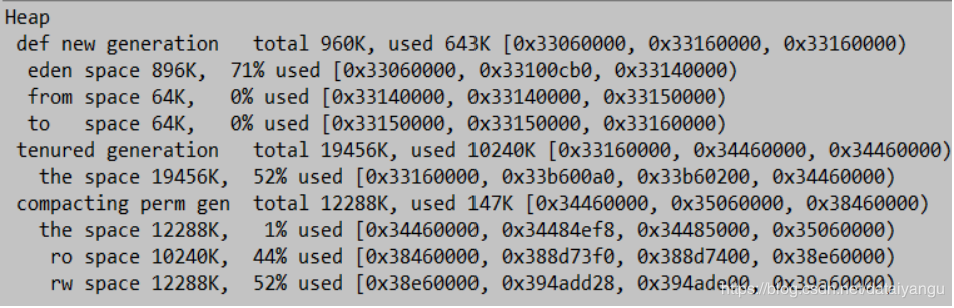
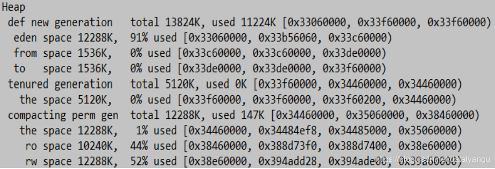
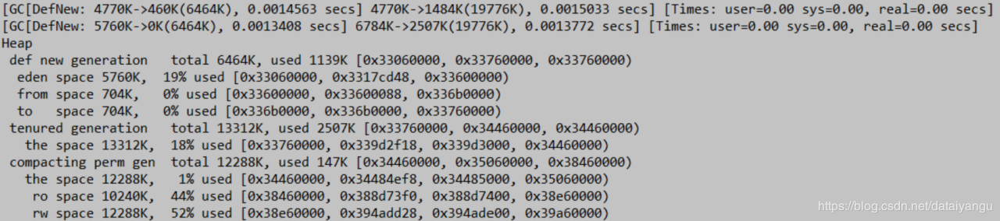
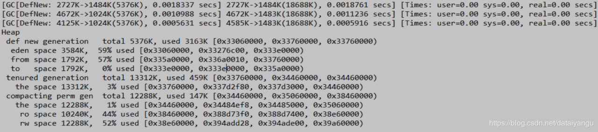
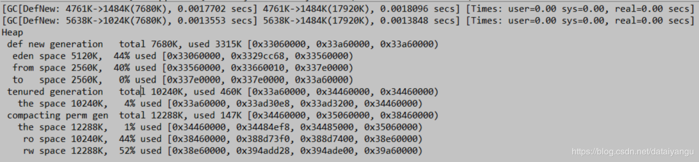
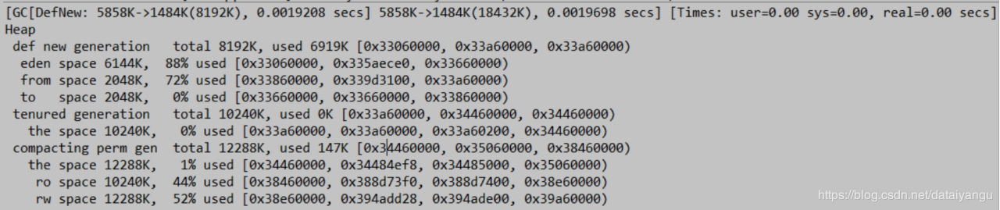
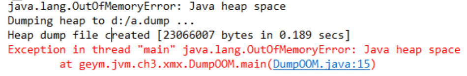
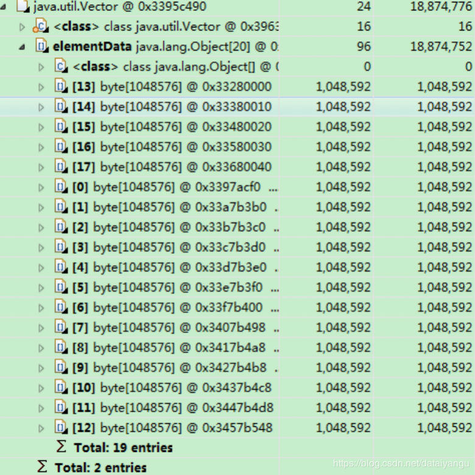
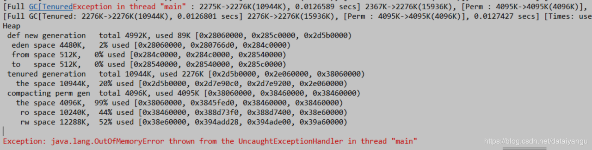
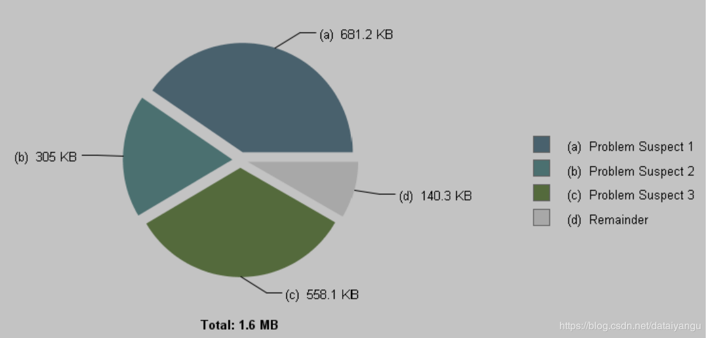

title: JVM内核-原理、诊断与优化学习笔记（三）：常用JVM配置参数
author: Leesin.Dong
top: 
tags:
  - JVM
categories:
  - 学习笔记
  - JVM内核-原理、诊断与优化学习笔记
date: 2019-2-24 22:20:02

---


# Trace跟踪参数
## -verbose:gc (打开gc的跟踪情况)
## -XX:+printGC（打开gc的log开关，如果在运行的过程中出现了gc，就会打印出相关的信息。）
- 可以打印GC的简要信息
[GC 4790K->374K(15872K), 0.0001606 secs]
[GC 4790K->374K(15872K), 0.0001474 secs]
[GC 4790K->374K(15872K), 0.0001563 secs]
[GC 4790K->374K(15872K), 0.0001682 secs]
上面这行的解释：堆在gc之前用了4m，在gc之后用了374k，回收了将近4m的大小，整个堆的大小15872K
##  -XX:+PrintGCDetails
打印GC详细信息
## XX:+PrintGCTimeStamps
打印CG发生的时间戳
- 例
这是一个PrintGCDetails的log
```js
[GC[DefNew: 4416K->0K(4928K), 0.0001897 secs] 4790K->374K(15872K), 0.0002232 secs] 
[Times: user=0.00 sys=0.00, real=0.00 secs] 
```
DefNew: 4416K->0K(4928K), 0.0001897 secs表示这是一个新生代的gc
- -XX:+PrintGCDetails的输出，在程序运行结束后的一段描述
PrintGCDetails会把程序运行结束后，整个程序的堆的情况打印出来

```js
Heap
	//新生代总的空间13824K，用了11223K
	//0x27e80000低边界，起始位置，0x28d80000，当前所分配的，所申请到的位置，
	//0x28d80000最高边界，最多能申请到的位置。从现在来看新生代已经全部申请完了，已经不能再做扩展了。
	//（0x28d80000-0x27e80000)/1024/1024=15M说明新生代正好15m
	//也就正好是eden+from+to，但是和13824K是不相等的，也就是分配了15m，但是只有
	//13824K可用，为什么？后面学习gc的算法。
	def new generation   total 13824K, used 11223K [0x27e80000, 0x28d80000, 0x28d80000)
	//yiden（伊甸园）对象出生的地方，总共12288K，91%被使用了
	eden space 12288K,  91% used [0x27e80000, 0x28975f20, 0x28a80000)
	//from和to的大小是必须相等的
	from space 1536K,   0% used [0x28a80000, 0x28a80000, 0x28c00000)
	to   space 1536K,   0% used [0x28c00000, 0x28c00000, 0x28d80000)
	//老年代，总共5120K，已经使用0k
	tenured generation   total 5120K, used 0K [0x28d80000, 0x29280000, 0x34680000)
	the space 5120K,   0% used [0x28d80000, 0x28d80000, 0x28d80200, 0x29280000)
	//持久带，永久区，方法区。
	compacting perm gen  total 12288K, used 142K [0x34680000, 0x35280000, 0x38680000)
	//为什么use142k相对较小？
	//因为在jdk5.0之后，在串行gc的模式之下，可以有一个永久区的共享，叫做类的共享
	//打开类的共享之后一些基础的java的类会被加载到一个共享区间，供所有的jvm使用，
	//ro和rw就是共享区间的大小，一个是只读的，一个是可读可写的，占得比重比较大了
	the space 12288K,   1% used [0x34680000, 0x346a3a90, 0x346a3c00, 0x35280000)
	ro space 10240K,  44% used [0x38680000, 0x38af73f0, 0x38af7400, 0x39080000)
	rw space 12288K,  52% used [0x39080000, 0x396cdd28, 0x396cde00, 0x39c80000)

```
## -Xloggc:log/gc.log
指定GC log的位置，以文件输出
帮助开发人员分析问题
因为一般gc日志的输出都是在控制台的，不便于保留。
## -XX:+PrintHeapAtGC
每次一次GC后，都打印堆信息

```js
{
//gc之前的信息
Heap before GC invocations=0 (full 0):
 def new generation   total 3072K, used 2752K [0x33c80000, 0x33fd0000, 0x33fd0000)
  eden space 2752K, 100% used [0x33c80000, 0x33f30000, 0x33f30000)
  from space 320K,   0% used [0x33f30000, 0x33f30000, 0x33f80000)
  to   space 320K,   0% used [0x33f80000, 0x33f80000, 0x33fd0000)
 tenured generation   total 6848K, used 0K [0x33fd0000, 0x34680000, 0x34680000)
   the space 6848K,   0% used [0x33fd0000, 0x33fd0000, 0x33fd0200, 0x34680000)
 compacting perm gen  total 12288K, used 143K [0x34680000, 0x35280000, 0x38680000)
   the space 12288K,   1% used [0x34680000, 0x346a3c58, 0x346a3e00, 0x35280000)
    ro space 10240K,  44% used [0x38680000, 0x38af73f0, 0x38af7400, 0x39080000)
    rw space 12288K,  52% used [0x39080000, 0x396cdd28, 0x396cde00, 0x39c80000)
//这里正好是一次gc
[GC[DefNew: 2752K->320K(3072K), 0.0014296 secs] 2752K->377K(9920K), 0.0014604 secs] [Times: user=0.00 sys=0.00, real=0.00 secs] 
//gc之后的信息
Heap after GC invocations=1 (full 0):
 def new generation   total 3072K, used 320K [0x33c80000, 0x33fd0000, 0x33fd0000)
  eden space 2752K,   0% used [0x33c80000, 0x33c80000, 0x33f30000)
  from space 320K, 100% used [0x33f80000, 0x33fd0000, 0x33fd0000)
  to   space 320K,   0% used [0x33f30000, 0x33f30000, 0x33f80000)
 tenured generation   total 6848K, used 57K [0x33fd0000, 0x34680000, 0x34680000)
   the space 6848K,   0% used [0x33fd0000, 0x33fde458, 0x33fde600, 0x34680000)
 compacting perm gen  total 12288K, used 143K [0x34680000, 0x35280000, 0x38680000)
   the space 12288K,   1% used [0x34680000, 0x346a3c58, 0x346a3e00, 0x35280000)
    ro space 10240K,  44% used [0x38680000, 0x38af73f0, 0x38af7400, 0x39080000)
    rw space 12288K,  52% used [0x39080000, 0x396cdd28, 0x396cde00, 0x39c80000)
}
```
## -XX:+TraceClassLoading
监控类的加载
[Loaded java.lang.Object from shared objects file]
[Loaded java.io.Serializable from shared objects file]
[Loaded java.lang.Comparable from shared objects file]
[Loaded java.lang.CharSequence from shared objects file]
[Loaded java.lang.String from shared objects file]
[Loaded java.lang.reflect.GenericDeclaration from shared objects file]
[Loaded java.lang.reflect.Type from shared objects file]
## -XX:+PrintClassHistogram
打印类的直方图
在程序的运行过程中，按下Ctrl+Break后，打印类的信息：
所有的类的使用情况

```js
 num     #instances      #bytes    class name
----------------------------------------------
   1:        890617      470266000  [B    //byte数组
   2:        890643       21375432  java.util.HashMap$Node//hashMap的节点数。
   3:        890608       14249728  java.lang.Long
   4:            13        8389712  [Ljava.util.HashMap$Node;
   5:          2062         371680  [C
   6:           463          41904  java.lang.Class
```

分别显示：序号、实例数量、总大小（占用的空间）、类型
# 堆的分配参数
## Xmx –Xms
指定最大堆和最小堆(只要jvm一启动，这么多的空间就是被占用的。)
- -Xmx20m -Xms5m  运行代码：

```js
System.out.print("Xmx=");
System.out.println(Runtime.getRuntime().maxMemory()/1024.0/1024+"M");
//最大空间
System.out.print("free mem=");
System.out.println(Runtime.getRuntime().freeMemory()/1024.0/1024+"M");
//空闲的空间
System.out.print("total mem=");
System.out.println(Runtime.getRuntime().totalMemory()/1024.0/1024+"M");
//总的空间、目前分配到的空间
```

```js
Xmx=19.375M  （Xmx）
free mem=4.342750549316406M
total mem=4.875M （Xms）
```
-Xmx20m -Xms5m  运行代码

```js
byte[] b=new byte[1*1024*1024];
System.out.println("分配了1M空间给数组");

System.out.print("Xmx=");
System.out.println(Runtime.getRuntime().maxMemory()/1024.0/1024+"M");

System.out.print("free mem=");
System.out.println(Runtime.getRuntime().freeMemory()/1024.0/1024+"M");

System.out.print("total mem=");
System.out.println(Runtime.getRuntime().totalMemory()/1024.0/1024+"M");
```

```js
分配了1M空间给数组
Xmx=19.375M
free mem=3.4791183471679688M
total mem=4.875M
```

```js
为什么total还是5m，Java会尽可能维持在最小堆（Xms）。
```
-Xmx20m -Xms5m  运行代码

```js
b=new byte[4*1024*1024];
System.out.println("分配了4M空间给数组");

System.out.print("Xmx=");
System.out.println(Runtime.getRuntime().maxMemory()/1024.0/1024+"M");

System.out.print("free mem=");
System.out.println(Runtime.getRuntime().freeMemory()/1024.0/1024+"M");

System.out.print("total mem=");
System.out.println(Runtime.getRuntime().totalMemory()/1024.0/1024+"M");
```

```js
分配了4M空间给数组
Xmx=19.375M
free mem=3.5899810791015625M
total mem=9.00390625M
总内存变多了
```
-Xmx20m -Xms5m  运行代码

```js
System.gc();

System.out.println("回收内存");
System.out.print("Xmx=");
System.out.println(Runtime.getRuntime().maxMemory()/1024.0/1024+"M");

System.out.print("free mem=");
System.out.println(Runtime.getRuntime().freeMemory()/1024.0/1024+"M");

System.out.print("total mem=");
System.out.println(Runtime.getRuntime().totalMemory()/1024.0/1024+"M");
```

```js
回收内存
Xmx=19.375M
free mem=6.354591369628906M
total mem=10.75390625M
空闲内存变多了
```
## 小问题：
-Xmx 和 –Xms 应该保持一个什么关系，可以让系统的性能尽可能的好呢？
如果你要做一个Java的桌面产品，需要绑定JRE，但是JRE又很大，你如何做一下JRE的瘦身呢？
## Xmn
设置新生代大小（大小的绝对值，比如是5m就是5m）
## -XX:NewRatio
新生代（eden+2*s（eden+from+to））和老年代（不包含永久区）的比值
4 表示 新生代:老年代=1:4，即年轻代占堆的1/5
NewRatio和Xmn的区别是：一个是比值，一个是绝对值。
## -XX:SurvivorRatio
设置两个Survivor区（幸存区，from+to）和eden的比
8表示 两个Survivor :eden=2:8，即一个Survivor占年轻代的1/10
## 举个栗子
### 栗子一
```js
public static void main(String[] args) {
   byte[] b=null;
   for(int i=0;i<10;i++)
       b=new byte[1*1024*1024];
}
```
 **<font color="red"> 注意：以上代码一共分配10m的空间   </font>**
```js
-Xmx20m -Xms20m -Xmn1m  -XX:+PrintGCDetails
```


新生代（eden+from+to）一共1m，不能够分配10m，所以全部分配到了年老代，因为没有到达gc的条件。
```js
没有触发GC
全部分配在老年代
```
### 栗子二

```js
-Xmx20m -Xms20m -Xmn15m  -XX:+PrintGCDetails
```


新生代调整到15m。
```js
没有触发GC
全部分配在eden
老年代没有使用
```
### 栗子三

```js
-Xmx20m -Xms20m –Xmn7m  -XX:+PrintGCDetails
```


新生代调整到7m，from和to都是700k，还不足以放下1m的对象，所以有对象进入了老年代。
gc第一次回收了3m，第二次回收了4m，所以最后还剩下3m的空间，可以看到年轻代1m，年老代2m。
 

```js
1.进行了2次新生代GC
2.s0 s1 太小需要老年代担保
```
### 栗子四

```js
-Xmx20m -Xms20m -Xmn7m   -XX:SurvivorRatio=2 -XX:+PrintGCDetails
```


调整了幸存区的大小from和to每个1.7m，因为空间足够，所以进行了三次gc，在年轻代进行了三次gc，所以年老代并没有分配太多的空间。
年老代的459k是系统级别的（比如classloader、线程对象实例）

```js
1.进行了3次新生代GC
2.s0 s1 增大
```
### 栗子五

```js
-Xmx20m -Xms20m -XX:NewRatio=1   
-XX:SurvivorRatio=2 -XX:+PrintGCDetails
```


加大幸存区的比例，gc正常，基本上所有的数据在新生代做了处理，一共回收了7m的空间，剩下的3m还在新生代，没有老年代的gc发生。
### 栗子六

```js
-Xmx20m -Xms20m -XX:NewRatio=1   
-XX:SurvivorRatio=3 -XX:+PrintGCDetails
```


对新生代做一定的调整，gc越多，对系统的压力越大。幸存代大了之后容易形成空间浪费，eden变大，幸存区变小，gc次数变小，很多对象没有机会晋升到老年代，老年代所使用的空间就变成了0.
## -XX:+HeapDumpOnOutOfMemoryError
OutOfMemory的时候做一个堆的转存，一般系统OutOfMemory之后会马上down掉，为了便于分析，在系统运行时，就让堆信息转存出来，在down掉之后能够得到有用的堆信息，推测当前系统down掉的时候发生了什么。
OOM时导出堆到文件
## -XX:+HeapDumpPath
导出OOM的路径
## -Xmx20m -Xms5m -XX:+HeapDumpOnOutOfMemoryError -XX:HeapDumpPath=d:/a.dump
 Vector v=new Vector();
        for(int i=0;i<25;i++)
            v.add(new byte[1*1024*1024]);




           上面就是dump出来的文件，可以看到已经分配了19个byte数组，每个数组1m，再次分配超过了-Xmx20m最大堆内存。
            通过类似于上面的文件能够很好的考到问题出在了哪里。
# -XX:OnOutOfMemoryError
在OOM时，执行一个脚本
"-XX:OnOutOfMemoryError=D:/tools/jdk1.7_40/bin/printstack.bat %p“
%p指的是当前这个java程序的一个pid，进程id。
printstack.bat中定义的内容是：

```js
D:/tools/jdk1.7_40/bin/jstack -F %1 > D:/a.txt
将jstack的信息打印到D:/a.txt下面。
```

当程序OOM时，在D:/a.txt中将会生成线程的dump
可以在OOM时，发送邮件，甚至是重启程序
## 总结
根据实际事情调整新生代和幸存代的大小
官方推荐新生代占堆的3/8
幸存代占新生代的1/10
在OOM时，记得Dump出堆，确保可以排查现场问题
# 永久区分配参数
## -XX:PermSize  -XX:MaxPermSize
设置永久区的初始空间和最大空间
他们表示，一个系统可以容纳多少个类型
## 使用CGLIB等库的时候，可能会产生大量的类，这些类，有可能撑爆永久区导致OOM

```js
for(int i=0;i<100000;i++){
    CglibBean bean = new CglibBean("geym.jvm.ch3.perm.bean"+i,new HashMap());
}
```
通过CGlib不断产生新的类


永久代不断触发full gc，full gc后永久代的空间没有办法回收，所以会导致OOM
而OOm的时候年轻代用了2%，年老代用了20%，持久待用了99%
## 打开堆的Dump
堆空间实际占用非常少
但是永久区溢出 一样抛出OOM


如果堆空间没有用完也抛出了OOM，有可能是永久区导致的
# 栈大小分配
## -Xss
通常只有几百K
决定了函数调用的深度（如果线程中有地柜，栈的空间又太小的话，会导致栈的溢出，）
每个线程都有独立的栈空间（栈的数量*每个栈的大小=系统中栈的大小，所以如果想多跑一些线程的话，就应该就应该把栈空间减小）
局部变量、参数 分配在栈上
## 举个栗子

```js
public class TestStackDeep {
	private static int count=0;
	public static void recursion(long a,long b,long c){
		long e=1,f=2,g=3,h=4,i=5,k=6,q=7,x=8,y=9,z=10;
		count++;
		recursion(a,b,c);
	}
	public static void main(String args[]){
		try{
			recursion(0L,0L,0L);
		}catch(Throwable e){
			System.out.println("deep of calling = "+count);
			e.printStackTrace();
		}
	}
}
```

```js
递归调用
-Xss128K
deep of calling = 701
java.lang.StackOverflowError

-Xss256K
deep of calling = 1817 //调用的次数
java.lang.StackOverflowError
```
java.lang.StackOverflowError，就是函数的调用层次太深。
当然如果想要增加迭代的次数，通过减小栈中的局部变量表中的参数或者局部变量也能达到效果。


