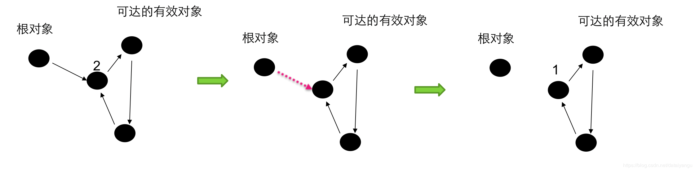
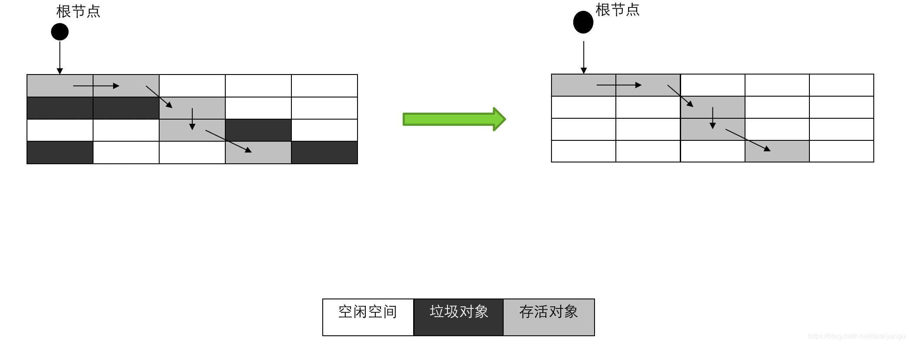
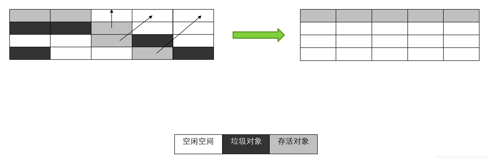
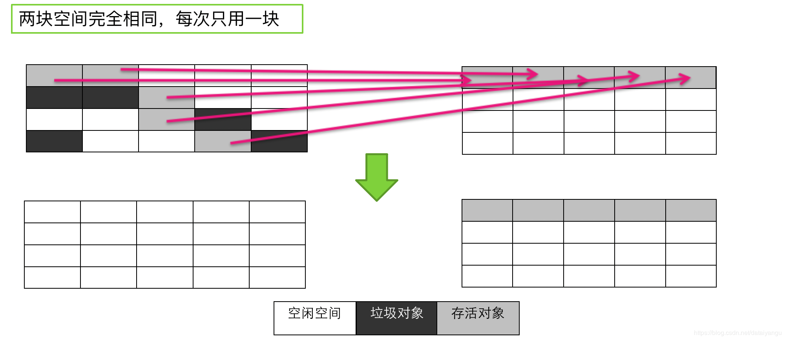
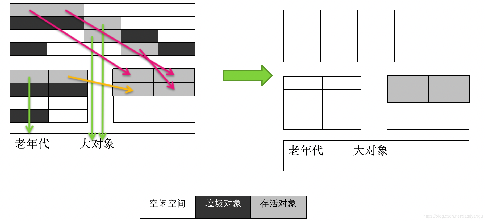

title: JVM内核-原理、诊断与优化学习笔记（四）：GC算法与种类
author: Leesin.Dong
top: 
tags:
  - JVM
categories:
  - 学习笔记
  - JVM内核-原理、诊断与优化学习笔记
date: 2019-2-24 22:21:02

---

# GC的概念
- Garbage Collection 垃圾收集
- 1960年 List 使用了GC
- Java中，GC的对象是堆空间和永久区
# GC算法
## 引用计数法
老牌垃圾回收算法
通过引用计算来回收垃圾
使用者
- COM
- ActionScript3
- Python

引用计数器的实现很简单，对于一个对象A，只要有任何一个对象引用了A，则A的引用计数器就加1，当引用失效时，引用计数器就减1。只要对象A的引用计数器的值为0，则对象A就不可能再被使用。


### 引用计数法的问题
引用和去引用伴随加法和减法，因为引用的计算是实时的，影响性能。
很难处理循环引用


根对象的引用去掉之后，对于根对象来说，剩下的三个的引用都不为0，所以不会回收，所以引用计数的一个很大的问题就是 **<font color="red">垃圾对象的循环引用    ，导致无法被回收</font>**。
## 标记清除
标记-清除算法是现代垃圾回收算法的思想基础。标记-清除算法将垃圾回收分为两个阶段：标记阶段和清除阶段。一种可行的实现是，在标记阶段，首先通过根节点，标记所有从根节点开始的可达对象。因此，未被标记的对象就是未被引用的垃圾对象。然后，在清除阶段，清除所有未被标记的对象。


**<font color="red"> 上图左边是标记阶段，右边是清除阶段。   </font>**
空白区域表示空闲空间，深灰色表示垃圾对象，浅灰色表示存或对象。
从根节点，箭头表示引用，所有的浅灰色的是从根节点的可达对象，这些对象是不应该被回收的，而所有的从根节点不可达的对象，即深灰色的对象为垃圾对象。
## 标记压缩
标记-压缩算法适合用于存活对象较多的场合，如老年代。它在标记-清除算法的基础上做了一些优化。和标记-清除算法一样，标记-压缩算法也首先需要从根节点开始，对所有可达对象做一次标记。但之后，它并不简单的清理未标记的对象，而是将所有的存活对象压缩到内存的一端。之后， **<font color="red"> 清理边界外所有的空间   </font>**。


已经标记好了对象，箭头表示移动存活对象，而不是去简单的清除未被标记的对象，移动完了之后把区域外的对象（上图指的是除了第一行）全部清理。
### 小问题
标记压缩对标记清除而言，有什么优势呢？
## 复制算法
- 与标记-清除算法相比，复制算法是一种相对高效的回收方法
- 不适用于存活对象较多的场合 如老年代
- 将原有的内存空间分为两块，每次只使用其中一块，在垃圾回收时，将正在使用的内存中的存活对象复制到未使用的内存块中，之后，清除正在使用的内存块中的所有对象，交换两个内存的角色，完成垃圾回收



每次把存活的对象被复制到另一块区域中，复制完之后第一块区域中所有的对象都做一次清理，然后交换角色。
### 复制算法的最大问题是：空间浪费 整合标记清理思想
因为复制算法，每次都有一半是没有被用的。


主要的对象，对象的产生放在左边最大的区域中，下面的两小块是复制算法的核心。
当垃圾回收进行的时候，大对象直接进入担保空间（年老代），为什么大对象放到年老代中？因为复制区域很小，可能大对象直接就放不进去，也可能大对象放到负值区域，导致原本应该放到负值区域的小对象被挤到了年老代中。
然后老年对象进入老年代，什么叫做老年对象，对象在几次回收之后都没有被回收掉，每次回收后对象的年龄就会加一，当对象到达一定的年龄对象之后，就会变成老年对象，即长期被引用的对象，所以老年对象被放在老年代。
剩下小的、年轻的对象做复制右边的小的区域中去。
根据复制算法，清空原先使用的空间，就形成了右边的结果。
### -XX:+PrintGCDetails的输出

```js
Heap
//（0x28d80000-0x27e80000)/1024/1024=15m，即新生代有15m的大小。
//可是这里total为什么是13824K？
//实质上是12288K+ 1536K=13824
//即浪费了from to其中的一个空间，即复制算法所需要浪费的空间。
 def new generation   total 13824K, used 11223K [0x27e80000, 0x28d80000, 0x28d80000)
  eden space 12288K,  91% used [0x27e80000, 0x28975f20, 0x28a80000)
  from space 1536K,   0% used [0x28a80000, 0x28a80000, 0x28c00000)
  to   space 1536K,   0% used [0x28c00000, 0x28c00000, 0x28d80000)
 tenured generation   total 5120K, used 0K [0x28d80000, 0x29280000, 0x34680000)
   the space 5120K,   0% used [0x28d80000, 0x28d80000, 0x28d80200, 0x29280000)
 compacting perm gen  total 12288K, used 142K [0x34680000, 0x35280000, 0x38680000)
   the space 12288K,   1% used [0x34680000, 0x346a3a90, 0x346a3c00, 0x35280000)
    ro space 10240K,  44% used [0x38680000, 0x38af73f0, 0x38af7400, 0x39080000)
    rw space 12288K,  52% used [0x39080000, 0x396cdd28, 0x396cde00, 0x39c80000)
```
## gc思想以及总结
### 分代思想
#### 依据对象的存活周期进行分类，短命对象归为新生代，长命对象归为老年代。
#### 根据不同代的特点，选取合适的收集算法
少量对象存活，适合复制算法（年轻代）
大量对象存活，适合标记清理或者标记压缩（年老代）
因为年老代的对象除了是比较大的对象之外，就是在年轻代多次存活的对象，数量比较大，如果是数量比较多的话，复制算法，需要复制的操作比较多，比较消耗性能。
### GC算法总结整理
引用计数（没有被Java采用）
标记-清除、标记-压缩（被年老代采用）
复制算法（被新生代采用）
# 可触及性
所有的算法，需要能够识别一个垃圾对象，因此需要给出一个可触及性的定义
## 概念
### 可触及的
从根节点可以触及到这个对象，从根节点开始的引用链条中有这个对象就是可触及的。
### 可复活的
一旦所有引用被释放，就是可复活状态
因为在finalize()中可能复活该对象
就是在finalize（）执行过程中的时候，还没有变成不可触及的时候就是可复活的，可能会再次被触及的，可复活的对象是不能被回收的。
### 不可触及的
在finalize()执行完之后，可能会进入不可触及状态
不可触及的对象不可能复活
可以回收
## 举个栗子

```js
public class CanReliveObj {
	public static CanReliveObj obj;
	@Override
	protected void finalize() throws Throwable {
	    super.finalize();
	    System.out.println("CanReliveObj finalize called");
	    obj=this;
	}
	@Override
	public String toString(){
	    return "I am CanReliveObj";
	}
```

```js
public static void main(String[] args) throws
     InterruptedException{
	obj=new CanReliveObj();
	obj=null;   //可复活
	System.gc();
	Thread.sleep(1000);
	if(obj==null){
	    System.out.println("obj 是 null");
	}else{
	    System.out.println("obj 可用");
	}
	System.out.println("第二次gc");
	obj=null;    //不可复活
	System.gc();
	Thread.sleep(1000);
	if(obj==null){
		System.out.println("obj 是 null");
	}else{
		System.out.println("obj 可用");
	}
}
```
结果：

```js
CanReliveObj finalize called
obj 可用
第二次gc
obj 是 null
```
解释：
注意第一段代码中的obj=this;
第二段代码中第一次obj=null的时候，是可复活的状态，System.gc();调用了第一段代码的finalize方法，执行obj=this，所以obj可用，但是注意 **<font color="red">    finalize方法只能被执行一次</font>**，所以第二次obj=null，System.gc();的时候不能调用第一段代码中的finalize方法，所以第二次gc的时候输出obj 是 null。
### 注意点
通过上面的代码，如果第一次执行了finalize放啊，第二次没有执行obj=null，那是不是以为这obj这个对象，永远无法回收？
- 经验：避免使用finalize()，操作不慎可能导致错误。
- 优先级低，何时被调用， 不确定
何时发生GC不确定，所以不建议在finalize里面写代码，被调用的不确定性太大。
- 可以使用try-catch-finally来替代它

## 根
根，上面许多地方所说的根，究竟是什么？
- 栈中引用的对象
- 方法区中静态成员或者常量引用的对象（全局对象）
- JNI方法栈中引用对象
# Stop-The-World
- Java中一种全局暂停的现象
- 全局停顿，所有Java代码停止，native代码可以执行，但不能和JVM交互，也就是不能做所有应用层面的事情，只能做gc。
- 多半由于GC引起
Dump线程
死锁检查
堆Dump
因为Dump线程、死锁检查、堆Dump概率较低，而且多是由于程序员引起，而gc则是由程序自动触发的，所以由gc引起的全局暂停应该引起重视。
- GC时为什么会有全局停顿？
类比在聚会时打扫房间，聚会时很乱，又有新的垃圾产生，房间永远打扫不干净，只有让大家停止活动了，才能将房间打扫干净。
所以gc会出现停顿，新生代停顿的短一点可能是0.000x秒，可是老年代停顿的可能就是几百秒，几十分钟。
- 危害
长时间服务停止，没有响应
遇到HA系统，可能引起主备切换，严重危害生产环境。
线上系统，主机gc时间较长的时候，备机启动，可是稍后gc完成了主机再次重新启动，主机和备机都启动的状态是十分危险的。

## 举个栗子
每秒打印10条
```js
public static class PrintThread extends Thread{
	public static final long starttime=System.currentTimeMillis();
	@Override
	public void run(){
		try{
			while(true){
				long t=System.currentTimeMillis()-starttime;
				System.out.println("time:"+t);
				Thread.sleep(100);
			}
		}catch(Exception e){
			
		}
	}
}
```

```js
public static class MyThread extends Thread{
	HashMap<Long,byte[]> map=new HashMap<Long,byte[]>();
	@Override
	public void run(){
		try{
		//大于450M时，清理内存
			while(true){
				if(map.size()*512/1024/1024>=450){
					System.out.println(“=====准备清理=====:"+map.size());
					map.clear();
				}
				//工作线程，消耗内存
				for(int i=0;i<1024;i++){
					map.put(System.nanoTime(), new byte[512]);
				}
				Thread.sleep(1);
			}
		}catch(Exception e){
			e.printStackTrace();
		}
	}
}
```
运行
```js
-Xmx512M -Xms512M -XX:+UseSerialGC -Xloggc:gc.log -XX:+PrintGCDetails
-Xmn1m -XX:PretenureSizeThreshold=50 -XX:MaxTenuringThreshold=1
```
结果：
预期，应该是每秒中有10条输出

```js
time:2018
time:2121
time:2221
time:2325
time:2425
time:2527
time:2631
time:2731
time:2834
time:2935
time:3035
time:3153
time:3504
time:4218
======before clean map=======:921765
time:4349
time:4450
time:4551
```
注意

```js
time:3153
time:3504
time:4218
```
这里并不是中间间隔一秒

```js
3.292: [GC3.292: [DefNew: 959K->63K(960K), 0.0024260 secs] 523578K->523298K(524224K), 0.0024879 secs] [Times: user=0.02 sys=0.00, real=0.00 secs] 
3.296: [GC3.296: [DefNew: 959K->959K(960K), 0.0000123 secs]3.296: [Tenured: 523235K->523263K(523264K), 0.2820915 secs] 524195K->523870K(524224K), [Perm : 147K->147K(12288K)], 0.2821730 secs] [Times: user=0.26 sys=0.00, real=0.28 secs] 
3.579: [Full GC3.579: [Tenured: 523263K->523263K(523264K), 0.2846036 secs] 524159K->524042K(524224K), [Perm : 147K->147K(12288K)], 0.2846745 secs] [Times: user=0.28 sys=0.00, real=0.28 secs] 
3.863: [Full GC3.863: [Tenured: 523263K->515818K(523264K), 0.4282780 secs] 524042K->515818K(524224K), [Perm : 147K->147K(12288K)], 0.4283353 secs] [Times: user=0.42 sys=0.00, real=0.43 secs] 
4.293: [GC4.293: [DefNew: 896K->64K(960K), 0.0017584 secs] 516716K->516554K(524224K), 0.0018346 secs] [Times: user=0.00 sys=0.00, real=0.00 secs] 
……省略若干…..
4.345: [GC4.345: [DefNew: 960K->960K(960K), 0.0000156 secs]4.345: [Tenured: 522929K->12436K(523264K), 0.0781624 secs] 523889K->12436K(524224K), [Perm : 147K->147K(12288K)], 0.0782611 secs] [Times: user=0.08 sys=0.00, real=0.08 secs] 
```
注意：

```js
3.296: Times: user=0.26 sys=0.00, real=0.28 secs
3.579：Times: user=0.28 sys=0.00, real=0.28 secs
3.863：Times: user=0.42 sys=0.00, real=0.43 secs
```
综上：因为系统的gc停顿导致了本应该每秒输出的时间有了误差。
因为一个是系统线程（gc），一个是应用级别的线程所以时间的显示可能有些误差。


