title: JVM内核-原理、诊断与优化学习笔记（五）：GC参数
author: Leesin.Dong
top: 
tags:
  - JVM
categories:
  - 学习笔记
  - JVM内核-原理、诊断与优化学习笔记
date: 2019-2-26 10:21:02

---


# 堆的回顾

# 串行收集器
- 最古老，最稳定
- 效率高
- 可能会产生较长的停顿（因为只有一个线程）
-XX:+UseSerialGC
新生代、老年代使用串行回收
新生代复制算法
老年代标记-压缩
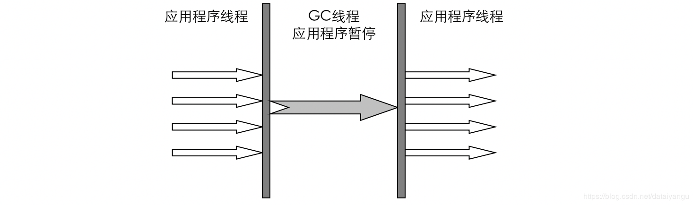

GC关键字：新生代gc日志
```js
0.844: [GC 0.844: [DefNew: 17472K->2176K(19648K), 0.0188339 secs] 17472K->2375K(63360K),
 0.0189186 secs] [Times: user=0.01 sys=0.00, real=0.02 secs]
```
Full GC关键字：老年代gc日志
```js
8.259: [Full GC 8.259: [Tenured: 43711K->40302K(43712K), 0.2960477 secs] 63350K->40302K(63360K), 
[Perm : 17836K->17836K(32768K)], 0.2961554 secs] [Times: user=0.28 sys=0.02, real=0.30 secs]
```
# 并行收集器
## ParNew（par-并行的缩写，new-新生代，所以只是新生代并行）
- -XX:+UseParNewGC
新生代并行
老年代串行
- Serial收集器新生代的并行版本
- 复制算法
- 多线程，需要多核支持
- -XX:ParallelGCThreads 限制线程数量

和串行收集器的区别是，通过多核支持多线程。

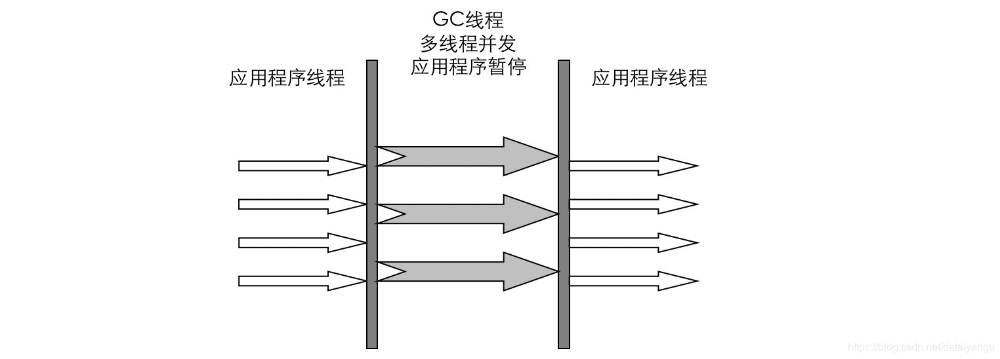
多线程不一定快哦！
如果是多核用ParNew速度快一点，如果是单线程的话，还是建议串行收集器。

```js
0.834: [GC 0.834: [ParNew: 13184K->1600K(14784K), 0.0092203 secs] 13184K->1921K(63936K), 
0.0093401 secs] [Times: user=0.00 sys=0.00, real=0.00 secs]
```
 **<font color="red"> 注意：有ParNew关键字表示ParNew收集器   </font>**
## Parallel收集器
- 类似ParNew
- 新生代复制算法
- 老年代 标记-压缩
- 更加关注吞吐量（和ParNew时候的区别）
- -XX:+UseParallelGC 
使用Parallel收集器+ 老年代串行+新生代并行
- -XX:+UseParallelOldGC
使用Parallel收集器+ 并行老年代+新生代并行
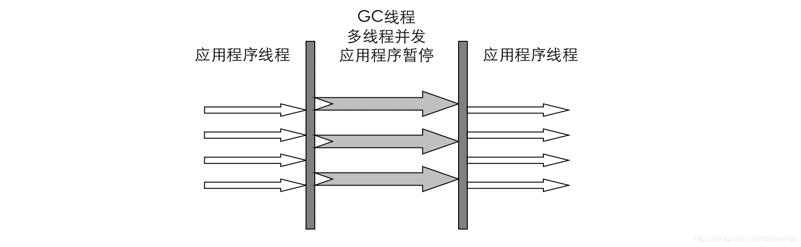


```js
1.500: [Full GC [PSYoungGen: 2682K->0K(19136K)] [ParOldGen: 28035K->30437K(43712K)] 30717K->30437K(62848K) 
[PSPermGen: 10943K->10928K(32768K)], 
0.2902791 secs] [Times: user=1.44 sys=0.03, real=0.30 secs]
```
 **<font color="red">  注意：PSYoungGen 、ParOldGen关键字 </font>**
 ## 参数设置
###  -XX:MaxGCPauseMills
最大停顿时间，单位毫秒
GC尽力保证回收时间不超过设定值
### -XX:GCTimeRatio
0-100的取值范围
垃圾收集时间占总时间的比
默认99，即最大允许1%时间做GC

这两个参数是矛盾的。因为停顿时间和吞吐量不可能同时调优。

对于这句话的理解：
在gc的时候，垃圾回收的工作总量是一定的，所以就是花一定的时间做一定的事情，如果gc的频率提高，每次gc花的时间就会变少，可是系统的性能会受到损伤，就会导致停顿的时间比较短，可是总体的性能并不是很好。但是，为了追求高性能，gc少做几次，也就是XX:GCTimeRatio比值会比较大，gc时间较少，所以每次的gc停顿的时间就会比较长。
吞吐量：一般认为系统的性能是和吞吐量息息相关的，单位时间内cpu是分配到了应用程序还是gc，如果cpu是分配到应用程序越多，吞吐量越高。
吞吐量高->gc占用cpu时间短->gc停顿的时间长。
这里既希望gc的停顿时间短一点，又希望吞吐量大一点，所以是矛盾的，所以不能同时调优，所以有侧重的调优。
# CMS收集器
## CMS收集器
Concurrent Mark Sweep 并发标记清除（ **<font color="red">与用户线程一起执行    </font>**）
试图和应用程序线程一起执行。
标记-清除算法
与标记-压缩相比（因为是并行的，所以不能使标记-压缩的方式）
并发阶段会降低吞吐量（停顿减少了，吞吐量就会降低）
老年代收集器（新生代使用ParNew，这里CMS是一个单纯的老年代的收集器）
-XX:+UseConcMarkSweepGC
## CMS运行过程比较复杂，着重实现了标记的过程，可分为
- 初始标记
根可以直接关联到的对象
速度快
会产生全局停顿
- 并发标记（和用户线程一起）
主要标记过程，标记全部对象
- 重新标记
由于并发标记时，用户线程依然运行，因此在正式清理前，再做修正
会产生全局停顿
- 并发清除（和用户线程一起）
基于标记结果，直接清理对象

可以看到初始标记、重新标记都会产生全局的停顿，所以CMS还是没有办法去掉所有的全局停顿，但是已经大大的减小了全局停顿。
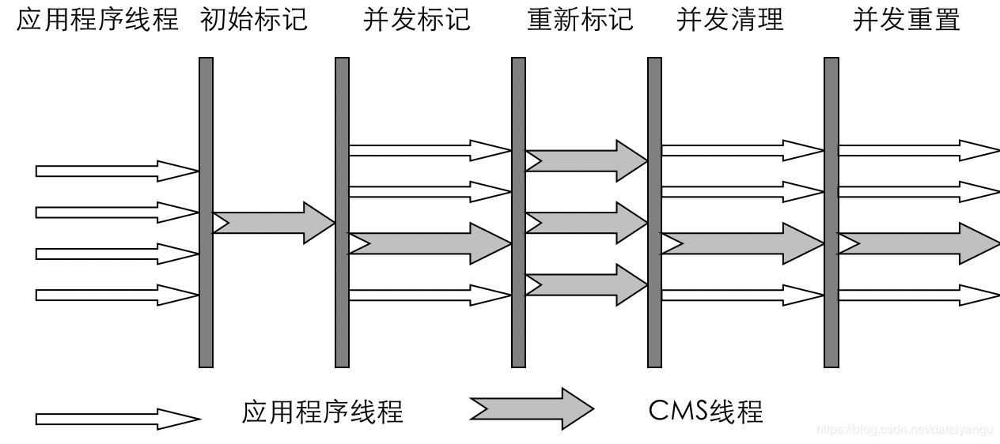


```js
1.662: [GC [1 CMS-initial-mark: 28122K(49152K)] 29959K(63936K), 0.0046877 secs] [Times: user=0.00 sys=0.00, real=0.00 secs] 
1.666: [CMS-concurrent-mark-start]
1.699: [CMS-concurrent-mark: 0.033/0.033 secs] [Times: user=0.25 sys=0.00, real=0.03 secs] 
1.699: [CMS-concurrent-preclean-start]
1.700: [CMS-concurrent-preclean: 0.000/0.000 secs] [Times: user=0.00 sys=0.00, real=0.00 secs] 
1.700: [GC[YG occupancy: 1837 K (14784 K)]1.700: [Rescan (parallel) , 0.0009330 secs]1.701: [weak refs processing, 0.0000180 secs] [1 CMS-remark: 28122K(49152K)] 29959K(63936K), 0.0010248 secs] [Times: user=0.00 sys=0.00, real=0.00 secs] 
1.702: [CMS-concurrent-sweep-start]
1.739: [CMS-concurrent-sweep: 0.035/0.037 secs] [Times: user=0.11 sys=0.02, real=0.05 secs] 
1.739: [CMS-concurrent-reset-start]
1.741: [CMS-concurrent-reset: 0.001/0.001 secs] [Times: user=0.00 sys=0.00, real=0.00 secs]
```
关键字：

```js
CMS-initial-mark
CMS-concurrent-mark
CMS-remark
CMS-concurrent-sweep
CMS-concurrent-reset
```
## 特点
- 尽可能降低停顿
- 会影响系统整体吞吐量和性能
比如，在用户线程运行过程中，分一半CPU去做GC，系统性能在GC阶段，反应速度就下降一半
- 清理不彻底
因为在清理阶段，用户线程还在运行，会产生新的垃圾，无法清理
- 因为和用户线程一起运行，不能在空间快满时再清理
如果是串行清理、并行清理，gc的时候会停顿，gc完成之后有足够的空间来申请，但是CMS是和应用程序同时进行的，当空间快满时没有足够的空间供申请。
-XX:CMSInitiatingOccupancyFraction设置触发GC的阈值
如果不幸内存预留空间不够，就会引起concurrent mode failure

```js
33.348: [Full GC 33.348: [CMS33.357: [CMS-concurrent-sweep: 0.035/0.036 secs] [Times: user=0.11 sys=0.03, real=0.03 secs] 
 (concurrent mode failure): 47066K->39901K(49152K),
  0.3896802 secs] 60771K->39901K(63936K), [CMS Perm : 22529K->22529K(32768K)],
  0.3897989 secs] [Times: user=0.39 sys=0.00, real=0.39 secs]
```
上面出现concurrent mode failure错误，表示在CMS的时候，内存申请失败。
使用串行收集器作为后备，及时将CMS收集转化为串行收集，但是因为出现这个错误说明内存已经到了消耗殆尽的状态，所以切换为串行收集的时候可能会出现长时间的停顿。
## 有关碎片
标记-清除和标记-压缩
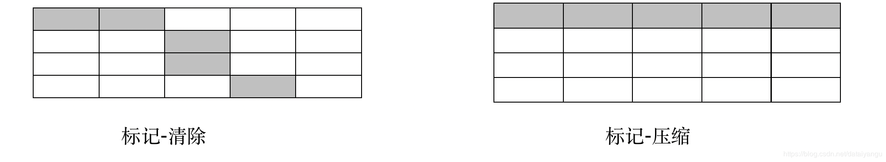

上图可以看到，标记清除之后会出现碎片，如果要申请五个连续单位的空间，是申请不到的，而标记压缩清理之后是能够申请到，所以串行收集和并行收集都是标记压缩的，而标记清理算法之后一般对剩余的空间一般还要进行一次压缩。
可是为什么CMS是使用的标记清除？因为希望和用户线程同时进行，标记压缩在清理的时候需要移动可用的对象的空间，应用层的线程可能找不到对象在哪里，为了能够和应用程序并发执行， 就需要可用的对象位置是没有改变的。

所以出现如下的配置：
### -XX:+ UseCMSCompactAtFullCollection 
Full GC后，进行一次整理
整理过程是独占的，会引起停顿时间变长
### -XX:+CMSFullGCsBeforeCompaction 
设置进行几次Full GC后，进行一次碎片整理，当碎片很多的时候，还是会停顿很长的时间，所以不能从根本上解决问题。
### -XX:ParallelCMSThreads
设定CMS的线程数量，一般约等于CPU的数量。
# GC参数整理

```js
-XX:+UseSerialGC：在新生代和老年代使用串行收集器
-XX:SurvivorRatio：设置eden区大小和survivior区大小的比例
-XX:NewRatio:新生代和老年代的比
-XX:+UseParNewGC：在新生代使用并行收集器
-XX:+UseParallelGC ：新生代使用并行回收收集器
-XX:+UseParallelOldGC：老年代使用并行回收收集器
-XX:ParallelGCThreads：设置用于垃圾回收的线程数
-XX:+UseConcMarkSweepGC：新生代使用并行收集器，老年代使用CMS+串行收集器
-XX:ParallelCMSThreads：设定CMS的线程数量
-XX:CMSInitiatingOccupancyFraction：设置CMS收集器在老年代空间被使用多少后触发
-XX:+UseCMSCompactAtFullCollection：设置CMS收集器在完成垃圾收集后是否要进行一次内存碎片的整理
-XX:CMSFullGCsBeforeCompaction：设定进行多少次CMS垃圾回收后，进行一次内存压缩
-XX:+CMSClassUnloadingEnabled：允许对类元数据进行回收
-XX:CMSInitiatingPermOccupancyFraction：当永久区占用率达到这一百分比时，启动CMS回收
-XX:UseCMSInitiatingOccupancyOnly：表示只在到达阀值的时候，才进行CMS回收
```
# Tomcat实例演示
## 环境
Tomcat 7
JSP 网站
测试网站吞吐量和延时
## 工具
JMeter
## 目的
让Tomcat有一个不错的吞吐量
## 系统结构
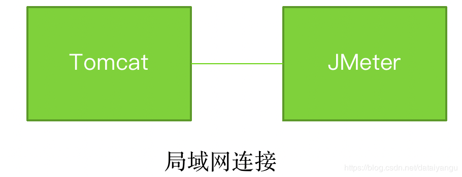

通过局域网连接，将JMeter和Tomcat放在两个电脑上，防止Jmeter对Tomcat的运行产生影响
## Jmeter
性能测试工具
建立10个线程，每个线程请求Tomcat 1000次 共10000次请求
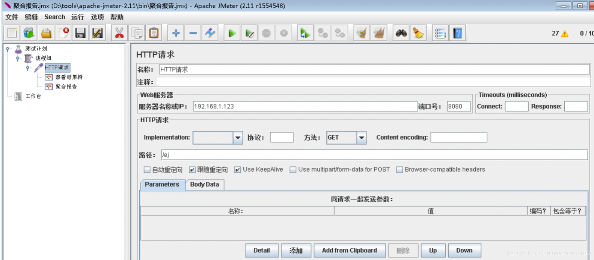

设置ip、端口、请求地址。
## JDK6：使用32M堆处理请求
参数：

```js
set CATALINA_OPTS=-server -Xloggc:gc.log -XX:+PrintGCDetails -Xmx32M -Xms32M 
-XX:+HeapDumpOnOutOfMemoryError -XX:+UseSerialGC -XX:PermSize=32M 
```

Average：在一万次请求中平均的返回速度是6毫秒，
Median：一半的请求都能在4毫秒内返回
90%line：90%请求在7毫秒返回，
min：最小延时2毫秒
max：最大演示135毫秒
Throughput：540每秒（）吞吐量
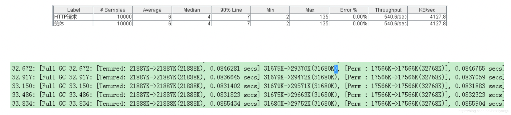

上述截图显示的是，系统运行到后期大量的请求，占据了一些内存，从而会导致系统产生大量的full gc，在32-33秒之间就产生了四次full gc。
## JDK6：使用最大堆512M堆处理请求，未设置Xms
为了有更好的性能，最简单的方法就是直接增大堆的数量。
参数：
set CATALINA_OPTS=-Xmx512m -XX:MaxPermSize=32M  -Xloggc:gc.log -XX:+PrintGCDetails

结果：FULL GC很少，基本上是Minor GC
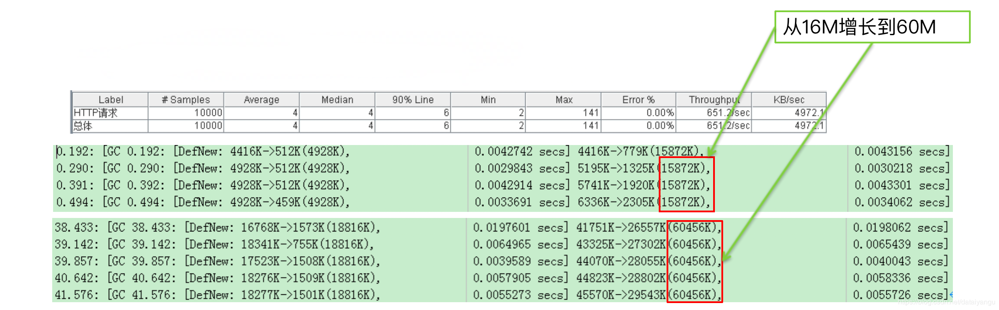

吞吐量变成了651，因为没有设置最小初始化堆的大小，所以最小初始化堆就变成了可以扩展的空间，在系统运行时，系统只有16m的内存，但是系统运行到后面，内存在不停的往上涨，到达了60m，整个过程中没有full gc的产生，因为没有full gc的产生，所以吞吐量有一个很好的效果。
## JDK6：使用最大堆512M堆处理请求，设置Xms为64m
上面看到最后会扩展到60m，这里直接将Xms设置为64m。
参数：
set CATALINA_OPTS=-Xmx512m -Xms64m -XX:MaxPermSize=32M  -Xloggc:gc.log -XX:+PrintGCDetails

结果 GC数量减少 大部分是Minor GC


因为堆越大gc越少，如果堆很小的话，系统希望将工作维持在一个很小的堆上做，必然会不断的进行gc。
## JDK6：使用最大堆512M堆处理请求，改为并行收集器
参数：
set CATALINA_OPTS=-Xmx512m -Xms64m -XX:MaxPermSize=32M  -Xloggc:gc.log -XX:+PrintGCDetails -XX:+UseParallelGC -XX:+UseParallelOldGC -XX:ParallelGCThreads=4

将新生代和年老代换成并行回收的方式，因为堆很大，所以GC压力原本就不大。
结果：GC压力原本不大，修改GC方式影响很小
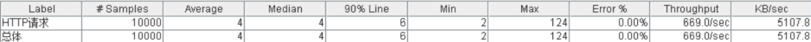

## JDK 6，减小堆，串行收集器
set CATALINA_OPTS=-Xmx40m -Xms40m -XX:MaxPermSize=32M  -Xloggc:gc.log -XX:+PrintGCDetails

减小堆大小，增加GC压力，使用Serial回收器，Serial回收器是默认的回收器。
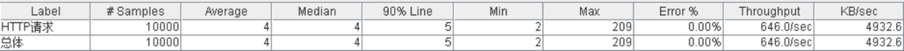

## JDK 6，减小堆，并行收集器
set CATALINA_OPTS=-Xmx40m -Xms40m -XX:MaxPermSize=32M  -Xloggc:gc.log -XX:+PrintGCDetails -XX:+UseParallelOldGC -XX:ParallelGCThreads=4

减小堆大小，增加GC压力，使用并行回收器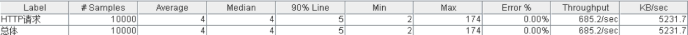


## JDK 6，减小堆，ParNew收集器
set CATALINA_OPTS=-Xmx40m -Xms40m -XX:MaxPermSize=32M  -Xloggc:gc.log -XX:+PrintGCDetails -XX:+UseParNewGC

减小堆大小，增加GC压力，使用ParNew回收器
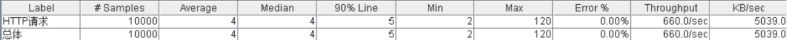

ParNew只是影响新生代，对老年代影响不大，而这里的压力主要是老年代，所以影响不大。
## 启动Tomcat 7
使用JDK6
不加任何参数启动测试
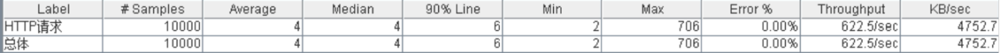

## 启动Tomcat 7
使用JDK7
不加任何参数启动测试
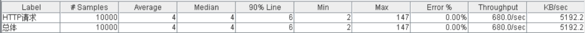

可以看到JDK7性能更加好一点。
 **<font color="red"> 升级JDK可能会带来额外的性能提升！
不要忽视JDK的版本哦   </font>**
# 总结
细节决定成败
- 性能的根本在应用
- GC参数属于微调
- 设置不合理，会影响性能，产生大的延时

