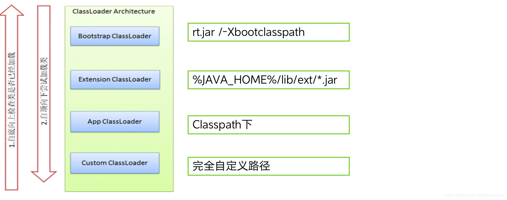
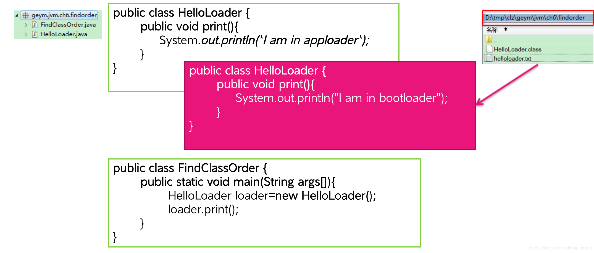
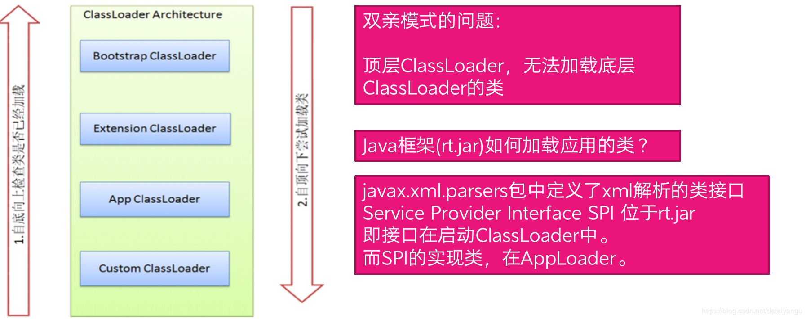

title: JVM内核-原理、诊断与优化学习笔记（六）：类装载器
author: Leesin.Dong
top: 
tags:
  - JVM
categories:
  - 学习笔记
  - JVM内核-原理、诊断与优化学习笔记
date: 2019-3-1 10:21:02

---


# class装载验证流程
## class装载验证流程 
加载
链接（验证、准备、解析）
初始化
## class装载验证流程 -加载
装载类的第一个阶段
取得类的二进制流
转为方法区数据结构
在Java堆中生成对应的java.lang.Class对象
## class装载验证流程 -链接 验证
### 链接 -> 验证
目的：保证Class流的格式是正确的
#### 文件格式的验证
是否以0xCAFEBABE开头
版本号是否合理
#### 元数据验证（class文件简单语义的验证）
是否有父类（比如某个类继承了某个类，可是这个类根本就是不存在的。）
继承了final类？（继承了final的方法或者修改了final属性）
非抽象类实现了所有的抽象方法（非抽象类实现接口中所有的非抽象方法）
#### 字节码验证 (很复杂)
运行检查
栈数据类型和操作码数据参数吻合（分配了两个字的空间，可是运行的时候可能不只是两个字、分配了两个局部变量，可是运行的时候发现很多的局部变量）
跳转指令指定到合理的位置（跳转至零跳转到字节码的一个偏移量上面，比如本来就五十个字节，结果跳转到第五十一个字节上去了。）
#### 符号引用验证
常量池中描述类是否存在（比如一个类继承了某个类，可是这个接口或者类实际上是不存在。）
访问的方法或字段是否存在且有足够的权限（访问的方法或者字段的权限是否足够（public private等））
## class装载验证流程 -链接 准备

#### 分配内存，并为类设置初始值 （方法区中）
public static int v=1;
在准备阶段中，v会被设置为0
在初始化的<clinit>中才会被设置为1
对于static final类型，在准备阶段就会被赋上正确的值
public static final  int v=1;
## class装载验证流程 -链接 解析

#### 符号引用替换为直接引用
符号引用就是字符串，默认的超类就是java.lang.Object，符号引用就是在常亮池里面有个字符串，字符串的内容就是java.lang.Object，符号引用并不能被用，只是一种表示的方式，直接就是指针或者地址偏移量，因为最后一定是指向一个内存地址，替换为直接引用之后，class才能够用自己需要引用的内容。

符号引用：字符串引用对象不一定被加载
直接引用：指针或者地址偏移量引用对象一定在内存
## class装载验证流程 – 初始化
执行类构造器<clinit>
static变量 赋值语句
static{}语句
子类的<clinit>调用前保证父类的<clinit>被调用
<clinit>是线程安全的（一个线程进去之后其他的等待）
## 小问题
Java.lang.NoSuchFieldError错误可能在什么阶段抛出？
# 什么是类装载器ClassLoader
ClassLoader是一个抽象类
ClassLoader的实例将读入Java字节码将类装载到JVM中
ClassLoader可以定制，满足不同的字节码流获取方式（网络中、文件中）
ClassLoader负责类装载过程中的加载阶段（连接和初始化阶段是和ClassLoader是没有关系的）
## ClassLoader的重要方法

```js
public Class<?> loadClass(String name) throws ClassNotFoundException
```

根据名字加载一个class，并返回这个class类的信息。

```js
protected final Class<?> defineClass(byte[] b, int off, int len)
```

定义一个类，参数：byte数组、偏移量、长度，不公开调用，byte数组中是二进制的字节码，二进制的流信息，就是class文件里面的内容，把二进制文件的信息转化成class文件的内容。

```js
protected Class<?> findClass(String name) throws ClassNotFoundException
```

loadClass回调该方法，即loadClass里面会调用findClass方法，去做类的查找。自定义ClassLoader的推荐做法

```js
protected final Class<?> findLoadedClass(String name) 
```

寻找已经加载的类，只有查找不到才会做加载，如果已经加载了不会做二次的加载。

# JDK中ClassLoader默认设计模式
BootStrap ClassLoader （启动ClassLoader）
Extension ClassLoader （扩展ClassLoader）
App ClassLoader （应用ClassLoader/系统ClassLoader）
Custom ClassLoader(自定义ClassLoader)

每个ClassLoader都有一个Parent作为父亲
## JDK中ClassLoader默认设计模式 – 协同工作


 **<font color="red">  注意：向上查找，不是查找这个类存在不存在，而是查找类被加载了没有！！！  </font>**
 **<font color="red">  注意：向上查找，不是查找这个类存在不存在，而是查找类被加载了没有！！！  </font>**
 **<font color="red">  注意：向上查找，不是查找这个类存在不存在，而是查找类被加载了没有！！！  </font>**
当找类的时候在当前的classloder找，即AppClassLoader，如果没有找到会将查找的请求给父类，ExtensionClassLoader，如果有则ExtensionClassLoader做加载，如果还没有，将查找的请求给BootsTrapClassLoader，有则加载，如果没有则说明这个类的整个ClassLoader的整个系列中都没有这个类，它就会尝试去加载。
加载的方法是从上往下的，并不是APPClassLoader找不到就让APPClassLoader做加载，先由BootsTrapClassLoader做加载，如果BootsTrapClassLoader加载成功了，下面的ClassLoader就不做事情，如果BootsTrapClassLoader没有加载成功，就让ExtensionClassLoader，做加载，如果ExtensionClassLoader没有加载成功，再让APPClassLoader加载。由此可见，如果一个class由BootsTrapClassLoader加载之后，再去询问，在ExtensionClassLoader中是没有的，因为不是第一个尝试加载的ClassLoader
 
- BootsTrapClassLoader 中是$JAVA_HOME/jre/lib/rt.jar中的内容，通常是java中的系统核心类，同样可以再启动jar的时候通过-Xbootsclasspath，使得后面的class文件通过BootsTrapClassLoader加载
- ExtensionClassLoader加载$JAVAHOME/lib/ext/*.jar中的class内容
- APPClassLoader加载来自在命令java中的classpath或者java.class.path系统属性或者CLASSPATH操作系统属性所指定的JAR类包和类路径，也就是我们经常用到的classpath路径
 **<font color="red">   classpath的默认路径是当前路径 </font>**
## JDK中ClassLoader默认设计模式 – 协同工作

```js
protected synchronized Class<?> loadClass(String var1, boolean var2) throws ClassNotFoundException {
//查看是否加载了类var1，加载过的话返回class，确保类只加载一次。
        Class var3 = this.findLoadedClass(var1);
        //如果找不到
        if (var3 == null) {
            try {
            //请求父类做加载
                if (this.parent != null) {
                    var3 = this.parent.loadClass(var1, false);
                } else {
                    var3 = this.findBootstrapClassOrNull(var1);
                }
            } catch (ClassNotFoundException var5) {
                ;
            }

            if (var3 == null) {
                var3 = this.findClass(var1);
            }
}
```
### 举个栗子


描述:起初是左边的HelloLoader在如图的包下面，之后再在本机的clz目录下新建一个HelloLoader(红色部分)

- 直接运行以上代码：	
输出：I am in apploader
- 加上参数 -Xbootclasspath/a:D:/tmp/clz
输出：I am in bootloader
此时AppLoader中不会加载HelloLoader
 I am in apploader 在classpath中却没有加载
说明类加载是从上往下的

解析：
**<font color="red">  注意：向上查找，不是查找这个类存在不存在，而是查找类被加载了没有！！！  </font>**
**<font color="red">  注意：向上查找，不是查找这个类存在不存在，而是查找类被加载了没有！！！  </font>**
**<font color="red">  注意：向上查找，不是查找这个类存在不存在，而是查找类被加载了没有！！！  </font>**
 **<font color="red"> classpath的默认路径是当前路径   </font>**，
- 没有加入-Xbootclasspath/a:D:/tmp/clz命令的时候
首次肯定都没有被加载，这个时候，依次通过BootsTrapClassLoader（rt.jar/- XbootClasspath，发现没有），ExtensionClassLoader （lib/ext，还是没有），最后加载APPCLassLoader（因为 **<font color="red"> classpath的默认路径是当前路径   </font>**，所以能够加载到），最后输出了I am in apploader

- 加入-Xbootclasspath/a:D:/tmp/clz参数
查找同上，首次加载查找一圈都没有查找到被加载，然后从上往下加载，这个时候由于设置了BootsTrapClassLoader的参数，所以在BootsTrapClassLoader层面就已经能够被加载到了，下面也不会再被加载，所以输出I am in bootloader

### 强制在apploader中加载

```js
public static void main(String args[]) throws Exception {
	ClassLoader cl=FindClassOrder2.class.getClassLoader();
	//得到geym.jvm.ch6.findorder.HelloLoader的字节码
	byte[] bHelloLoader=loadClassBytes("geym.jvm.ch6.findorder.HelloLoader");
	//为甚么通过反射得到这个函数？因为这个函数是protect的
	Method md_defineClass=ClassLoader.class.getDeclaredMethod("defineClass", byte[].class,int.class,int.class);
	//set为true能够使用
	//将此对象的 accessible 标志设置为指示的布尔值。
	//值为 true 则指示反射的对象在使用时应该取消 Java 语言访问检查。
	//值为 false 则指示反射的对象应该实施 Java 语言访问检查。 
	md_defineClass.setAccessible(true);
	md_defineClass.invoke(cl, bHelloLoader,0,bHelloLoader.length);
	md_defineClass.setAccessible(false);
	
	HelloLoader loader = new HelloLoader();
	System.out.println(loader.getClass().getClassLoader());
	loader.print();
}
```
依然添加参数-Xbootclasspath/a:D:/tmp/clz
输出：I am in apploader

在查找类的时候，先在底层的Loader查找，是从下往上的。因为在APPLoader已经加载了，所以Apploader能找到，就不会去上层加载器加载
### 小问题
能否只用反射，仿照上面的写法，将类注入启动ClassLoader呢？

## JDK中ClassLoader默认设计模式 – 问题


如上图，接口位于rt.jar,实现类位于APPClassLoader，如果想要实现这个类，必须要在BootsTrapClassLoader中知道下面即APPClassLoader中的内容，可是这种双亲委派的机制，自底向上检查是否被夹在，APPClassLoader可以知道BootsTrapClassLoader中的内容，加载是自顶向下，加载了BootsTrapClassLoader之后就不能再加载ExtensionClassLoader和APPClassLoader，也就不能知道APPClassLoader中的内容，所以永远无法知道。
## JDK中ClassLoader默认设计模式 – 解决
- Thread. setContextClassLoader()
上下文加载器
 **<font color="red">   是一个角色 </font>**
 解释：角色是什么意思？小明是班里的一个成员，他的职务是班长，小明是ClassLoader，班长就是角色。
用以解决顶层ClassLoader无法访问底层ClassLoader的类的问题
基本思想是，在顶层ClassLoader中，传入底层ClassLoader的实例

```js
tatic private Class getProviderClass(String className, ClassLoader cl,
        boolean doFallback, boolean useBSClsLoader) throws ClassNotFoundException
{
    try {
        if (cl == null) {
            if (useBSClsLoader) {
                return Class.forName(className, true, FactoryFinder.class.getClassLoader());
            } else {
                cl = ss.getContextClassLoader();
                if (cl == null) {
                    throw new ClassNotFoundException();
                }
                else {
                    return cl.loadClass(className); //使用上下文ClassLoader
                }
            }
        }
        else {
            return cl.loadClass(className);
        }
    }
    catch (ClassNotFoundException e1) {
        if (doFallback) {
            // Use current class loader - should always be bootstrap CL
            return Class.forName(className, true, FactoryFinder.class.getClassLoader());
        }
…..
```
注意上面代码中的

```js
return cl.loadClass(className);
```
中的cl就是ContextClassLoader

代码来自于rt.jar中的
javax.xml.parsers.FactoryFinder
展示如何在启动类加载器加载AppLoader的类

上下文ClassLoader可以突破双亲模式的局限性
## 双亲模式的破坏
 **<font color="red">双亲模式是默认的模式，但不是必须这么做    </font>**
Tomcat的WebappClassLoader 就会先加载自己的Class，找不到再委托parent
OSGi的ClassLoader形成网状结构，根据需要自由加载Class，因为他是热加载，一会加载了一会又不加载了，所以就是网状结构。
### 举个栗子
破坏双亲模式例子-  先从底层ClassLoader加载
OrderClassLoader的部分实现

```js
protected synchronized Class<?> loadClass(String name, boolean resolve) throws ClassNotFoundException {
    // First, check if the class has already been loaded
    //现在自己的层面查找，
    Class re=findClass(name);
    //找不到再去找父类
    if(re==null){
        System.out.println(“无法载入类:”+name+“ 需要请求父加载器");
        return super.loadClass(name,resolve);
    }
    return re;
}
```

```js
protected Class<?> findClass(String className) throws ClassNotFoundException {
//在自己层面上找是否加载了类
Class clazz = this.findLoadedClass(className);
if (null == clazz) {
    try {
        String classFile = getClassFile(className);
        //没有的话就在自己的层面上加载某个文件
        FileInputStream fis = new FileInputStream(classFile);
        FileChannel fileC = fis.getChannel();
        ByteArrayOutputStream baos = new ByteArrayOutputStream();
        WritableByteChannel outC = Channels.newChannel(baos);
        ByteBuffer buffer = ByteBuffer.allocateDirect(1024);
         省略部分代码
        fis.close();
        byte[] bytes = baos.toByteArray();
//定义某个类
        clazz = defineClass(className, bytes, 0, bytes.length);
    } catch (FileNotFoundException e) {
        e.printStackTrace();
    } catch (IOException e) {
        e.printStackTrace();
    }
}
return clazz;
}
```
所以达到了从自己开始加载的目的
```js
OrderClassLoader myLoader=new OrderClassLoader("D:/tmp/clz/");
Class clz=myLoader.loadClass("geym.jvm.ch6.classloader.DemoA");
System.out.println(clz.getClassLoader());

System.out.println("==== Class Loader Tree ====");
ClassLoader cl=myLoader;
while(cl!=null){
    System.out.println(cl);
    cl=cl.getParent();
}
```
结果：

```js
ava.io.FileNotFoundException: D:\tmp\clz\java\lang\Object.class (系统找不到指定的路径。)
	at java.io.FileInputStream.open(Native Method)
	.....
	at geym.jvm.ch6.classloader.ClassLoaderTest.main(ClassLoaderTest.java:7)
无法载入类:java.lang.Object需要请求父加载器
geym.jvm.ch6.classloader.OrderClassLoader@18f5824
==== Class Loader Tree ====
geym.jvm.ch6.classloader.OrderClassLoader@18f5824
sun.misc.Launcher$AppClassLoader@f4f44a
sun.misc.Launcher$ExtClassLoader@1d256fa
```
因为所有的类都继承自Object，前面知道验证的过程需要先检查自己的父类是否加载，先从OrderClassLoader加载，即从文件中加载Object，找不到Object，之后使用appLoader加载Object
DemoA在ClassPath中，但由OrderClassLoader加载，而不是由APPClassLoader加载


如果OrderClassLoader不重载loadClass()，只重载findClass，还是双亲委派机制，那么程序输出为

```js
sun.misc.Launcher$AppClassLoader@b23210
==== Class Loader Tree ====
geym.jvm.ch6.classloader.OrderClassLoader@290fbc
sun.misc.Launcher$AppClassLoader@b23210
sun.misc.Launcher$ExtClassLoader@f4f44a
```
DemoA由AppClassLoader加载，Object也能加载到了

# 热替换
- 含义：
当一个class被替换后，系统无需重启，替换的类立即生效
php就是热替换的。
例子：
geym.jvm.ch6.hot.CVersionA

```js
public class CVersionA {
	public void sayHello() {
		System.out.println("hello world! (version A)");
	}
}
```
- DoopRun 不停调用CVersionA . sayHello()方法，因此有输出：
hello world! (version A)
- 在DoopRun 的运行过程中，替换CVersionA 为：

```js
public class CVersionA {
	public void sayHello() {
		System.out.println("hello world! (version B)");
	}
}
```
- 替换后， DoopRun 的输出变为
hello world! (version B)
思考：应该如何做？


