title: JVM内核-原理、诊断与优化学习笔记（八）：JAVA堆分析
author: Leesin.Dong
top: 
tags:

  - JVM
categories:
  - 学习笔记
  - JVM内核-原理、诊断与优化学习笔记
date: 2019-3-3 10:22:02

---


# 内存溢出(OOM)的原因

## 在JVM中，有哪些内存区间？
堆、永久区、线程栈、直接内存，此外还有code cache等，但是不会出现OOM。
这几块空间的总和是不能超过计算机分配给jvm的内存空间的，一般在32位的计算机中不能超过2g，总体上来说不能超过物理内存，如果任何一个内存空间没有办法得到足够的分配，都有可能会OOM
## 堆溢出
使用堆中的空间，对其中无用的对象，没有进行及时的释放，导致堆溢出。

```js
public static void main(String args[]){
    ArrayList<byte[]> list=new ArrayList<byte[]>();
    for(int i=0;i<1024;i++){
        list.add(new byte[1024*1024]);
    }
}
```
因为arrayList是持有byte数组，也就是说这些byte数组都是有引用的，所以byte数组不会被认为是垃圾对象，无法被系统回收。

```js
占用大量堆空间，直接溢出
```

```js
Exception in thread "main" java.lang.OutOfMemoryError: Java heap space
at geym.jvm.ch8.oom.SimpleHeapOOM.main(SimpleHeapOOM.java:14)
```
 **<font color="red"> 注意： Java heap space   </font>**
解决方法：增大堆空间，及时释放内存
## 永久区
永久区存着类的元信息，所以当类很多的时候，永久区也会空间不足。

```js生成大量的类
public static void main(String[] args) {
    for(int i=0;i<100000;i++){
        CglibBean bean = new CglibBean("geym.jvm.ch3.perm.bean"+i,new HashMap());
    }
}
```
这里new了很多类
```js
Caused by: java.lang.OutOfMemoryError: PermGen space
[Full GC[Tenured: 2523K->2523K(10944K), 0.0125610 secs] 2523K->2523K(15936K), 
[Perm : 4095K->4095K(4096K)], 0.0125868 secs] [Times: user=0.02 sys=0.00, real=0.01 secs] 
Heap
 def new generation   total 4992K, used 89K [0x28280000, 0x287e0000, 0x2d7d0000)
  eden space 4480K,   2% used [0x28280000, 0x282966d0, 0x286e0000)
  from space 512K,   0% used [0x286e0000, 0x286e0000, 0x28760000)
  to   space 512K,   0% used [0x28760000, 0x28760000, 0x287e0000)
 tenured generation   total 10944K, used 2523K [0x2d7d0000, 0x2e280000, 0x38280000)
   the space 10944K,  23% used [0x2d7d0000, 0x2da46cf0, 0x2da46e00, 0x2e280000)
 compacting perm gen  total 4096K, used 4095K [0x38280000, 0x38680000, 0x38680000)
   the space 4096K,  99% used [0x38280000, 0x3867fff0, 0x38680000, 0x38680000)
    ro space 10240K,  44% used [0x38680000, 0x38af73f0, 0x38af7400, 0x39080000)
    rw space 12288K,  52% used [0x39080000, 0x396cdd28, 0x396cde00, 0x39c80000)
```
 **<font color="red"> 注意： PermGen space   </font>**
解决方法：
增大Perm区
允许Class回收（在JVM中可以设置为允许回收Class元数据）
## Java栈溢出
这里的栈溢出指，在创建线程的时候，需要为线程分配栈空间，这个栈空间是向操作系统请求的，如果操作系统无法给出足够的空间，就会抛出OOM

从上图可以看出对空间和线程栈空间是不能超过操作系统可分配的总空间的。

```js
public static class SleepThread implements Runnable{
    public void run(){
        try {
            Thread.sleep(10000000);
        } catch (InterruptedException e) {
            e.printStackTrace();
        }
    }
}

public static void main(String args[]){
    for(int i=0;i<1000;i++){
        new Thread(new SleepThread(),"Thread"+i).start();
        System.out.println("Thread"+i+" created");
    }
}
```

```js
-Xmx1g -Xss1m
```

```js
Exception in thread "main" java.lang.OutOfMemoryError: 
unable to create new native thread
```
 **<font color="red"> 注意： unable to create new native thread   </font>**
解决方法：
减少堆内存
减少线程栈大小

解析：因为这里的问题是线程sleep时间太久，有太多的线程存在于栈中，所以没有足够的空间新建新的线程，从上面得知，操作系统的总空间是堆内存和线程栈空间的大小，所以这里可以减小堆内存，也可以减小单个线程栈的大小，就能够产生更多的线程。
## 直接内存溢出
ByteBuffer.allocateDirect()无法从操作系统获得足够的空间

对空间、线程栈空间、直接内存加起来是不能大于操作系统可分配空间的。

```js
for(int i=0;i<1024;i++){
    ByteBuffer.allocateDirect(1024*1024);
    System.out.println(i);
      System.gc();
}
```
使用ByteBuffer分配了一些直接的内存区域，这些内存是在堆外的，是操作系统直接分配给jvm内存的。

```js
-Xmx1g -XX:+PrintGCDetails
```
分配了一个g的堆空间

可以看到报错的直接原因是DirectByteBuffer分配的memory没有办法分配到，从最后面的堆中的信息可以看到堆的空间是十分富裕的，所以可以断定，就是因为使用直接内存过度导致的。


解决方法：
减少堆内存
有意触发GC

解析：同上面的栈空间解析一样，这三者加起来不能超过系统可分配的总空间，所以减小堆内存，能够解决直接内存堆栈溢出的问题。直接内存分配不会引起GC，只有堆和永久区会导致GC的发生，虽然直接内存是能够被jvm回收的，但是不能够自动触发GC。
## 小问题？
遇到内存溢出后，应该如何思考和处理问题？
# MAT使用基础
Memory Analyzer（MAT）内存分析的工具
基于Eclipse的软件（能够在eclipse官网进行下载）
http://www.eclipse.org/mat/

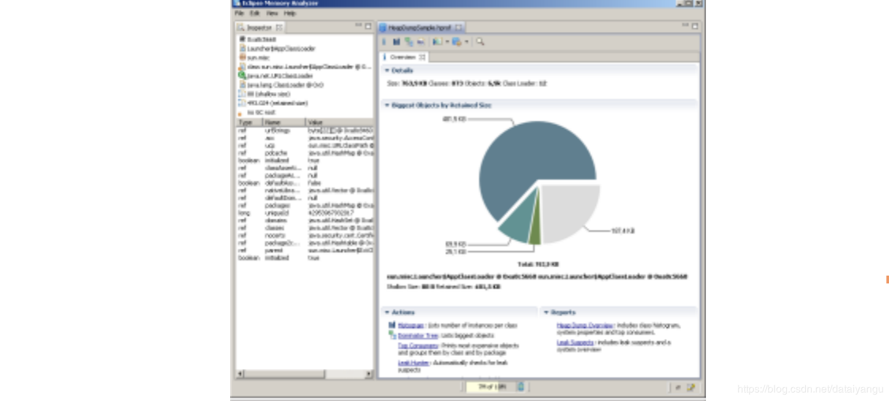
## 柱状图显示
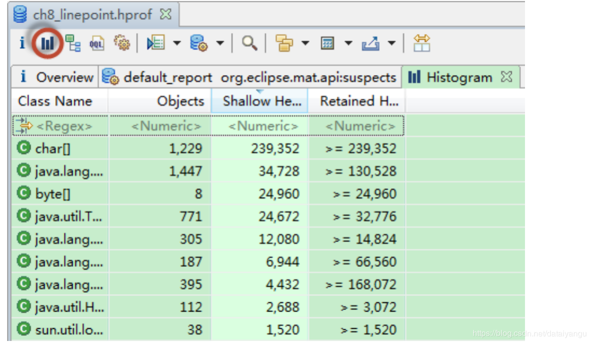
柱状图显示，显示每个类的使用情况，
比如类的数量，所占空间等
## 支配树
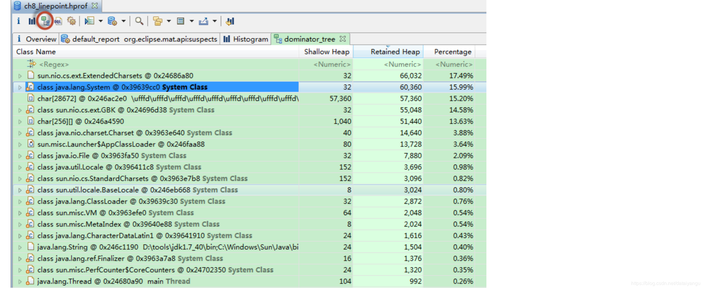
显示支配树

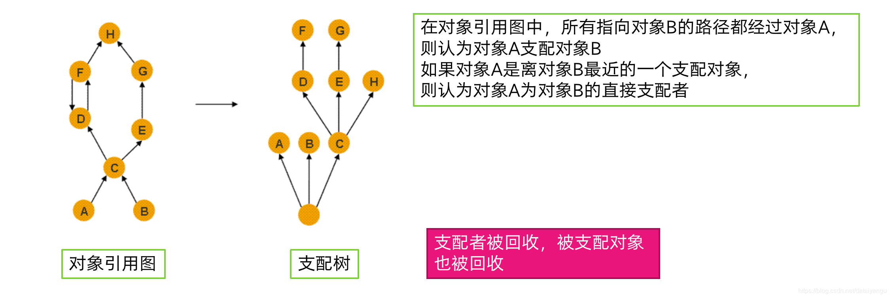
上图可以看到，左边是对象引用图（a引用c，b引用c，等等略），右边是支配树（图中有支配树的解释），我认为更确切的解释是“所有指向对象B的路径都 **<font color="red">  必须并且只能  </font>**经过A，则认为对象A支配对象B”，这里可以看到c可以通过a过来可以通过b过来，所以a、b与c之间没有支配关系，同样，可以退出上面的支配关系，但是注意h不能被f和g支配但是被c支配着，所以看似c和h之间离得很远，其实是直接支配的关系。

支配者被回收，被支配对象也会被回收：c被回收则d、e、f、g、h都会被回收
因为达到我的唯一路径被回收了，所以没有其他路径能过到达被支配对象了。
 **<font color="red">所以当一个对象被回收之后，究竟有多少内存空间能被释放掉，这个是个支配树直接相关的。    </font>**
## 显示线程信息
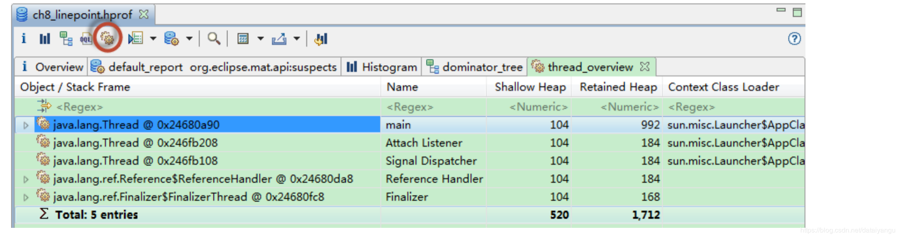
这里不是指线程堆栈的信息，而是每个线程在堆中的对象，比如这里就能看到主线程的一些信息，从而看到主线程的一些引用。
## 显示堆总体信息，比如消耗最大的一些对象等
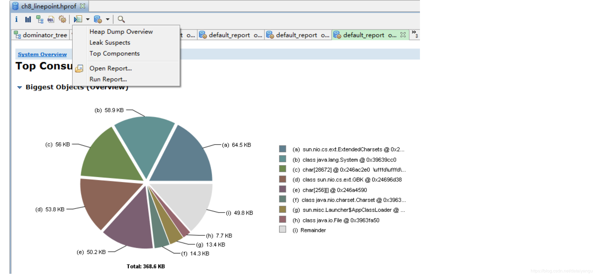
## 入引用和出引用
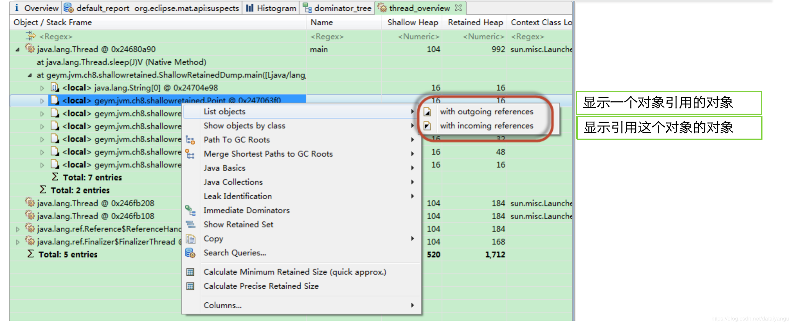
## 浅堆、深堆 
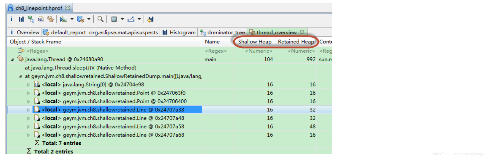
### 浅堆 
一个对象结构所占用的内存大小


3个int类型以及一个引用类型合计占用内存3*4+4=16个字节。再加上对象头的8个字节，因此String对象占用的空间，即浅堆的大小是16+8=24字节
对象大小按照8字节对齐
 **<font color="red">   浅堆大小和对象的内容无关，只和对象的结构有关 </font>**
### 深堆
一个对象被GC回收后，可以真实释放的内存大小（是对象实际占用的空间的大小）
 **<font color="red"> 只能通过对象访问到的（直接或者间接）所有对象的浅堆之和 （支配树）   </font>**
### 举个栗子

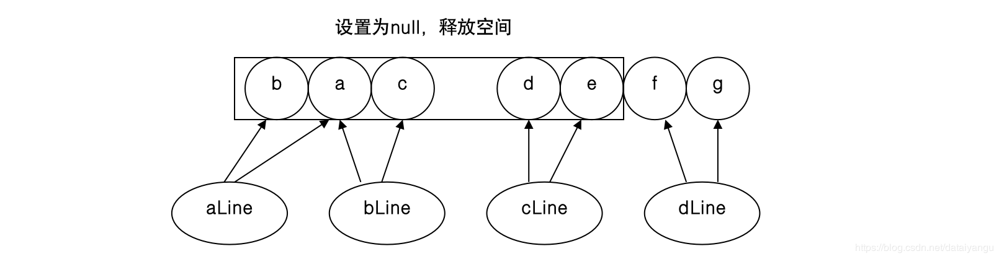
将b、a、c、d、e设置为null，f、g不设置为null

可以看到f和g不仅在下面的dline有引用，而且被main引用因为没有被设置为null，所以能够被main当做局部变量（上图中local）使用。
右边的第一列是浅堆，第二列是深堆，每一个浅堆（point和line，因为line中是两个引用， **<font color="red">  引用是四个字节  </font>**）都是16，f和g是没有引用任何人，所以也是16，
aline的深堆是32，因为aline被释放掉之后point a还被bline引用这，所以aline本身释放能释放16，再加上自己支配树上的b点，一共能释放32
bline能够释放本身（只能释放b点，因为a在aline中也有，所以是没有支配a点的）所以能够释放b点，一共也是32
cline除了自己的16，还有自己支配的d和e，所以一共48
dline只能释放16，因为除了释放自己，在mian的局部变量中还有f和g的引用，所以深堆是16

通过上面的分析：深堆就是 **<font color="red">对象被回收之后，实际能够释放的内存空间</font>**
# 使用Visual VM分析堆
## java自带的多功能分析工具，可以用来分析堆Dump

通过使用Visual VM可以知道哪个类的实例数是最多的，占用的空间大小是最多的，方便定位。
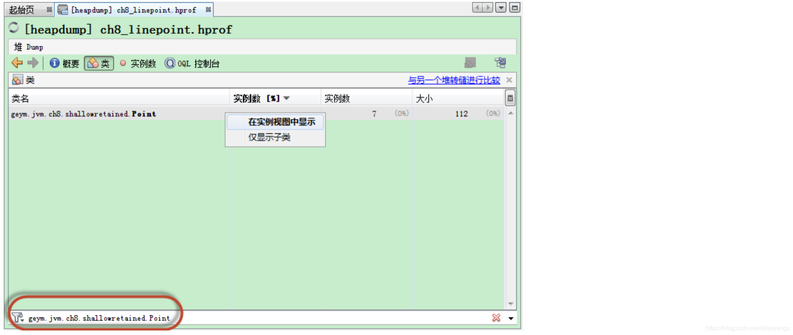
下面的过滤框方便过滤率类

点击point实例，右边显示详细信息，和引用信息

上图为使用OQL语句进行分析，通过类似于SQL语句的方式，进行查询，比如上面的OQL语句的含义就是将所有的point 对象通过{x:p.x,y:p.y}的json形式显示出来。

reference，返回引用了某个变量的对象
返回引用了(0,0)这个点的所有对象，发现有两条引用了（0，0）的点
# Tomcat OOM分析案例
- Tomcat OOM
  Tomcat 在接收大量请求时（可能通过jmeter压力测试）发生OOM，获取堆Dump文件，进行分析。
- 使用MAT打开堆
  -分析目的：
  找出OOM的原因
  推测系统OOM时的状态
  给出解决这个OOM的方法
  
  堆的大小是29m，推断当时，使用可30m左右堆的大小，所以29m的时候就发生了OOM的问题，还看到RetainedSize是16.4m，RetainedSize是释放掉对象后所能得到的空间，这个对象就是StandardManager，位于catalina.session包下，可以推断和session有关系，从图中可以看到最大的就是她16.4m
  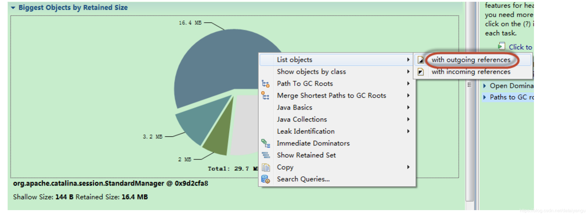
  右击查看出引用（引用了谁）
  
  可以看到sessions深堆远远大于其他，推断是因为session中保存了大量的数据。
  
  通过上图，打开sessions，发现有很多的segements，concurrentHashMap是一个高并发的HashMap，通过“锁分离”将HashMap的数组分成多份，每次加锁，只锁住其中的一个小锁，达到优化性能的作用。
  
  接着打开segement发现里面就是普通的table--》entry（表象）--》key、value，所以推断就是在保存了过多的session没有被释放


验证是否是因为存放了过多的session
visual VM的OQL和MAT的OQL是有一定的区别的，但是也是支持的。
通过上面的OQL将所有的standerdSession对象查找出来，查询的最后发现返回了9941个对象，每个对象的深堆将近1.6k。所以断定OOM的时候系统中存在大量的访问，所以持有大量的session没有被释放掉。

点击任意一个session，左边有详细的信息：
thisAccessedTime，当前访问的时间
maxInactiveInterval，最大的过期时间间隔，大约二十分钟
expiring，是否过期
creationTime，session创建的时间
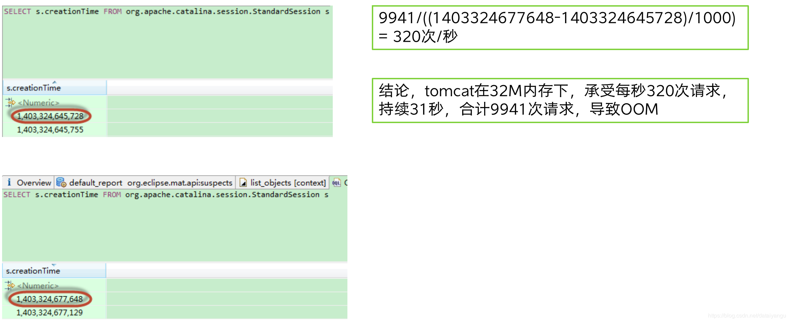
上图中最后一个session创建时间减去第一个session创建时间/1000就是一个再多少秒之内是有请求的，9941/这个数值，就是每秒有创建了多少个，即多少次请求，所以得出了上图的结论。
## 解决方法：
1. OOM由于保存session过多引起，可以考虑增加堆大小
2. 如果应用允许，缩短session的过期时间，使得session可以及时过期，并回收

