title: JVM内核-原理、诊断与优化学习笔记（七）：性能监控工具
author: Leesin.Dong
top: 
tags:
  - JVM
categories:
  - 学习笔记
  - JVM内核-原理、诊断与优化学习笔记
date: 2019-3-3 10:21:02

---

# 系统性能监控
确定系统运行的整体状态，基本定位问题所在
## 系统性能监控- linux
### uptime

```js
➜  ~ uptime
 7:38  up 11 days, 14:06, 14 users, load averages: 2.60 2.06 1.96
```
参数解释：
- 系统时间
- 运行时间
例子中为7分钟
- 连接数
每一个终端算一个连接
- 1,5,15分钟内的系统平均负载
运行队列中的平均进程数，这个数越大负载越大。
### top

```js
top - 07:43:53 up 168 days, 13:16,  2 users,  load average: 0.00, 0.00, 0.00
Tasks: 110 total,   1 running, 109 sleeping,   0 stopped,   0 zombie
Cpu(s):  0.3%us,  0.3%sy,  0.0%ni, 99.3%id,  0.0%wa,  0.0%hi,  0.0%si,  0.0%st
Mem:    520132k total,   425620k used,    94512k free,    91668k buffers
Swap:   135164k total,     9164k used,   126000k free,   136948k cached

  PID USER      PR  NI  VIRT  RES  SHR S %CPU %MEM    TIME+  COMMAND
 4694 root      20   0  440m  77m  14m S  0.3 15.2 144:14.78 java
21796 root      20   0 12292 6332 5516 S  0.3  1.2   0:00.14 sshd
    1 root      20   0  2964  624  504 S  0.0  0.1   0:01.14 init
    2 root      20   0     0    0    0 S  0.0  0.0   0:00.00 kthreadd
    4 root       0 -20     0    0    0 S  0.0  0.0   0:00.00 kworker/0:0H
    6 root      20   0     0    0    0 S  0.0  0.0   0:26.37 ksoftirqd/0
    7 root      20   0     0    0    0 S  0.0  0.0   2:47.42 rcu_sched
    8 root      20   0     0    0    0 S  0.0  0.0   0:00.00 rcu_bh
    9 root      RT   0     0    0    0 S  0.0  0.0   0:00.00 migration/0
   10 root       0 -20     0    0    0 S  0.0  0.0   0:00.00 lru-add-drain
   11 root      RT   0     0    0    0 S  0.0  0.0   0:47.40 watchdog/0
   12 root      20   0     0    0    0 S  0.0  0.0   0:00.00 cpuhp/0
   13 root      20   0     0    0    0 S  0.0  0.0   0:00.00 kdevtmpfs
   14 root       0 -20     0    0    0 S  0.0  0.0   0:00.00 netns
   15 root      20   0     0    0    0 S  0.0  0.0   0:15.88 khungtaskd
   16 root      20   0     0    0    0 S  0.0  0.0   0:00.00 oom_reaper
   17 root       0 -20     0    0    0 S  0.0  0.0   0:00.00 writeback
   18 root      20   0     0    0    0 S  0.0  0.0   0:01.28 kcompactd0
```
第一行的功能同uptime，然后包块CPU的使用情况、内存的使用情况、交换空间的使用情况，下面的表格是每个进程占CPU的情况。
## vmstat（虚拟内存统计）
可以统计系统的CPU，内存，swap，io等情况
```js
//1s采样一次，输出4次就结束了。
[root@host ~]# vmstat 1 4
procs -----------memory---------- ---swap-- -----io---- --system-- -----cpu-----
 r  b   swpd   free   buff  cache   si   so    bi    bo   in   cs us sy id wa st
 0  0   9164  94768  91668 136948    0    0     0     1    1    0  0  0 100  0  0
 0  0   9164  94656  91668 136972    0    0     0    12   61  108  1  0 99  0  0
 0  0   9164  94656  91668 136972    0    0     0     0   45   87  0  0 100  0  0
 0  0   9164  94688  91668 136972    0    0     0     0   46   90  0  0 100  0  0
```
java空间的使用情况：memory:free剩余内存，
io：bi、bo即输入输出，
system：多少个终中断，多少个上下文切换（cs， 每秒的环境（上下文）切换次数），用户占用的cpu是多少，上下文切换的越多，表示线程之间的切换比较频繁， us，用户CPU时间(非内核进程占用时间)（单位为百分比）。 us的值比较高时，说明用户进程消耗的CPU时间多
## pidstat
- 细致观察进程
- 需要安装
sudo apt-get install sysstat
- 监控CPU
- 监控IO
- 监控内存

```js
//-p 指定进程 –u 监控CPU 每秒采样 一共3次
[root@host ~]# pidstat -p  4694 -u 1 3
Linux 4.10.4-1.el6.elrepo.i686 (host.localdomain) 	03/02/2019 	_i686_	(1 CPU)

08:11:25 AM       PID    %usr %system  %guest    %CPU   CPU  Command
08:11:26 AM      4694    0.00    0.00    0.00    0.00     0  java
08:11:27 AM      4694    0.00    0.00    0.00    0.00     0  java
08:11:28 AM      4694    0.00    0.00    0.00    0.00     0  java
Average:         4694    0.00    0.00    0.00    0.00     -  java
```

```js
//-t 显示线程
[root@host ~]# pidstat -p  4694 -u 1 3 -t
Linux 4.10.4-1.el6.elrepo.i686 (host.localdomain) 	03/02/2019 	_i686_	(1 CPU)
//%usr看当前线程占用的cpu   参数”CPU“是指当前线程运行在哪个cpu上，
//一般有两个cpu的话，是轮着用的
08:12:05 AM      TGID       TID    %usr %system  %guest    %CPU   CPU  Command
08:12:06 AM      4694         -    1.00    0.00    0.00    1.00     0  java
08:12:06 AM         -      4694    0.00    0.00    0.00    0.00     0  |__java
08:12:06 AM         -      4695    0.00    0.00    0.00    0.00     0  |__java
08:12:06 AM         -      4696    0.00    0.00    0.00    0.00     0  |__java
08:12:06 AM         -      4697    0.00    0.00    0.00    0.00     0  |__java
08:12:06 AM         -      4698    0.00    0.00    0.00    0.00     0  |__java
08:12:06 AM         -      4699    0.00    0.00    0.00    0.00     0  |__java
08:12:06 AM         -      4700    0.00    0.00    0.00    0.00     0  |__java
08:12:06 AM         -      4701    0.00    0.00    0.00    0.00     0  |__java
08:12:06 AM         -      4702    0.00    0.00    0.00    0.00     0  |__java
08:12:06 AM         -      4703    0.00    0.00    0.00    0.00     0  |__java
08:12:06 AM         -      4704    0.00    0.00    0.00    0.00     0  |__java

08:12:06 AM      TGID       TID    %usr %system  %guest    %CPU   CPU  Command
08:12:07 AM      4694         -    0.00    0.00    0.00    0.00     0  java
08:12:07 AM         -      4694    0.00    0.00    0.00    0.00     0  |__java
...
```

```js
//-d   io情况
[root@host ~]# pidstat -p  4694  1 3 -d -t
Linux 4.10.4-1.el6.elrepo.i686 (host.localdomain) 	03/02/2019 	_i686_	(1 CPU)
//PID：进程id
//kB_rd/s：每秒从磁盘读取的KB
//kB_wr/s：每秒写入磁盘KB
//kB_ccwr/s：任务取消的写入磁盘的KB。当任务截断脏的pagecache的时候会发生。
//COMMAND:task的命令名
08:13:55 AM      TGID       TID   kB_rd/s   kB_wr/s kB_ccwr/s  Command
08:13:56 AM      4694         -      0.00      0.00      0.00  java
08:13:56 AM         -      4694      0.00      0.00      0.00  |__java
08:13:56 AM         -      4695      0.00      0.00      0.00  |__java
08:13:56 AM         -      4696      0.00      0.00      0.00  |__java
08:13:56 AM         -      4697      0.00      0.00      0.00  |__java
08:13:56 AM         -      4698      0.00      0.00      0.00  |__java
08:13:56 AM         -      4699      0.00      0.00      0.00  |__java
08:13:56 AM         -      4700      0.00      0.00      0.00  |__java
08:13:56 AM         -      4701      0.00      0.00      0.00  |__java
08:13:56 AM         -      4702      0.00      0.00      0.00  |__java
08:13:56 AM         -      4703      0.00      0.00      0.00  |__java
08:13:56 AM         -      4704      0.00      0.00      0.00  |__java

08:13:56 AM      TGID       TID   kB_rd/s   kB_wr/s kB_ccwr/s  Command
08:13:57 AM      4694         -      0.00      0.00      0.00  java
...
```
## 系统性能监控 - windows
### 任务管理器
 描述每一个进程，右边是选择功能。
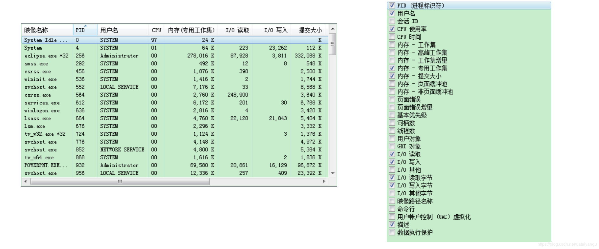

### Perfmon
Windows自带多功能性能监控工具，windows+r-》输入perfmon
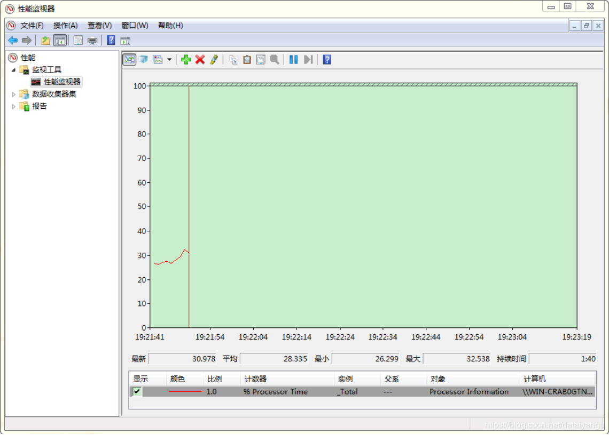
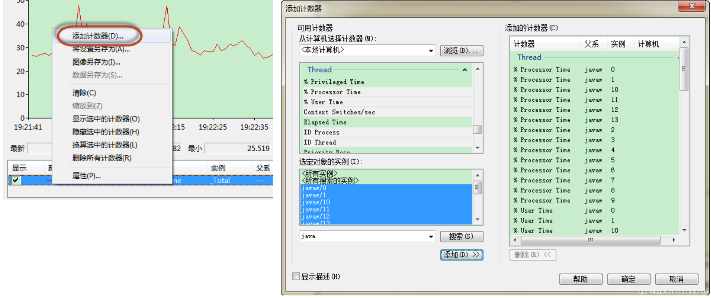
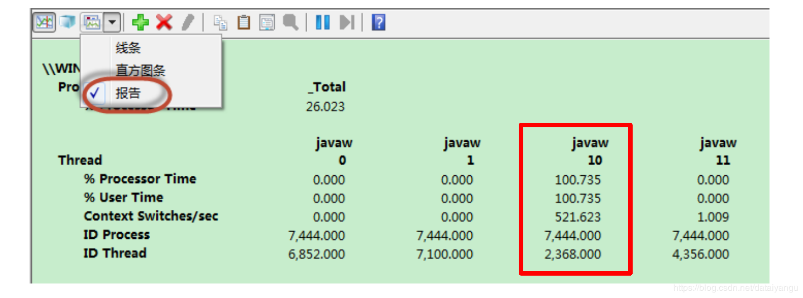

如上图：右击-》添加计数器-》选择对象实例（进程），关键字java-》确定-》将原来的线条显示的方式变成报告的形式

可以看到最后的java进程中线程id为2368000的线程cpu占用时间100%。
% Processor Time
% Processor Time 指处理器用来执行非闲置线程时间的百分比。计算方法是，测量范例间隔内非闲置线程活动的时间，用范例间隔减去该值。这个计数器是处理器活动的主要说明器，显示在范例间隔时所观察的繁忙时间平均百分比。
% User Time
% User Time 指处理器处于用户模式的时间百分比。用户模式是为应用程序、环境分系统和整数分系统设计的有限处理模式。
## Process Explorer
进程管理器
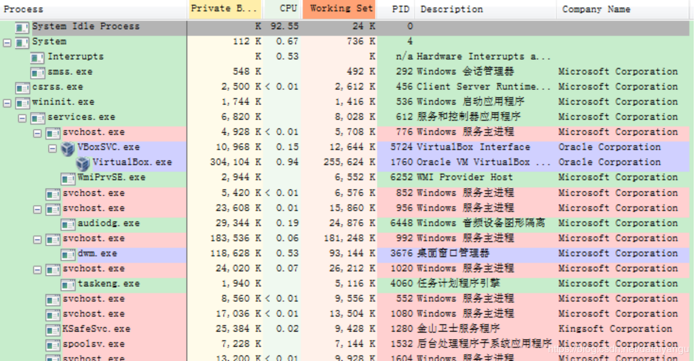

右击-》属性，查看具体的线程使用情况，最消耗性能的是3132
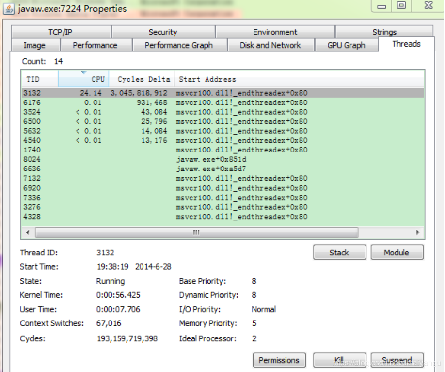

### 小问题？
找到系统内最消耗CPU的线程
## pslist
为什么介绍windows下命令行的形式？用于写一些脚本自动化测试。
需要安装
命令行工具
可用于自动化数据收集
显示java程序的运行情况
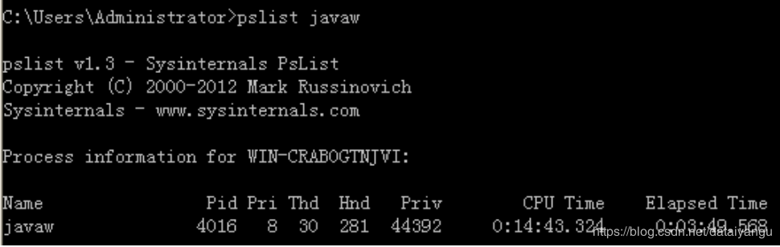

cmd-》PsList javaw（查看javaw这个进程的使用情况）
- Cpu Time cpu时间
CPU时间就是单纯的消耗cpu的时间，这个值越大代表占用的cpu时间越多
- Elapsed Time消耗的时间
占用的cpu时间，io或者网络上的读写，都有等待时间，这些时间不能算到cpu时间上去，也就是一些流失的时间，流失的时间等于cpu的时间，实际上cpu的时间加上等待时间。
但是这里的cpu时间大于流失时间，因为这个计算机是一个多核计算机，在多核计算机上，如果有两个核，第一个核流占用一分钟，第二个核也占用一分钟，最后还是一分钟，

### pslist javaw -d(查看javaw这个进程中的线程信息)

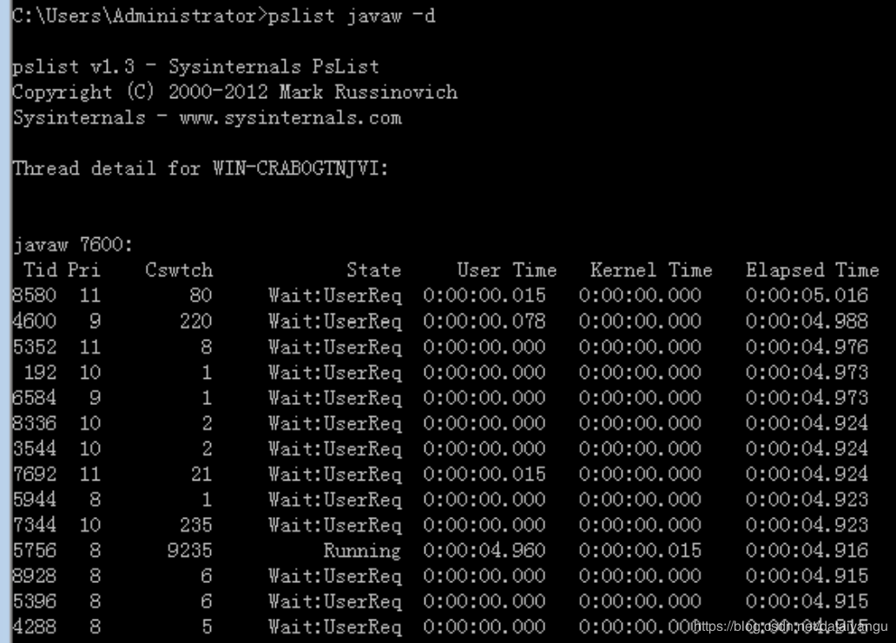

user time和kernel time分别是系统在用户模式和内核模式占用的cpu时间，应用程序在用户模式下运行，核心操作系统组件在内核模式下运行。
线程5756 上下文切换是9235

# Java自带的工具
查看Java程序运行细节，进一步定位问题，查看java程序本身的。
一般出了问题都先通过系统级别的性能监控工具，如果确定了是java程序本身除了问题，再用java自带的性能监控工具。
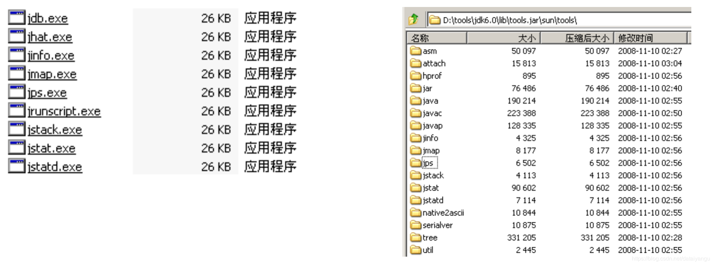

这些工具在jdk中的tools.jar/sun/tools目录下面
## jps
列出java进程，类似于ps命令
参数-q可以指定jps只输出进程ID ，不输出类的短名称
参数-m可以用于输出传递给Java进程（主函数）的参数
参数-l可以用于输出主函数的完整路径
参数-v可以显示传递给JVM的参数
### 举个栗子

```js
➜  ~ jps
16821
31612 Jps
26588 OsxApp
➜  ~ jps -q
16821
31624
26588
➜  ~ jps -m
31634 Jps -m
16821
26588 OsxApp
➜  ~ jps -l
16821
31639 sun.tools.jps.Jps
26588 org.jd.gui.OsxApp
➜  ~ jps -v
16821  -Xms128m -Xmx750m -XX:ReservedCodeCacheSize=240m -XX:+UseCompressedOops -Dfile.encoding=UTF-8 -XX:+UseConcMarkSweepGC -XX:SoftRefLRUPolicyMSPerMB=50 -ea -Dsun.io.useCanonCaches=false -Djava.net.preferIPv4Stack=true -XX:+HeapDumpOnOutOfMemoryError -XX:-OmitStackTraceInFastThrow -Xverify:none -XX:ErrorFile=/Users/leesin/java_error_in_idea_%p.log -XX:HeapDumpPath=/Users/leesin/java_error_in_idea.hprof -javaagent:/Applications/IntelliJ IDEA.app/Contents/bin/JetbrainsCrack.jar -Djb.vmOptionsFile=/Applications/IntelliJ IDEA.app/Contents/bin/idea.vmoptions -Didea.java.redist=jdk-bundled -Didea.home.path=/Applications/IntelliJ IDEA.app/Contents -Didea.executable=idea -Didea.paths.selector=IntelliJIdea2018.1
31644 Jps -Dapplication.home=/Library/Java/JavaVirtualMachines/jdk1.8.0_202.jdk/Contents/Home -Xms8m
26588 OsxApp -Dapple.laf.useScreenMenuBar=true -Xms512m
```
## jinfo
可以用来查看正在运行的Java应用程序的扩展参数，甚至支持在运行时，修改部分参数
-flag <name>：打印指定JVM的参数值
-flag [+|-]<name>：设置指定JVM参数的布尔值
-flag <name>=<value>：设置指定JVM参数的值
### 举个栗子
2972是进程号
```js
显示了新生代对象晋升到老年代对象的最大年龄
jinfo -flag MaxTenuringThreshold 2972
-XX:MaxTenuringThreshold=15
```

```js
显示是否打印GC详细信息
jinfo -flag PrintGCDetails  2972
-XX:-PrintGCDetails
```

```js
运行时修改参数，控制是否输出GC日志
jinfo -flag PrintGCDetails  2972
-XX:-PrintGCDetails

jinfo -flag +PrintGCDetails  2972

jinfo -flag PrintGCDetails  2972
-XX:+PrintGCDetails
```
## jmap	
生成Java应用程序的堆快照和对象的统计信息

```js
//将信息输出到s.txt
jmap -histo 2972 >c:\s.txt
```

```js
num     #instances         #bytes  class name
----------------------------------------------
   1:          4983        6057848  [I
   2:         20929        2473080  <constMethodKlass>
……………….
1932:             1              8  sun.java2d.pipe.AlphaColorPipe
1933:             1              8  sun.reflect.GeneratedMethodAccessor64
Total        230478       22043360
```
打开s.txt发现，[I 占用了将近6m的空间
### Dump堆

```js
//将堆信息dump到系统的文件中   hprof文件通过特殊的工具打开
jmap -dump:format=b,file=c:\heap.hprof 2972


Dumping heap to C:\heap.hprof ...
Heap dump file created
```


## jstack
打印线程dump
-l 打印锁信息
-m 打印java和native的帧信息
-F 强制dump，当jstack没有响应时使用
### 举个栗子

```js
jstack 120 >>C:\a.txt
```
tid是java中的tid，操作系统中本线程的id是nid
```js
"main" #1 prio=6 os_prio=0 tid=0x0831c400 nid=0xecc runnable [0x0018f000]
   java.lang.Thread.State: RUNNABLE
	at org.eclipse.swt.internal.win32.OS.WaitMessage(Native Method)
	at org.eclipse.swt.widgets.Display.sleep(Display.java:4657)
	at org.eclipse.ui.application.WorkbenchAdvisor.eventLoopIdle(WorkbenchAdvisor.java:364)
	at org.eclipse.ui.internal.ide.application.IDEWorkbenchAdvisor.eventLoopIdle(IDEWorkbenchAdvisor.java:917)
	at org.eclipse.ui.internal.Workbench$3.eventLoopIdle(Workbench.java:487)
	at org.eclipse.e4.ui.internal.workbench.swt.PartRenderingEngine$9.run(PartRenderingEngine.java:1117)
	at org.eclipse.core.databinding.observable.Realm.runWithDefault(Realm.java:332)
	at org.eclipse.e4.ui.internal.workbench.swt.PartRenderingEngine.run(PartRenderingEngine.java:997)
	at org.eclipse.e4.ui.internal.workbench.E4Workbench.createAndRunUI(E4Workbench.java:140)
	at org.eclipse.ui.internal.Workbench$5.run(Workbench.java:611)
	at org.eclipse.core.databinding.observable.Realm.runWithDefault(Realm.java:332)
	at org.eclipse.ui.internal.Workbench.createAndRunWorkbench(Workbench.java:567)
	at org.eclipse.ui.PlatformUI.createAndRunWorkbench(PlatformUI.java:150)
	at org.eclipse.ui.internal.ide.application.IDEApplication.start(IDEApplication.java:124)
	at org.eclipse.equinox.internal.app.EclipseAppHandle.run(EclipseAppHandle.java:196)
	at org.eclipse.core.runtime.internal.adaptor.EclipseAppLauncher.runApplication(EclipseAppLauncher.java:110)
	at org.eclipse.core.runtime.internal.adaptor.EclipseAppLauncher.start(EclipseAppLauncher.java:79)
	at org.eclipse.core.runtime.adaptor.EclipseStarter.run(EclipseStarter.java:354)
	at org.eclipse.core.runtime.adaptor.EclipseStarter.run(EclipseStarter.java:181)
	at sun.reflect.NativeMethodAccessorImpl.invoke0(Native Method)
	at sun.reflect.NativeMethodAccessorImpl.invoke(Unknown Source)
	at sun.reflect.DelegatingMethodAccessorImpl.invoke(Unknown Source)
	at java.lang.reflect.Method.invoke(Unknown Source)
	at org.eclipse.equinox.launcher.Main.invokeFramework(Main.java:636)
	at org.eclipse.equinox.launcher.Main.basicRun(Main.java:591)
	at org.eclipse.equinox.launcher.Main.run(Main.java:1450)
```
## JConsole
java自带的
图形化监控工具
可以查看Java应用程序的运行概况，监控堆信息、永久区使用情况、类加载情况等
- 打开方式
win：jdk/bin下双击JConsole.exe
linux/mac：运行命令`$JAVA_HOME/bin/jconsole`(这里的$JAVA_HOME是jdk的路径)
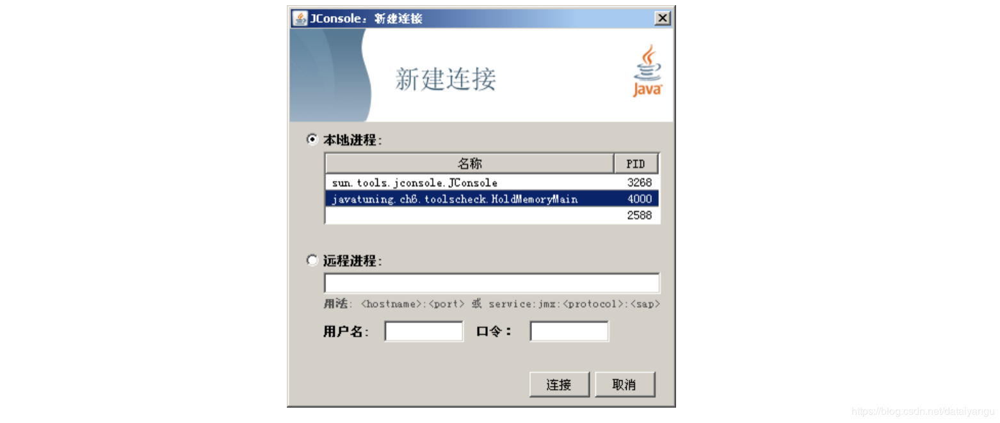

选中-》连接
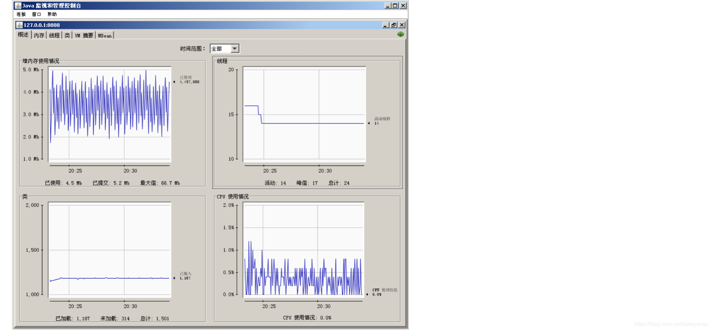
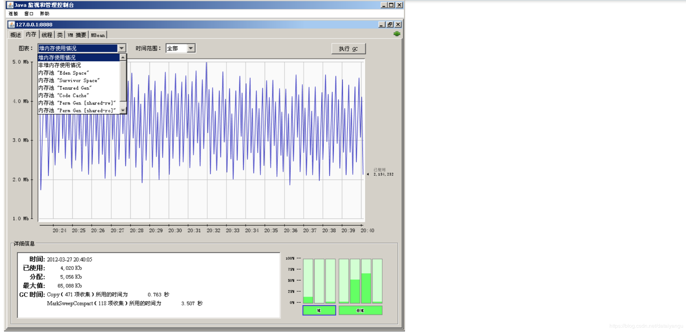

code cache是编译完的native的代码。
右上角有执行gc的按钮。
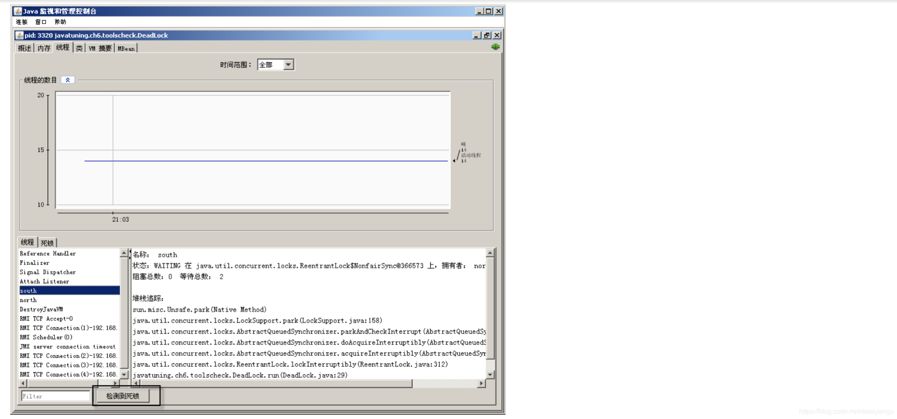

所以建议以后写代码都给线程起一个比较好听，方便排查问题的名字。
## Visual VM
Visual VM是一个功能强大的多合一故障诊断和性能监控的可视化工具
-打开方式
win：jdk/bin下双击jvisualvm.exe
linux/mac：运行命令`$JAVA_HOME/bin/jvisualvm`(这里的$JAVA_HOME是jdk的路径)
本地-》VisualVM-》概述
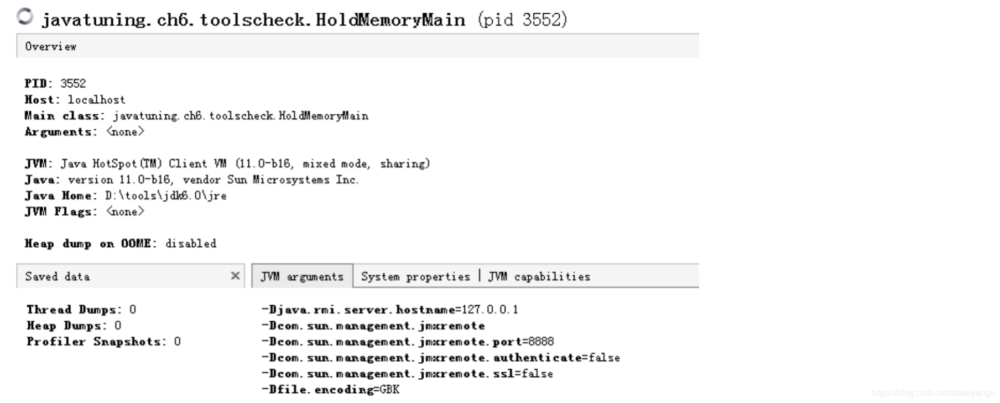

本地-》VisualVM-》监视

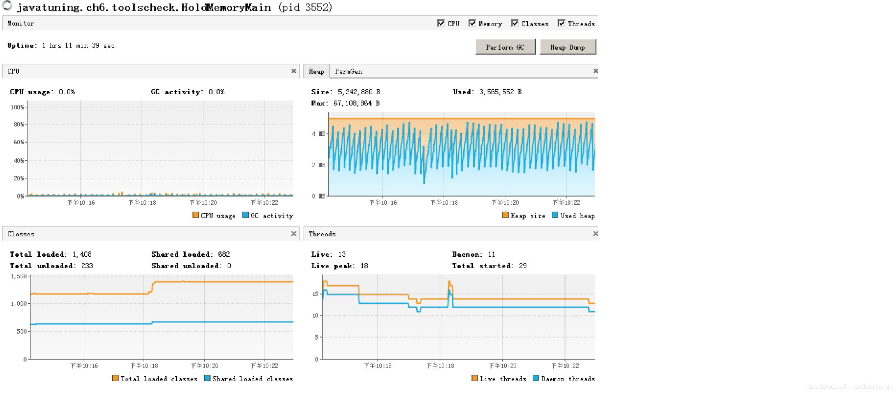
右上角有强制执行gc和堆dump的按钮
本地-》VisualVM-》线程
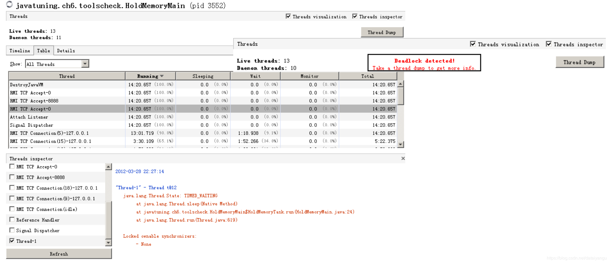

红色部分可以显示死锁，包括右上角有线程dump的按钮


性能监控：找到占用CPU时间最长的方法
本地-》VisualVM-》抽样器-》cpu

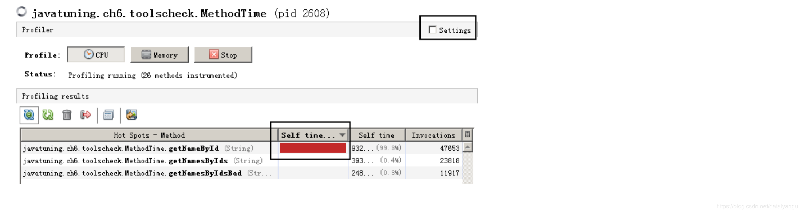
根据cpu的时间自动进行排序
invocation调用次数

分析堆Dump
visualVm本身就是一个能够查看Dump堆文件的工具，下图就是通过VisualVm打开的Dump文件的内容
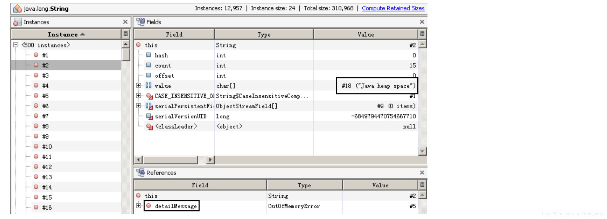

小问题？
观察Java线程打印
# 实战分析
## 运行一程序ThreadBlockMain，期望输出Hello,World ，结果在程序运行后，程序卡死，没有预期输出。
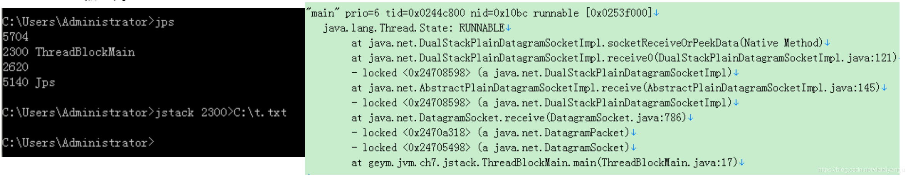

先通过jps命令找到进程id，然后将jstack dump到文件中，打开文件。
发现：线程还是RUNNABLE的状态，说明还在运行
在等待一个socketReceiverOrPeekData说明在等待接受一个网络io
再往下有一个DatagramSocketImpl说明是在等待一个UDP的socket
## Java程序HoldCPUMain运行后，发现占用CPU很高，希望能找到原因。
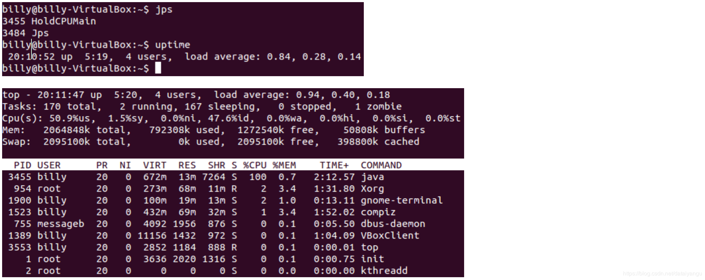

先通过jps找到进程id--》通过uptime发现load average（系统平均负载）比较大--》通过top命令发现java进程占用的cpu是百分之百
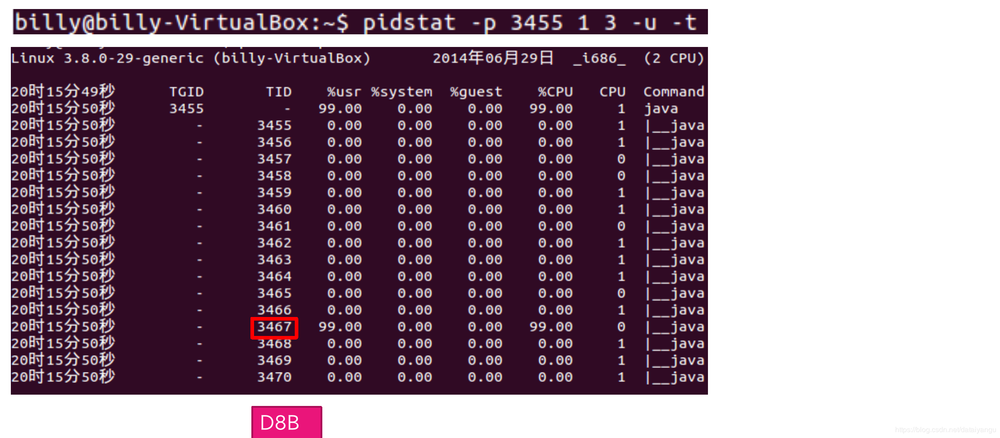

通过pidstat命令查看pid为3455的进程的cpu使用情况并以线程的形式输出
 **<font color="red">注意这里的3467    </font>**：因为下面将会用到jstack命令，发现里面显示的都是用了十六进制表示的，所以应该将它转化成十六进制，即D8B
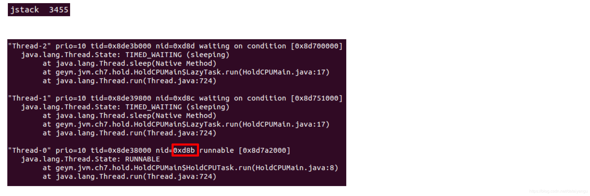

 通过jstack命令查看3455进程，找到了d8b这个线程，得知里面的第八行出现了问题。
##  死锁
死锁的结果是，程序卡死
可以用jstack查找死锁
### 如何从jstack的输出中找出死锁

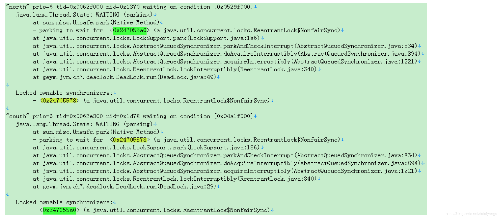

如果非常明显的能够找打一个简单的死锁，会自动输出如下：
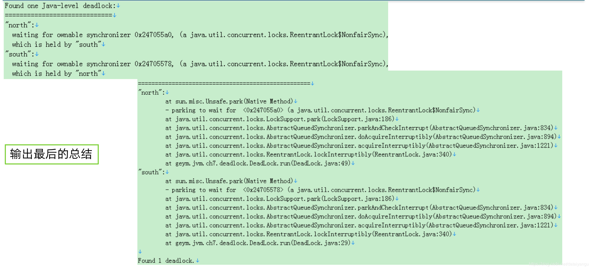


