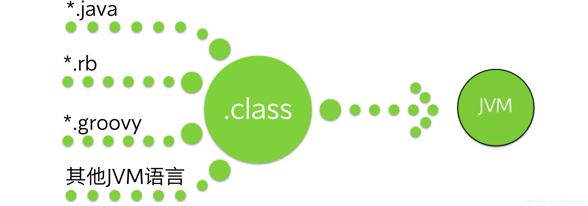
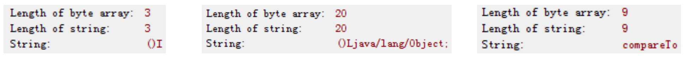
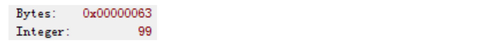
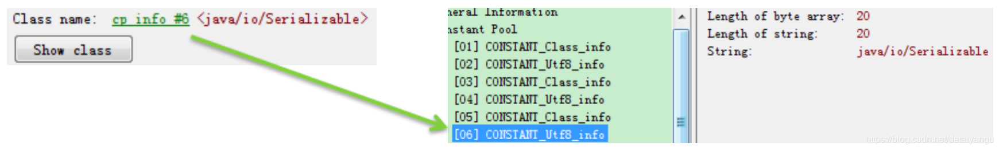
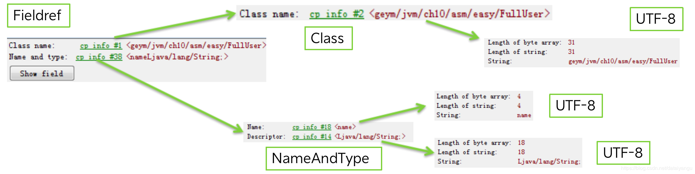
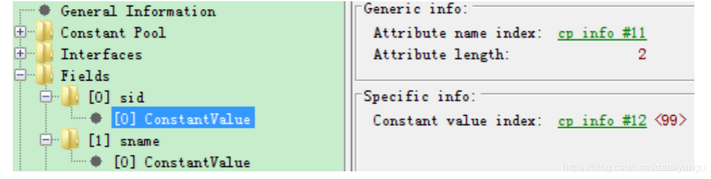
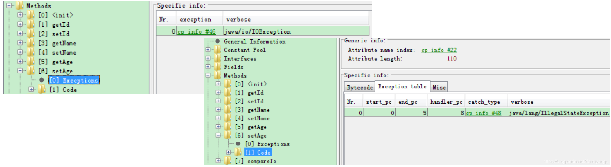
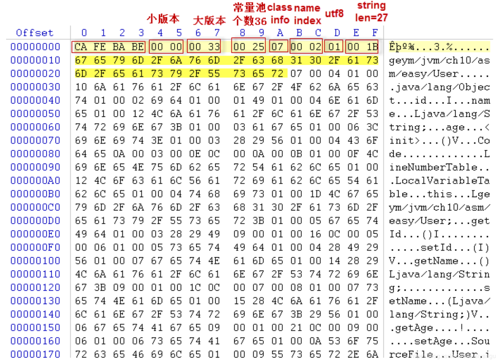
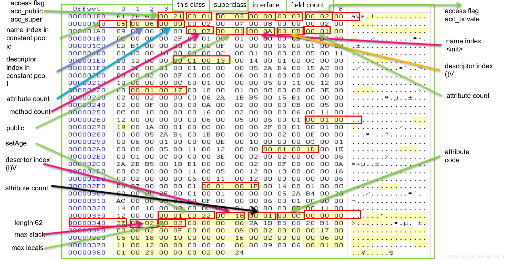
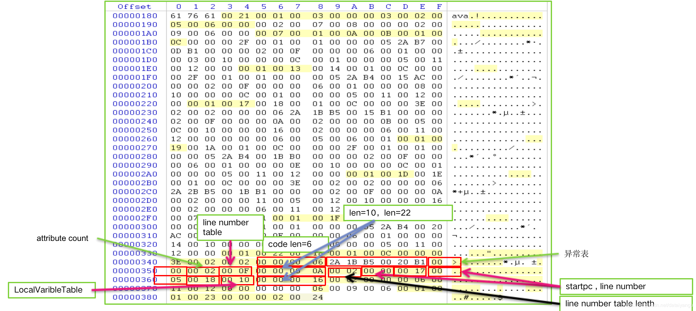

title: JVM内核-原理、诊断与优化学习笔记（十）：Class文件结构
author: Leesin.Dong
top: 
tags:
  - JVM
categories:
  - 学习笔记
  - JVM内核-原理、诊断与优化学习笔记
date: 2019-3-4 10:21:02

---

# 语言无关性

.class文件能够在JVM上运行，上图可以看出许多语言rb、groovy等都能编译成.class文件，所以java和JVM是相对独立的两部分。 
同样能得出结论：class文件是JVM的基石
# 文件结构
| 类型 | 名称 |数量|描述|
|--|--|--|--|
| u4 |  magic|1 |魔数，也叫magic number，数字表示是否是一个java文件 
| u2 |  minor_version|1 |小版本
| u2 |  major_version|1 |大版本
| u2 |  constant_pool_count|1 |常量池数量的属性
| cp_info |  constant_pool|constant_pool_count - 1 |常量池的内容，就是常量池的个数减一
| u2 |  access_flags|1 |访问修饰符 public private等
| u2 |  this_class|1 |当前类
| u2 |  super_class|1 |超类，单继承
| u2 |  interfaces_count|1 |接口数量的属性
| u2 |  interfaces|interfaces_count |接口
| u2 |  fields_count|1 |字段数量的属性
| field_info |  fields|fields_count |字段
| u2 |  methods_count|1 |方法数量的属性
| method_info|  methods|methods_count|方法的信息
| u2 |  attribute_count|1 |属性数量的属性
| attribute_info |  attributes|attributes_count |属性的信息

u1 u2 u3 u4表示无符号的整数，u1表示1个byte的整数，u2表示2个byte的整数，数字表示整数的长度。

## 魔数

magic u4

 - 0xCAFEBABE

 4个byte的一个数字，用来表示当前文件是一个class文件

## 版本
minor_version u2
major_version u2
当进行编译的时候用什么版本的javac编译出来的class文件
-target目标版本是多少

JDK 编译器版本|  target 参数	            |六进制 minor.major	   |十进制major.minor                     
|--|--|--|--|                                                                               
jdk1.1.8| 不能带 target 参数	            |00 03 00 2D	       |45.3                            
jdk1.2.2| 不带(默认为 -target 1.1)	    |       00 03 00 2D	   |45.3                            
jdk1.2.2| -target 1.2	            |       00 00 00 2E    |	46.0                        
jdk1.3.1_19| 不带(默认为 -target 1.1)	|       00 03 00 2D	   |    45.3                        
jdk1.3.1_19| -target 1.3	        |       00 00 00 2F	|        47.0                       
j2sdk1.4.2_|	不带(默认为 -target 1.2)	|   00 00 00 2E	       |46.0                            
j2sdk1.4.2_|	-target 1.4	        |       00 00 00 30    |	48.0                        
jdk1.5.0_11| 不带(默认为 -target 1.5)	|       00 00 00 31	   |    49.0                        
jdk1.5.0_11| -target 1.4 -source 1.4|           00 00 00 30|        48.0                    
jdk1.6.0_01| 不带(默认为 -target 1.6)	|       00 00 00 32	   |    50.0                        
jdk1.6.0_01| -target 1.5	        |           00 00 00 31|        49.0                    
jdk1.6.0_01| -target 1.4 -source 1.4|           00 00 00 30|        48.0                    
jdk1.7.0| 不带(默认为 -target 1.6)	    |       00 00 00 32	   |50.0                            
jdk1.7.0| -target 1.7	            |       00 00 00 33	   |    51.0                        
jdk1.7.0| -target 1.4 -source 1.4	|       00 00 00 30	   |    48.0                        

## 常量池
 **<font color="red"> 基本上所有的数据都是存在这里，后面的类名方法名等都是通过索引的方式指向这里，一切数据的基石。  </font>**

 - constant_pool_count u2
 - constant_pool  cp_info

 |-|-|-|                                                         
|--|--|--|                                                   
CONSTANT_Utf8		            |1|UTF-8编码的Unicode字符串        
CONSTANT_Integer	            |3|	int类型的字面值                
CONSTANT_Float		            |4|float类型的字面值               
CONSTANT_Long		            |5|long类型的字面值                
CONSTANT_Double		            |6|double类型的字面值              
CONSTANT_Class		            |7|对一个类或接口的符号引用              
CONSTANT_String		            |8|String类型字面值的引用            
CONSTANT_Fieldref	            |9|	对一个字段的符号引用               
CONSTANT_Methodref	            |10|对一个类中方法的符号引用             
CONSTANT_InterfaceMethodref	    |11|    对一个接口中方法的符号引用        
CONSTANT_NameAndType	        |12|        对一个字段或方法的部分符号引用  
### CONSTANT_Utf8
 - tag 1 (常量标识符 1代表UTF-8)
 - length u2 （UFT-8这个字符串byte数组的长度）
 - bytes[length]（UTF-8的实际的内容）
  
  三个UTF-8类型的常量：先显示字符串的长度，()I  表示空参返回值是int的数，()Ljava/lang/Object表示空参返回值是Object，compareTo表示方法的名称
### CONSTANT_Integer
- tag 3
- byte u4

```js
public static final int sid=99;
```

### CONSTANT_String
- tag 8
- string_index  u2 (指向utf8的索引)
  内部不直接存储内容而是指向UFT-8，实际的内容保存在UTF-8中

```js
public static final String sname="geym";
```

### CONSTANT_NameAndType
- tag 12
- name_index u2 (名字，指向utf8)
- descriptor_index u2 (描述符类型，指向utf8)
  名字和类型都是指向UTF-8描述的，本身是没有内容的


上图表示了名字为init，空参，返回值为void的方法，即默认的构造函数的表示。
### CONSTANT_Class
- tag 7
- name_index u2 (名字，指向utf8)


### CONSTANT_Fieldref ,CONSTANT_Methodref ,CONSTANT_InterfaceMethodref
字段、方法、接口方法
- tag 9 ,10, 11
- class_index  u2 (指向CONSTANT_Class)属于哪个类
- name_and_type_index u2 (指向CONSTANT_NameAndType)本身的名字和类型



## 访问标识符
access flag u2：类的标示符
根据value的值做区分


Flag Name	    |Value	|Interpretation
|-|-|-|
ACC_PUBLIC	    |0x0001	|public
ACC_FINAL	    |0x0010	|final,不能被继承.
ACC_SUPER	    |0x0020	|是否允许使用invokespecial指令，JDK1.2后，该值为true
ACC_INTERFACE	|0x0200	|是否是接口
ACC_ABSTRACT	|0x0400	|抽象类
ACC_SYNTHETIC	|0x1000	|该类不是由用户代码生成,运行时生成的，没有源码
ACC_ANNOTATION	|0x2000	|是否为注解
ACC_ENUM	    |0x4000	|是否是枚举
## 类、超类、接口
- this_class u2
  指向常量池的Class
- super_class u2
  指向常量池的Class
- interface_count u2
  接口数量
- interfaces
  interface_count 个 interface u2
  每个interface是指向CONSTANT_Class的索引
##  字段
- field_count
  字段数量
- fields
  field_count个field_info
- field
  access_flags u2 
  name_index u2 
  descriptor_index u2 
  attributes_count u2 
  attribute_info attributes[attributes_count];
### access_flags
Flag Name	    |Value	|Interpretat
|--|--|--|      
ACC_PUBLIC	    |0x0001	|public     
ACC_PRIVATE	    |0x0002	|private    
ACC_PROTECTED	|0x0004	|protected  
ACC_STATIC	    |0x0008	|static.    
ACC_FINAL	    |0x0010	|final      
ACC_VOLATILE	|0x0040	|volatile   
ACC_TRANSIENT	|0x0080	|transient  
ACC_SYNTHETIC	|0x1000	|synthetic; 
ACC_ENUM	    |0x4000	|枚举类型       
 - name_index u2
  常量池引用 ，表示字段的名字
- descriptor_index
  表示字段的类型
  为了尽量少的占用空间，简单表示
                                              

-|-                                           
--|--                                         
|B |byte                                    | 
|C |char                                    | 
|D |double                                  | 
|F |float                                   | 
|I |int                                     | 
|J |long                                    | 
|S |short                                   | 
|Z |boolean                                 | 
|V |void                                    | 
|L |对象Ljava/lang/Object;                    | 
|[ |  数组 [[Ljava/lang/String; = String[][] 二维数组[[ | 
### 小问题
descriptor_index的字符串存放位置在哪里？

## 方法
- methods_count
  方法数量
- methods
  methods_count个method_info
### method_info
access_flags u2 
name_index u2 
descriptor_index u2 
attributes_count u2 
attribute_info attributes[attributes_count];
#### access flag
|-|-|-|
|--|--|--|
Flag Name	      |  Value	|Interpretation
ACC_PUBLIC	      |  0x0001	|public
ACC_PRIVATE	      |  0x0002	|private
ACC_PROTECTED	  |  0x0004	|protected
ACC_STATIC	      |  0x0008	|static
ACC_FINAL	      |  0x0010	|final
ACC_SYNCHRONIZED|	0x0020	|synchronized
ACC_BRIDGE	      |  0x0040	|编译器产生 桥接方法
ACC_VARARGS	      |  0x0080	|可变参数
ACC_NATIVE	      |  0x0100	|native
ACC_ABSTRACT	  |  0x0400	|abstract
ACC_STRICT	      |  0x0800	|strictfp
ACC_SYNTHETIC	  |  0x1000	|不在源码中，由编译器产
#### name_index u2
方法名字，常量池UTF-8索引
#### descriptor_index u2
描述符，用于表达方法的参数和返回值
- 方法描述符
  void inc()   ()V
  void setId(int)  (I)V
  int indexOf(char[],int ) ([CI)I
## 属性
- 在field和method中，可以有若干个attribute，类文件也有attribute，用于描述一些额外的信息
  attribute_name_index u2 
  名字，指向常量池UTF-8
  attribute_length u4 
  长度
  info[attribute_length] u1
  内容 
- attribute本身也可以包含其他attribute(即可嵌套的)
- 随着JDK的发展不断有新的attribute加入

|类型	       |     名称	          |          数量                        
|--|--|--|                                                         
u2	            |methods_count	     |   1                       | 
method_info	    |methods	         |       methods_count       | 
u2	            |attribute_count	 |       1                   | 
attribute_info	|attributes	         |   attributes_count        | 

| 名称          | 使用者       | 描述                   |
| ------------- | ------------ | ---------------------- |
| Deprecated    | field method | 字段、方法、类被废弃   |
| ConstantValue | field        | final常量              |
| Code          | method       | 方法的字节码和其他数据 |
| ptions        | method       | 方法的异常             |
|LineNumberTable	  |  Code_Attribute|方法行号和字节码映射  
|LocalVaribleTable|	Code_Attribute|方法局部变量表描述      | 
|ceFile	      |  Class file	   |源文件名          | 
|hetic	      |  field method|编译器产生的方法或字段     | 
LineNUmberTable和LocalVatibleTable是Code_attribute的，即Attribute是可以嵌套使用的
### Deprecated
attribute_name_index u2
attribute_length u4
- attribute_name_index
  指向包含Deprecated的UTF-8常量
- attribute_length
  为0
### ConstantantValue
attribute_name_index u2
attribute_length u4
constantvalue_index u2
- attribute_name_index
  包含ConstantantValue字面量的UTF-8索引
- attribute_length
  为2
- constantvalue_index
  常量值，指向常量池，可以是UTF-8，Float, Double 等


public static final int sid=99;

### Code

```js
Code_attribute {
    u2 attribute_name_index;//Code
    u4 attribute_length;
    u2 max_stack;
    u2 max_locals;
    u4 code_length;//字节码长度
    u1 code[code_length];//字节码
    u2 exception_table_length;//异常表长度
    {   u2 start_pc;//异常处理的开始位置
        u2 end_pc;
        u2 handler_pc;//处理这个异常的字节码位置
        //如果出现异常处理代码的指针就会偏移到这里
        u2 catch_type;//处理的异常类型，指向Constant_Class的指针
        //是什么类型的异常
    } exception_table[exception_table_length];
    u2 attributes_count;//属性数量
    //在code基础上封装的属性，比如LineNumberTable
    attribute_info attributes[attributes_count];
}
```
### LineNumberTable - Code属性的属性(字节码的偏移量和对应的行号)

```js
LineNumberTable_attribute {
    u2 attribute_name_index;//UTF-8常量池，字面量LineNumberTable

    u4 attribute_length;

    u2 line_number_table_length;//表项

    {   u2 start_pc;//字节码偏移量和对应的行号
        u2 line_number;	
    } line_number_table[line_number_table_length];
}
```
### LocalVariableTable -  Code属性的属性(局部变量表)

```js
LocalVariableTable_attribute {
    u2 attribute_name_index;//UTF-8常量池，字面量LocalVariableTable
    u4 attribute_length;
    u2 local_variable_table_length;

    {   u2 start_pc;//局部变量作用域，从哪里开始
        u2 length;
        u2 name_index;//局部变量名称
        u2 descriptor_index;//类型
        u2 index;//局部变量的Slot位置
        //局部变量的slot是能够重用的，为了节省空间，后面局部变量会重用前面局部变量的slot
        //slot的意思是”变量槽“
    } local_variable_table[local_variable_table_length];
}
```
### Exceptions属性
和Code属性平级
表示方法抛出的异常 **<font color="red">   (不是try catch部分，而是 throws部分) </font>**
- 结构
  attribute_name_index u2 
  attribute_length u4 
  number_of_exceptions u2 
  exception_index_table[number_of_exceptions] u2 这个class就是要抛出的异常的类
  指向Constant_Class的索引
#### 举个🌰

```js
public void setAge(int age)  throws IOException{
	try{
		this.age = age;
	}catch(IllegalStateException e){
		this.age = 0;
	}
}
```

code里面的Exception即try catch的是第五个字节码如果发生了异常，就跳转到第八个字节码，上小节有讲到。
### SourceFile
描述生成Class文件的源码文件名称
- 结构
  attribute_name_index u2
  attribute_length u4
  固定为2
  soucefile_index u2文件名
  UTF-8常量索引
# class文件结构🌰
## 代码
```js
public class User {
	private int id;
	private String name;
	private int age;
	public int getId() {
		return id;
	}
	public void setId(int id) {
		this.id = id;
	}
	public String getName() {
		return name;
	}
	public void setName(String name) {
		this.name = name;
	}
	public int getAge() {
		return age;
	}
	public void setAge(int age) {
		this.age = age;
	}
	
}
```

0123 魔数，表示是class文件
45 小版本
67 大版本
89 常量池的个数0025表示36个常量
接着开始描述常量池里面的内容
A 07 表示class类型的常量（上面有对应的表格）
class类型的常量里有0002，表示指向常量池的指针，这个类的utf-8的描述是常量池的第二个，第二个是什么呢？看D 发现是01类型的就是utf-8。然后是长度001B，即27，内容是geym/------------User，至此完整描述了一个类

常量池里面一共36个，这里不一一的进行分析

access_flag访问权限 0021表示public和super
然后thisclass，跟上常量池的第一个，第一个就是类本身
superclass，父类
interface，接口，没有实现接口，所以是0，
field count 0003三个，确实是三个字段
0002 第一个字段开始描述了，field count 之后就是具体信息的描述，这里的0002表示field是private的即私有的
0005 field名字的索引在常量池中的索引是第五个
0006 描述符，大写的I 表示这个field的类型是一个int类型
0000 attribute 没有attribute

以此类推将三个field解读一下。
0007,field描述完之后开始描述方法method count 7个方法上面一共有六个，7个因为还有一个构造函数
0001 public方法
000A方法名字的索引表示的是init方法。
000B方法描述
0001attribute count属性的值

离散的标出了几个方法的开始
00010013
00010017
000100
0001001D
0001001F

00010022表示最后一个方法setAge
0018方法的descritor方法的描述签名
0001attribute count 1
000c code属性
0000003E changdu 62
0002max stack最大栈的大小
0002max locals最大局部变量表的大小
上图表示code
00000006 6个byte
2A1BB50020B1系统中真正运行的字节码
0000异常表因为没有异常所以为空
0002属性属性
000Flinenumbertable
0000000A长度为10
0002linenumber table lenth表象
0000 0017      0005 0018 分别为偏移量和行号
0010 局部变量表
00000016 长度22
。。。

0002局部变量表的表象的长度
0000偏移量
0006长度作用范围
0011第一局部变量的名字，this
0012局部变量的类型user
0000slot第一个slot被它所占
00000006另一个局部变量的信息
0001attribute其他的属性 还有一个
0023哪个源文件声称出来的
00000002长度2
0024指向索引，类是由User.java编译出来的。