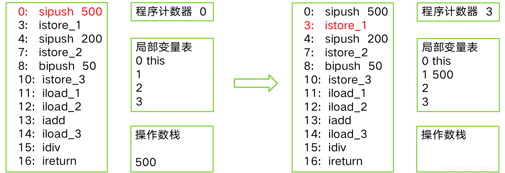
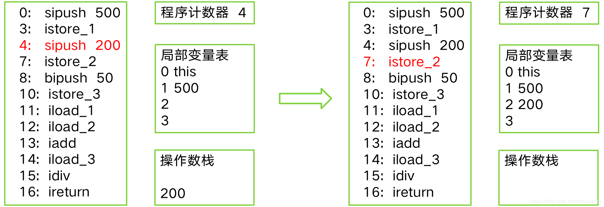
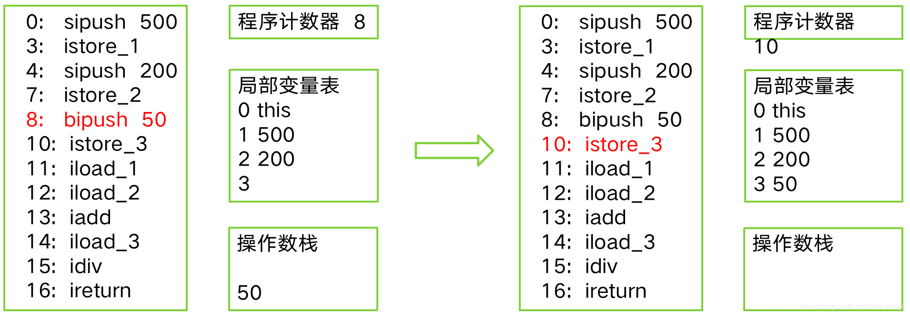
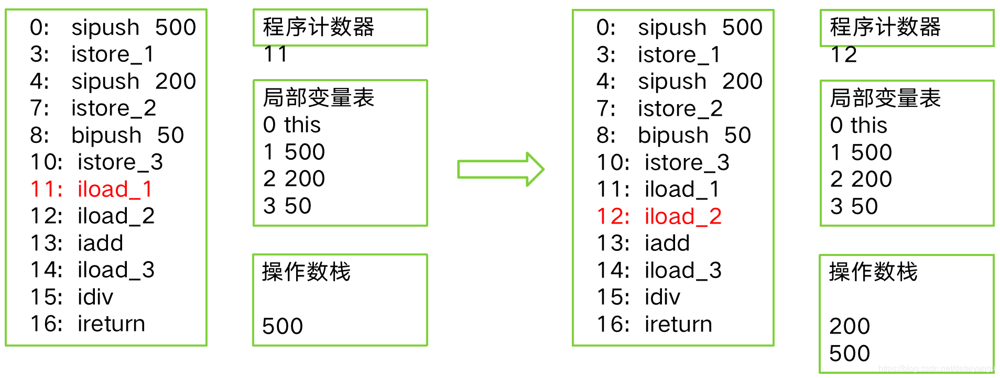
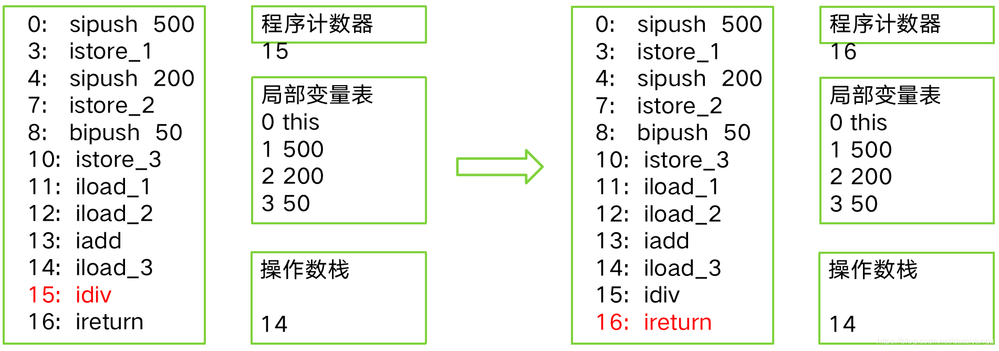
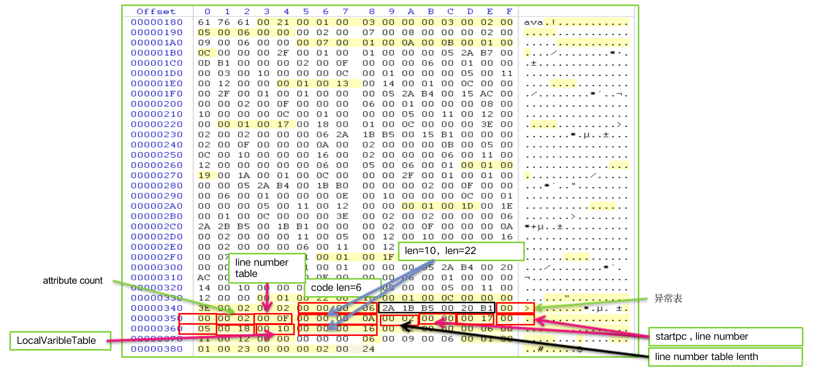
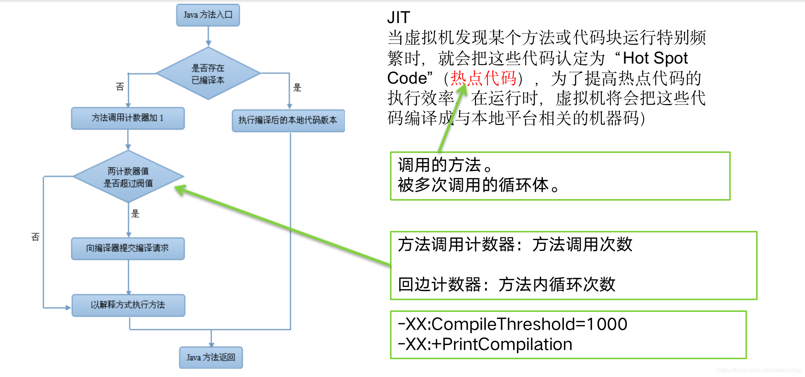

title: JVM内核-原理、诊断与优化学习笔记（十一）：JVM字节码执行
author: Leesin.Dong
top: 
tags:

  - JVM
categories:
  - 学习笔记
  - JVM内核-原理、诊断与优化学习笔记
date: 2019-3-5 09:21:02

---

# javap
## javap
class文件反汇编工具
 **<font color="red">  生成code区（汇编指令） ，这和class文件中的字节码是不一样的，上一篇文章中的”2A 1B B5 00 20 B1“ 是在字节码文件中映射这具体的汇编指令，可是在字节码文件中仅仅存在的都是十六进制的有映射能力的字节码而非汇编指令。</font>**


javap是jdk自带的反解析工具。它的作用就是根据class字节码文件，反解析出当前类对应的code区（汇编指令）、本地变量表、异常表和代码行偏移量映射表、常量池等等信息。
当然这些信息中，有些信息（如本地变量表、指令和代码行偏移量映射表、常量池中方法的参数名称等等）需要在使用javac编译成class文件时，指定参数才能输出，比如，你直接javac xx.java，就不会在生成对应的局部变量表等信息，如果你使用javac -g xx.java就可以生成所有相关信息了。如果你使用的eclipse，则默认情况下，eclipse在编译时会帮你生成局部变量表、指令和代码行偏移量映射表等信息的。
通过反编译生成的汇编代码，我们可以深入的了解java代码的工作机制。比如我们可以查看i++；这行代码实际运行时是先获取变量i的值，然后将这个值加1，最后再将加1后的值赋值给变量i。
通过局部变量表，我们可以查看局部变量的作用域范围、所在槽位等信息，甚至可以看到槽位复用等信息。
javap的用法格式：
javap <options> <classes>
其中classes就是你要反编译的class文件。
在命令行中直接输入javap或javap -help可以看到javap的options有如下选项：

```js
 -help  --help  -?        输出此用法消息
 -version                 版本信息，其实是当前javap所在jdk的版本信息，不是class在哪个jdk下生成的。
 -v  -verbose             输出附加信息（包括行号、本地变量表，反汇编等详细信息）
 -l                         输出行号和本地变量表
 -public                    仅显示公共类和成员
 -protected               显示受保护的/公共类和成员
 -package                 显示程序包/受保护的/公共类 和成员 (默认)
 -p  -private             显示所有类和成员
 -c                       对代码进行反汇编
 -s                       输出内部类型签名
 -sysinfo                 显示正在处理的类的系统信息 (路径, 大小, 日期, MD5 散列)
 -constants               显示静态最终常量
 -classpath <path>        指定查找用户类文件的位置
 -bootclasspath <path>    覆盖引导类文件的位置

```

一般常用的是-v -l -c三个选项。
javap -v classxx，不仅会输出行号、本地变量表信息、反编译汇编代码，还会输出当前类用到的常量池等信息。
javap -l 会输出行号和本地变量表信息。
javap -c 会对当前class字节码进行反编译生成汇编代码。
查看汇编代码时，需要知道里面的jvm指令，可以参考官方文档：
https://docs.oracle.com/javase/specs/jvms/se7/html/jvms-6.html
另外通过jclasslib工具也可以看到上面这些信息，而且是可视化的，效果更好一些。
## 举个🌰


```js
public class Calc {
	public int calc() {
		int a = 500;
		int b = 200;
		int c = 50;
		return (a + b) / c;
	}
}
```
运行命令
```js
javap –verbose Calc
```
得到

```js
public int calc();
  Code:
  //栈大小   局部变量大小 
   Stack=2, Locals=4, Args_size=1
   //前面的数字可以理解为广义上的行号，但不是真正的行号，
   //因为这是反编译过来的，这是偏移量的意思。
   //sipush、istore_1等就是字节码本身，就是方法体在运行的时候
   //会执行的指令
   0:   sipush  500
   3:   istore_1
   4:   sipush  200
   7:   istore_2
   8:   bipush  50
   10:  istore_3
   11:  iload_1
   12:  iload_2
   13:  iadd
   14:  iload_3
   15:  idiv
   16:  ireturn
}
```

# 简单的字节码执行过程

每个线程都有一个程序计数器，指向当前运行的这条指令的位置
局部变量表和操作数栈都是在帧栈中产生的数据

sipush 500因为当前是一个实例方法，所以this作为参数放在局部变量表的第0个位置，同时将500操作数压入到操作数栈中
istore 1 从操作数栈中取出一个数弹出到局部变量表中 1的位置

同上

bipush 50 将50压入到操作数栈当中
istore 3 将操作数栈顶端的数压入到局部变量表的第3个位置
执行完以上指令局部变量表中欧冠0123都有了数字，同时操作数栈是空的

iload 1 将局部变量表的数据压入到操作数栈中，将局部变量表的第1个位置的整数，压入到操作数栈中
iload 2 同上

iadd 相加操作，从操作数栈中。弹出两个操作数，做累加，将数据之和再压入操作数栈，所以在iadd执行完之后，200+500=700
iload 3 将局部变量表的第3个位置的整数50压入操作数栈的顶端 

idiv 表示整数的除法，从操作数栈中弹出两个数，做除法，700/50=14
ireturn 返回操作数栈的栈顶的元素即14
至此函数运行完毕。

之前这个图中黑色框中的内容没有详细的介绍。
即

```js
2A1B B5 00 20 B1
```
其实就是函数真正的字节码

 **<font color="red">  字节码指令为一个byte整数  </font>**
 
| 指令         | 整数           | 解释   |
| ------------ | -------------- | ------ |
| _nop         | =   0, // 0x00 | 空指令 |
| _aconst_null | =   1, // 0x01 |        |
| _iconst_0    | =   3, // 0x03 |        |
| _iconst_1    | =   4, // 0x04 |        |
| _dconst_1    | =  15, // 0x0f |        |
| _bipush      | =  16, // 0x10 |        |
| _iload_0     | =  26, // 0x1a |        |
| _iload_1     | =  27, // 0x1b |        |
| _aload_0     | =  42, // 0x2a |        |
| _istore      | =  54, // 0x36 |        |
| _pop         | =  87, // 0x57 |        |
| _imul        | = 104, // 0x68 |        |
| _idiv        | = 108, // 0x6c |        |
指令是方便阅读和理解的，右半部分是文件中、计算机内真正的表示方式

上面的字节码解析
```js
2A1B B5 00 20 B1
```
- void setAge(int) 方法的字节码
  2A 1B B5 00 20 B1
- 2A _aload_0
  无参
  将局部变量slot0 （this）作为引用 压入操作数栈
- 1B _iload_1
  无参
  将局部变量slot1 作为整数 压入操作数栈
- B5 _putfield
  设置对象中字段的值
  参数为2bytes (00 20) (指明了字段名称)
1. 指向常量池的引用
2. Constant_Fieldref
3. 此处为User.age
  弹出栈中2个对象:objectref（iload_0中的值，即this对象）, value（load_1中的值）
  将栈中的value赋给objectref的给定字段
- 简而言之：就是讲load_1压入的值赋值给this对象中的age字段
- B1 _return 没有返回值，返回void


# 常用的字节码
## 常量入栈

| -           | -                  |
| ----------- | ------------------ |
| aconst_null | null对象入栈       |
| iconst_m1   | int常量-1入栈      |
| iconst_0    | int常量0入栈       |
| iconst_5    |                    |
| lconst_1    | long常量1入栈      |
| fconst_1    | float 1.0入栈      |
| dconst_1    | double 1.0 入栈    |
| bipush      | 8位带符号整数入栈  |
| sipush      | 16位带符号整数入栈 |
| ldc         | 常量池中的项入栈   |
前面是
a表示对象的引用，
i表示int，
l表示long，
f表示float，
d表示double，
bi表示8位带符号整数（128以下），
si表示16位带符号整数，
ldc表示常量池中的对象某一项入栈
## 局部变量压栈
局部变量包括方法中的局部变量和方法的参数
- xload(x为i l f d a)
  分别表示int，long，float，double，object ref
- xload_n(n为0 1 2 3)
- xaload(x为i l f d a b c s) x后面的a表示数组
  分别表示int, long, float, double, obj ref ,byte,char,short
  从数组中取得给定索引的值，将该值压栈
  iaload
1. 执行前，栈：..., arrayref, index，栈顶元素是数组下表，第二个元素是整数数组的索引
2. 它取得arrayref所在数组的index的值，并将值压栈，并将arrayref和index从栈顶弹出来
3. 执行后，栈：..., valu，最后只剩下给定数组的index索引的数值
## 出栈装载入局部变量
- xstore(x为i l f d a)
  出栈，存入局部变量
- xstore_n(n 0 1 2 3)
  出栈，将值存入第n个局部变量
- xastore(x为i l f d a b c s)
  将值存入数组中
  iastore
1. 执行前，栈：...,arrayref, index, value
2. 执行后，栈：...
3. 将value值存入arrayref[index] 
## 通用栈操作（无类型，不指定数据类型）
- nop 空指令，什么都不做
- pop 
  弹出栈顶1个字长
- dup
  复制栈顶1个字长，复制内容压入栈
## 类型转化

| -    |
| - |
| i2l  |
| i2f  |
| l2i  |
| l2f  |
| l2d  |
| f2i  |
| f2d  |
| d2i  |
| d2l  |
| d2f  |
| i2b  |
| i2c  |
### i2l
将int转为long
执行前，栈：..., value      value是int
执行后，栈：...,result.word1,result.word2    将原来的int变成了long的前半部分和后半部分
弹出int，扩展为long，并入栈
## 运算
### 整数运算

 |-| -|             
 |-|  -|            
|iadd   | 加          
|ladd   |            
|isub   | 减          
|lsub   |            
|idiv   | 除          
|ldiv   |            
|imul   |    乘       
|lmul   |            
|iinc   |    整数加加    
|i--》int    l--》long  
### 浮点运算

|-|    
|-|    
|fadd |  
|dadd |  
|fsub |  
|dsub |  
|fdiv |  
|ddiv |  
|fmul |  
|dmul |  
|f--》float d--》double
## 对象操作指令

|-|
|-|                         |
|new      |   生成对象           |
|getfield |拿到实例对象给定字段的值      |
|putfield |设置实例对象给定字段的值      |
|getstatic| 拿到静态字段的值         |
|putstatic| 设置静态字段的值         |
## 条件控制

| -        | -                       |
| -------- | - |
| feq      | 如果为0，则跳转         |
| fne      | 如果不为0，则跳转       |
| flt      | 如果小于0 ，则跳转      |
| fge      | 如果大于0，则跳转       |
| f_icmpeq | 如果两个int相同，则跳转 |
### 举个🌰
- ifeq
  参数 byte1,byte2
  value出栈 ，如果栈顶value为0则跳转到(byte1<<8)|byte2  byte1左移8位，再和byte2取或
  执行前，栈：...,value
  执行后，栈：...
## 方法调用

| -|-|
| - | - |
| invokevirtual                 |  普通的实例的类方法调用（动态调用，运行的时候根据目前的实际类型，获取调用的方法）   |
| invokespecial                 |   父类方法调用，编译的时候表名的类型的方法，所以不会有多态的作用  |
| invokestatic                  |   静态方法的调用  |
| invokeinterface               |  接口方法的调用   |
| xreturn(x为 i l f d a 或为空)     |   x为返回值类型，空位void  |                
# 使用ASM生成Java字节码
- Java字节码操作框架
- 可以用于修改现有类或者动态产生新类(从无到有)
- 用户（都用到了ASM技术）
  AspectJ
  Clojure
  Ecplise
  spring
  cglib(hibernate)

ASM通过访问者模式访问class文件，最终生成class文件，生产class文件的时候使用的是ClassWriter这个类，visit访问class文件
## 举个🌰
一个class从无到有的过程
```js
//生成一个ClassWeiter，写class文件的对象
ClassWriter cw = new ClassWriter(ClassWriter.COMPUTE_MAXS|ClassWriter.COMPUTE_FRAMES);  
//让ClassWriter访问一个类，生成类的名字的Example，访问权限public，父类是Object
cw.visit(V1_7, ACC_PUBLIC, "Example", null, "java/lang/Object", null); 
//visitMEthod动态产生一个init方法，权限public，即构造方法，参数返回值都是空的
MethodVisitor mw = cw.visitMethod(ACC_PUBLIC, "<init>", "()V", null,  null);  
//this 入栈
mw.visitVarInsn(ALOAD, 0);  
//调用给定对象的方法，静态绑定，也就是访问了父类object的init函数
mw.visitMethodInsn(INVOKESPECIAL, "java/lang/Object", "<init>", "()V");  
//return 没有返回值
mw.visitInsn(RETURN);  
//对访问的帧栈和局部变量表做一个自动的计算
mw.visitMaxs(0, 0);  
//访问结束
mw.visitEnd();  
//访问main方法，方法参数是String数组，[表示数组L表示对象 返回值void
mw = cw.visitMethod(ACC_PUBLIC + ACC_STATIC, "main",  "([Ljava/lang/String;)V", null, null);  
//得到名为java.lang.system的static属性，这个成员是一个类型为java.io.pritStream的out
mw.visitFieldInsn(GETSTATIC, "java/lang/System", "out",  "Ljava/io/PrintStream;");  
//压栈Ldc将常量池中的常量压入堆栈
mw.visitLdcInsn("Hello world!");  
//调用实例对象的方法，将前面GWTSTATIC拿到的值压入堆栈，将helloworld压入堆栈，所以
//堆栈的前两位就是system.out对象的引用和println方法的参数”Hello World“，
//INVOKEVOTUAL就将压入堆栈的system.out 的prontln调用了一次，并传入了一个参数”Hello World“
//所以完成了一个system.println HelloWorld的操作
mw.visitMethodInsn(INVOKEVIRTUAL, "java/io/PrintStream", "println",  "(Ljava/lang/String;)V");  
//return  void
mw.visitInsn(RETURN);  
//自动生成帧栈局部变量的大小
mw.visitMaxs(0,0);  
//结束
mw.visitEnd();  
//将整个类变成一个byte数组
byte[] code = cw.toByteArray();  

AsmHelloWorld loader = new AsmHelloWorld();  
//通过classloader定义一个类，将刚刚的byte数组传入，通过defineClass生成类
Class exampleClass = loader  
    .defineClass("Example", code, 0, code.length);  
 //通过反射执行刚刚生成的main方法
exampleClass.getMethods()[0].invoke(null, new Object[] { null }); 
```
输出结果

```js
Hello world!
```
##  模拟实现AOP字节码织入
在函数开始部分或者结束部分嵌入字节码
可用于进行鉴权（查看用户是否有权限调用这个方法）、日志（方法被调用的时候记录一些额外的日志）等
### 举个🌰
```js
public class Account { 
	 public void operation() { 
		 System.out.println("operation...."); 
	 } 
}
```
在操作前加上鉴权或者日志
我们要嵌入的内容
安全检查：
```js
public class SecurityChecker { 
 public static boolean checkSecurity() { 
 System.out.println("SecurityChecker.checkSecurity ...");
 return true;
 } 
}
```

```js
//继承一个ClassVisitor，表示对类进行一些访问
class AddSecurityCheckClassAdapter extends ClassVisitor {
//给class加上SecurityChecker类的checkSecurity功能
    public AddSecurityCheckClassAdapter( ClassVisitor cv) {
		super(Opcodes.ASM5, cv);
	}
    // 重写 visitMethod，访问到 "operation" 方法时，
    // 给出自定义 MethodVisitor，实际改写方法内容
    //name是method的名字
    public MethodVisitor visitMethod(final int access, final String name, 
        final String desc, final String signature, final String[] exceptions) { 
        MethodVisitor mv = cv.visitMethod(access, name, desc, signature,exceptions);
        MethodVisitor wrappedMv = mv; 
        if (mv != null) { 
            // 对于 "operation" 方法，当name叫做opration的时候
            if (name.equals("operation")) { 
                // 使用自定义 MethodVisitor，实际改写方法内容
                wrappedMv = new AddSecurityCheckMethodAdapter(mv); 
            } 
        } 
        return wrappedMv; 
    } 
}
```
AddSecurityCheckMethodAdapter
```js
//MethodVIsitor专门用来访问方法
class AddSecurityCheckMethodAdapter extends MethodVisitor { 
	 public AddSecurityCheckMethodAdapter(MethodVisitor mv) { 
		 super(Opcodes.ASM5,mv); 
	 } 
	 public void visitCode() { 
	 //先执行geym/jvm/ch10/asm/SecurityChecker空参的返回值是boolean的checkSecurity方法
		 visitMethodInsn(Opcodes.INVOKESTATIC, "geym/jvm/ch10/asm/SecurityChecker", 
			"checkSecurity", "()Z"); 
			//然后再执行真正的操作，即在class文件中有一个Attribute是code
			//即将原原本本的其他的一些字节码再运行一遍
		 super.visitCode();
	 } 
}
```
将字节码织入
```js
public class Generator{ 
	 public static void main(String args[]) throws Exception { 
	 //通过ClassReader将Account类读进来，生成一个ClassReader实例
		 ClassReader cr = new ClassReader("geym.jvm.ch10.asm.Account"); 
		 ClassWriter cw = new ClassWriter(ClassWriter.COMPUTE_MAXS|ClassWriter.COMPUTE_FRAMES); 
		 AddSecurityCheckClassAdapter classAdapter = new AddSecurityCheckClassAdapter(cw); 
		 //cr接受一个访问者classAdapter，即AddSecurityCheckClassAdapter
		 //由classReader作为一个引导对这个class文件做一个访问
		 //在访问的过程中就会做一些自己的织入
		 cr.accept(classAdapter, ClassReader.SKIP_DEBUG); 
		 //将修改过的字节码做一个输出
		 byte[] data = cw.toByteArray(); 
		 File file = new File("bin/geym/jvm/ch10/asm/Account.class"); 
		 FileOutputStream fout = new FileOutputStream(file); 
		 //通过data即cw.toByteArray覆盖原来的Account文件
		 fout.write(data); 
		 fout.close(); 
	 } 
}
```
运行结果：

```js
//在operation执行之前会先执行checkSecurity
SecurityChecker.checkSecurity ...
operation....
```

# JIT及其相关参数
- 字节码执行性能较差，所以可以对于热点代码编译成机器码再执行，在运行时的编译，
  叫做JIT Just-In-Time
- JIT的基本思路是，将热点代码，就是执行比较频繁的代码，编译成机器码，当再次执行的时候就不做解释执行，而是直接执行机器码。
  
  即使是在循环体中被多次调用也会被认为热点代码，可能方法被即时调用并没有返回，这种情况下依然能够促进被编译完的代码的使用，这个过程叫做”栈上替换“，在方法的执行栈上直接替换成机器码
  CompileThreadshld 设置阈值，方法被调用多少次之后将其设置成机器码
  PrintCompilatoin 打出JIT的一些编译的信息，哪些方法已经完成了编译
## 举个🌰

```js
public class JITTest {

    public static void met(){
        int a=0,b=0;
        b=a+b;
    }
    
    public static void main(String[] args) {
        for(int i=0;i<1000;i++){
            met();
        }
    }
}
```

```js
-XX:CompileThreshold=1000
-XX:+PrintCompilation
```
输出：
```js
//所有被编译的方法都有一个输出
56    1             java.lang.String::hashCode (55 bytes)
56    2             java.lang.String::equals (81 bytes)
57    3             java.lang.String::indexOf (70 bytes)
60    4             java.lang.String::charAt (29 bytes)
61    5             java.lang.String::length (6 bytes)
61    6             java.lang.String::lastIndexOf (52 bytes)
61    7             java.lang.String::toLowerCase (472 bytes)
67    8             geym.jvm.ch2.jit.JITTest::met (9 bytes)
```
## JIT相关参数
默认是解释和编译混合的，何时解释和编译，取决于被调用的次数和热点代码的分布情况

编译器是把源程序的每一条语句都编译成机器语言,并保存成二进制文件,这样运行时计算机可以直接以机器语言来运行此程序,速度很快; 

而解释器则是只在执行程序时,才一条一条的解释成机器语言给计算机来执行,所以运行速度是不如编译后的程序运行的快的. 

这是因为计算机不能直接认识并执行我们写的语句,它只能认识机器语言(是二进制的形式)
- -Xint
  解释执行
  执行性能比较差
- -Xcomp
  全部编译执行
  启动初期，所有的方法都还没有被编译完之前，这时候的编译量是非常巨大的，这个时候的性能比较差，可是全部编译完成之后，会比解释执行快很多。
- -Xmixed
  默认，混合