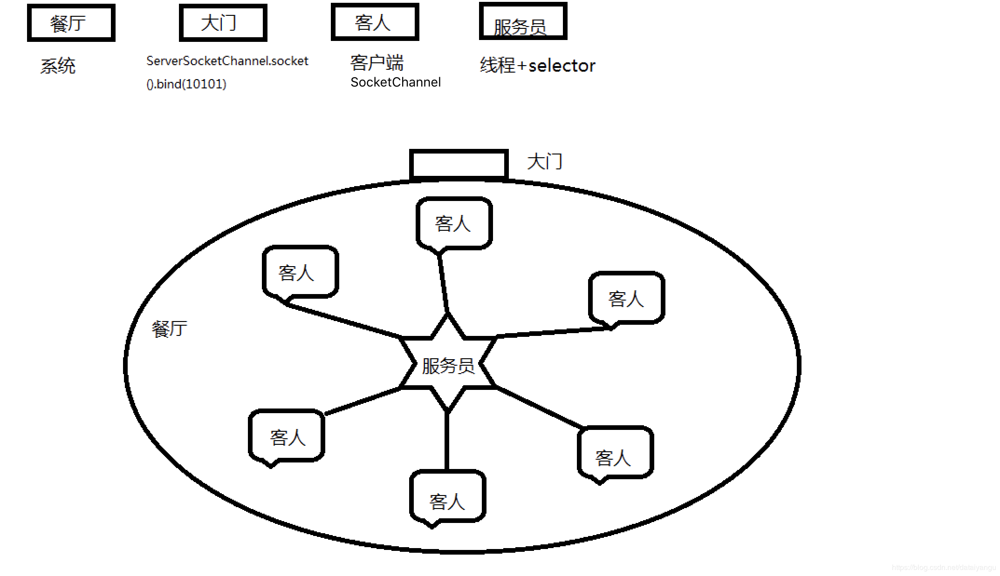

title: 基于Netty的RPC架构学习笔记（一）：NIO
author: Leesin.Dong
top: 
tags:

- Netty
categories:
- 学习笔记
- 基于Netty的RPC架构学习笔记
date: 2019-3-10 10:21:01

---


# 传统的socket分析
## 举个🌰

```js
package OIO;
import java.io.IOException;
import java.io.InputStream;
import java.net.ServerSocket;
import java.net.Socket;
import java.util.concurrent.ExecutorService;
import java.util.concurrent.Executors;
/**
 * 传统socket服务端
 * 
 *
 */
public class OioServer {

	@SuppressWarnings("resource")
	public static void main(String[] args) throws Exception {

		ExecutorService newCachedThreadPool = Executors.newCachedThreadPool();
		//创建socket服务,监听10101端口
		ServerSocket server=new ServerSocket(10101);
		System.out.println("服务器启动！");
		while(true){
			//获取一个套接字（阻塞）
			final Socket socket = server.accept();
			System.out.println("来个一个新客户端！");
			newCachedThreadPool.execute(new Runnable() {
				
				@Override
				public void run() {
					//业务处理
					handler(socket);
				}
			});
			
		}
	}
	
	/**
	 * 读取数据
	 * @param socket
	 * @throws Exception
	 */
	public static void handler(Socket socket){
			try {
				byte[] bytes = new byte[1024];
				InputStream inputStream = socket.getInputStream();
				
				while(true){
					//读取数据（阻塞）
					int read = inputStream.read(bytes);
					if(read != -1){
						System.out.println(new String(bytes, 0, read));
					}else{
						break;
					}
				}
			} catch (Exception e) {
				e.printStackTrace();
			}finally{
				try {
					System.out.println("socket关闭");
					socket.close();
				} catch (IOException e) {
					e.printStackTrace();
				}
			}
	}
}

```
上面为修改后的代码。如果不将handler(socket);放在线程池中

打开第一个telnet 
cmd
```js
telnet 127.0.0.1 10101 
```
eclisep终端

```js
服务器启动！
来了一个新客户端
```

通过断点执行，断点执行到read形成了阻塞
再打开第二个telnet
cmd
```js
telnet 127.0.0.1 10101 
```
eclipse终端没有任何反应，说明没有连上客户端，因为已经阻塞在第一个客户端的read函数中，所以不能返回到accept（）
这个时候在第一个telnet中

```js
send hello
```
eclipse终端
```js
服务器启动！
来了一个新客户端
hello
```
但是第二个还是进不来？

那是不是可以吧handler修改成一个线程任务呢？来一个socket就为这个socke服务
通过线程池，将任务添加进入线程池再看结果
重复上面的操作

```js
telnet 127.0.0.1 10101
```

```js
服务器启动！
来了一个新客户端
```
send hello
```js
服务器启动！
来了一个新客户端
hello
```
再开启一个telnet

```js
telnet 127.0.0.1 10101
```

```js
服务器启动！
来了一个新客户端
hello
来了一个新客户端
```
send abc
```js
服务器启动！
来了一个新客户端
hello
来了一个新客户端
abc
```
### 弊端
上面虽然把handler(socket);放到了线程池中，使得多个socket能够进行连接，可是每个socket需要一个线程，假如把系统比作是一个餐厅的话，来一客人就安排一个服务生专门接待这个客人，又来一个新的客人又安排一个新的服务生，这样的消耗很大，客人越来越多，饭店迟早一天会黄了的
所以传统的socket不能做长连接的服务器，但是可以做短连接的服务器。
例如老的tomcat，底层是用socket，因为是一问一答机制，客户端发一个消息，服务端回了以后就可以关掉，所以不会出现线程一直被一个客户端占用的情况，一个线程是可以为多个客户端处理任务的
## 总结
阻塞点
- server.accept();
- inputStream.read(bytes);

单线程情况下只能有一个客户端
用线程池可以有多个客户端连接，但是非常消耗性能
# NIO代码分析
## 举个🌰

```js
package NIO;

import java.io.IOException;
import java.net.InetSocketAddress;
import java.nio.ByteBuffer;
import java.nio.channels.SelectionKey;
import java.nio.channels.Selector;
import java.nio.channels.ServerSocketChannel;
import java.nio.channels.SocketChannel;
import java.util.Iterator;

/**
 * NIO服务端
 * 
 * 
 */
public class NIOServer {
	// 通道管理器
	private Selector selector;

	/**
	 * 获得一个ServerSocket通道，并对该通道做一些初始化的工作
	 * 
	 * @param port
	 *            绑定的端口号
	 * @throws IOException
	 */
	public void initServer(int port) throws IOException {
		// 获得一个ServerSocket通道，ServerSocketChannel想到与普通io的ServerSocket
		ServerSocketChannel serverChannel = ServerSocketChannel.open();
		// 设置通道为非阻塞
		serverChannel.configureBlocking(false);
		// 将该通道对应的ServerSocket绑定到port端口
		serverChannel.socket().bind(new InetSocketAddress(port));
		// 获得一个通道管理器
		this.selector = Selector.open();
		// 将通道管理器和该通道绑定，并为该通道注册SelectionKey.OP_ACCEPT事件,注册该事件后，
		// 当该事件到达时，selector.select()会返回，如果该事件没到达selector.select()会一直阻塞。
		serverChannel.register(selector, SelectionKey.OP_ACCEPT);
	}

	/**
	 * 采用轮询的方式监听selector上是否有需要处理的事件，如果有，则进行处理
	 * 
	 * @throws IOException
	 */
	public void listen() throws IOException {
		System.out.println("服务端启动成功！");
		// 轮询访问selector
		while (true) {
			// 当注册的事件到达时，方法返回；否则,该方法会一直阻塞
			//点不进去select方法，因为底层是c写的
			selector.select();
			// 获得selector中选中的项的迭代器，选中的项为注册的事件
			Iterator<?> ite = this.selector.selectedKeys().iterator();
			while (ite.hasNext()) {
				SelectionKey key = (SelectionKey) ite.next();
				// 删除已选的key,以防重复处理
				ite.remove();

				handler(key);
			}
		}
	}

	/**
	 * 处理请求
	 * 
	 * @param key
	 * @throws IOException
	 */
	public void handler(SelectionKey key) throws IOException {
		
		// 客户端请求连接事件
		if (key.isAcceptable()) {
			handlerAccept(key);
			// 获得了可读的事件
		} else if (key.isReadable()) {
			handelerRead(key);
		}
	}

	/**
	 * 处理连接请求
	 * 
	 * @param key
	 * @throws IOException
	 */
	public void handlerAccept(SelectionKey key) throws IOException {
		ServerSocketChannel server = (ServerSocketChannel) key.channel();
		// 获得和客户端连接的通道，SocketChannel相当于传统io里面的Channel
		SocketChannel channel = server.accept();
		// 设置成非阻塞
		channel.configureBlocking(false);

		// 在这里可以给客户端发送信息哦
		System.out.println("新的客户端连接");
		// 在和客户端连接成功之后，为了可以接收到客户端的信息，需要给通道设置读的权限。
		channel.register(this.selector, SelectionKey.OP_READ);
	}

	/**
	 * 处理读的事件
	 * 
	 * @param key
	 * @throws IOException
	 */
	public void handelerRead(SelectionKey key) throws IOException {
		// 服务器可读取消息:得到事件发生的Socket通道
		SocketChannel channel = (SocketChannel) key.channel();
		// 创建读取的缓冲区
		ByteBuffer buffer = ByteBuffer.allocate(1024);
		int read = channel.read(buffer);
		if(read > 0){
			byte[] data = buffer.array();
			String msg = new String(data).trim();
			System.out.println("服务端收到信息：" + msg);
			
			//回写数据
			ByteBuffer outBuffer = ByteBuffer.wrap("好的".getBytes());
			channel.write(outBuffer);// 将消息回送给客户端
		}else{
			System.out.println("客户端关闭");
			key.cancel();
		}
	}

	/**
	 * 启动服务端测试
	 * 
	 * @throws IOException
	 */
	public static void main(String[] args) throws IOException {
		NIOServer server = new NIOServer();
		server.initServer(8000);
		server.listen();
	}

}

```
测试：
通过telnet 多次连接，都可以成功
## 举个🌰
NIO的特点

ServerSocketChannel	 相当于ServerSocket

SocketChannel相当于Socket

Selector  使得NIO能够通过单线程为多个客户端服务

SelectionKey 
# 图解IO/NIO
## IO

## NIO

selector监控着大门（accept）和客人，待在岗位上等待客人
```js
selector.select();
```
客人进店之后先在大门这里注册一个read事件，相当于说了一声”欢迎光临“，帮助客人走到座位上，然后客人有需求的话随时待命

```js
channel.register(this.selector, SelectionKey.OP_READ);
```
然后就接着回到原来的岗位上待命

```js
selector.select();
```

然后服务员就可以走了，我点菜（read的时候）了再叫你
客人点菜--》tlnet

```js
//想要连续发送，第一次回撤之后，需要先退出当前页面一次，然后通过终端再次send （win7）
send wo yao chi fan 
```
然后客户端进行读菜单（read操作）

```js
sout（“xxxxxx”）
```
# 关于NIO的一些疑惑
## 客户端关闭的时候会抛出异常，死循环
运行上面的程序，打开tlnet

```js
send hello
```
然后关闭掉当前tlnet窗口
报错：

```js
java.io.IOException:您的主机中的软件终止了一个已建立的连接
```

```js
public void handelerRead(SelectionKey key) throws IOException {
		// 服务器可读取消息:得到事件发生的Socket通道
		SocketChannel channel = (SocketChannel) key.channel();
		// 创建读取的缓冲区
		ByteBuffer buffer = ByteBuffer.allocate(1024);
		int read = channel.read(buffer);
		if(read > 0){
			byte[] data = buffer.array();
			String msg = new String(data).trim();
			System.out.println("服务端收到信息：" + msg);
			
			//回写数据
			ByteBuffer outBuffer = ByteBuffer.wrap("好的".getBytes());
			channel.write(outBuffer);// 将消息回送给客户端
		}else{
			System.out.println("客户端关闭");
			key.cancel();
		}
	}
```
因为会写数据这里出错，可以将其注释掉

```js
//回写数据
			ByteBuffer outBuffer = ByteBuffer.wrap("好的".getBytes());
			channel.write(outBuffer);// 将消息回送给客户端
```
紧接着原来的错误没有了可是会出现不停的死循环

```js
服务端收到信息：
服务端收到信息：
服务端收到信息：
服务端收到信息：
服务端收到信息：
服务端收到信息：
服务端收到信息：
服务端收到信息：
```
解决方案：

```js
int read = channel.read(buffer);
		if(read > 0){
			byte[] data = buffer.array();
			String msg = new String(data).trim();
			System.out.println("服务端收到信息：" + msg);
			
			//回写数据
			ByteBuffer outBuffer = ByteBuffer.wrap("好的".getBytes());
			channel.write(outBuffer);// 将消息回送给客户端
		}else{
			System.out.println("客户端关闭");
			key.cancel();
		}
```
应该对收到的数据做一次判断，如果没有数据，就将key取消。
## selector.select();阻塞，那为什么说nio是非阻塞的IO？
判断io是不是阻塞的点，不是accept或者selector，而是读取数据的时候是否能够立马返回，从上面的问题知道，即使没有数据输入也是会立即返回的，但是传统的io是会阻塞在哪里的
	selector.select()
	select（）可以非阻塞，带有参数即可变成非阻塞
	selector.select(1000);不阻塞，在一秒内内有发送请求，这个方法也会返回，只不过返回的是零。
	selector.wakeup();也可以唤醒selector，如果当前的selector是阻塞状态的，用这个方法调用后会立即返回。
	selector.selectNow();也可以立马返还，视频里忘了讲了，哈，这里补上


## SelectionKey.OP_WRITE是代表什么意思
 **<font color="red">一般write方法用的很少，写数据的时候也不需要注册write事件。   </font>**

OP_WRITE表示底层缓冲区是否有空间，是则响应返还true（一般都是有空间的，即一般是true）

```js
System.out.println("isWriteabl"+key.isWritable)
```
输出
```js
false
```
因为没有给selector注册这个事件，所以默认是false
比如餐厅里面的筷子掉了，经理没让你管，你就假装不知道，但是经理告诉你筷子掉了（注册），你就需要捡起来

```js
channel.register(this.selector,SelectionKey.OP_WRITE)
```

```js
isWriteabl true
isWriteabl true
isWriteabl true
isWriteabl true
isWriteabl true
isWriteabl true
```
就是判断缓冲区有没有空间，所以一般情况下不会注册write事件