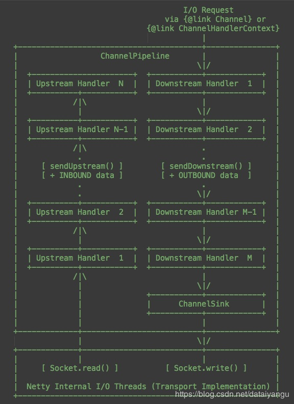

title: 基于Netty的RPC架构学习笔记（十一）：粘包、分包分析，如何避免socket攻击
author: Leesin.Dong
top: 
tags:
  - Netty
categories:
  - 学习笔记
  - 基于Netty的RPC架构学习笔记
date: 2019-3-10 10:21:11

---

# 问题
## 消息如何在管道中流转
当前的一个handler如何往下面的一个handler传递一个对象？
一个管道（pipeline）中会有多个handler
handler往下传递对象的方法是sendUpstream(event)

每个管道下面娥decoder、encoder其实最终都是继承了某个handler

当客户端发送消息到服务端以后netty会把这个消息对象封装成一个事件，把事件传递到管道里面，管道里面有很多handler,每次经过一个handler，就会出现一个新的事件，然后经过下一个handler，形成新的事件。
也没找到什么好的图解，感谢：https://www.cnblogs.com/chenmo-xpw/p/3938284.html

上图中其实是将一个channelEvent即事件传入了channel中的pipeline，下面源码中详细介绍。

## 源码解析
进入
### AbstractNioSelector.java

```js
run(){
		...
	    process(selector);
		...
}
```
从process方法到
### AbstractNioWorker.java

```js
process(){
	...
	if (!read(k)) {
	}
	...
}
```
从read方法到
### NioWorker.java

```js
read(k){
	//通过k得到channel
	final SocketChannel ch = (SocketChannel) k.channel();
	final NioSocketChannel channel = (NioSocketChannel) k.attachment();

	...
	final ChannelBuffer buffer = bufferFactory.getBuffer(readBytes);
    buffer.setBytes(0, bb);
    ...
    // Fire the event.
    fireMessageReceived(channel, buffer);
}
```
从fireMessageReceived方法再进入fireMessageReceived方法

```js
 public static void fireMessageReceived(Channel channel, Object message, SocketAddress remoteAddress) {
 //从channel中获取一个管道，往管道中发送了一个sendUpstream事件
        channel.getPipeline().sendUpstream(
        //new了一个UpstreamMessageEvent往管道中扔
                new UpstreamMessageEvent(channel, message, remoteAddress));
    }
//上传的event
  public void sendUpstream(ChannelEvent e) {
  //首先获取到一个DefaultChannelHandlerContext,在下面
  //head是头指针
  //getActualUpstreamContext方法在下面的DefualtChannelPipeline.java
        DefaultChannelHandlerContext head = getActualUpstreamContext(this.head);
        if (head == null) {
            if (logger.isWarnEnabled()) {
                logger.warn(
                        "The pipeline contains no upstream handlers; discarding: " + e);
            }

            return;
        }
//接着head里面接着send
//具体实现在DefaultChannelPipeline.java
        sendUpstream(head, e);
    }
```
### DefaultChannelHandlerContext.java
```js
private final class DefaultChannelHandlerContext implements ChannelHandlerContext {
		//有next和prev来维护链表的关系。
        volatile DefaultChannelHandlerContext next;
        volatile DefaultChannelHandlerContext prev;
        private final String name;
        //就是前面的demo中的encodehandler和decodehandler
        private final ChannelHandler handler;
        private final boolean canHandleUpstream;
        private final boolean canHandleDownstream;
        private volatile Object attachment;
....
}
```
实际上就是通过ChannelHandlerContext封装handler对象，让handler和handler之间有一个双向链表的关系
### DefualtChannelPipeline.java

```js
private DefaultChannelHandlerContext getActualUpstreamContext(DefaultChannelHandlerContext ctx) {
        if (ctx == null) {
            return null;
        }

        DefaultChannelHandlerContext realCtx = ctx;
        //判断头指针是不是一个可以接受Upstream的handler
        while (!realCtx.canHandleUpstream()) {
        //不是的话就往下找，找下一个可以接受Upstream的handler
            realCtx = realCtx.next;
            if (realCtx == null) {
                return null;
            }
        }

        return realCtx;
    }


    void sendUpstream(DefaultChannelHandlerContext ctx, ChannelEvent e) {
        try {
        //从head里面得到这些handler，然后调用这些handler的handleUpstream方法
        //这个方法是抽象方法，当前的类继承自SimpleChannelUpstreamHandler类，所以去这个类中看具体实现
        //SimpleChannelUpstreamHandler在下面
            ((ChannelUpstreamHandler) ctx.getHandler()).handleUpstream(ctx, e);
        } catch (Throwable t) {
            notifyHandlerException(e, t);
        }
    }
```
我们demo中的StringDecoder和Hellohandler是可以接受Upstream的，但是StringEncoder是不行的，因为implements ChannelDownstreamHandler，是一个下行的handler
### SimpleChannelUpstreamHandler.java
```js
public void handleUpstream(
            ChannelHandlerContext ctx, ChannelEvent e) throws Exception {
		
        if (e instanceof MessageEvent) {
        //如果是MessageEvent，就执行messageReceived方法
        //public void messageReceived(
        //    ChannelHandlerContext ctx, MessageEvent e) throws Exception {
        //调用完了之后接着调用	sendUpstream方法
        // ctx.sendUpstream(e);
   		 //}	
   		 //public void sendUpstream(ChannelEvent e) {
          //  DefaultChannelHandlerContext next = getActualUpstreamContext(this.next);
         //   if (next != null) {
         //从当前节点往下找下一个可以处理sendUpstream的handler，继续传递e事件
         //       DefaultChannelPipeline.this.sendUpstream(next, e);
          //  }
       	//	 }
            messageReceived(ctx, (MessageEvent) e);
        } else if (e instanceof WriteCompletionEvent) {
            WriteCompletionEvent evt = (WriteCompletionEvent) e;
            writeComplete(ctx, evt);
        } else if (e instanceof ChildChannelStateEvent) {
            ChildChannelStateEvent evt = (ChildChannelStateEvent) e;
            if (evt.getChildChannel().isOpen()) {
                childChannelOpen(ctx, evt);
            } else {
                childChannelClosed(ctx, evt);
            }
        } else if (e instanceof ChannelStateEvent) {
            ChannelStateEvent evt = (ChannelStateEvent) e;
            switch (evt.getState()) {
            case OPEN:
                if (Boolean.TRUE.equals(evt.getValue())) {
                    channelOpen(ctx, evt);
                } else {
                    channelClosed(ctx, evt);
                }
                break;
          ....
    }

```
 通过上面这段代码知道
 **<font color="red">  handler往下传递的一个方法是 sendUpstream ，应该继承SimpleChannelUpstreamHandler</font>**
## 验证
验证上面的 handler往下传递的一个方法是 sendUpstream
 **<font color="red"> 自己定义handler。
   </font>**

### Server.java

```js
package com.server;

import java.net.InetSocketAddress;
import java.util.concurrent.ExecutorService;
import java.util.concurrent.Executors;

import org.jboss.netty.bootstrap.ServerBootstrap;
import org.jboss.netty.channel.ChannelPipeline;
import org.jboss.netty.channel.ChannelPipelineFactory;
import org.jboss.netty.channel.Channels;
import org.jboss.netty.channel.socket.nio.NioServerSocketChannelFactory;
import org.jboss.netty.handler.codec.string.StringDecoder;
import org.jboss.netty.handler.codec.string.StringEncoder;

public class Server {

	public static void main(String[] args) {
		//服务类
		ServerBootstrap bootstrap = new ServerBootstrap();
		
		//boss线程监听端口，worker线程负责数据读写
		ExecutorService boss = Executors.newCachedThreadPool();
		ExecutorService worker = Executors.newCachedThreadPool();
		
		//设置niosocket工厂
		bootstrap.setFactory(new NioServerSocketChannelFactory(boss, worker));
		
		//设置管道的工厂
		bootstrap.setPipelineFactory(new ChannelPipelineFactory() {
			
			@Override
			public ChannelPipeline getPipeline() throws Exception {

				ChannelPipeline pipeline = Channels.pipeline();
				pipeline.addLast("handler1", new MyHandler1());
				pipeline.addLast("handler2", new MyHandler2());
				return pipeline;
			}
		});
		
		bootstrap.bind(new InetSocketAddress(10101));
		
		System.out.println("start!!!");
	}

}

```
### Handler1.java

```js
package com.server;

import org.jboss.netty.buffer.ChannelBuffer;
import org.jboss.netty.channel.ChannelHandlerContext;
import org.jboss.netty.channel.MessageEvent;
import org.jboss.netty.channel.SimpleChannelHandler;
import org.jboss.netty.channel.UpstreamMessageEvent;

public class MyHandler1 extends SimpleChannelHandler {

	@Override
	public void messageReceived(ChannelHandlerContext ctx, MessageEvent e) throws Exception {

		ChannelBuffer buffer = (ChannelBuffer)e.getMessage();
		
		byte[] array = buffer.array();
		String message = new String(array);
		System.out.println("handler1:" + message);
		
		//传递
		ctx.sendUpstream(new UpstreamMessageEvent(ctx.getChannel(), "abc", e.getRemoteAddress()));
		ctx.sendUpstream(new UpstreamMessageEvent(ctx.getChannel(), "efg", e.getRemoteAddress()));
	}
}

```
### Handler2.java

```js
package com.server;

import org.jboss.netty.channel.ChannelHandlerContext;
import org.jboss.netty.channel.MessageEvent;
import org.jboss.netty.channel.SimpleChannelHandler;

public class MyHandler2 extends SimpleChannelHandler {

	@Override
	public void messageReceived(ChannelHandlerContext ctx, MessageEvent e) throws Exception {

		String message = (String)e.getMessage();
		
		System.out.println("handler2:" + message);
	}
}

```
### Client.java

```js
package com.server;

import java.net.Socket;

public class Client {

	public static void main(String[] args) throws Exception {

		Socket socket = new Socket("127.0.0.1", 10101);
		
		socket.getOutputStream().write("hello".getBytes());
		
		socket.close();
	}

}

```
### 输出

```js
start！！！
handler1：hello
handler2：abc
handler2：efg
```
注意handler1中，通过如下代码向下传递

```js
//传递
		ctx.sendUpstream(new UpstreamMessageEvent(ctx.getChannel(), "abc", e.getRemoteAddress()));
		ctx.sendUpstream(new UpstreamMessageEvent(ctx.getChannel(), "efg", e.getRemoteAddress()));
```
# 观察粘包、分包现象，并进行处理。
粘包就是客户端分十次进行传递十个hello，可是客户端一次就输出了，所以不能判断是几次请求，相当于只处理了一次
## 举个🌰
### Server.java

```js
package com.server;

import java.net.InetSocketAddress;
import java.util.concurrent.ExecutorService;
import java.util.concurrent.Executors;

import org.jboss.netty.bootstrap.ServerBootstrap;
import org.jboss.netty.channel.ChannelPipeline;
import org.jboss.netty.channel.ChannelPipelineFactory;
import org.jboss.netty.channel.Channels;
import org.jboss.netty.channel.socket.nio.NioServerSocketChannelFactory;
import org.jboss.netty.handler.codec.string.StringDecoder;
import org.jboss.netty.handler.codec.string.StringEncoder;

public class Server {

	public static void main(String[] args) {
		//服务类
		ServerBootstrap bootstrap = new ServerBootstrap();
		
		//boss线程监听端口，worker线程负责数据读写
		ExecutorService boss = Executors.newCachedThreadPool();
		ExecutorService worker = Executors.newCachedThreadPool();
		
		//设置niosocket工厂
		bootstrap.setFactory(new NioServerSocketChannelFactory(boss, worker));
		
		//设置管道的工厂
		bootstrap.setPipelineFactory(new ChannelPipelineFactory() {
			
			@Override
			public ChannelPipeline getPipeline() throws Exception {

				ChannelPipeline pipeline = Channels.pipeline();
				//pipeline.addLast("decoder", new MyDecoder());
				pipeline.addLast("handler1", new HelloHandler());
				return pipeline;
			}
		});
		
		bootstrap.bind(new InetSocketAddress(10101));
		
		System.out.println("start!!!");
	}

}

```
### HelloHandler.java

```js
package com.server;

import org.jboss.netty.channel.ChannelHandlerContext;
import org.jboss.netty.channel.MessageEvent;
import org.jboss.netty.channel.SimpleChannelHandler;

public class HelloHandler extends SimpleChannelHandler {
	
	@Override
	public void messageReceived(ChannelHandlerContext ctx, MessageEvent e) throws Exception {
		
		ChannelBuffer message = (ChannelBuffer)e.getMessage();
		byte[] array = message.arrage();
		System.out.println(new String (array))
	}
}

```


### Client.java

```js
package com.server;

import java.net.Socket;
import java.nio.ByteBuffer;

public class Client {

	public static void main(String[] args) throws Exception {
		Socket socket = new Socket("127.0.0.1", 10101);
		
		String message = "hello";
		
		byte[] bytes = message.getBytes();
		
		//ByteBuffer buffer = ByteBuffer.allocate(4 + bytes.length);
		//buffer.putInt(bytes.length);
		//buffer.put(bytes);
		
	//	byte[] array = buffer.array();
			
	//	for(int i=0; i<1000; i++){
	//		socket.getOutputStream().write(array);
	//	}
	for(int i=0; i<1000; i++){
			socket.getOutputStream().write(message);
		}
			
		socket.close();
	}

}

```
### 输出

```js
start!!!
hellohellohellohellohellohellohellohellohellohellohellohellohellohellohellohellohellohellohellohell
ohellohellohellohellohellohellohellohellohellohellohellohe
llohellohellohellohellohellohellohello
hellohellohellohellohello
```
如图将很多请求当做一次请求输出，就是粘包，后面几行的行首不是he开头的，就是而是上一行的行尾和本行行首分开了，就是分包
## 解决
定义一个稳定的结构 length + hello
### MyDecoder.java

```js
package com.server;

import org.jboss.netty.buffer.ChannelBuffer;
import org.jboss.netty.channel.Channel;
import org.jboss.netty.channel.ChannelHandlerContext;
import org.jboss.netty.handler.codec.frame.FrameDecoder;

public class MyDecoder extends FrameDecoder {

	@Override
	protected Object decode(ChannelHandlerContext ctx, Channel channel, ChannelBuffer buffer) throws Exception {

		if(buffer.readableBytes() > 4){
			
			//这段代码是为了防止字节流攻击，本文的下面小节中会讲到
			if(buffer.readableBytes() > 2048){
				buffer.skipBytes(buffer.readableBytes());
			}
			
			
			//标记
			buffer.markReaderIndex();
			//长度
			int length = buffer.readInt();
			
			if(buffer.readableBytes() < length){
				buffer.resetReaderIndex();
				//缓存当前剩余的buffer数据，等待剩下数据包到来
				return null;
			}
			
			//读数据
			byte[] bytes = new byte[length];
			buffer.readBytes(bytes);
			//往下传递对象
			return new String(bytes);
		}
		//缓存当前剩余的buffer数据，等待剩下数据包到来
		return null;
	}

}

```
#### 问题
1、为什么FrameDecoder return的对象就是往下传递的对象

2、buffer里面数据未被读取完怎么办？    

3、为什么return null就可以缓存buffer     

会在本文章的下面的小节中解答
### HelloHandler.java
上面的HelloHandler修改为

```js
package com.server;

import org.jboss.netty.channel.ChannelHandlerContext;
import org.jboss.netty.channel.MessageEvent;
import org.jboss.netty.channel.SimpleChannelHandler;

public class HelloHandler extends SimpleChannelHandler {
//为了确定是不是一次一次的请求过来的，
//因为pipeline中处理handler的时间是一个单线程的时间
//不会涉及到并发，所以直接给一个私有变量即可。
	
	private int count = 1;

	@Override
	public void messageReceived(ChannelHandlerContext ctx, MessageEvent e) throws Exception {
		
		System.out.println(e.getMessage() + "  " +count);
		count++;
	}
}

```
### 在server.java中添加

```js
pipeline.addLast("decoder", new MyDecoder());
pipeline.addLast("handler1", new HelloHandler());
```
### 输出

```js
start！！！
hello 1
hello 2
hello 3
hello 4
```
# 查看FramDecoder源码（解决上小节的疑问）
FramDecoder 继承SimpleChannelUpstreamHandler
上面提到进入pipeline后第一个处理的方法是messageReceived方法
## FramDecoder
```js
@Override
    public void messageReceived(
            ChannelHandlerContext ctx, MessageEvent e) throws Exception {

        Object m = e.getMessage();
        if (!(m instanceof ChannelBuffer)) {
        //判断是不是channelbuffer，不是的话就向下传递事件
            ctx.sendUpstream(e);
            return;
        }

        ChannelBuffer input = (ChannelBuffer) m;
        if (!input.readable()) {
        //判断有没有数据可读，没有的话就直接返回
            return;
        }
		//这里的cumulation其实就是一个缓存的buffer对象	
		//假如handler中return null之后buffer中海有数据，就存到这里面
		//假如读完之后，往下传递对象，但是buffer中还有未传递完的对象，也会将数据存到里面
		//其实        protected ChannelBuffer cumulation; 本身也是一个channelbuffer
        if (cumulation == null) {
            try {
                // the cumulation buffer is not created yet so just pass the input to callDecode(...) method
                //第一次进来cumulation里面没有缓存的数据进入callDecode对象，往下面看
                //第三个参数是我们的input
                //这个方法具体实现往下看
                callDecode(ctx, e.getChannel(), input, e.getRemoteAddress());
            } finally {
            	//缓存数据到cumulation
                updateCumulation(ctx, input);
            }
        } else {
        //Cumulation中有数据，就把新的数据添加到cumulation后面,具体代码往下看
            input = appendToCumulation(input);
            try {
            //再次进入callDecode方法
                callDecode(ctx, e.getChannel(), input, e.getRemoteAddress());
            } finally {
                updateCumulation(ctx, input);
            }
        }
    }


 private void callDecode(
            ChannelHandlerContext context, Channel channel,
            ChannelBuffer cumulation, SocketAddress remoteAddress) throws Exception {

        while (cumulation.readable()) {
        //首先记录一下读指针位置
            int oldReaderIndex = cumulation.readerIndex();
            //然后执行decode方法，这里的decode方法就是我我们之前自定义的myDecoder等方法
            //回一下之前自定义的，如果进来的数据小于四个字节，直接return null，如果长度不够也return null
            //判断长度之后，读，读完之后buffer中还有数据，return new String（）；
            //看一下这里renturn的对象是frame
            Object frame = decode(context, channel, cumulation);
            if (frame == null) {
            //首先看旧的指针和现在的是不是一样
                if (oldReaderIndex == cumulation.readerIndex()) {
                    // Seems like more data is required.
                    // Let us wait for the next notification.
                    //是的话就不管了
                    //第一次return了返回看上面的代码
                    break;
                } else {
                    // Previous data has been discarded.
                    // Probably it is reading on.
                    continue;
                }
            }
            //如果我们自定义的Handler不是return null，就走这里
            //如果旧的指针和新的指针相同的话，就会抛出异常
            //可是我们return的是一个string，所以肯定不是null
            if (oldReaderIndex == cumulation.readerIndex()) {
                throw new IllegalStateException(
                        "decode() method must read at least one byte " +
                        "if it returned a frame (caused by: " + getClass() + ')');
            }
			//所以走到了这里，具体代码往下看
            unfoldAndFireMessageReceived(context, remoteAddress, frame);
        }
    }
    //就是看input里面还有没有数据，有的话就把数据加到cumulation中
protected ChannelBuffer updateCumulation(ChannelHandlerContext ctx, ChannelBuffer input) {
        ChannelBuffer newCumulation;
        int readableBytes = input.readableBytes();
        if (readableBytes > 0) {
            int inputCapacity = input.capacity();

            // If input.readableBytes() == input.capacity() (i.e. input is full),
            // there's nothing to save from creating a new cumulation buffer
            // even if input.capacity() exceeds the threshold, because the new cumulation
            // buffer will have the same capacity and content with input.
            if (readableBytes < inputCapacity && inputCapacity > copyThreshold) {
                // At least one byte was consumed by callDecode() and input.capacity()
                // exceeded the threshold.
                cumulation = newCumulation = newCumulationBuffer(ctx, input.readableBytes());
                cumulation.writeBytes(input);
            } else {
                // Nothing was consumed by callDecode() or input.capacity() did not
                // exceed the threshold.
                if (input.readerIndex() != 0) {
                    cumulation = newCumulation = input.slice();
                } else {
                    cumulation = newCumulation = input;
                }
            }
        } else {
            cumulation = newCumulation = null;
        }
        return newCumulation;
    }
    //如过cumulation中有数据，就把新的数据加到后面，返回上面接着看
 protected ChannelBuffer appendToCumulation(ChannelBuffer input) {
        ChannelBuffer cumulation = this.cumulation;
        assert cumulation.readable();
        if (cumulation instanceof CompositeChannelBuffer) {
            // Make sure the resulting cumulation buffer has no more than the configured components.
            CompositeChannelBuffer composite = (CompositeChannelBuffer) cumulation;
            if (composite.numComponents() >= maxCumulationBufferComponents) {
                cumulation = composite.copy();
            }
        }

        this.cumulation = input = ChannelBuffers.wrappedBuffer(cumulation, input);
        return input;
    }

 protected final void unfoldAndFireMessageReceived(
            ChannelHandlerContext context, SocketAddress remoteAddress, Object result) {
        if (unfold) {
        	//result就是我们上面的frame，就是自定义的handler中的return 后面的值（走到这步说明return肯定不是null）
        	//如果是数组
            if (result instanceof Object[]) {
                for (Object r: (Object[]) result) {
                    Channels.fireMessageReceived(context, r, remoteAddress);
                }
            } else if (result instanceof Iterable<?>) {
                for (Object r: (Iterable<?>) result) {
                    Channels.fireMessageReceived(context, r, remoteAddress);
                }
            } else {
            //fireMessageReceived方法往下看，其实还是执行了sendUpStream方法，也就是往下传。
                Channels.fireMessageReceived(context, result, remoteAddress);
            }
        } else {
            Channels.fireMessageReceived(context, result, remoteAddress);
        }
    }

public static void fireMessageReceived(
            ChannelHandlerContext ctx, Object message, SocketAddress remoteAddress) {
        ctx.sendUpstream(new UpstreamMessageEvent(
                ctx.getChannel(), message, remoteAddress));
    }
```
## 答案
1、为什么FrameDecoder return的对象就是往下传递的对象  （还是调用了sendUpstream）

2、buffer里面数据未被读取完怎么办？    （cumulation缓存）

3、为什么return null就可以缓存buffer     （cumulation缓存）

# 如何避免socket攻击 
上面的长度加内容的方式还是有问题的
比如客户端发送的数据 长度是8，可是真正发送了10个字节。
或者客户端发送了Integer.Max个字节，每次判断

```js
if(buffer.readableBytes() < length){
				buffer.resetReaderIndex();
				//缓存当前剩余的buffer数据，等待剩下数据包到来
				return null;
}
```
每次都是判断，不断的网缓存里面生产数据包，知道内存不够，宕机

把长度定义的很大，这种数据包，通常被称为socket攻击，字节流式攻击

## 解决（🌰）
可以通过清除缓存的方式，可是因为清除了数据之后，因为可能会出现分包截断的现象，下次进来的时候，可能不是开头，所以不能知道哪个是长度，哪个是数据，所以需要包头，只有当时读到包头的时候才继续往下走。
### ResponseDecoder.java

```js
package com.cn.codc;

import org.jboss.netty.buffer.ChannelBuffer;
import org.jboss.netty.channel.Channel;
import org.jboss.netty.channel.ChannelHandlerContext;
import org.jboss.netty.handler.codec.frame.FrameDecoder;
import com.cn.constant.ConstantValue;
import com.cn.model.Response;

/**
 * response解码器
 * <pre>
 * 数据包格式
 * +——----——+——-----——+——----——+——----——+——-----——+——-----——+
 * | 包头          | 模块号        | 命令号       |  状态码    |  长度          |   数据       |
 * +——----——+——-----——+——----——+——----——+——-----——+——-----——+
 * </pre>
 * 包头4字节
 * 模块号2字节short
 * 命令号2字节short
 * 长度4字节(描述数据部分字节长度)
 * 
 -
 *
 */
public class ResponseDecoder extends FrameDecoder{
	
	/**
	 * 数据包基本长度
	 */
	public static int BASE_LENTH = 4 + 2 + 2 + 4;

	@Override
	protected Object decode(ChannelHandlerContext arg0, Channel arg1, ChannelBuffer buffer) throws Exception {
		
		//可读长度必须大于基本长度
		if(buffer.readableBytes() >= BASE_LENTH){
			//防止字节流攻击
			if(buffer.readableBytes()>2048){
			//清除缓存中的数据
				buffer.skipBytes(buffer.readableBytes());
			}
			//记录包头开始的index
			int beginReader ；
			
			while(true){
				beginReader = buffer.readerIndex();
				//标记当前索引
				buffer.markReaderIndex();
				//判断包头是否是当前的包头
				//因为清除了数据之后，因为可能会出现分包截断的现象，下次进来的时候，
				//可能不是开头，所以不能知道哪个是长度，哪个是数据，所以需要包头，
				//只有当时读到包头的时候才继续往下走。
				if(buffer.readInt() == ConstantValue.FLAG){
					break;
				}
				//未读到包头超过了一个字节
				buffer.resetReaderIndex();
				//因为可能读一个int之后，略过了包头，因为可能包头在第一个字节处
				//所以这里选择继续往下读一个字节
				buffer.readByte();
				//可能出现极端的情况，长度又变得不满足
				if(buffer.readableBytes()<BASE_LENGTH){
					return null
				}
			}
			
			//模块号
			short module = buffer.readShort();
			//命令号
			short cmd = buffer.readShort();
			//状态码
			int stateCode = buffer.readInt();
			//长度
			int length = buffer.readInt();
			
			if(buffer.readableBytes() < length){
				//还原读指针
				buffer.readerIndex(beginReader);
				return null;
			}
			
			byte[] data = new byte[length];
			buffer.readBytes(data);
			
			Response response = new Response();
			response.setModule(module);
			response.setCmd(cmd);
			response.setStateCode(stateCode);
			response.setData(data);
			
			//继续往下传递 
			return response;
			
		}
		//数据包不完整，需要等待后面的包来
		return null;
	}

}
```