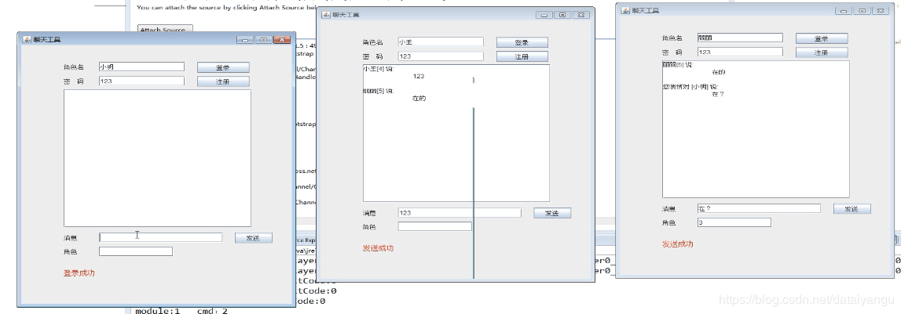

title: 基于Netty的RPC架构学习笔记（十二）：借助spring实现业务分离、聊天室小项目、netty3和4、5的不同、业务线程池以及消息串行化
author: Leesin.Dong
top: 
tags:

  - Netty
categories:
  - 学习笔记
  - 基于Netty的RPC架构学习笔记
date: 2019-3-10 10:21:12

---

# 借助spring实现业务分离（🌰）
## 问题
之前的文章中的handler每次都需要判断如果是moudle=？然后如果cmd=？，才进行我们的业务，这里希望能够通过某种方法实现自动执行moudle=？cmd=？时候的方法，从而实现业务分离。
```js
public void messageReceived(ChannelHandlerContext ctx, MessageEvent e) throws Exception {
	//修改为response对象
			Response message = (Response)e.getMessage();
			if(message.getModule() == 1){
				if(message.getCmd() == 1){
					。。。
				}else if(message.getCmd() == 2){
				}
			}else if (message.getModule() == 1){			
			}
	}
}
```
下面是一个通过spring实现业务分离的🌰
## SocketMoudle(interface)

```js
@SocketMoudle(moudle=1)
public interface UserService {
	@SocketCmd(cmd=1)
	public void login();
	@SocketCmd(cmd=2)
	public void getInfo();
	}
```
## Scanner.java

```js
@Component
public class Scanner implements BeanPostProcessor {
	@Override
	public Object postProcessBeforeInitialization(Object bean, String beanName) throws BeansException {
		return bean;
	}
	@Override
	public Object postProcessAfterInitialization(Object bean, String beanName) throws BeansException {
		Class<? extends Object> clazz = bean.getClass();
		Class<?>[] interfaces = clazz.getInterfaces();
		if(interfaces != null && interfaces.length > 0){
			//扫描类的所有接口父类
			for (Class<?> interFace : interfaces) {
				//判断是否为handler接口类
				//getAnnotation获得interface中注解名字为SocketModule的注解对象
				SocketModule socketModule = interFace.getAnnotation(SocketModule.class);
				if (socketModule == null) {
					continue;
				}
				
				//找出命令方法
				Method[] methods = interFace.getMethods();
				if(methods != null && methods.length > 0){
					for(Method method : methods){
				//getAnnotation获得method中注解名字为SocketCmd的注解对象
						SocketCmd socketCmd = method.getAnnotation(SocketCmd.class);
						if(socketCmd == null){
							continue;
						}	
						//获得注解里面的moudle值			
						final short module = socketModule.module();
						//获得注解里面的cmd值
						final short cmd = socketCmd.cmd();
						//InvokerHolder、Invoker在下面，对invoke进行了封装
						if(InvokerHoler.getInvoker(module, cmd) == null){
							InvokerHoler.addInvoker(module, cmd, Invoker.valueOf(method, bean));
						}else{
							System.out.println("重复命令:"+"module:"+module +" "+"cmd：" + cmd);
						}
					}
				}
				
			}
		}
		return bean;
	}

}

```
Invoker.java

```js
public class Invoker {
	
	/**
	 * 方法
	 */
	private Method method;
	
	/**
	 * 目标对象
	 */
	private Object target;
	
	public static Invoker valueOf(Method method, Object target){
		Invoker invoker = new Invoker();
		invoker.setMethod(method);
		invoker.setTarget(target);
		return invoker;
	}
	
	/**
	 * 执行
	 * @param paramValues
	 * @return
	 * @throws InvocationTargetException 
	 * @throws IllegalArgumentException 
	 * @throws IllegalAccessException 
	 */
	public Object invoke(Object... paramValues){
		try {
			return method.invoke(target, paramValues);
		} catch (IllegalAccessException e) {
			e.printStackTrace();
		} catch (IllegalArgumentException e) {
			e.printStackTrace();
		} catch (InvocationTargetException e) {
			e.printStackTrace();
		}
		return null;
	}

	public Method getMethod() {
		return method;
	}

	public void setMethod(Method method) {
		this.method = method;
	}

	public Object getTarget() {
		return target;
	}

	public void setTarget(Object target) {
		this.target = target;
	}
}
```
InvokerHodler.java

```js

public class InvokerHoler {
	
    /**命令调用器*/
    private static Map<Short, Map<Short, Invoker>> invokers = new HashMap<>();
    
    /**
     * 添加命令调用
     * @param module
     * @param cmd
     * @param invoker
     */
    public static void addInvoker(short module, short cmd, Invoker invoker){
    	Map<Short, Invoker> map = invokers.get(module);
    	if(map == null){
    		map = new HashMap<>();
    		invokers.put(module, map);
    	}
    	map.put(cmd, invoker);
    }
    
    
    /**
     * 获取命令调用
     * @param module
     * @param cmd
     * @param invoker
     */
    public static Invoker getInvoker(short module, short cmd){
    	Map<Short, Invoker> map = invokers.get(module);
    	if(map != null){
    		return map.get(cmd);
    	}
    	return null;
    }

}

```
将Scanner交给spring处理，这样，就可以通过注解实现业务分离。
# 聊天室项目
聊天室功能：多个客户端能够在类似qq群里聊天，某个用户能够指定角色几可以收到消息，如果角色在另一个客户端被登录，会被挤下线。


#  netty3和4、5的不同
|作用|netty3|netty4/5|
|:-----:|-|-|
|判断是否连接|channel.isConnected | channel.isActive                                                                                                                                                                                                                                                                                                                                                                                                                                                                                                                                             |
|发送数据|write|writeAndFlush                                                                                                                                                                                                                                                                                                                                                                                                                                                                                                                                                                  |
|绑定|getAttachement、setAttachement、removeAttachement| channe.attr(ATTACHMENT_KEY).set(attachement)/get()/remove()                                                                                                                                                                                                                                                                                                                                                                                                                                                                           |
|写数据（里面的方法一样，只是对象名字变了）|ChannelBuffer|ByteBuf                                                                                                                                                                                                                                                                                                                                                                                                                                                                                                                                               |
|new一个channel| ChannelBuffers.dynamicBuffer() |  PooledByteBufAllocator一个内存申请器(要注意使用完后释放buffer)release（）释放或UnpooledByteBufAllocator（最好也进行一次释放）或Unpooled（底层走的是UnpooledByteBufAllocator）       注意申请一次，就只能释放一次       -------当然netty封装消息的bytebuf用的是UnpooledByteBufAllocator，可以通过new ServerBootstrap().childOption(channelOption.ALLOCATOR,PooledByteBufAllocator.DEFAULT);还有：decode方法中传入的buffer是netty帮我们创建的，decode方法上层自动判断如果缓存（cumulation）中没有了数据就会自动释放。继承自SimpleChannelInbundHandler的handler顶层也会自动释放                                                                                           |
|协助我们解决粘包分包的问题（里面实现的原理差不多，只是改了名字）解码器|FrameDecoder|ByteToMessageDecoder                                                                                                                                                                                                                                                                                                                                                                                                                                                                                                                     |
| 编码器|OneToOneEncoder|MessageToByteEncoder                                                                                                                                                                                                                                                                                                                                                                                                                                                                                                                                                 |
|接收消息| messageReceive|channelRead0(netty5里面是messageReceive)                                                                                                                                                                                                                                                                                                                                                                                                                                                                                                                                |
                                                                                                                                                                                                                                                                                                                                                                                                                                                                                                                                                                                           
# 业务线程池
前面讲到抽象的例子，boss和worker分别是餐厅的服务员，负责的是帮客人点菜，可是点完菜之后做菜的过程么？做菜的过程就是业务，是不能交给服务员（boos和worker来做的），否则效率大打折扣。厨师应该有多个，a顾客要的才厨师1来做，剩下还有多个厨师，不影响其他顾客的正常消费。
上面例子中整个厨师团队就是业务线程池。

注意：如果不作处理的话，业务是在worker线程中的
## netty3中解决方法

```js
public class HiHandler extends SimpleChannelHandler {
	public static ExecutorService executorService = Executors.newFixedTHeradPool(Runtime.getRuntime().availableProcessors()*2);
	/**
	 * 接收消息
	 */
	@Override
	public void messageReceived(ChannelHandlerContext ctx, MessageEvent e) throws Exception {
	//修改为response对象
			Response message = (Response)e.getMessage();
			RUnnavle task  = handlerMessage(new SessionImpl(ctx.getChannel()),request);
			executorService.execute(task);
	}
	/**
	 * 消息处理
	 */
	public Runnavle handlerMessage(final Session session,final Request request){
		return new Runnable(){
			//此处省略业务处理的过程，自行脑补
			...
		}
	}
}
```
注意：
如果不自己将业务进行异步的话，netty其实是一个同步的过程（虽然netty被叫做异步）。
业务中回写数据也默认是异步的，因为在前面的源码介绍中有介绍，AbstractNioSelector.java中的run方法里面有 processTaskQueue();就是讲write回写的数据封装到了队列中，供异步调用。


## netty4、netty5中的解决方法
不需要自己new一个线程池
Server.java(server中)
```js
public class Server {

	public static void main(String[] args) throws InterruptedException {
		//服务类
		ClientBootstrap bootstrap = new  ClientBootstrap();
		//线程池
		EventLoopGroup bossGroup = new.NioEventLoopGroup();
		EventLoopGroup workerGroup = new.NioEventLoopGroup();
		//业务线程池
		EventLoopGroup busyGroup = new.NioEventLoopGroup();

		...
		ch.pipeline().addLast(new ResponseDecoder());
		ch.pipeline.addLast(new RequestEncoder());
		ch.pipeline.addLast(busyGroup,new HiHandler());
		...
```
这里只需要

```js
EventLoopGroup busyGroup = new.NioEventLoopGroup();
ch.pipeline.addLast(busyGroup,new HiHandler());//在new HiHandler（）前面加入busyGroup参数
```
原本的handler就不是再worker中运行了，变成了在上面的线程池循环组中运行

如果不加入这个参数，HiHandler和RequestEncoder是在一个线程中的（worker）
加入之后两个handler就不在一个线程中了。

 **<font color="red">注意： netty4、netty5中的这种方法比netty3要好   </font>**
 因为在EventLoopGroup具有消息串行化的功能

## 什么是消息串行化？
举个🌰：
假如a和b同时在打游戏
a发出指令1-1，要求锁定自己的账号，b也发出指令2-1，要求锁定a的账号，两者之间存在锁竞争是正常的。
可是如果a自己发出了5条1-1的指令，即连续要求锁定自己五次，五次请求同时进行，就会自己跟自己竞争。
一旦有了锁的竞争，就会十分影响效率

消息串行化就是请求一个一个执行

所以在netty3中需要自己实现编写可以实现有序的请求的处理线程，但是在netty4，netty5中EventLoopGroup具有消息串行化的功能。

具体实现可以开启多个线程，线程中存储着队列，将a和b的请求分别放到自己对应的线程中的队列中去，通过队列去执行，达到消息的串行化。