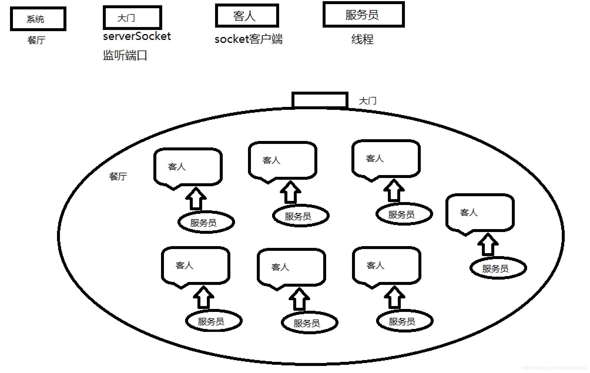
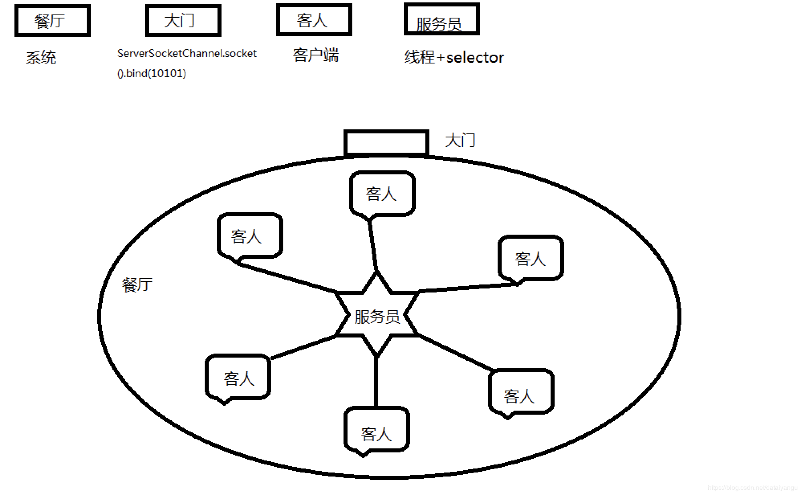
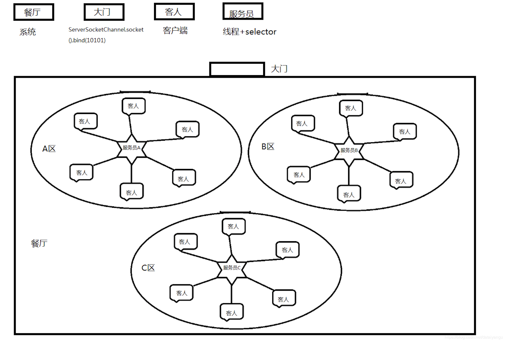
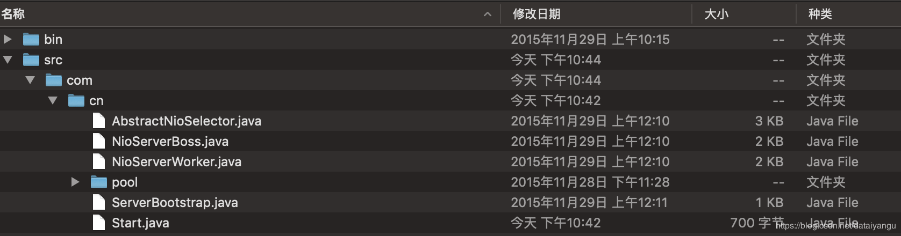

title: 基于Netty的RPC架构学习笔记（四）：netty线程模型源码分析（一）
author: Leesin.Dong
top: 
tags:
  - Netty
categories:
  - 学习笔记
  - 基于Netty的RPC架构学习笔记
date: 2019-3-10 10:21:04

---

# 如何提高NIO的工作效率


## 举个🌰
前面第一节中的NIO代码
```js
public void listen() throws IOException {
		System.out.println("服务端启动成功！");
		// 轮询访问selector
		while (true) {
			// 当注册的事件到达时，方法返回；否则,该方法会一直阻塞
			//点不进去select方法，因为底层是c写的
			selector.select();
			// 获得selector中选中的项的迭代器，选中的项为注册的事件
			Iterator<?> ite = this.selector.selectedKeys().iterator();
			while (ite.hasNext()) {
				SelectionKey key = (SelectionKey) ite.next();
				// 删除已选的key,以防重复处理
				ite.remove();
				handler(key);
			}
		}
	}
```
仅仅修改成

```js
public void listen() throws IOException {
		System.out.println("服务端启动成功！");
		// 轮询访问selector
		while (true) {
			// 当注册的事件到达时，方法返回；否则,该方法会一直阻塞
			//点不进去select方法，因为底层是c写的
			selector.select();
			// 获得selector中选中的项的迭代器，选中的项为注册的事件
			Iterator<?> ite = this.selector.selectedKeys().iterator();
			while (ite.hasNext()) {
				SelectionKey key = (SelectionKey) ite.next();
				// 删除已选的key,以防重复处理
				ite.remove();
				newCachedThreadPool.execute(new Runnable(){
					@Override
					public void run(){
					handler(key);
					}
				})

			}
		}
	}
```

```js
public void handlerAccept(SelectionKey key) throws IOException {
		ServerSocketChannel server = (ServerSocketChannel) key.channel();
		// 获得和客户端连接的通道，SocketChannel相当于传统io里面的Channel
		SocketChannel channel = server.accept();
		// 设置成非阻塞
		channel.configureBlocking(false);

		// 在这里可以给客户端发送信息哦
		System.out.println("新的客户端连接");
		// 在和客户端连接成功之后，为了可以接收到客户端的信息，需要给通道设置读的权限。
		channel.register(this.selector, SelectionKey.OP_READ);
	}
```

然后通过telnet请求一下

报错，空指针异常，因为虽然ite.remove，可是在handler（key）还没有处理完的时候就返回了，没有处理select方法并不不会阻塞，所以下次还是这个key去访问selector.select()，this.selector.selectedKeys()还是刚才的客户端，然后再进行一次handler，也就是这个ket又进行了一次accept，同一个key accept了两次。
看到上面的handleraccept方法，第一次已经accept到了客户端，所以第二次accept的时候就获取不到了

```js
SocketChannel channel = server.accept();
```
获取不到channel，这行代码的下面就抛出了空指针异常。

 **<font color="red"> 综上：NIO的多线程不能通过上面的方式   </font>**

##  小问题
###  一个NIO是不是只能有一个selector？

不是，一个系统可以有多个selector

###  selector是不是只能注册一个ServerSocketChannel？

不是，可以注册多个

```js
serverSocketChannel.register(selector, SelectionKey.OP_ACCEPT);
scocketchannel.register(this.selector, SelectionKey.OP_READ);
```
selector既要负责大门，又要负责每个客人点菜的需求
## 图说NettyIO
socketIO

NIO

NettyIO

随着餐厅规模的越来越大，需要更多的服务生，如何分配这些服务生呢？每个服务生分配到不同的区域，管理不同的区域，大门的地方也可以分配一个服务生。

# 如何构建一个多线程的NIO系统(🌰源码解读)
下面是一个精简了Netty源码的小例子（从Netty中抽取部分代码并整合）
代码结构：

start.java
```js
package com.cn;

import java.net.InetSocketAddress;
import java.util.concurrent.Executors;
import com.cn.pool.NioSelectorRunnablePool;
/**

- 启动函数

- 
   */
public class Start {
 public static void main(String[] args) {
  //初始化线程
  //NioSelectorRunnablePool是用来管理线程池的
  //给了两个线程池一个boss，一个worker
  //newCachedThreadPool 缓存的线程池，当一下子好多任务的时候，就开好多线程去做，如果没有任务
  //的时候，线程空闲下来的时候，慢慢线程的数量就会减少，自然消亡，简而言之就是线程的数量在某段时
  //间内是会扩张或者收缩的
  //这个类的构造函数在下面的NioSelectorRunnablePool.java
  NioSelectorRunnablePool nioSelectorRunnablePool = new NioSelectorRunnablePool(Executors.newCachedThreadPool(), Executors.newCachedThreadPool()); 
  //获取服务类，将线程管理者交给服务类
  //具体看ServerBoosTrap.java
  ServerBootstrap bootstrap = new ServerBootstrap(nioSelectorRunnablePool);  
  //绑定端口具体看ServerBoosTrap.java
  bootstrap.bind(new InetSocketAddress(10101));
  System.out.println("start");
  }
}
```
NioSelectorRunnablePool.java
```js
package com.cn.pool;

import java.util.concurrent.Executor;
import java.util.concurrent.atomic.AtomicInteger;
import com.cn.NioServerBoss;
import com.cn.NioServerWorker;
/**

- selector线程管理者

-
  *
   */
  public class NioSelectorRunnablePool {

  /**

  - boss线程数组
    */
    private final AtomicInteger bossIndex = new AtomicInteger();
    private Boss[] bosses;

  /**

  - worker线程数组
    */
    private final AtomicInteger workerIndex = new AtomicInteger();
    private Worker[] workeres;

  public NioSelectorRunnablePool(Executor boss, Executor worker) {
  //初始化线程池boss，默认是1的数量
  //往下一点点是initBoss这个方法
  	initBoss(boss, 1);
  	//初始化worker，传入worker线程池，数量是系统的核心数量*2
  	//往下看initWorker方法
  	initWorker(worker, Runtime.getRuntime().availableProcessors() * 2);
  }

  /**

  - 初始化boss线程
  - @param boss
  - @param count
    */
    private void initBoss(Executor boss, int count) {
    //NioServerBoss在下面NioServerBoss.java里面
    this.bosses = new NioServerBoss[count];
    for (int i = 0; i < bosses.length; i++) {
    //回到这里对每一个boss初始化
    //构造方法在下面
    	bosses[i] = new NioServerBoss(boss, "boss thread " + (i+1), this);
    }

  }

  /**

  - 初始化worker线程
  - @param worker
  - @param count
    */
    private void initWorker(Executor worker, int count) {
    this.workeres = new NioServerWorker[count];
    for (int i = 0; i < workeres.length; i++) {
    //NioServerWorker在下面
    	workeres[i] = new NioServerWorker(worker, "worker thread " + (i+1), this);
    }
    }

  /**

  - 获取一个worker
  - @return
    */
    public Worker nextWorker() {
     return workeres[Math.abs(workerIndex.getAndIncrement() % workeres.length)];

  }

  /**

  - 获取一个boss
  - @return
    */
    public Boss nextBoss() {
     return bosses[Math.abs(bossIndex.getAndIncrement() % bosses.length)];
    }

}
```
NioServerBoss,java
```js
package com.cn;

import java.io.IOException;
import java.nio.channels.ClosedChannelException;
import java.nio.channels.SelectionKey;
import java.nio.channels.Selector;
import java.nio.channels.ServerSocketChannel;
import java.nio.channels.SocketChannel;
import java.util.Iterator;
import java.util.Set;
import java.util.concurrent.Executor;

import com.cn.pool.Boss;
import com.cn.pool.NioSelectorRunnablePool;
import com.cn.pool.Worker;
/**

- boss实现类

- 
  *
   */
   //AbstractNioSelector在下面AbstractNioSelector.java这个类是selector的一个抽象类
   //为什么要是抽象类？
   //在门口的服务生和在里面为客人服务的服务生有很多共同点，比如关注多个地方，穿着一样
   //但是还有很多不同的地方，比如大门口的服务生说欢迎光临，大厅的服务生看哪里有点菜的需求
  public class NioServerBoss extends AbstractNioSelector implements Boss{
  public NioServerBoss(Executor executor, String threadName, NioSelectorRunnablePool selectorRunnablePool) {
  //调动的是其父类AbstractNioSelector的构造方法，往下看
  	super(executor, threadName, selectorRunnablePool);
  }
  @Override
  protected void process(Selector selector) throws IOException {
  	Set<SelectionKey> selectedKeys = selector.selectedKeys();
      if (selectedKeys.isEmpty()) {
          return;
      }
	  for (Iterator<SelectionKey> i = selectedKeys.iterator(); i.hasNext();) {
      SelectionKey key = i.next();
      i.remove();
      ServerSocketChannel server = (ServerSocketChannel) key.channel();
  	//accept 新客户端
  	SocketChannel channel = server.accept();
  	// 设置为非阻塞
  	channel.configureBlocking(false);
  	// 通过线程管理者，获取一个worker，
  	//门口的服务生引入客人后要带到某个区域的worker身边，告诉他你要负责这位客人。
  	Worker nextworker = getSelectorRunnablePool().nextWorker();
  	// 注册新客户端接入任务
  	//负责大厅的服务生给自己注册任务
  	//registerNewChannelTask具体的实现看下面的NioServerWorker类
  	//将当前的客户端注册给selector read事件
  	//这么做的好处是什么？？？有效的解决高并发
  	//往别的队列里面加任务，而不是直接去操作你的东西，你自己去处理这个任务，
  	nextworker.registerNewChannelTask(channel);
  	
  	System.out.println("新客户端链接");
  }
  }
  public void registerAcceptChannelTask(final ServerSocketChannel serverChannel){
  	 final Selector selector = this.selector;
  	 //注册完下面的事件之后，执行registerTask，具体看AbstractNioSelector.java
  	 //简而言之就是把任务放入队列，并wakenup
  	 registerTask(new Runnable() {
  		@Override
  		public void run() {
  			try {
  				//注册serverChannel，accept到selector
  				serverChannel.register(selector, SelectionKey.OP_ACCEPT);
  			} catch (ClosedChannelException e) {
  				e.printStackTrace();
  			}
  		}
  	});
  }
  @Override
  protected int select(Selector selector) throws IOException {
  	return selector.select();
  }
}
```
AbstractNioSelector.java
```js
package com.cn;
import java.io.IOException;
import java.nio.channels.Selector;
import java.util.Queue;
import java.util.concurrent.ConcurrentLinkedQueue;
import java.util.concurrent.Executor;
import java.util.concurrent.atomic.AtomicBoolean;
import com.cn.pool.NioSelectorRunnablePool;
/**
- 抽象selector线程类
- 
- */
  public abstract class AbstractNioSelector implements Runnable {
  /**
  - 线程池
    */
    private final Executor executor;
  /**
  - 选择器
    */
    protected Selector selector;
/**
  - 选择器wakenUp状态标记
    */
    protected final AtomicBoolean wakenUp = new AtomicBoolean();
  /**
 - 任务队列
    */
    private final Queue<Runnable> taskQueue = new ConcurrentLinkedQueue<Runnable>();
  /**
  - 线程名称
    */
    private String threadName;
  /**
  - 线程管理对象
    */
    protected NioSelectorRunnablePool selectorRunnablePool;
    //线程池、线程名、线程管理者
  AbstractNioSelector(Executor executor, String threadName, NioSelectorRunnablePool selectorRunnablePool) {
  	this.executor = executor;
  	this.threadName = threadName;
  	this.selectorRunnablePool = selectorRunnablePool;
  	//最后openSelector，往下看往每一个线程里面加入了selector这个东西
  	//一个线程加一个selector才有为多个客人服务的能力。
  	openSelector();
  }
  /**
  - 获取selector并启动线程
    */
    private void openSelector() {
    try {
    	this.selector = Selector.open();
    } catch (IOException e) {
    	throw new RuntimeException("Failed to create a selector.");
    }
    //用线程池执行当前对象，运行当前线程
    //这里的this就是bosses[i] = new NioServerBoss(boss, "boss thread " + (i+1), this);
    //继承AbstractNioSelect又实现了Runnable，所以有一个run方法，看下面
    executor.execute(this);
    }
  @Override
  public void run() {
  //给当前线程赋一个名字
  Thread.currentThread().setName(this.threadName);
  //这里是最核心的，看完这里回去看NioSelectorRunnablePool的initWorker
  while (true) {
  	try {
  		wakenUp.set(false);  
  		//selector的抽象方法有两个实现
  		//boos中return selector.select();直接阻塞了
  		//worker中return selector.select(500);超时时间500
  		select(selector);
  		//执行队列中的任务
  		//方法在下面
  		processTaskQueue(); 
  		//抽象方法被boss和worker实现，具体实现看上面的NioServerBoss和下面的NioServerWorker
  		process(selector);
  	} catch (Exception e) {
  		// ignore
  	}
  }
  }
  /**
  - 注册一个任务并激活selector
  - 
  - @param task
    */
//简而言之就是把任务放入队列，并wakenup
    protected final void registerTask(Runnable task) {
    //往队列中加了任务
    taskQueue.add(task);
    Selector selector = this.selector;
    if (selector != null) {
    //wakenUp是一个原子的类，conpareAndSet，看他是不是false，是false的话就设置为true
    	if (wakenUp.compareAndSet(false, true)) {
    	//加入一个新的客户端，要立马激活selector的阻塞状态，即如果原来select或select（long）
    	//被阻塞，调用这个方法将其立马返回。
    	//可以看到上面哪个方法里wakenUp.set(false);  
    	//看完这里回去接着看main方法中的第二行ServerBootstrap
    		selector.wakenup();
    	}
    } else {
    	taskQueue.remove(task);
    }
    }
  /**

  - 执行队列里的任务
    */
    private void processTaskQueue() {
    for (;;) {
    	final Runnable task = taskQueue.poll();
    	if (task == null) {
    		break;
    	}
    	task.run();
    }
    }
  /**
  - 获取线程管理对象
  - @return
    */
    public NioSelectorRunnablePool getSelectorRunnablePool() {
    return selectorRunnablePool;
    }
  /**
  - select抽象方法
  - 
  - @param selector
  - @return
  - @throws IOException
    */
    protected abstract int select(Selector selector) throws IOException;

  /**
  - selector的业务处理
  - 
  - @param selector
  - @throws IOException
    */
    protected abstract void process(Selector selector) throws IOException;

}
```
NioServerWorker.java

```js
package com.cn;

import java.io.IOException;
import java.nio.ByteBuffer;
import java.nio.channels.ClosedChannelException;
import java.nio.channels.SelectionKey;
import java.nio.channels.Selector;
import java.nio.channels.SocketChannel;
import java.util.Iterator;
import java.util.Set;
import java.util.concurrent.Executor;

import com.cn.pool.NioSelectorRunnablePool;
import com.cn.pool.Worker;
/**

- worker实现类

- 
  *
   */
   //和NioServerBoss是一样的继承AbstractNioSelector
  public class NioServerWorker extends AbstractNioSelector implements Worker{
  //和NioServerBoss是一样的运行父类的构造方法
  //跳转到上面的AbstractNioSelector类的构造方法
  public NioServerWorker(Executor executor, String threadName, NioSelectorRunnablePool selectorRunnablePool) {
  	super(executor, threadName, selectorRunnablePool);
  }

  @Override
  protected void process(Selector selector) throws IOException {
  	Set<SelectionKey> selectedKeys = selector.selectedKeys();
      if (selectedKeys.isEmpty()) {
          return;
      }
      Iterator<SelectionKey> ite = this.selector.selectedKeys().iterator();
  	while (ite.hasNext()) {
  		SelectionKey key = (SelectionKey) ite.next();
  		// 移除，防止重复处理
  		ite.remove();
	  	// 得到事件发生的Socket通道
	  	SocketChannel channel = (SocketChannel) key.channel();
	  	// 数据总长度
	  	int ret = 0;
	  	boolean failure = true;
	  	ByteBuffer buffer = ByteBuffer.allocate(1024);
	  	//读取数据
	  	try {
	  		ret = channel.read(buffer);
	  		failure = false;
	  	} catch (Exception e) {
	  		// ignore
	  	}
	  	//判断是否连接已断开
	  	if (ret <= 0 || failure) {
	  		key.cancel();
	  		System.out.println("客户端断开连接");
	      }else{
	      	 System.out.println("收到数据:" + new String(buffer.array()));	 
	   		//回写数据
	   		ByteBuffer outBuffer = ByteBuffer.wrap("收到\n".getBytes());
	   		channel.write(outBuffer);// 将消息回送给客户端
	      }
  }
  }
  /**

  - 加入一个新的socket客户端
    */
    public void registerNewChannelTask(final SocketChannel channel){
     final Selector selector = this.selector;
     //registerTask方法是抽象的在AbstractNioSelector，往上面看
     registerTask(new Runnable() {
    	@Override
    	public void run() {
    		try {
    			//将客户端注册到selector中
    			//将当前的客户端注册给selector read事件
    			channel.register(selector, SelectionKey.OP_READ);
    		} catch (ClosedChannelException e) {
    			e.printStackTrace();
    		}
    	}
    });
    }

  @Override
  protected int select(Selector selector) throws IOException {
  	return selector.select(500);
  }

}
```
ServerBootstrap.java

```js
package com.cn;
import java.net.SocketAddress;
import java.nio.channels.ServerSocketChannel;
import com.cn.pool.Boss;
import com.cn.pool.NioSelectorRunnablePool;
/**

- 服务类
- 
  *
   */
   //简单看下回到上面的main函数第三行绑定端口
  public class ServerBootstrap {
private NioSelectorRunnablePool selectorRunnablePool;
public ServerBootstrap(NioSelectorRunnablePool selectorRunnablePool) {
	this.selectorRunnablePool = selectorRunnablePool;
}

/**
 * 绑定端口
 * @param localAddress
 */
public void bind(final SocketAddress localAddress){
	try {
		// 获得一个ServerSocket通道
		ServerSocketChannel serverChannel = ServerSocketChannel.open();
		// 设置通道为非阻塞
		serverChannel.configureBlocking(false);
		// 将该通道对应的ServerSocket绑定到port端口
		serverChannel.socket().bind(localAddress);
		//获取一个boss线程，因为boss线程是专门负责监听端口的
		Boss nextBoss = selectorRunnablePool.nextBoss();
		//向boss注册一个ServerSocket通道
		//注册时间和上面的worker的注册时间类似
		//具体看NioServerBoss.java
		nextBoss.registerAcceptChannelTask(serverChannel);
	} catch (Exception e) {
		e.printStackTrace();
	}
}
}
```
boss.java

```js
package com.cn.pool;

import java.nio.channels.ServerSocketChannel;
/**

- boss接口

- 
  *
   */
  public interface Boss {

  /**

  - 加入一个新的ServerSocket
  - @param serverChannel
    */
    public void registerAcceptChannelTask(ServerSocketChannel serverChannel);
    }
```
worker.java

```js
package com.cn.pool;

import java.nio.channels.SocketChannel;
/**

- worker接口

-
  *
   */
  public interface Worker {

  /**

  - 加入一个新的客户端会话
  - @param channel
    */
    public void registerNewChannelTask(SocketChannel channel);

}
```

# 学到的思想
上面的process方法被boss和worker继承，boss中除了给新客户端accept之外，还往worker的队列中加入了当前客户端的read任务
很多时候都是这样，我不会去操作你的某些东西，而是把任务放到的队列中，具体怎么执行和我无关，能够有效的解决高并发