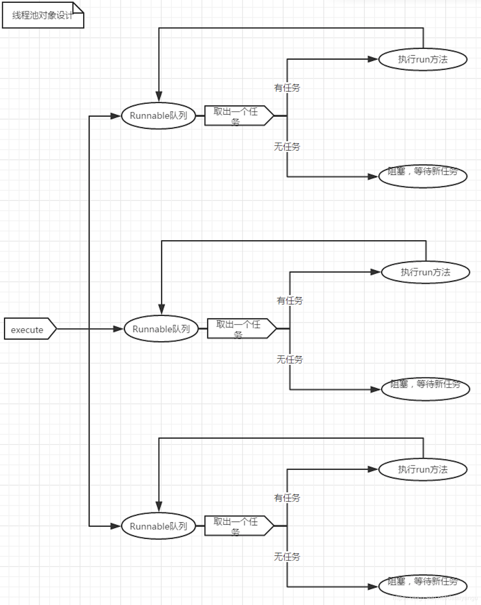
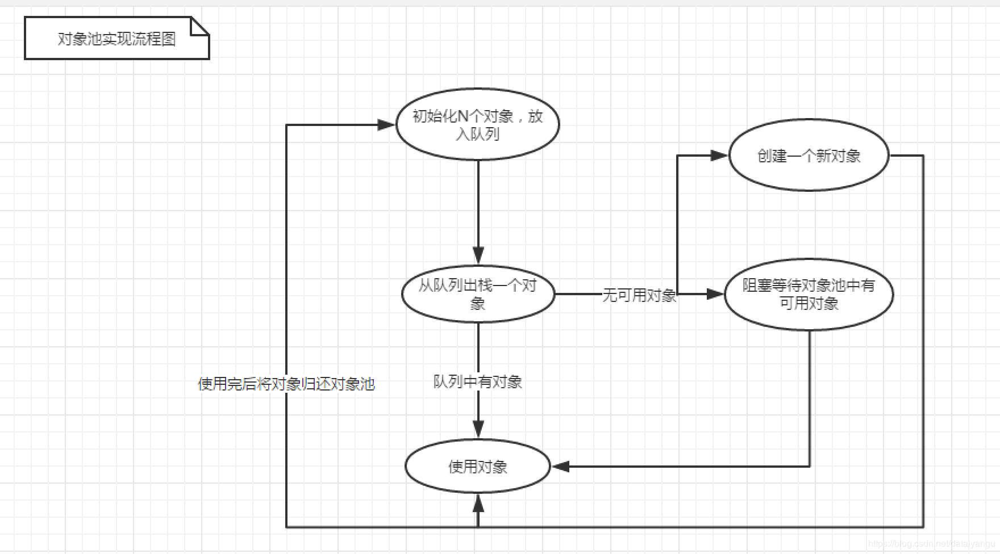
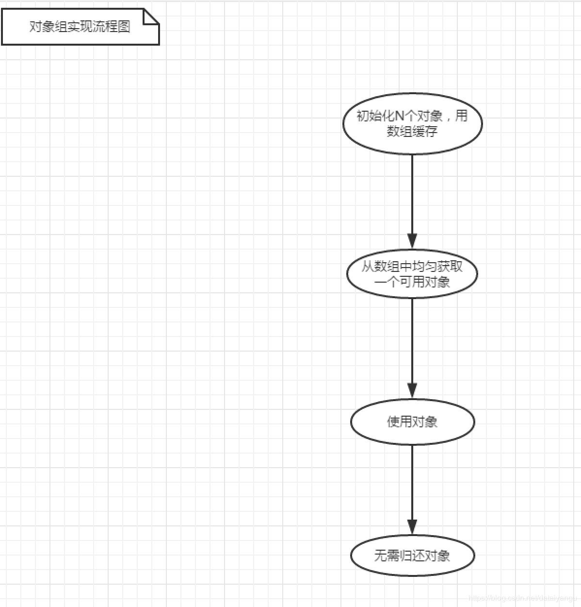

title: 基于Netty的RPC架构学习笔记（六）：netty5案例学习
author: Leesin.Dong
top: 
tags:
  - Netty
categories:
  - 学习笔记
  - 基于Netty的RPC架构学习笔记
date: 2019-3-10 10:21:06

---


# netty5服务端入门案例
Server.java

```js
package com.server;

import io.netty.bootstrap.ServerBootstrap;
import io.netty.channel.Channel;
import io.netty.channel.ChannelFuture;
import io.netty.channel.ChannelInitializer;
import io.netty.channel.ChannelOption;
import io.netty.channel.EventLoopGroup;
import io.netty.channel.nio.NioEventLoopGroup;
import io.netty.channel.socket.nio.NioServerSocketChannel;
import io.netty.handler.codec.string.StringDecoder;
import io.netty.handler.codec.string.StringEncoder;

/**

- netty5服务端

- 
  *
   */
  public class Server {

  public static void main(String[] args) {
  	//服务类
  	ServerBootstrap bootstrap = new ServerBootstrap();
  	

  //boss和worker
  //在前面的3里面的例子这里是两个线程池，在5里面做了一次封装
  //EventLoopGroup这个类中还是包含线程池这个属性的
  EventLoopGroup boss = new NioEventLoopGroup();
  EventLoopGroup worker = new NioEventLoopGroup();
  
  try {
  	//设置线程池
  	bootstrap.group(boss, worker);
  	
  	//设置socket工厂、
  	//在3中 bootstrap.setFactory(new NioServerSocketChannelFactory(boss, worker));
  
  	bootstrap.channel(NioServerSocketChannel.class);
  	
  	//设置管道工厂
  	//在3中bootstrap.setPipelineFactory(new ChannelPipelineFactory() {
  	//管道最终是要放到channel中的，这边不是把管道传过来，而是直接把拥有管道的channel，传过来，
  	//我们自己去设置管道
  	bootstrap.childHandler(new ChannelInitializer<Channel>() {
  
  		@Override
  		protected void initChannel(Channel ch) throws Exception {
  			ch.pipeline().addLast(new StringDecoder());
  			ch.pipeline().addLast(new StringEncoder());
  			ch.pipeline().addLast(new ServerHandler());
  		}
  	});
  	
  	//netty3中对应设置如下
  	//bootstrap.setOption("backlog", 1024);
  	//bootstrap.setOption("tcpNoDelay", true);
  	//bootstrap.setOption("keepAlive", true);
  	//设置参数，TCP参数
  	//serverSocketchannel的设置，链接缓冲池的大小
  	//accept操作是从缓存队列里面拿到主机，加入有2048个主机连接进来，第2049个主机想再次连接进来
  	//就会被拒绝
  	bootstrap.option(ChannelOption.SO_BACKLOG, 2048);
  	//socketchannel的设置,维持链接的活跃，清除死链接
  	//加入有连接在很长一段时间既没有读也没有写，就会自动关掉这个连接
  	bootstrap.childOption(ChannelOption.SO_KEEPALIVE, true);
  	//socketchannel的设置,关闭延迟发送
  	//tcp是有批量发送的算法的，这里设置为true，进行关闭
  	bootstrap.childOption(ChannelOption.TCP_NODELAY, true);
  	
  	//绑定端口
  	ChannelFuture future = bootstrap.bind(10101);
  	
  	System.out.println("start");
  	
  	//等待服务端关闭
  	//这里的channel是serversocketchannel或者监听端口的channel
  	//.sync()就会阻塞在这里等待channel关闭之后再继续往下走。
  	future.channel().closeFuture().sync();
  } catch (Exception e) {
  	e.printStackTrace();
  } finally{
  	//释放资源
  	boss.shutdownGracefully();
  	worker.shutdownGracefully();
  }


  }
  }
```
ServerHandler.java

```js
package com.server;

import io.netty.channel.ChannelHandlerContext;
import io.netty.channel.SimpleChannelInboundHandler;
/**

- 服务端消息处理

- 
  *
   */
  public class ServerHandler extends SimpleChannelInboundHandler<String> {

  @Override
  protected void messageReceived(ChannelHandlerContext ctx, String msg) throws Exception {

//得到客户端发送的数据
//3中 String s = (String) e.getMessage()
//这里可以拿来直接用
  System.out.println(msg);
  
  //下面两种回写都是可以的，他们两个调用的是同一个方法
  ctx.channel().writeAndFlush("hi");
  ctx.writeAndFlush("hi");


  }

  /**

  - 新客户端接入,相当于3中的channelConnected
    */
    @Override
    public void channelActive(ChannelHandlerContext ctx) throws Exception {
    System.out.println("channelActive");
    }

  /**

  - 客户端断开
    */
    @Override，相当于3中的channelDisconnected
    public void channelInactive(ChannelHandlerContext ctx) throws Exception {
    System.out.println("channelInactive");
    }

  /**

  - 异常
    */
    @Override
    public void exceptionCaught(ChannelHandlerContext ctx, Throwable cause) throws Exception {
    cause.printStackTrace();
    }

  

}
```
通过telnet进行测试

# netty5客户端入门案例

Client.java

```js
package com.client;

import java.io.BufferedReader;
import java.io.InputStreamReader;

import io.netty.bootstrap.Bootstrap;
import io.netty.channel.Channel;
import io.netty.channel.ChannelFuture;
import io.netty.channel.ChannelInitializer;
import io.netty.channel.EventLoopGroup;
import io.netty.channel.nio.NioEventLoopGroup;
import io.netty.channel.socket.nio.NioSocketChannel;
import io.netty.handler.codec.string.StringDecoder;
import io.netty.handler.codec.string.StringEncoder;

/**

- netty5的客户端

- 
  *
   */
  public class Client {

  public static void main(String[] args) {
  	//服务类
  	Bootstrap bootstrap = new Bootstrap();
  	//因为boss是监听端口的所以这里只需要worker
  //worker
  EventLoopGroup worker = new NioEventLoopGroup();
  
  try {
  	//设置线程池
  	bootstrap.group(worker);
  	
  	//设置socket工厂、
  	bootstrap.channel(NioSocketChannel.class);
  	
  	//设置管道
  	bootstrap.handler(new ChannelInitializer<Channel>() {
  
  		@Override
  		protected void initChannel(Channel ch) throws Exception {
  			ch.pipeline().addLast(new StringDecoder());
  			ch.pipeline().addLast(new StringEncoder());
  			ch.pipeline().addLast(new ClientHandler());
  		}
  	});
  	
  	ChannelFuture connect = bootstrap.connect("127.0.0.1", 10101);
  	
  	BufferedReader bufferedReader = new BufferedReader(new InputStreamReader(System.in));
  	while(true){
  		System.out.println("请输入：");
  		String msg = bufferedReader.readLine();
  		connect.channel().writeAndFlush(msg);
  	}
  	
  } catch (Exception e) {
  	 e.printStackTrace();
  } finally{
  	worker.shutdownGracefully();
  }
  

  }
  }
```
ClientHandler

```js
package com.client;

import io.netty.channel.ChannelHandlerContext;
import io.netty.channel.SimpleChannelInboundHandler;
/**

- 客户端消息处理

- 
  *
   */
  public class ClientHandler extends SimpleChannelInboundHandler<String> {

  @Override
  protected void messageReceived(ChannelHandlerContext ctx, String msg) throws Exception {
  	System.out.println("客户端收到消息:"+msg);
  }

}
```

# 单客户端多连接程序
## 知识普及
### 线程池原理图

当任务进来的时候，将任务放到各个线程对应的队列中，线程没有任务了就去队列里面取，因为有这些队列的存在所以是并发执行。
一个thread+队列======》一个单线程线程池 ======》线程安全的，任务是线性执行的

维护多个缓存对象通常会有两种设计方案，一种是做成对象池，一种是做成对象组。
### 对象池原理图

初始化n个对象放到队列中，如果队列中有拿出来直接用，如果队列中没有可以创建一个对象，拿去用，用完之后归还给线程池，发现多了一个对象，可以直接销毁，也可以等待线程池中有可用的对象再执行相关的任务。
对象池通常用在，对象是线程不安全的或者对象在多线程并发的时候会出现阻塞效应的时候。
### 对象组原理图

因为对象还在数组中，所以不需要归还对象。
数组中的对象可能会被多个对象访问，所以需要数组中的对象具有锁并发的能力，否则不适合用对象组的方式

在这个例子中Netty要并发写的是channel

### 结论
单个线程安全，不会产生阻塞效应，使用对象组
单个线程不安全，会产生阻塞效应，使用对象池
### 理论结合实际
netty中的channel是支持并发的

```js
connect.channel().writeAndFlush(msg)//writeAndFlush往下点
|
AbstractChannelHandlerContext//writeAndFlush点击invokeWrite
|
DefaultChannelHandleInvoker
//关注writeAndFlush方法，假如当前是worker线程，就直接写，假如不是就封装成一个任务扔到一个线程池中，safeExecuteOutbound方法
|
//进入safeExecuteOutbound，里面的线程池是一个NioEventoop对象，继承自SingleThreadEventLoop，
//再继承SingleThreadEventLoopExecuter，即单线程线程池
```
一个thread+队列======》一个单线程线程池 ======》线程安全的，任务是线性执行的

因为channel是线程安全的，所以最后采用对象组的方式。
## 开干开干
MultClient.java
```js
package com.client;

import java.util.ArrayList;
import java.util.List;
import java.util.concurrent.atomic.AtomicInteger;

import io.netty.bootstrap.Bootstrap;
import io.netty.channel.Channel;
import io.netty.channel.ChannelFuture;
import io.netty.channel.ChannelInitializer;
import io.netty.channel.EventLoopGroup;
import io.netty.channel.nio.NioEventLoopGroup;
import io.netty.channel.socket.nio.NioSocketChannel;
import io.netty.handler.codec.string.StringDecoder;
import io.netty.handler.codec.string.StringEncoder;

/**

- 多连接客户端

- 
  *
   */
  public class MultClient {

  /**

  - 服务类
    */
    private Bootstrap bootstrap = new Bootstrap();

  /**

  - 会话    缓存客户端的连接。
    */
    private List<Channel> channels = new ArrayList<>();

  /**

  - 引用计数
    */
    private final AtomicInteger index = new AtomicInteger();

  /**

  - 初始化

  - @param count
    */
    public void init(int count){

    //worker
    EventLoopGroup worker = new NioEventLoopGroup();

    //设置线程池
    bootstrap.group(worker);

    //设置socket工厂、
    bootstrap.channel(NioSocketChannel.class);

    //设置管道
    bootstrap.handler(new ChannelInitializer<Channel>() {


    @Override
    protected void initChannel(Channel ch) throws Exception {
    	ch.pipeline().addLast(new StringDecoder());
    	ch.pipeline().addLast(new StringEncoder());
    	ch.pipeline().addLast(new ClientHandler());
    }


    });

    for(int i=1; i<=count; i++){
    	ChannelFuture future = bootstrap.connect("192.168.0.103", 10101);
    	channels.add(future.channel());
    }
    }

  /**

  - 获取会话
  - @return
    */
    public Channel nextChannel(){
    return getFirstActiveChannel(0);
    }

  private Channel getFirstActiveChannel(int count){
  	Channel channel = channels.get(Math.abs(index.getAndIncrement() % channels.size()));
  	if(!channel.isActive()){
  		//重连
  		reconnect(channel);
  		//如果已经没有channel可用了
  		if(count >= channels.size()){
  			throw new RuntimeException("no can use channel");
  		}
  		return getFirstActiveChannel(count + 1);
  	}
  	return channel;
  }

  /**

  - 重连

  - @param channel
    */
    private void reconnect(Channel channel){
    synchronized(channel){
    //如果是-1，说明已经不在channel数组中了，已经移除掉了
    	if(channels.indexOf(channel) == -1){
    		return ;
    	}
    	

 
    Channel newChannel = bootstrap.connect("192.168.0.103", 10101).channel();
    channels.set(channels.indexOf(channel), newChannel);


    }
    }

}
```
Start.java

```js

package com.client;

import java.io.BufferedReader;
import java.io.InputStreamReader;
/**

- 启动类

- @au
   */
  public class Start {

  public static void main(String[] args) {


  MultClient client = new MultClient();
  client.init(5);
  
  BufferedReader bufferedReader = new BufferedReader(new InputStreamReader(System.in));
  while(true){
  	try {
  		System.out.println("请输入:");
  		String msg = bufferedReader.readLine();
  		client.nextChannel().writeAndFlush(msg);
  	} catch (Exception e) {
  		e.printStackTrace();
  	}
  }

  }

}
```
运行======》输出：

```js
start
channelActive
channelActive
channelActive
channelActive
channelActive
```
这个时候断开本机的网络（如果上面客户端尝试连接的是127.0.0.1的话，断开也能连接，所以即使是连接本机服务端，也要写成真正的ip地址），抛出异常

```js
java.lang.RuntimeException:no can use channel
```
然后再次开启网络，在while true 的帮助下自动重连。
# 总结
因为channel本身就是线程安全的，所以多客户端连一个服务端的情况下，可以尝试非阻塞的方式，即对象组。