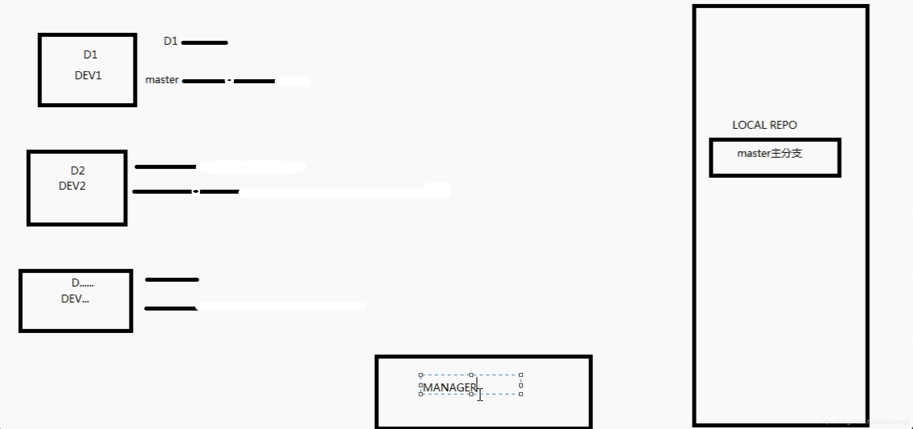
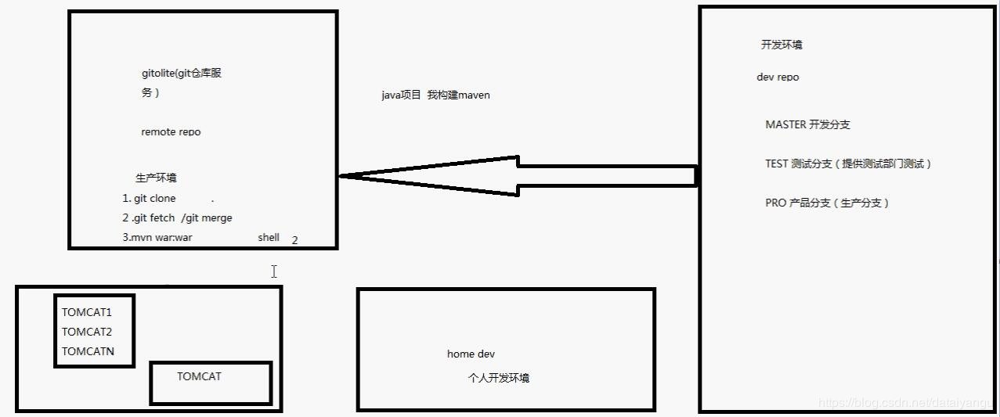

title: git分布式版本控制系统权威指南学习笔记（一）：配置文件、简单流程和小问题
author: Leesin.Dong
top: 
tags:
  - Git
categories:
  - 学习笔记
  - git分布式版本控制系统权威指南学习笔记
date: 2019-3-12 10:21:01

---


# git配置文件简介
一. 配置文件的存储位置
Git相关的配置文件有三个

1. /etc/gitconfig：包含了适用于系统所有用户和所有项目的值。

2. ~/.gitconfig：只适用于当前登录用户的配置。

3. 位于git项目目录中的.git/config：适用于特定git项目的配置。

对于同一配置项，三个配置文件的优先级是1<2<3

 ~/.gitconfig:
```js
//用户信息
[user]
	name = xxx
	email  = xxx
//为git输出着色
[color]
	diff = auto
	status = auto
	branch = auto 
	interactive = true
	ui = true
//为git命令配置别名
[alias]  
    st = status  
    ci = commit  
    br = branch   
//core.filemode 让git忽略对文件权限的修改
[core]  
    filemode = false  

```
## git config各种命令

```js
➜  demo git:(master) git config
usage: git config [<options>]

Config file location
    --global              use global config file
    --system              use system config file
    --local               use repository config file
    --worktree            use per-worktree config file
    -f, --file <file>     use given config file
    --blob <blob-id>      read config from given blob object

Action
    --get                 get value: name [value-regex]
    --get-all             get all values: key [value-regex]
    --get-regexp          get values for regexp: name-regex [value-regex]
    --get-urlmatch        get value specific for the URL: section[.var] URL
    --replace-all         replace all matching variables: name value [value_regex]
    --add                 add a new variable: name value
    --unset               remove a variable: name [value-regex]
    --unset-all           remove all matches: name [value-regex]
    --rename-section      rename section: old-name new-name
    --remove-section      remove a section: name
    -l, --list            list all
    -e, --edit            open an editor
    --get-color           find the color configured: slot [default]
    --get-colorbool       find the color setting: slot [stdout-is-tty]

Type
    -t, --type <>         value is given this type
    --bool                value is "true" or "false"
    --int                 value is decimal number
    --bool-or-int         value is --bool or --int
    --path                value is a path (file or directory name)
    --expiry-date         value is an expiry date

Other
    -z, --null            terminate values with NUL byte
    --name-only           show variable names only
    --includes            respect include directives on lookup
    --show-origin         show origin of config (file, standard input, blob, command line)
    --default <value>     with --get, use default value when missing entry

```
### 配置级别：
|-|-|
|-|-|
| --global            |  use global config file 全局级别，用户级别|
|--system       |       use system config file 系统级别|
|--local        |       use repository config file 当前项目级别|


### 用户信息
第一个要配置的是你个人的用户名称和电子邮件地址。这两条配置很重要，每次 Git 提交时都会引用这两条信息，说明是谁提交了更新，所以会随更新内容一起被永久纳入历史记录：

```js
$ git config --global user.name "John Doe"
$ git config --global user.email johndoe@example.com
```

如果用了 --global 选项，那么更改的配置文件就是位于你用户主目录下的那个，以后你所有的项目都会默认使用这里配置的用户信息。如果要在某个特定的项目中使用其他名字或者电邮，只要去掉 --global 选项重新配置即可，新的设定保存在当前项目的 .git/config 文件里。

### 文本编辑器
接下来要设置的是默认使用的文本编辑器。Git 需要你输入一些额外消息的时候，会自动调用一个外部文本编辑器给你用。默认会使用操作系统指定的默认编辑器，一般可能会是 Vi 或者 Vim。如果你有其他偏好，比如 Emacs 的话，可以重新设置：

```js
$ git config --global core.editor emacs
```

#### 差异分析工具
还有一个比较常用的是，在解决合并冲突时使用哪种差异分析工具。比如要改用 vimdiff 的话：

```js
$ git config --global merge.tool vimdiff
```

Git 可以理解 kdiff3，tkdiff，meld，xxdiff，emerge，vimdiff，gvimdiff，ecmerge，和 opendiff 等合并工具的输出信息。当然，你也可以指定使用自己开发的工具，具体怎么做可以参阅第七章。
### 配置命令别名

```js
git config --global alias.st status
```

# 公钥
每次提交代码都是通过公钥提交的
.ssh/id_ras
公钥最好备份一份，避免每次换操作系统都要去生成，人户在git上更新。
# git协同流程


上图中右边为公司内网的仓库，左边是三个开发人员对应的本地环境，每个环境对应两条线，上面的线是本地分支，下面的线是master远程分支。
每个人从远端拉取配置下来进行开发，D1先开发完之后push到远端，D1的本地分支和远端分支长度变为了2，这时候D2、D3对应的master分支还只有长度1，所以D2想要push代码的时候应该首先让自己的master分支变为长度变为2，然后进行merge，merge之后master变成了长度3，再进行push。


home dev是个人开发环境
dev repo是本地开发环境 ：master分支开发完之后，开一个测试分支test，供测试人员测试，测试完之后交给产品分支pro，每次提交给产品分支后会自动同步到上图中的remote repo  远程生产环境
remote repo是远程生产环境：远程的linux服务器，首次通过git clone 将代码clone到本地，之后可以通过git fetch/git merge操作，然后运行mvn war：war，将项目打包，之后通过shell脚本直接推送到tomcat服务器上面

尚存在的问题：
如果出现紧急bug怎么办呢？不能从右边起手，开发==》测试==》产品吧？应该直接去生产环境修改代码，运行，之后怎样让开发环境同步代码和生产环境一样呢？将生产环境代码同步到pro产品分支，之后通过产品分支merge给master和test分支。
# 简单流程
## 初始化版本库
在1.5.x之前是需要初始化版本库的

```js
➜  test git init demo
Initialized empty Git repository in /Users/leesin/Desktop/test/demo/.git/
//以后所有的版本就在.git目录里面存着
➜  demo git:(master) ls -a
.    ..   .git
➜  demo git:(master) cd .git
➜  .git git:(master) ls -a
.           ..          HEAD        config      description hooks       info        objects     refs
```
## 提交至缓存区

```js
➜  demo git:git add xxx
```
## 查看状态

```js
➜  demo git:(master) ✗ git status
On branch master

No commits yet

Changes to be committed:
  (use "git rm --cached <file>..." to unstage)

	new file:   a.txt
```

## 提交分支

```js
➜  demo git:(master) ✗ git commit -m "my once"
[master (root-commit) ed97a5e] my once
 1 file changed, 0 insertions(+), 0 deletions(-)
 create mode 100644 a.txt
```
## 查看状态

```js
➜  demo git:(master) git status
On branch master
nothing to commit, working tree clean
```

# 小问题
## git是如何找到自己的.git文件的
发现加入我的目录是
/~/Desktop/test/gitDemo
首先在gitDemo中git init 出现了.git文件，进入gitDemo中的某个文件b，执行git status，显示的都是gitDemo的这个版本库的信息
在gitDemo的外层（test）目录执行git init，在test目录下也会出现一个.git文件，哪个同样进入gitDemo的某个文件b，这个时候现实的还是gitDemo这个版本库的信息

因为寻找.git的方法是通过递归往上寻找离自己最近的版本库信息。


## git随意设置并提交名是否安全
安全，可以，但是如果是开发环境的话，因为公钥是通过提交名邮箱设置的，随意设置可能提交不上去。
## 命令别名的作用

```js
git status
git st
```
配置了之后，上面是等价的