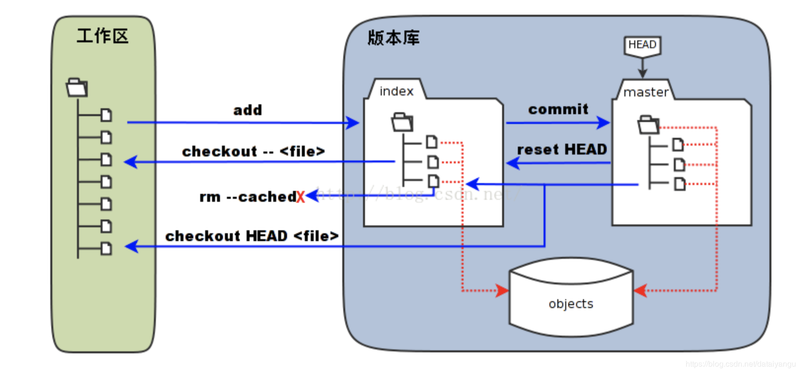

title: git分布式版本控制系统权威指南学习笔记（二）：git add暂存区的三个状态以及暂存区的理解
author: Leesin.Dong
top: 
tags:
  - Git
categories:
  - 学习笔记
  - git分布式版本控制系统权威指南学习笔记
date: 2019-3-12 10:21:02

---


# 不经过git add（到暂存区），能直接进行commit吗？
不能，有一种方法，建议忘掉。
## 举个🌰

```js
➜  demo git:(master) vi a.txt
➜  demo git:(master) ✗ git commit -m "a"
On branch master
Changes not staged for commit:
	modified:   a.txt

no changes added to commit
➜  demo git:(master) ✗ git status
On branch master
Changes not staged for commit:
  (use "git add <file>..." to update what will be committed)
  (use "git checkout -- <file>..." to discard changes in working directory)

	modified:   a.txt

no changes added to commit (use "git add" and/or "git commit -a")
```
代码中modified:   a.txt是红色的，提交失败了

```js
➜  demo git:(master) ✗ git add .
➜  demo git:(master) ✗ git status
On branch master
Changes to be committed:
  (use "git reset HEAD <file>..." to unstage)

	modified:   a.txt
➜  demo git:(master) ✗ git commit -m "add "
[master 81b09ec] add
 1 file changed, 1 insertion(+), 1 deletion(-)
```
代码中modified:   a.txt是绿色的，提交成功了

通过上面的例子说明modified:  
 **<font color="red">  a.txt是红色的代表没有git add，是绿色的代表，进行了git add 操作。
  </font>** 
当然可以通过

```js
➜  demo git:(master) ✗ git commit -a -m ”add“
```
便可以省去git add的操作，但是 **<font color="red">   不建议，建议直接忘记 </font>**，因为直接略过了git add 操作，少了很多操作的可能，而且没有了git add的操作，像操作回溯就无法实现。

```js
➜  demo git:(master) ✗ git log
commit 81b09ecc5f2f0222ede2b474efb1d8da9b04714e (HEAD -> master)
Author: dataiyangu <32248827@qq.com>
Date:   Mon Mar 11 12:18:24 2019 +0800

    add

commit 1e20fe7563a4b4bf8a091fe6c55ca9f32786224c
Author: dataiyangu <32248827@qq.com>
Date:   Mon Mar 11 12:15:53 2019 +0800

    a

commit ed97a5e3d4ae753183e6a796625dfca1f83c1f61
Author: dataiyangu <32248827@qq.com>
Date:   Mon Mar 11 08:33:11 2019 +0800
```
通过git log查看三次commit的提交
# 什么是head
当前版本库的最后一次commit，默认master分支。
# git add暂存区的三个状态
## git diff

```js
➜  demo git:(master) vi a.txt
➜  demo git:(master) ✗ git status
On branch master
Changes not staged for commit:
  (use "git add <file>..." to update what will be committed)
  (use "git checkout -- <file>..." to discard changes in working directory)

	modified:   a.txt

no changes added to commit (use "git add" and/or "git commit -a")
➜  demo git:(master) ✗ git diff
diff --git a/a.txt b/a.txt
index 9c3645e..d16f5ff 100644
--- a/a.txt
+++ b/a.txt
@@ -1 +1 @@
-dfasff:
+dsdf:fasff:
```
修改了a.txt后执行git diff，可以看到是在比较差异。
作者认为，上次提交之后，当前的工作区是干净的

```js
➜  demo git:(master) git checkout .
➜  demo git:(master) git status
On branch master
nothing to commit, working tree clean
➜  demo git:(master) git diff
```
git checkout . 撤销了上次修改文件的操作，回去刷新自己的a.txt文件，发现刚才做的改变没有了，然后执行git diff发现什么也没有

这里认为git diff就是已经被修改了的文件，但是没有被加到暂存区中文件内容的对比。
## git diff head
workspace里面的文件和版本库里面是一样的，拿当前的改和版本库里面改和刚才的workspace和当前的修改对比其实是一样的

```js
➜  demo git:(master)  vi a.txt
➜  demo git:(master) ✗ git diff head
dfasff:
diff --git a/a.txt b/a.txt
index 9c3645e..021fcac 100644
--- a/a.txt
+++ b/a.txt
@@ -1 +1,3 @@
 dfasff:
+
+aaa
(END)
```
head是当前的一个游标，你切换到哪个分支，head就指向哪个分支，所以就是和head这个分支做对比
说实话上面讲的我自己都没有听懂，一篇写的不错的问章：https://blog.csdn.net/u013485584/article/details/53303858

## git diff --cached
暂存区和head对比

| 命令 | 作用 |
| ------------------ | ------------------ |
| git diff head | 工作区和head对比 |
| git diff --cached | 暂存区和head对比 |

## git checkout .

```js
git checkout .
```
在当前的状态下做了一些修改，想回退回去， **<font color="red">前提是没有进行git add 操作    </font>**

## M在第一列和第二列不同的含义
|第n列|含义|
|-|-|
| M 第一列字符含义 | 版本库和处理中间状态有差异|
| M 第二列字符含义| 工作区和当前文件有差异|
```js
➜  demo git:(master) ✗ vi a.txt
➜  demo git:(master) ✗ git add .
➜  demo git:(master) ✗ vi a.txt
➜  demo git:(master) ✗ git status
On branch master
Changes to be committed:
  (use "git reset HEAD <file>..." to unstage)

	modified:   a.txt

Changes not staged for commit:
  (use "git add <file>..." to update what will be committed)
  (use "git checkout -- <file>..." to discard changes in working directory)

	modified:   a.txt

➜  demo git:(master) ✗ git status -s
MM a.txt
➜  demo git:(master) ✗
```
上述代码中的git status 第一个modified:   a.txt 绿色，第二个modified:   a.txt 红色
git status -s 第一列M是绿色，第二列M是红色

两次修改a.txt，第一次git add ，第二次没有进行git add


利用上面的这个特性可以：
开发代码完了之后`git add .`   ，之后希望加一些log日志进行test，但是不希望最后把这些log日志的语句加到最后的项目中，所以可以`git chckout .`    ，就回退到了`git add .`完了的时候，即往代码中加log的时候。

## git reset head a.txt

```js
➜  demo git:(master) ✗ vi a.txt
➜  demo git:(master) ✗ git add .
➜  demo git:(master) ✗ git reset head a.txt
Unstaged changes after reset:
M	a.txt
➜  demo git:(master) ✗ git st
On branch master
Changes not staged for commit:
  (use "git add <file>..." to update what will be committed)
  (use "git checkout -- <file>..." to discard changes in working directory)

	modified:   a.txt

no changes added to commit (use "git add" and/or "git commit -a")
➜  demo git:(master) ✗
➜  demo git:(master) ✗ git checkout a.txt
➜  demo git:(master) git st
On branch master
nothing to commit, working tree clean
➜  demo git:(master)
```
上面说到如果代码没有被`git add .`可以通过 `git checkout .`进行回退，将修改的文件从workspace
如果代码已经被`git add .`可，可以通过`git reset head filename`回退，将修改的文件从缓存区中回退
完了之后再运行`git chekcout a.txt`，文件最终回退到没有被修改的过程，将文件从workspace回退


# 理解暂存区
## 举个🌰(git stash、git stash pop)
```js
➜  demo git:(master) vi a.txt
➜  demo git:(master) ✗ git checkout -b b
M	a.txt
Switched to a new branch 'b'
➜  demo git:(b) ✗ ls
a.txt
➜  demo git:(b) ✗ git status
On branch b
Changes not staged for commit:
  (use "git add <file>..." to update what will be committed)
  (use "git checkout -- <file>..." to discard changes in working directory)

	modified:   a.txt

no changes added to commit (use "git add" and/or "git commit -a")
```

一个经常犯的错误
加入当前在dev分支修改了a.txt但是没有`git add`，这个时候checkout到了master分支， **<font color="red">  这个时候发现在master分支也有了a.txt，并且里面做的改变也跟着过去，  </font>**并且没有提交，刚才的这个a.txt现在就是一个游离的状态，谁也不属于谁，可是你又不想提交，又不想切换，这个时候就需要`git stash`这个命令，会将当前做的修改做一个临时的存储，就像看电影一样，看了一会，先暂停一下，去上个厕所，回来接着看。

```js
➜  demo git:(master) ✗ vi a.txt
➜  demo git:(master) ✗ git stash
Saved working directory and index state WIP on master: 81b09ec add
➜  demo git:(master) git co b
Switched to branch 'b'
➜  demo git:(b) cat a.txt
dfasff:
➜  demo git:(b) git co master
Switched to branch 'master'
➜  demo git:(master) git stash pop
On branch master
Changes not staged for commit:
  (use "git add <file>..." to update what will be committed)
  (use "git checkout -- <file>..." to discard changes in working directory)

	modified:   a.txt

no changes added to commit (use "git add" and/or "git commit -a")
Dropped refs/stash@{0} (f56b964ed9dd46735f383a6c3c93e289cad6bb00)
➜  demo git:(master) ✗ cat a.txt
sdaf
dasf
sdaf:
```
git stash就是在即将切换到另一个分支的时候不想git add，但是不希望自己的改变跟着到了另一个分支 ，**<font color="red">    注意:git stash 后文件还是会跟着过去，但是里面做的修改是没有跟着过去的</font>**，这个时候到了另一个分支，做自己的事情，做完之后，切换回刚才的分支，通过 git stash pop 就能切换回，切换分支前没有提交而保存了的那个状态了，就像看电影的暂停。

## 理解暂存区
像git status等一些其他的命令就是通过扫描文件改变的时间戳长度等信息来判断是否被修改了，而不是通过传统的查看文件是否被修改，这样肯定比传统的方式速度有一定的提升。

左侧是工作区，右侧是版本库
右侧中的index是暂存区也叫stage，master是目录树，objects所有被修改的对象

当工作区的文件进行了修改，做`git add`命令时，暂存区的目录树被更新了，所有被`git add`的文件都会被写入到object对象库中，这时候对象也是一个游离的对象，不能确定是属于index还是master，因为没有被提交所以不是隶属于master，也不一定会在index中，因为可能会被撤销，当执行提交的时候，暂存区中的目录树会被写入到对象库中，master分支会做一个相应的更新，master最新的目录树就会指向暂存区里面的目录树。

如果已经加入了暂存区中，但是不想要这个修改，可以执行`git reset head filename`命令，暂存区的目录树会被重写，重写的依据会被master分支的目录所替换，这个时候工作区并不受影响，包括   ` git rm --cached file`会将文件从暂存区里面删除掉，删除的时候只是在暂存区中删的，并没有将工作区的文件删掉。