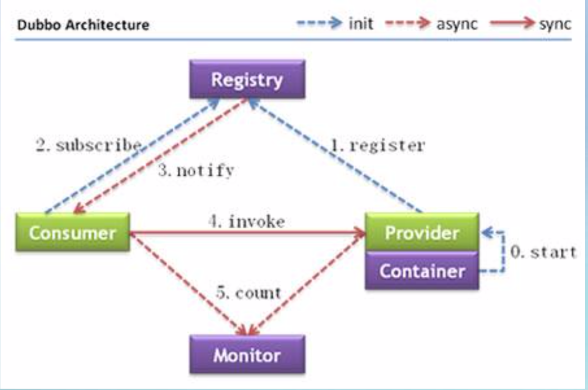
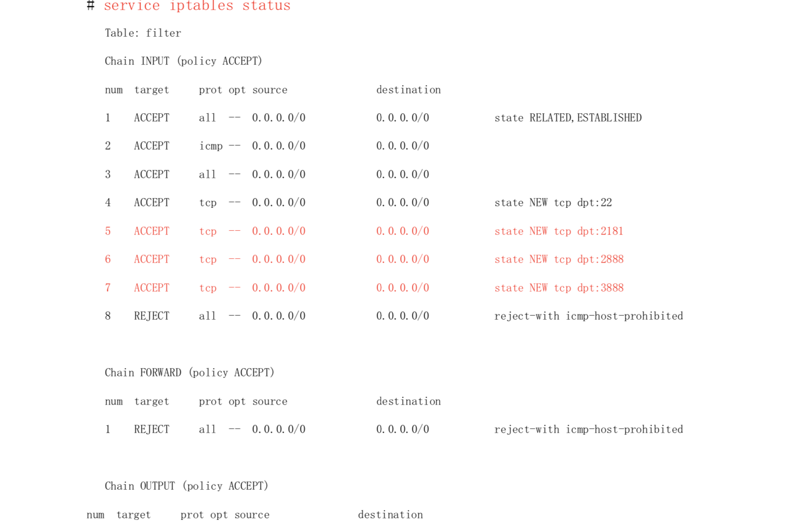

title: Dubbo入门到精通学习笔记（一）：Dubbo对传统工程进行改造
author: Leesin.Dong
top: 
tags:

  - Dubbo
categories:
  - 学习笔记
  - Dubbo入门到精通学习笔记
date: 2019-3-13 10:21:01

---

# 改造思路

## 样例工程：传统的单工程项目（edu-demo）

Maven
J-UI
Struts2
Spring3
MyBatis3
Druid
MySQL5.6
只有一个用户信息表(增、删除、查、改)

## 模型结构

传统mvc 	action（视图层、控制层） service（业务逻辑层） dao（dao层）
目录结构：

```js
common包— core.dao包（dao）、entity包（entity）、exception包、page包（pagebean、pageparam）、web包(sessionCOnstant、webException、Struts2ActionSupport、Dwzparam)

user包—action包（action层）、base包（action层）、biz包（pmsuserBiz service层）、dao包（dao层）、entity包（实体pmsUser）、enums包(枚举)
```

## 思路

如果对传统的mvc架构进行改造，一般会把业务逻辑层以下的做成dubbo服务，action去调用服务，拿到数据之后，然后和页面进行交互，也就是说继承dubbo之后action中只有极少的业务逻辑，调用的接口中执行了业务逻辑操作。

## 改成dubbo调用方式后的工程结构

edu-common-parent(Maven父配置)
edu-facade-user(用户服务接口)
edu-service-user(用户服务实现)
edu-web-boss(服务消费者)

## 部署环境规划
192.168.2.61 edu-web-boss(consumer) 
192.168.3.71 zookeeper-3.4.6(注册中心) 
192.168.3.72 edu-service-user(provider) 
192.168.4.201 MySQL5.6(数据库) 

# 改造

## 愚公移山

### 迁移包

将edu（传统的工程demo下面简称edu）common包下（一些公共的类和接口）的内容（除了web包、core.dao包）放到facade项目中，也就只剩下exception、page包和entity包了，因为facade工程是服务的一个接口，是需要被别人引用的，别人用他的时候他等于是服务的api，我要调用的服务肯定要先在工程里引用服务本身的接口
将edu  common包下的web包下内容放到web项目中
将edu  common包下的core.dao包下的内容放到sercvice项目中
将edu user包下的action和base包放到web项目中
将edu user包下的entity和enums放到facade项目中，因为服务要引用实体，消费端也要引用实体
将edu user包下的biz和dao放到service项目中

### 迁移页面：

将webapp目录下除了META-INF和WEB-INF的文件，即images、js、page、statics、index.jsp包括web.xml迁移到web项目中

### 迁移配置相关

将edu项目中mybatis包、spring包下的内容和jdbc.properties、log4j.properties放到service项目中的resource中
将edu项目中spring、struts包下的内容放到web项目中
web项目中不需要mybatis配置
### 新项目的主要作用

facade项目放着所有工程可以共用的包和接口，其实公共的包应该再建一个项目供所有人调用的
service项目放着dao和业务实现
web项目放着action

## 涂涂改改

web项目只能去调用facade包中的内容，facade去调用service中的内容。所以在facade中再加一个包service包新建PmsUserFacade **<font color="red">接口    </font>**对应于service包中的业务逻辑，PmsUserFacade是真正的dubbo用户服务接口。
因为service是业务实现，service中新建service.impl包下新键PmsUserFacadeImpl，dubbo用户服务接口实现。在PmsUserFacadeImpl的class头部添加注释 **<font color="red"> @service（PmsUserFacade） </font>**
service项目中的biz下的PmsUserBiz是业务逻辑里面 **<font color="red">@AutoWired了PmsUserDao</font>**，自己也有注解**<font color="red">@service（“pmsUserBiz”） </font>**，是业务逻辑的具体实现
在PmsUserFacadeImpl中 **<font color="red">   @AutoWire了pmsUserBiz </font>**，并且粘贴pmsUserBiz的所有方法，并做修改

```js
@service("pmsUserFacade")
public class PmsUserFacadeImpl implements PmsUserFacade{
    @AutoWired
    private PmsUserBiz pmsUserBiz;
    //根据id获取用户信息
	public PmsUser getById(Long userId){
        return pmsUserBiz.getByid
	}
	...
}
```

把pmsUserBiz中的全部方法（包括getId（return pmsUserDao.findByUserNo(userNo)）等业务逻辑方法）拷贝到PmsUserFacade接口中，当然去掉方法体（希望对外提供pmsUserBiz所有的方法）

```js
public interface PmsUserFacade{
    //根据用户id获取用户信息
    public PmsUser getById(Long userId);
    ...
}
```
这里在原来的基础上多加了一层，所以action将原来的@AutoWire pmsUserBiz 变成@AutoWire PmsUserFacade

## 公布服务

在service项目中新建一个spring-dubbo-provider.xml的配置文件

```js
<xml...>
<bean>
    //服务的名称，提供应用信息，用于计算依赖关系
    <dubbo:application name="gw-sercvice-user"/>
    //使用zookeeper注册中心暴露服务地址
    <dubbo:registry protocol="zookeeper" address="192.167.2.12:2181"/>
    //用dubbo协议在20880端口暴露服务
	<dubbo:protocol name-="dubbo" prot="20880"/>
    //当protocolConfig和SerciceConfig某属性没有配置时，采用此缺省值
	<dubbo:provider timeout="10000" threadpool="fixed" threads="100" accepts="1000"/>
    //将要公布的接口，权限服务接口
    <dubbo:service interface="wusc.edu.facade.user.service.PmsUserFacade" ref="pmsUserFacade"/>
</bean>
```

在web项目中新建一个dubbo-consumer.xml

```js
<xml...>
<bean>
    //服务的名称，提供应用信息，用于计算依赖关系
    <dubbo:application name="gw-web-boss"/>
    //使用zookeeper注册中心暴露服务地址
    <dubbo:registry protocol="zookeeper" address="192.167.2.12:2181"/>
    //用dubbo协议在20880端口暴露服务
	<dubbo:protocol name-="dubbo" prot="20880"/>
    //当protocolConfig和SerciceConfig某属性没有配置时，采用此缺省值
	<dubbo:provider timeout="10000" threadpool="fixed" threads="100" accepts="1000"/>
    //将要公布的接口，权限服务接口,check=false的作用是当服务端没启动的时候，消费端也能启动，否则检查
    //的话消费端会报错。
    <dubbo:reference interface="wusc.edu.facade.user.service.PmsUserFacade" ref="pmsUserFacade" check="false"/>
</bean>
```

将上面的两个配置文件分别引入到各自项目的spring配置文件中（import）

# Dubbo架构说明



节点角色说明:
•Provider: 暴露服务的服务提供方 （对应上面service项目）
•Consumer: 调用远程服务的服务消费方（对应于上面的web项目）
•Registry: 服务注册与发现的注册中心（将rovider的接口注册到注册中心，然后consuser去注册中心拿到provider的地址，调用的时候不需要在经过注册中心了。）
•Monitor: 统计服务的调用次数和调用时间的监控中心
•Container: 服务运行容器

调用关系说明: 

1. 服务容器负责启动，加载，运行服务提供者。 

2. 服务提供者在启动时，向注册中心注册自己提供的服务。 

3. 服务消费者在启动时，向注册中心订阅自己所需的服务。 

4. 注册中心返回服务提供者地址列表给消费者，如果有变更，注册中心将基于长连接推送变更数据给消费者。 

5. 服务消费者，从提供者地址列表中，基于软负载均衡算法，选一台提供者进行调用，如果调用失败， 

   再选另一台调用。 

6. 服务消费者和提供者，在内存中累计调用次数和调用时间，定时每分钟发送一次统计数据到监控中心。 

注册中心可选方案:zookeeper、Redis 

1、建议使用dubbo-2.3.3以上版本的使用zookeeper注册中心客户端 

2、Zookeeper是Apache Hadoop的子项目，强度相对较好，建议生产环境使用该注册中心。 

3、Dubbo未对Zookeeper服务器端做任何侵入修改，只需安装原生的Zookeeper服务器即可， 所有注册中心逻辑适配都在调用Zookeeper客户端时完成。 

# 注册中心安装(Zookeeper-3.4.6)

Dubbo 建议使用 Zookeeper 作为服务的注册中心。 

注册中心服务器(192.168.3.71)配置，安装 Zookeeper: 
1、 修改操作系统的/etc/hosts 文件中添加映射ip: 
    # zookeeper servers
​    192.168.3.71   edu-provider-01

2、 到 http://apache.fayea.com/zookeeper/下载 zookeeper-3.4.6: 

$ wget http://apache.fayea.com/zookeeper/zookeeper-3.4.6/zookeeper-3.4.6.tar.gz 

3、  解压 zookeeper 安装包: 

   $ tar -zxvf zookeeper-3.4.6.tar.gz 

4、  在/home/wusc/zookeeper-3.4.6 目录下创建以下目录:
```js
	$ cd /home/wusc/zookeeper-3.4.6
	$ mkdir data
	$ mkdir logs 
```
5、将 zookeeper-3.4.6/conf 目录下的 zoo_sample.cfg 文件拷贝一份，命名为为zoo.cfg
```js
	$ cp zoo_sample.cfg zoo.cfg
```
6、 修改 zoo.cfg 配置文件: 
```js
$ vi zoo.cfg
```

```js
# The number of milliseconds of each tick
   tickTime=2000
   # The number of ticks that the initial
   # synchronization phase can take
   initLimit=10
   # The number of ticks that can pass between
   # sending a request and getting an acknowledgement
   syncLimit=5
   # the directory where the snapshot is stored.
   # do not use /tmp for storage, /tmp here is just
   # example sakes.
   dataDir=/home/wusc/zookeeper-3.4.6/data
   dataLogDir=/home/wusc/zookeeper-3.4.6/logs
   # the port at which the clients will connect
   clientPort=2181
   #2888,3888 are election port
	server.1=edu-provider-01:2888:3888
```

上面的配置找到example sakes，将下面那行删除掉，替换成我们上面的那两行。

找到the port at which the clients will connect，配置端口clientPort=2181，不论是provider还是consumer将来都连接这个端口。

找到 #2888,3888 are election port，修改#2888,3888 are election port

其中， 

2888 端口号是 zookeeper 服务之间通信的端口。 
3888 是 zookeeper 与其他应用程序通信的端口。 

edu-provider-01是在 hosts 中已映射了 IP 的主机名。
initLimit:这个配置项是用来配置 Zookeeper 接受客户端(这里所说的客户端不 是用户连接 Zookeeper 服务器的客户端，而是 Zookeeper 服务器集群中连接到 Leader 的 Follower 服务器)初始化连接时最长能忍受多少个心跳时间间隔数。 当已经超过 10 个心跳的时间(也就是 tickTime)长度后 Zookeeper 服务器还没 有收到客户端的返回信息，那么表明这个客户端连接失败。总的时间长度就是
5*2000=10 秒。
syncLimit:这个配置项标识 Leader 与 Follower 之间发送消息，请求和应答时 间长度，最长不能超过多少个 tickTime 的时间长度，总的时间长度就是 2*2000=4 秒。
server.A=B:C:D:其中 A 是一个数字，表示这个是第几号服务器;B 是这个服务 器的 IP 地址或/etc/hosts 文件中映射了 IP 的主机名;C 表示的是这个服务器与 集群中的 Leader 服务器交换信息的端口;D 表示的是万一集群中的 Leader 服务 器挂了，需要一个端口来重新进行选举，选出一个新的 Leader，而这个端口就是 用来执行选举时服务器相互通信的端口。如果是伪集群的配置方式，由于 B 都是 一样，所以不同的 Zookeeper 实例通信端口号不能一样，所以要给它们分配不同 的端口号。
7、 在 dataDir=/home/wusc/zookeeper-3.4.6/data 下创建 myid 文件
编辑 myid 文件，并在对应的 IP 的机器上输入对应的编号。如在 zookeeper 上，myid 文件内容就是 1。如果只在单点上进行安装配置，那么只有一个 server.1。指的就是上面的zoo.cfg中server.1=edu-provider-01:2888:3888的 server.1

```js
 $ vi myid 
 1
```
8、 wusc 用户下修改 vi /home/wusc/.bash_profile，增加 zookeeper 配置，类似于配置jdk的环境变量:
```js
# zookeeper env
export ZOOKEEPER_HOME=/home/wusc/zookeeper-3.4.6
export PATH=$ZOOKEEPER_HOME/bin:$PATH
```
使配置文件生效
```js
$ source /home/wusc/.bash_profile
```
9、 在防火墙中打开要用到的端口 2181、2888、3888 
切换到 root 用户权限，执行以下命令:
```js
# chkconfig iptables on
# service iptables start
编辑/etc/sysconfig/iptables
# vi /etc/sysconfig/iptables
增加以下 3 行:
-A INPUT -m state --state NEW -m tcp -p tcp --dport 2181 -j ACCEPT 
-A INPUT -m state --state NEW -m tcp -p tcp --dport 2888 -j ACCEPT 
-A INPUT -m state --state NEW -m tcp -p tcp --dport 3888 -j ACCEPT
```
重启防火墙:
```js
# service iptables restart
```
查看防火墙端口状态:
```js
# service iptables status
```


10、 启动并测试 zookeeper(要用 wusc 用户启动，不要用 root):
(1) 使用 wusc 用户到/home/wusc/zookeeper-3.4.6/bin 目录中执行:
```js
       $ zkServer.sh start
```
(2)输入 jps 命令查看进程:
 $ jps
 1456 QuorumPeerMain
 1475 Jps
其中，QuorumPeerMain 是 zookeeper 进程启动正常 

(3) 查看状态:
$ zkServer.sh status
(4) 查看 zookeeper 服务输出信息: 
由于服务信息输出文件在/home/wusc/zookeeper-3.4.6/bin/zookeeper.out 
```js
$ tail -500f zookeeper.out
```
11、停止 zookeeper 进程:
$ zkServer.sh stop
12、 配置 zookeeper 开机使用 wusc 用户启动:
编辑/etc/rc.local 文件，加入:
```js
su - wusc -c '/home/wusc/zookeeper-3.4.6/bin/zkServer.sh start'
```
su - wusc的意思是： 通过wusc用户执行后面的命令

# 改造后的服务调用测试

通过tomcat分别启动provider话consumer，查看zookeeper.out的日志。

provider也可以通过jar的方式启动

在service项目下新建test包，包下新建main的类

```js
package dubbo.test;

import org.apache.commons.logging.Log;
import org.apache.commons.logging.LogFactory;
import org.springframework.context.support.ClassPathXmlApplicationContext;

/**
 * 
 * @描述: 启动Dubbo服务用的MainClass.
 * @作者: WuShuicheng .
 * @创建时间: 2013-11-5,下午9:47:55 .
 * @版本: 1.0 .
 */
public class DubboProvider {
	
	private static final Log log = LogFactory.getLog(DubboProvider.class);

	public static void main(String[] args) {
		try {
			ClassPathXmlApplicationContext context = new ClassPathXmlApplicationContext("classpath:spring/spring-context.xml");
			context.start();
		} catch (Exception e) {
			log.error("== DubboProvider context start error:",e);
		}
		synchronized (DubboProvider.class) {
			while (true) {
				try {
					DubboProvider.class.wait();
				} catch (InterruptedException e) {
					log.error("== synchronized error:",e);
				}
			}
		}
	}
    
}
```
同样zookeeper.out有日志输出

浏览器入口原来是localhost:88/edu-demo
切换为dubbo的地址localhost:88/edu-web-boss
发现同样可以正常启动，并且功能完善。

# 使用Dubbo进行规模服务化前的工程结构优化

## 简介

一、使用Dubbo是为了实现系统的分布式服务化 
二、做成分布式服务架构的项目特点: 
1、多个服务 
2、多种类型的工程
3、工程间需要相互调用 4、如何实现工程间解耦?(高内聚、低耦合) 5、工程该怎样拆分? 6、如何对大量的工程进行合理有效管理?(高级篇:持续集成) 

## 修改项目结构

edu-common-parent(Maven父配置) 
edu-common (公共工程) 
edu-common-config (公共配置工程)
edu-common-core (公共core工程)
edu-common-web (公共web工程) 
edu-facade-user(用户服务接口) 
edu-service-user(用户服务实现) 
edu-web-boss(服务消费者) 


之前的项目结构是有问题的，通过service和facade构建了一个服务provider，将公共的包，放在了facade里面，可是当出现多个服务的时候，比如Base.java这个类所有的工程都需要，同样BaseDao.java，所有的工程都需要访问数据库。当然可能有多个web项目，即consumer，像struts2的一些支持类,自定义的一些公共类也需要抽取出来。
包括Dubbo中的配置文件中的zookeeper地址等信息也可以抽取成配置

### 抽取
edu-common (公共工程)，像异常、枚举类，任何工程需要的类都可以放在这里
 edu-common-config (公共配置工程)dubbo的配置
 edu-common-core (公共core工程)BaseDao.java、数据库等
edu-common-web (公共web工程) 消费者公共的部分

facade项目中的common包（entity、exception、page（分页））移到 edu-common 中，这些肯定是都需要用的。
service项目中的core.dao包下的内容（dao，对数据库的一些操作）迁移到edu-common-core
web项目中的common（struts2支持包）迁移到edu-common-web
项目中的数据路配置文件jdbc.properties和dubbo的注册地址（抽象到service.properties）,放到 edu-common-config 项目中

修改parent项目的pom.xml,将上面的几个新的工程加进去（properties节点）。
修改facade、service、web工程的pom.xml，添加dependencies（common等，引入需要的工程，ps需要什么里面的代码会报错的）重新导包。
修改spring配置文件，引入servic.peroperties(前提是已经在ma
ven中引入了项目)

```js
<context:property-playceholder location="classpath:jdbc.proerties,classpath:service.properties"/>
```
修改dubbo-provider.xml、dubbo-consumer.xml

```js
//dubbo.registory.address是service.properties文件中内容
<dubbo:registry protocol="zookeeper" address="${dubbo.registory.address}"/>
```
剩下需要抽取的配置都可以通过这个方法来配置。

最后发现web项目中只剩下了最简单的和前端交互的恭喜，service项目中是业务的实现。
架构上其实还是有点类似mvc。


