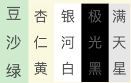
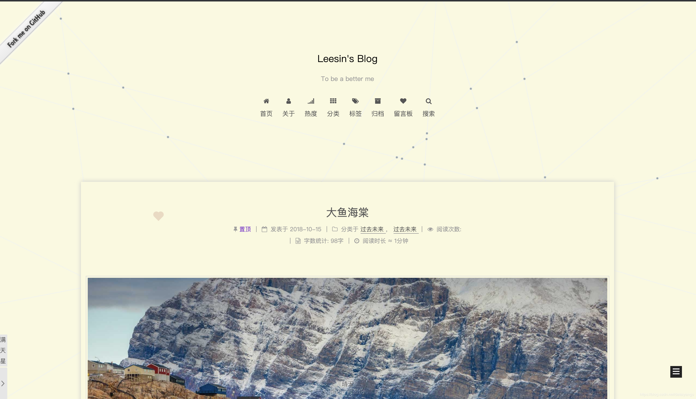

title: hexo next主题深度优化(九)，给博客加入主题，护眼主题，护眼色
author: Leesin.Dong
top: 9999991
tags:
  - hexo
categories:
  - hexo
date: 2018-12-18 20:37:00
---
# 


> * 一篇关于next主题中加入保护眼睛的护眼色的功能，做自己的贴心小棉袄吧。

<!--more-->

# 背景
我从小爱打游戏，所以视力下降厉害，加上现在工作天天对着电脑，所以想给自己的博客加上护眼色。
# 效果
博客：mmmmmm.me






# 码
## _layout.swig
在body下面
```
<div class="eye">
  <div class="eye1">
    <ul>
      <li style="background-color:#C7EDCC">豆沙绿</li>
      <li style="background-color:#FAF9DE">杏仁黄 </li>
      <li style="background-color:#FFFFFF">银河白</li>
      <li style="background-color:#000000">极光黑</li>
    </ul>
  </div>
  <div class="eye2">满天星</div>
</div>
```
## custom.styl
```
.eye{
  position: fixed;
  bottom: 68px;

  height: 66px;
  //background-color:transparent;
  font-size :12px;
line-height :33px;
  text-align :center;
  z-index :99;

}
.eye1{
    float :left;
display :none;
  height :50px;
}
.eye1 ul {
  height :50px;
  list-style: none;
  padding :0;
  margin :0
}
.eye1 ul li{
  float :left;
  width :23px;
  line-height :22px
  text-align :center;
  font-size :12px;
}
.eye1 ul li:hover {
  border-bottom : 0 !important;
  background-color: #fff;
  -webkit-transform: scale(1.1);
  -moz-transform: scale(1.1);
  -ms-transform: scale(1.1);
  -o-transform: scale(1.1);
  transform: scale(1.1);
}

.eye2{
  float :left;
  width :18px;
  line-height :22px
  text-align :center;
  font-size :12px;
  background-color:#e6e6e6;

}
  .eye2:hover{
    border-bottom : 0 !important;
    background-color: #eee;
    -webkit-transform: scale(1.1);
    -moz-transform: scale(1.1);
    -ms-transform: scale(1.1);
    -o-transform: scale(1.1);
    transform: scale(1.1);
  }
  ```
  ## eye.js
  ```
  function eye(){
  $(".eye .eye2").click(function () {
    $(".eye .eye1").slideToggle();
  })

  $(".eye ul li").click(function () {
    $(".eye .eye1").slideToggle();
    $color=$(this).css("background-color")
    console.log($color);
    $(".eye .eye1").css("background",$color);
      $("#canvas").css("background",$color);
      $("article").css("background",$color);
  })
}
eye()
```
# 引用eye.js
## 直接引用
在_layout.swig
```
<script src="xxxxxxxxxx.eye.js">
```
没有用到require.js和pjax的到这里就结束了，用了的往下看
********
## main.js
```
//
require.config({
  paths: {
    "eye":"/js/src/pjax/eye",
  },
});
require(['eye'], function (){
});
```
## pjax的函数中重写
```
function eye_js() {
  $color=$("#canvas").css("background");
  $("article").css("background",$color);
}
```