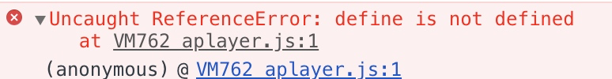
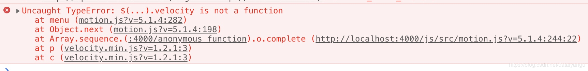
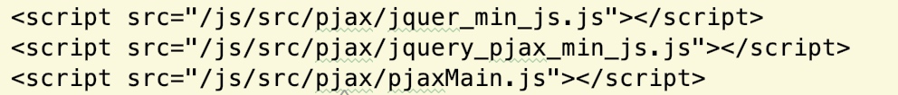
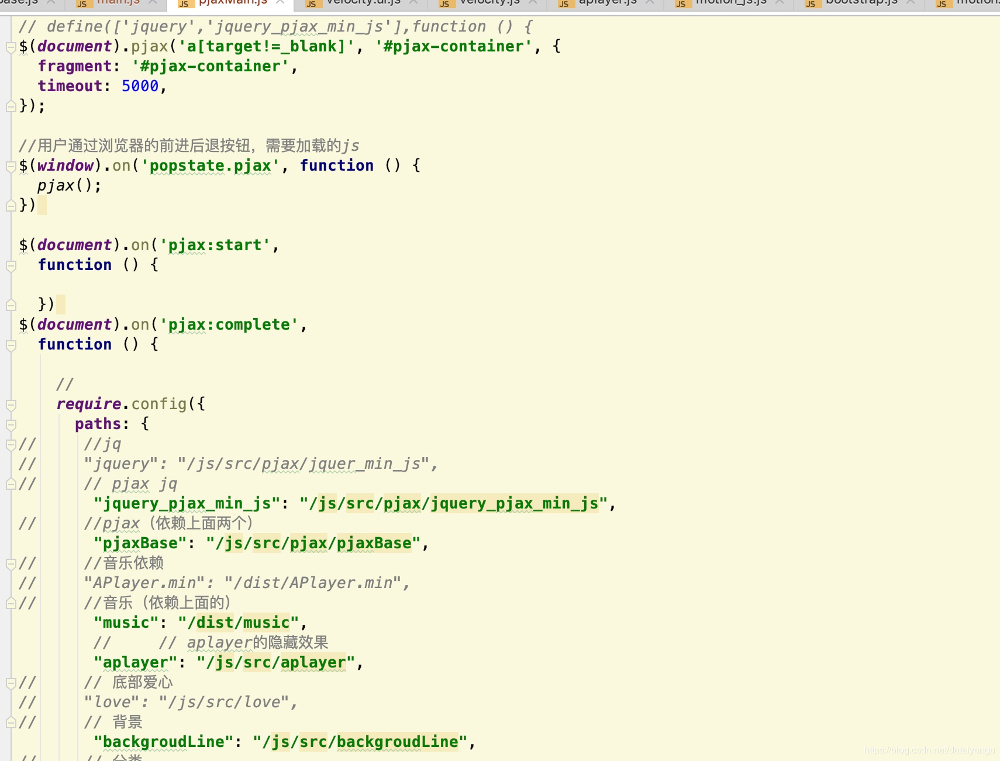
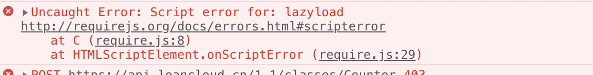
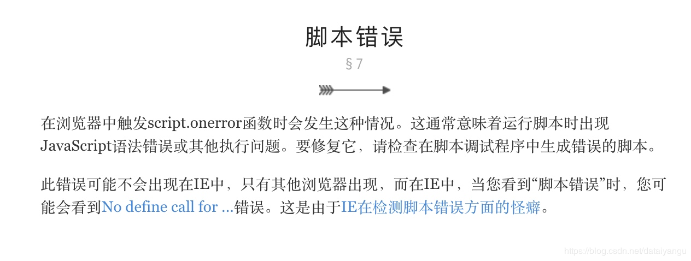
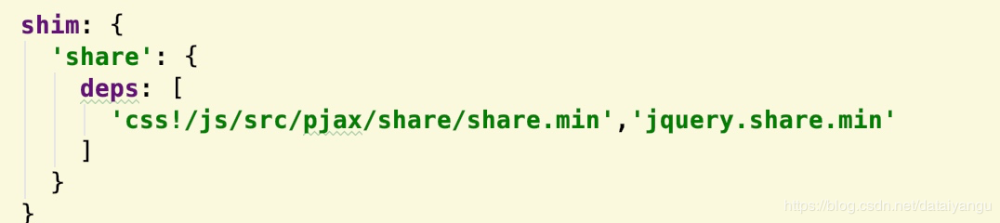

title: 'hexo next主题深度优化(三)，引入require.js,适配pjax'
author: Leesin.Dong
top: 9999997
tags:
  - hexo
categories:
  - hexo
date: 2018-12-18 20:16:00
---
# 
> * 一篇关于next主题中加入require.js的文章，让你的文章如闪电般迅捷。

<!--more-->

# require.js的好处，
总结一下就是：
 1. 减少js文件之间的依赖关系
 2. 能够在页面呈现出来之后再加载js css等，提升系统性能
 3. 异步，跟第二步一个意思
# hexo next中加入require.js
## 新建一个main.js作为所有js的入口
这个我是用来加载首页的js的，因为加入了pjax
下面会弄pjax
```
//
require.config({
  paths: {

    "music": "/dist/music",
    "aplayer": "/js/src/aplayer",
    "backgroudLine": "/js/src/backgroudLine",
    "category": "/js/src/category",
    "jquery.share.min":"/js/src/pjax/share/jquery.share.min",
    "share":"/js/src/pjax/share",
    "css":"/js/src/pjax/css"
  },
//为了动态的增加css，require js中并没有这个功能，github上有相关的插件和文档，自行google
  shim: {
    'share': {
      deps: [
        'css!/js/src/pjax/share/share.min','jquery.share.min'
      ]
    }
  }
});
require(['backgroudLine','music','aplayer','category','jquery.share.min','share','css'], function (){
 pjaxshare()
});
```
_layout.swig
```
{#require主函数#}

<script src="/js/src/pjax/require.js" defer async="true" data-main="/js/src/pjax/main.js"></script>
```
网上说必须在相应的js文件中用define包住类似于
```
define(function(){
原来的js
})
```
可是我发现并不用呀
##  pjax的require.js实现
_layout.swig
```
<script src="/js/src/pjax/jquer_min_js.js"></script>
<script src="/js/src/pjax/jquery_pjax_min_js.js"></script>
<script src="/js/src/pjax/pjaxMain.js"></script>
```
pjaxmain.js
```
$(document).pjax('a[target!=_blank]', '#pjax-container', {
  fragment: '#pjax-container',
  timeout: 5000,
});
//用户通过浏览器的前进后退按钮，需要加载的js
$(window).on('popstate.pjax', function () {
  /*原来不行后来加到complete中行了，后来又不行了*/
    pjax();
})
$(document).on('pjax:start',
  function () {
  })
$(document).on('pjax:complete',
  function () {
    require.config({
      paths: {
        // "category_js": "/js/src/pjax/category_js",
        // "opacity_js":"/js/src/pjax/opacity_js",
        // "motion_js":"/js/src/pjax/motion_js",
        // "scrollspy_js":"/js/src/pjax/scrollspy_js",
        // "post-details_js":"/js/src/pjax/post-details_js",
        // "lean_analytics":"/js/src/pjax/lean_analytics",
        // "baidutuisong":"/js/src/pjax/baidutuisong",
        // "utils_js":"/js/src/pjax/utils_js",
        //这个是单独的
        "jquery.share.min":"/js/src/pjax/share/jquery.share.min",
        // "share":"/js/src/pjax/share",
        //这个也是单独的
        "css":"/js/src/pjax/css",
        "pjax_function_public":"/js/src/pjax/pjax_function_public"
      },
      shim: {
        'share': {
          deps: [
            'css!/js/src/pjax/share/share.min','jquery.share.min'
          ]
        }
      }
    });

    require(['jquery.share.min','share','css','pjax_function_public'
    ], function () {
      pjax();
    });
  })

function pjax() {

  /*因为下面的postdetails_js中的有个判断空指针的，如果加上就不能左移，如果去掉会报错，所以把这个放在首行来执行。*/
  /*现在已经解决,可以放在任意的位置*/
  /*
      之前一直是好的突然有次就不好了，后来解决了右边sidebar滚轮效果消失的效果之后，突然又好了。
      原因是因为，之前放在detail js的下面，而detail的下面undfind的判断时报错的，所以不会往下走。
  */
  /*判断#lv-container是否为空，目前这是我找到最好的办法，因为不判断，进入首页或其他的页面会空指针异常。*/

  if ($("#lv-container").length > 0 &&$('comments').length>0) {
    $(".comments").css({opacity: 1});
    $.getScript("https://cdn-city.livere.com/js/embed.dist.js");
  }
  //不蒜子js
  $.getScript("https://busuanzi.ibruce.info/busuanzi/2.3/busuanzi.pure.mini.js");

  //自己写的分享
  pjaxshare();

// 分类的js
  category_js();
// 局部刷新后文章内容不显示bug的js
  opacity_js()
//点击有目录的文章sidebar不显示的bug解决
  motion_js()
  scrollspy_js()
  //utils_js()
  postdetails_js()
//lean数量统计的js，原来的js是在themes/next/layout/_third-party/analytics/lean-analytics.swig文件中
  lean_analytics();
  //百度推送js
  baidutuisong();
//     //右边sidebar滚轮效果消失了。
  initSidebarDimension()
  //懒加载
  lazyLoad();
}
```
# 关于require js适配过程中报的错误

## aplayer.min.js只能在——lauout加载
这个只能通过这里加载，因为RequireJS 介绍说一个JS文件里只能放一个Define，这个众所周知，不提
## 一直报错：MISMATCHED ANONYMOUS DEFINE() MODULES ...
解决：https://blog.csdn.net/u011558902/article/details/53691627

pjaxrequire 解决
require（[xxxxxxx]fuction（）{
pjax
}）

## 在博客中加requre.js时候，关于aplayer的插件需要。
define aplayer   可是里面还有一个define定义APlayer函数（重点记录 RequireJS 介绍说一个JS文件里只能放一个Define，这个众所周知，不提。）
解决方法：因为RequireJS 介绍说一个JS文件里只能放一个Define，这个众所周知，不提。，只能将这个插件不通过require来进行加载。让系统上来就加载。
## 如图

这是因为我的apler 的js在requer和——layout中都进行了定义
## velocity函数报错


解决：jquery从require中去掉，原因不详，好像有什么循环依赖。
解决：jquery从require中去掉，原因不详，好像有什么循环依赖。
## 针对pjax的require，我用这个requre主要就是来安排pjax的，因为要之前吧pjax的函数在家在一边，浪费很大的加载时间
发现：
我很多模块并没有用define进行定定义,但是仍然成功了，说明并不是一定要define定义才能用的。（我通过实际经验总结的，结论不一定正确，有不对的地方还请指出）
解决：



在pjaxmin里面写require的东西，可以发现我并没有在——类中写
{#<script src="/js/src/pjax/require.js" defer async="true" data-main="/js/src/pjax/pjaxMain.js"></script>#}

并没有按照require的方式引入pjaxmain这个函数，但还是成功了，
说明，项目中只需要引入一次require这个js，便可以处处使用（目前根据我的实际操作得出的结论，不一定正确。）

这样的话，每次pjax 的complite的函数执行完了之后才会加载需要的函数，也就是在首页，或者其他的页面，是不需要加载这个些个文件的，在首页的首次加载中大大节省了时间完美！！！！！
## 报错


官方解释


这里的脚本错误并不是我们引入的js脚本错误，而是对编写的config require函数的脚本错误，
比如我就是路径不会的
## pajx 返回失效
$(window).on('popstate.pjax', function () {
      $('img').lazyload({
        placeholder: '../images/loading.gif',
        effect: 'fadeIn',
        threshold : 100,
        failure_limit : 20,
        skip_invisible : false
      });

      pjax();
})
 和complite同样的代码，通过打断点，发现我的if（xxx>0）{}并没有执行，说明是在页面加载完之前就开始执行这段代码了，
 解决：
 $(window).on('popstate.pjax', function () {
  $(document).on('pjax:complete',
    function () {
  //
      $('img').lazyload({
        placeholder: '../images/loading.gif',
        effect: 'fadeIn',
        threshold : 100,
        failure_limit : 20,
        skip_invisible : false
      });

      pjax();

    })
})

在之前加入，
  $(document).on('pjax:complete',）
  意思是在pjax请求加载完了之后再进行如下的代码。
## pjaxshare函数（分享函数）老师报错pajaxshare（） not defined 
解决：想着在pjaxshare函数上面加define（function（）{}）,按照网上的教程是这样的，可是我加上就是不行，去掉反而行了。
## require css 
从github上下载
deps:['css!libs/css/color.min'] 这里会优先加在css这个模块名下的文件(libs/js/css.min.js) 然后一个 "!"后面紧接着在基目录下加在libs/css/color.min.css
所以css.js文件下载下拉是不能改名的


