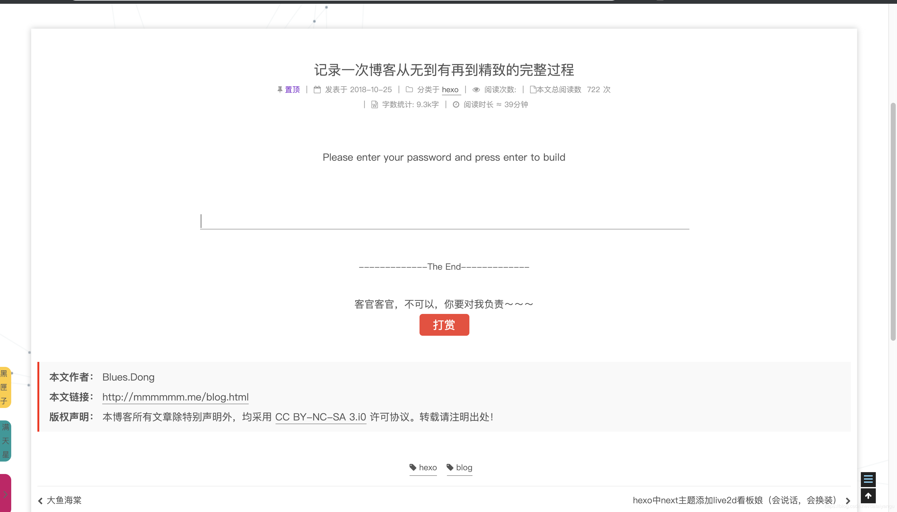

title: hexo next主题深度优化(十)，博文加密，不需要插件，极简模式，相对安全，融合pjax
author: Leesin.Dong
top: 9999990
tags:
  - hexo
  - ''
categories:
  - hexo
date: 2018-12-20 22:52:00
---
# 


> * 关于next主题中加入博文加密功能的文章，我就是我不一样的烟火。


<!--more-->

果想自定义功能样式的往下面看看也许会有点收获，为了避免读者不耐烦的看我的废话，所以移到了下面。
本人博客：mmmmmm.me
# 效果：





# 代码：
/blog/themes/next/layout/_layout.swig，找到main标签在吐下代码处添加自定义的swig
_layout.swig：
```
<div id="pjax-container">
    <main id="main" class="main">
      <div class="main-inner">
        <div class="content-wrap">
          <div id="content" class="content">
            
          </div>
          
          
        </div>
        
          
        
      </div>
      //这个是我自己写的swig，因为需要得到post的password参数，名字自己随便起。
      //如果博客中加入了pjax需要放在pjax的container中，每次刷新会重新加载container中的内容，也就默认重新加载我们这个简单的js了，如果没有加入pjax的话，位置就不重要了
      
    </main>
</div>
```
新建swig，目录：themes/next/layout/password.swig（和上面的_layout.swig在同级目录，具体路径在上面的include中可以自定义的。）
password.swig：
```
<script>
//暂时储存文章中的内容
var div = $('.post-body');
//暂时储存目录的内容
var toc=$('.post-toc-wrap')
function password() {
  if('{{ page.password }}'){
  //将文章内容删除
    div.remove();
 //将目录删除 
    toc.remove();
  //将文章删除后，向原来文章的地方添加，应该出现的提示用户输入密码的样式
  //下面这里的第一个用textarea是因为如果在手机端的时候只能显示一部分文字，
  //只是拓展:input里面的字只能显示一行，不会自动换行，目前上网搜索没有发现好的办法，所以用了textarea，右下角的小三角通过resize:none 去掉。
   $('.post-header').after('<textarea class="description" value="Please enter your password and press enter to build" style="border: none;display: block;' +'width: 60%;margin: 0 auto;text-align: center;outline: none;margin-bottom: 50px;resize:none ">
      Please enter your password and press enter to build</textarea>' +
      '<div class="qiang" style="height: 100px;width: 60%;margin:0 auto">' +
      '<input class="password"  type="text" value="" style="border: none;display: block;border-bottom: 1px solid #ccc;' +
      'margin: 0 auto;outline: none;width:95%"/>' +
      '</div>')
      //绑定点击事件，如果是点击的.password 这个div就改变样式，如果是document中除了div之外的其他任何元素，就变回原来的样式。
    document.onclick = function (event) {
      var e = event || window.event;
      var elem = e.srcElement || e.target;

      while (elem) {
        if (elem != document) {
          if (elem.className == "password") {
            $(".password").animate({paddingTop:"30px",width:"100%",borderWidth:"2px"},300)
            return;
          }
          elem = elem.parentNode;
        } else {
          $(".password").animate({paddingTop:"0px",width:"95%",borderWidth:"1px"},300)
          return;
        }
      }
    }
    //绑定enter键按下后离开的事件
    $(document).keyup(function(event){
      if(event.keyCode ==13&&$('.password').length>0){
        //console.log($('.password').val())
        //console.log('{{ page.password }}')
        if ($('.password').val() == '{{ page.password }}') {
        //恢复文章内容
          (div).appendTo($(".post-header"))
          //恢复目录
          toc.appendTo($(".sidebar-inner"))
                 //删除本页面的输入密码组件
           $(".description").remove();
          $(".qiang").remove();
          $(".password").remove();
          //重新处理pjax事件,如果没有加pjax的从下面这行起到下面的else之间的代码需要去掉。
          //图片懒加载，没有加入此功能的这个函数需要去掉
	          $('img').lazyload({
	             placeholder: '../images/loading.gif',
	             effect: 'fadeIn',
	             threshold : 100,
	             failure_limit : 20,
	             skip_invisible : false
	           });
	           //pjax后出现文章不显示，没有pjax的下面四行需要去掉
	            $(".post-block").css({opacity:1});
	            $(".post-header").css({opacity:1});
	            $(".post-body").css({opacity:1});
	            $(".pagination").css({opacity:1});
        }else {
          alert("Sorry, the password is wrong.")
        }
      }
      //将document的keyup移除，防止在pjax的情况下会重复绑定事件
    });
  }
}
password();
</script>
```
新建一个test.md
test.md
```
---
title: 测试
date: 2019-03-30 21:18:02
password: aaa
---
# aaaaaa
我就很反感大家老是那么说我，
## bbbbbb
除了有才，就只剩下那无可比拟的颜值。
```
上面的password后面的值自定义。
# 注意：
如果自己的博客源码中的这篇文章上传到github，密码也就公诸于世了，可以再push到github的时候将这篇文章忽略。
# 背景：
预给自己加入文章加密的功能。
# 思路：
## https://www.jianshu.com/p/90c0a15c6f36
 ```js
 <script>
    (function(){
        if('{{ page.password }}'){
            if (prompt('请输入查看密码') !== '{{ page.password }}'){
                alert('密码不正确,请询问主编大大');
                history.back();
            }
        }
    })();
</script>
```
不用试看看也知道没问题，可是网上说这个容易被破解，因为只是在alert的时候不显示，但是懂编程的人只要打开审查工具就能看到了。pass
## http://zhailiange.com/2017/07/06/hexo-encrypt/
hexo-blog-encrypt插件和hexo-encrypt插件，同样尝试过，如果没有pjax肯定是没问题的，因为我加入了pjax在跳转页面的时候有的js会不加载，所以会报错，放弃
## 自己写
一开始通过网_layout.swig里面引入 script的方式，可是在js文件中是的不到hexo自定义的page变量的（hexo中还有好多变量，比如site，theme等），所以在swig中能够得到这个变量，也就是我们文章中的password，当然你还可以自定义许多变量，比如在config文件中定义是否使用password功能，在文章中增加message（简称就是输入密码上方给用户说的话，或者文章的简单概要等，自定义即可）标签，然后通过js读到本篇文章的message，自定义的添加到页面中展示给用户，等等都可以通过{{page.xxxxx}}来得到。
当然自己写的初衷就是因为自己的pjax，这下子，终于可以成功的完美融合到pjax中，还学到不少的只是呢。
# 2018.12.23代码更新
## 问题一
发现输入密码成功之后，在页面的底部还有请输入密码的组件,在恢复文章的后面加下面三行（已在上面的代码中更新）
```js
$(".description").remove();
$(".qiang").remove();
$(".password").remove();
```
## 问题二
因为博客中加入了pjax，在局部刷新的时候，$(document).keyup并没有移除，所以当点击某文章的时候第一次没问题，再不刷新页面的情况下，再次进入，第二次进入的时候是通过pjax进入的，这样就给$(document)绑定了两次keyup事件，第三次的话就会绑定三次，第四次绑定四次，如此往复，出现的现象是前几次报密码错误，最后一次进入正常，调试的时候前几次得到的password的value值都是undifined
解决：
```
$(document).on('pjax:start',
  function () {
    $(document).unbind('keyup')
  })
```
在每次pjax发送请求开始就移除事件。

## 问题三
当输入密码进入页面，按回车键会不断的alert 密码错误
加入判断（上面已经修改）
```
&&$('.password').length>0
```