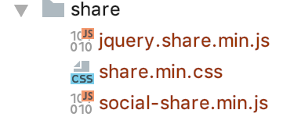
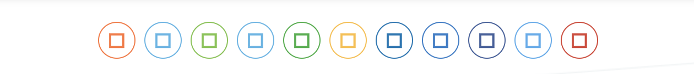
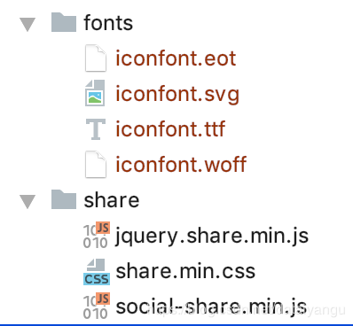

title: hexo next主题深度优化(四)，自定义一个share功能，share.js
author: Leesin.Dong
top: 9999996
tags:
  - hexo
categories:
  - hexo
date: 2018-12-18 20:18:00
---
# 

> * 关于next主题中加入自己喜欢的分享样式的文章，让你的博客如星空般璀璨。

<!--more-->

# 背景：
之前一直用的addthis或者百度分享，可是加入pjax后失效，相应的接口重写也不行，故自己重新加一个分享的功能。
# 开始：
## 引入资源：


## 代码
```
var $config = {
  sites : ['weibo','qq', 'wechat','tencent','qzone','douban', 'facebook',  'google','twitter'],
  disabled: [ 'linkedin', 'diandian'],
  wechatQrcodeTitle: "微信扫一扫",
  wechatQrcodeHelper: '<p>微信扫一扫，右上角分享</p>',
  source: 'Leesin Dong'
};


$('.post-spread').share($config);

function pjaxshare() {
  $('.post-spread').share($config);
}
```
## 关键的一步
很多时候出现：


这是什么鬼？
下载网上的demo发现了问题。缺少雪碧图把？（猜想）
通过对比，需要引入demo中的fonts目录。




## 附：方便学习的小demo
https://github.com/overtrue/share.js/zipball/master
## 一次成功后还出现上面的bug
将fonts目录删掉，重新导入
# 结束
# 2018.12.23发现bug（读者可忽略）
里面的图标变成了灰色，因为在护眼的js中对a标签的颜色进行了重新定义，加a:not()