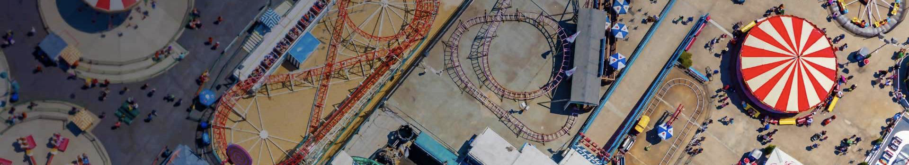
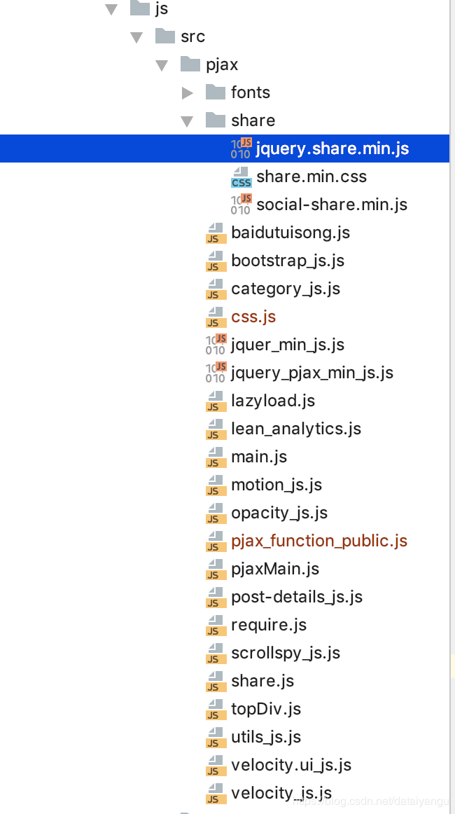

title: hexo next主题深度优化(一)，加入pjax功能
author: Leesin.Dong
top: 9999999
tags:
  - hexo
categories:
  - hexo
date: 2018-12-18 19:20:00
---
# 


> * 一篇关于在next主题中加入pjax的文章，让你的文章如钻石般夺目。

<!--more-->
特别声明：
**看不懂没关系，往下读，因为我写的逻辑可能不是很清晰~
本人源码在github上实在不懂的 git clone自己扣一扣，github在博客中有连接
本人博客mmmmmm.me**
# 背景：
我有强迫症，遇到好的东西就想给自己整上去，在这里想忠诚的奉劝大家一句，不要再搭建自己的博客了，这是一个无底洞，就跟打游戏一样，当你到达六十级之后，你发现版本更新了，顶级变成了八十级，而且，目前看来你自己只有三级，只是自己感觉自己是六十级，就像我，这个东西我足足花了一周多，当然也有我经常加班的原因吧，好了不吐槽了~~
# 进入正题
## pjax初体验--instantclick
首先本人加了一个不蒜子的群，看到有人说instantclick能够实现自己的博客实现不中断的播放（大家都知道博客一刷新，一换页，播放的歌曲插件肯定也会刷新，歌也就断了），看到这里是不是有感觉了~~，这个时候我就开始拼命的往里面加，大概花了两天放弃了，可是无奈中文文档也比较少，而且，bug巨多，最大的原因也是bug巨多，适配起来十分麻烦，比如多说评论系统等等。但是速度确实蛮快的，因为可以1鼠标放到标签上实现预加载2鼠标点下去的瞬间实现预加载，而且可以自己设定预加载的时间。（好像是这么回事，时间太久远了）
下面贴出我找到的几个教程，对于bug多这点不介意，喜欢钻研的同学可以看看：
https://www.ihewro.com/archives/515/
https://qqdie.com/archives/instantclick.html
https://www.jianshu.com/p/c306360e4270
https://www.songhaifeng.com/razt/32.html
好了就先这么多，google上也有好多，赶紧让我们进入正题吧~
## 真正的pjax
官方介绍：pushState + ajax = pjax 带来最直观的效果是整个网站变成单页应用。这样的效果将会极大的提升用户体验，并且可以减少https的请求的次数和内容。使用github上面的一个开源项目defunkt/jquery-pjax 可以很轻松的帮助我们实现pjax。

这样可以实现，刷新的时候只加载局部的html和css js 大大加快速度。
真诚提醒：如果对前端一点点基础都没有的话，要不就放弃吧。

### 第一步
找到theme->next->layout->_layout.swig文件
在开头加入以下代码：

```
<script src="//cdnjs.cloudflare.com/ajax/libs/jquery/2.2.4/jquery.min.js"></script>
<script src="https://cdn.bootcss.com/jquery.pjax/2.0.1/jquery.pjax.min.js"></script>
<script src="/js/src/pjax/pjaxBase.js"></script>
```

> 解释一下：前两行是引入jq文件和pjax的js文件，jq文件必须在pjax文件前面引入，第三行是引入我自己的文件，这个文件是我自己diy的目录如图。在第二行下面<script></script>中间加入内容是一样的效果。

### 第二步
还是在这个文件中在底部加入

```
{# 在这里依次加载pjax需要的js文件 #}//swig文件中的注释是这样子的
<script type="text/javascript"   src="/js/src/pjax/category_js.js" ></script>
<script type="text/javascript"   src="/js/src/pjax/opacity_js.js" ></script>
<script type="text/javascript"   src="/js/src/pjax/motion_js.js" ></script>
<script type="text/javascript"   src="/js/src/pjax/velocity.ui_js.js" ></script>
<script type="text/javascript"   src="/js/src/pjax/velocity_js.js" ></script>
<script type="text/javascript"   src="/js/src/pjax/bootstrap_js.js" ></script>
<script type="text/javascript"   src="/js/src/pjax/scrollspy_js.js" ></script>
<script type="text/javascript"   src="/js/src/pjax/utils_js.js" ></script>
<script type="text/javascript"   src="/js/src/pjax/post-details_js.js" ></script>
```
注意这里的文件是有顺序的，具体的我会在下文详细讲述。
### 第三步
第二步中的这些文件都是我自己加入的，原因是因为（划重点了！！！）
**在pjax中是局部刷新的也就是局部加载的，而以上的文件，next主题中本身是没有的，原来的文件名称没有我的_js后缀，在目录next->source->js->src下面，
源文件大部分都是$(document).ready()的，这个函数，大家可以上网好好查查，是加载完整个dom结构后进行加载的，当然了和js中的Window.onload是不一样的，后者是在图片等全部加载完之后才会加载js，好了不闲扯了，注意将这些文件复制到我上面的目录下并且重命名例如：/js/src/pjax/bootstrap_js.js然后将所有的文件都把$(document).ready()去掉，然后用function xxx包住，这样就可以外部调用了，我会在下面讲到，很有用哦。**

> 为什么这么麻烦，因为next的js是相互调用的，本人比较懒，实在没有时间阅读全部的源码。

目录：
### 第四步



如上面的目录，这些有的是我复制的系统核心的，因为在p我单独还建了一个/js/src/pjax/pjaxBase.js，你可能就懂了第一步了。这个js是pjax的核心，下面贴出源码：


```
// define(['jquery','jquery_pjax_min_js'],function () {
$(document).pjax('a[target!=_blank]', '#pjax-container', {
  fragment: '#pjax-container',
  timeout: 5000,
});
//用户通过浏览器的前进后退按钮，需要加载的js
$(window).on('popstate.pjax', function () {
  $(document).on('pjax:complete',
    function () {
      $('img').lazyload({
        placeholder: '../images/loading.gif',
        effect: 'fadeIn',
        threshold : 100,
        failure_limit : 20,
        skip_invisible : false
      });
      pjax();
    })
})
$(document).on('pjax:start',
  function () {
  })
$(document).on('pjax:complete',
  function () {
    require.config({
      paths: {
      //下面注释的这几个js是之前的版本，因为给主题加入了require.js提升性能，所以将他们整合到了下面pjax_function_public文件中，效果是一样的。
        // "category_js": "/js/src/pjax/category_js",
        // "opacity_js":"/js/src/pjax/opacity_js",
        // "motion_js":"/js/src/pjax/motion_js",
        // "scrollspy_js":"/js/src/pjax/scrollspy_js",
        // "post-details_js":"/js/src/pjax/post-details_js",
        // "lean_analytics":"/js/src/pjax/lean_analytics",
        // "baidutuisong":"/js/src/pjax/baidutuisong",
        // "utils_js":"/js/src/pjax/utils_js",
        //这个是单独的
        "jquery.share.min":"/js/src/pjax/share/jquery.share.min",
        // "share":"/js/src/pjax/share",
        //这个也是单独的
        "css":"/js/src/pjax/css",
        //我将上面注释的内容整合到了这个js中，为了更好的提升性能，因为虽然一样的内容，多次读取文件，和读一个文件，效率还是有很大的差距的。
        "pjax_function_public":"/js/src/pjax/pjax_function_public"
      },
      shim: {
        'share': {
          deps: [
            'css!/js/src/pjax/share/share.min','jquery.share.min'
          ]
        }
      }
    });

    require(['jquery.share.min','share','css','pjax_function_public'
    ], function () {
        $('img').lazyload({
          placeholder: '../images/loading.gif',
          effect: 'fadeIn',
          threshold : 100,
          failure_limit : 20,
          skip_invisible : false
        });

      pjax();
    });
  })

function pjax() {
  /*因为下面的postdetails_js中的有个判断空指针的，如果加上就不能左移，如果去掉会报错，所以把这个放在首行来执行。*/
  /*现在已经解决,可以放在任意的位置*/
  /*
      之前一直是好的突然有次就不好了，后来解决了右边sidebar滚轮效果消失的效果之后，突然又好了。
      原因是因为，之前放在detail js的下面，而detail的下面undfind的判断时报错的，所以不会往下走。
  */
  /*判断#lv-container是否为空，目前这是我找到最好的办法，因为不判断，进入首页或其他的页面会空指针异常。*/
  if ($("#lv-container").length > 0 ) {
    $(".comments").css({opacity: 1});
    $.getScript("https://cdn-city.livere.com/js/embed.dist.js");
  }
  //不蒜子js
  $.getScript("https://busuanzi.ibruce.info/busuanzi/2.3/busuanzi.pure.mini.js");

  //自己写的分享
  pjaxshare();

// 分类的js
  category_js();
// 局部刷新后文章内容不显示bug的js
  opacity_js()
//点击有目录的文章sidebar不显示的bug解决
  motion_js()
  scrollspy_js()
  //utils_js()
  postdetails_js()
//lean数量统计的js，原来的js是在themes/next/layout/_third-party/analytics/lean-analytics.swig文件中
  lean_analytics();
  //百度推送js
  baidutuisong();
//     //右边sidebar滚轮效果消失了。
  initSidebarDimension()
}
```

解释一下：
$(document).pjax('a[target!=_blank]' '#main', {
  fragment: '#main',
  timeout: 5000,
});
这个函数是pjax的核心，
'a[target!=_blank]'是你将会点击的标签[target!=_blank]，是当你的标签是blank的时候就是需要点击出现一个新的窗口，比如友链之类的，这个时候就不进行局部加载了，没有类似a标签的可以省略。
'#main'是你将会刷新的地方
fragment: '#main',是把那个地方的代码刷新然后放到'#main'中
timeout，懂js得都懂就不解释了。

$(document).on('pjax:complete',
  function() {}
  划重点了：这个函数是在局部加载完之后自己需要DIY的js，因为pjax是局部加载我已经强调了很多遍了，这个时候有的js会失效比如说评论功能。
  这个时候引入我们之前定义好的函数。完成！

贴几个对我很有帮助的博文和hexo next的博客和一个github，实在不懂得可以扒一扒别人的github源码，有很大的帮助。
https://www.ihewro.com/archives/354/comment-page-3#comments
https://www.jimoe.cn/archives/typecho-add-pjax.html
http://yelog.org/2017/02/08/pjax/
https://www.jianshu.com/p/808a647dc324
https://blog.dyboy.cn/
https://blog.flysay.com/
https://github.com/DIYgod/hexo-theme-sagiri
http://www.qingpingshan.com/m/view.php?aid=355579
https://diygod.me/
中间有个小技巧:chrom的审查元素里面的内容是可以移动和删除的，更利于我们的检查。
# 专门基于hexo next主题的pjax（将丢失的js效果重现）
## 将下面讲到的提取出来
**因为很多事被包装在$(documnent).ready(function(){})里面的，所以pjax不能加载的原因就在这里。自己提取出来，封装成函数自己调用即可**
**下面的需要前端基础，会通过断点进行审查**
## 点击右边的sidebar，sidebar不出现
经过阅读源码，点击事件在motion.js中，将相应的代码提取出来
motion.js
```
      this.toggleEl.on('click', this.clickHandler.bind(this));
      this.dimmerEl.on('click', this.clickHandler.bind(this));
      this.toggleEl.on('mouseenter', this.mouseEnterHandler.bind(this));
      this.toggleEl.on('mouseleave', this.mouseLeaveHandler.bind(this));
      this.sidebarEl.on('touchstart', this.touchstartHandler.bind(this));
      this.sidebarEl.on('touchend', this.touchendHandler.bind(this));
      this.sidebarEl.on('touchmove', function(e){e.preventDefault();});
````
post_detail.js
```
// TOC item animation navigate & prevent #item selector in adress bar.
  $('.post-toc a').on('click', function (e) {
    e.preventDefault();
    var targetSelector = NexT.utils.escapeSelector(this.getAttribute('href'));
    var offset = $(targetSelector).offset().top;

    hasVelocity ?
      html.velocity('stop').velocity('scroll', {
        offset: offset  + 'px',
        mobileHA: false
      }) :
      $('html, body').stop().animate({
        scrollTop: offset
      }, 500);
  });
```
这是线索，像java一样点到自己需要的地方，展开逻辑。
### sidebar自动隐藏，自动显示，点击出现，点击隐藏，回到首页，回到中间等操作
里面如果遇到不认识的函数，可能是hexo自己封装的比如toc，
hexo自己的辅助函数：https://hexo.io/zh-cn/docs/helpers.html
```java 

/*
下面这段代码是关于右边的sidebar的js的核心包括：
  自动隐藏，自动显示，点击出现，点击隐藏，回到首页，回到中间等操作*/
  // Expand sidebar on post detail page by default, when post has a toc.
  var $tocContent = $('.post-toc-content');
  var isSidebarCouldDisplay = CONFIG.sidebar.display === 'post' ||
      CONFIG.sidebar.display === 'always';
  var hasTOC = $tocContent.length > 0 && $tocContent.html().trim().length > 0;
  if (isSidebarCouldDisplay && hasTOC) {

      NexT.utils.displaySidebar();
  }else {
/*判断this.sidebarEl是否为null，因为从首页进入留言板的时候并没有this.sidebarEl这个属性，回报类似于空指针的异常。
 下面这个空指针的判断暂时注释掉因为，如果打开的，返回到首页的时候并没有this.sidebarEl，
下面的代码不会进行，下面的，文章在左面没回去的bug就无法得到解决。*/
/*已经将空指针异常的判断打开，因为下面的源码是this.sidebar，这里的this可能并不是element，所以会导致未定义，其实在element中是定义了的
* 在这里将this去掉就解决了*/
/*
* 下面这段源码在motion.js中的hideSidebar方法。*/
    var sidebarEl=$('.sidebar')
    if (typeof(sidebarEl)!=  "undefined") {
      NexT.utils.isDesktop() && $('body').velocity('stop').velocity({paddingRight: 0});
      sidebarEl.find('.motion-element').velocity('stop').css('display', 'none');
      sidebarEl.velocity('stop').velocity({width: 0}, {display: 'none'});
      /*sidebarToggleLines是在motion js里面的，在这里回报错，在下面进行了引用*/
      sidebarToggleLines.init();
      sidebarEl.removeClass('sidebar-active');
      sidebarEl.trigger('sidebar.isHiding');
      // Prevent adding TOC to Overview if Overview was selected when close & open sidebar.
      /*下面的else的js是我自己加的因为，点击有目录的文章后右侧sidebar会自动出来，文章会自动往左面走，因为margin是0 auto的。这个时候点击主页，
      文章还是在左面的没有回去，为了解决这个bug*/
      if (!!$('.post-toc-wrap')) {
        if ($('.site-overview-wrap').css('display') === 'block') {
          $('.post-toc-wrap').removeClass('motion-element');
        } else {
          $('.post-toc-wrap').addClass('motion-element');
        }
      }
    }
  }
}
var sidebarToggleLines = {
  lines: [],
  push: function (line) {
    this.lines.push(line);
  },
  init: function () {
    this.lines.forEach(function (line) {
      line.init();
    });
  },
  arrow: function () {
    this.lines.forEach(function (line) {
      line.arrow();
    });
  },
  close: function () {
    this.lines.forEach(function (line) {
      line.close();
    });
  }
};
````
### 添加bootstrp出现闪屏的现象
```
// .add(NexT.motion.middleWares.menu)已经注释掉了
```
貌似bootstrp不加也行,没有发现太需要重写的函数
### 右边的sidebar鼠标滚动目录滑动事件没了
核心代码是utils.js中的initSidebarDimension（）函数
直接调用即可。
**强烈建议用有道词典看看那些个函数的注释，这个注释就写的很清楚，一开始我找了好久没有跟到相关的代码，最后，偶尔看到了，还好有点英语基础。
utils.js
```
 /**
   * Init Sidebar & TOC inner dimensions on all pages and for all schemes.
   * Need for Sidebar/TOC inner scrolling if content taller then viewport.
   */
  function initSidebarDimension () {
    var updateSidebarHeightTimer;
    $(window).on('resize', function () {
      updateSidebarHeightTimer && clearTimeout(updateSidebarHeightTimer);
      updateSidebarHeightTimer = setTimeout(function () {
        var sidebarWrapperHeight = document.body.clientHeight - NexT.utils.getSidebarSchemePadding();
       updateSidebarHeight(sidebarWrapperHeight);
      }, 0);
    });
```
### 局部刷新文章不显示了，文章那里是空白的。
经过审查，是opacity变成了0，我自定义了一个回调函数。
opacity.js
```
 opacity_js() {
  // $(".post-block").css({visibility: 'visible',opacity:1});
  // $(".post-header").css({visibility: 'visible',opacity:1});
  // $(".post-body").css({visibility: 'visible',opacity:1});

  $(".post-block").css({opacity:1});
  $(".post-header").css({opacity:1});
  $(".post-body").css({opacity:1});
}
```
### 评论没了
我用的是来必力，其他的评论系统都是一样的操作，去评论系统的官网，或者阅读源码，跟到调用的api重新调用即可。
**注：下面紧跟着这个是之前错误的仅供记录，下面提供了正确的做法**
```
/*判断#lv-container、comments是否为空，目前这是我找到最好的办法，因为不判断，进入首页或其他的页面会空指针异常。*/
  if ($("#lv-container").length > 0 &&$('.comments').length>0) {
    $(".comments").css({opacity: 1});
    $.getScript("https://cdn-city.livere.com/js/embed.dist.js");
  }
```
**注：上面的版本是之前错误的，经过阅读源码**
```java 
if ($("#lv-container").length > 0 &&$('.comments').length>0) 
```
这句话是没用的,因为每个页面里面易经理加入了这个,并且js是没有重写完整的
**正确做法：**
```
(function(d, s) {
    var j, e = d.getElementsByTagName(s)[0];
    if (typeof LivereTower === 'function') { return; }
    j = d.createElement(s);
    j.src = 'https://cdn-city.livere.com/js/embed.dist.js';
    j.async = true;
    e.parentNode.insertBefore(j, e);
  })(document, 'script');
  ```
403的错误是localhost的原因，通过域名访问就没事了
不报错401就没问题
更新，虽然现实没问题，可是每次到首页总是会报错，id notfound，才疏学浅久久不能解决，决定换成gittalk评论。
参看我的另一篇文章。
### 局部会闪一下
boostrap.js    bootstrap是必须注释掉的
### 阅读数没了
自定义了一个js
**注意我第一行的注释**
```
function lean_analytics() {
  /*里面的参数原来是{{}}，可能会出现问题，所以在这里我直接将appid和key粘贴过来，具体问题是什么不详*/
  AV.initialize("6og9b7lpddMqazBCDe8z4HqL-gzGzoHsz", "faKN7dalSdXLmYYJTRq98B1f");
  $.getScript("https://cdn1.lncld.net/static/js/av-core-mini-0.6.4.js");
  function showTime(Counter) {
    var query = new AV.Query(Counter);
    var entries = [];
    var $visitors = $(".leancloud_visitors");

    $visitors.each(function () {
      entries.push( $(this).attr("id").trim() );
    });

    query.containedIn('url', entries);
    query.find()
      .done(function (results) {
        var COUNT_CONTAINER_REF = '.leancloud-visitors-count';
        if (results.length === 0) {
          $visitors.find(COUNT_CONTAINER_REF).text(0);
          return;
        }
        for (var i = 0; i < results.length; i++) {
          var item = results[i];
          var url = item.get('url');
          var time = item.get('time');
          var element = document.getElementById(url);
          $(element).find(COUNT_CONTAINER_REF).text(time);
        }
        for(var i = 0; i < entries.length; i++) {
          var url = entries[i];
          var element = document.getElementById(url);
          var countSpan = $(element).find(COUNT_CONTAINER_REF);
          if( countSpan.text() == '') {
            countSpan.text(0);
          }
        }
      })
      .fail(function (object, error) {
        console.log("Error: " + error.code + " " + error.message);
      });
  }
  function addCount(Counter) {
    var $visitors = $(".leancloud_visitors");
    var url = $visitors.attr('id').trim();
    var title = $visitors.attr('data-flag-title').trim();
    var query = new AV.Query(Counter);

    query.equalTo("url", url);
    query.find({
      success: function(results) {
        if (results.length > 0) {
          var counter = results[0];
          counter.fetchWhenSave(true);
          counter.increment("time");
          counter.save(null, {
            success: function(counter) {
              var $element = $(document.getElementById(url));
              $element.find('.leancloud-visitors-count').text(counter.get('time'));
            },
            error: function(counter, error) {
              console.log('Failed to save Visitor num, with error message: ' + error.message);
            }
          });
        } else {
          var newcounter = new Counter();
          /* Set ACL */
          var acl = new AV.ACL();
          acl.setPublicReadAccess(true);
          acl.setPublicWriteAccess(true);
          newcounter.setACL(acl);
          /* End Set ACL */
          newcounter.set("title", title);
          newcounter.set("url", url);
          newcounter.set("time", 1);
          newcounter.save(null, {
            success: function(newcounter) {
              var $element = $(document.getElementById(url));
              $element.find('.leancloud-visitors-count').text(newcounter.get('time'));
            },
            error: function(newcounter, error) {
              console.log('Failed to create');
            }
          });
        }
      },
      error: function(error) {
        console.log('Error:' + error.code + " " + error.message);
      }
    });
  }
  var Counter = AV.Object.extend("Counter");
  if ($('.leancloud_visitors').length == 1) {
    addCount(Counter);
  } else if ($('.post-title-link').length > 1) {
    showTime(Counter);
  }

}


```
### 百度统计(解决了footer自动推送)
baidutuisong.js
```
function baidutuisong() {
  var bp = document.createElement('script');
  var curProtocol = window.location.protocol.split(':')[0];
  if (curProtocol === 'https') {
    bp.src = 'https://zz.bdstatic.com/linksubmit/push.js';
  }
  else {
    bp.src = 'http://push.zhanzhang.baidu.com/push.js';
  }
  var s = document.getElementsByTagName("script")[0];
  s.parentNode.insertBefore(bp, s);

}
```
### 不蒜子阅读次数失效(解决)
```
  $.getScript("https://busuanzi.ibruce.info/busuanzi/2.3/busuanzi.pure.mini.js");
```
### 分类动态（css样式，js不行）
category.js
```
function category_js () {
  //在a标签前面加个>
  if ($(".jiantou").length==0) {
    $("<div class='jiantou' style='float: left'> &nbsp>&nbsp </div>").prependTo(".category-list-item");
  }
  //首相将子元素ul隐藏
  $(".category-list-child").css("display","none");
  //改变a标签的样式，"display":"inline-block"同时拥有块元素和行元素的两种特性。
  //放到了css中
  // $(".category-list-link").css({"width":"1000px","display":"inline-block"});

  //加入过滤器功能，因为if貌似不支持this功能，a标签如果有同级元素ul的话会使跳转功能失效，没有同级元素ul的话继续跳转
  $(".category-list-link").filter(function () {
    return $(this).siblings(".category-list-child").length>0
  }).attr("href","javascript:void(0)").css({"font-weight":"bold"});
  //点击出现隐藏功能，a标签如果有同级元素ul的话会使跳转功能失效，没有同级元素ul的话继续跳转，上面已经做了处理。
  $(".category-list-link").click(function () {
    $(this).siblings(".category-list-child").slideToggle();
  })


  $(".posts-expand .post-body ul li ").css("list-style-type", "none");
  //去掉下划线
  $(".category-list-link ").css("border-bottom", "none");

}
```
### 分享失败
原来用的addthis，不行，又换百度，还是不行，干脆自己整了一个
网上有share.js(有兴趣的自己学习一下)
share.js
```

// define(['jquery.share.min'],function () {
var $config = {
  sites : ['weibo','qq', 'wechat','tencent','qzone','douban', 'facebook',  'google','twitter'],
  disabled: [ 'linkedin', 'diandian'],
  wechatQrcodeTitle: "微信扫一扫",
  wechatQrcodeHelper: '<p>微信扫一扫，右上角分享</p>',
  source: 'Leesin Dong'
};


$('.post-spread').share($config);

function pjaxshare() {
  $('.post-spread').share($config);
}

```
### 评分系统（已经舍弃，感觉无用）
### 懒加载函数
```
$('img').lazyload({
    placeholder: '../images/loading.gif',
    effect: 'fadeIn',
    threshold : 100,
    failure_limit : 20,
    skip_invisible : false
  });
  ```
# 忘了最后最重要的一点一点，点击浏览器的返回前进按钮，特效还是失败了
辛辛苦苦google了三天的结果。
```
$(window).on('popstate.pjax', function () {
  pjax();
})
```

 暂时先这么多吧~
 喜欢的点个星星，加个关注。